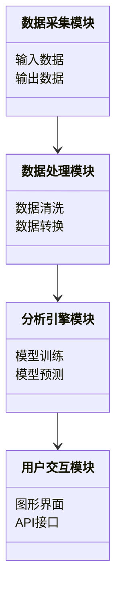
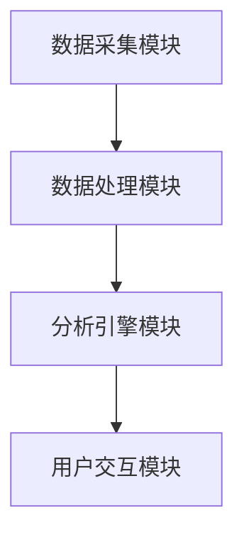
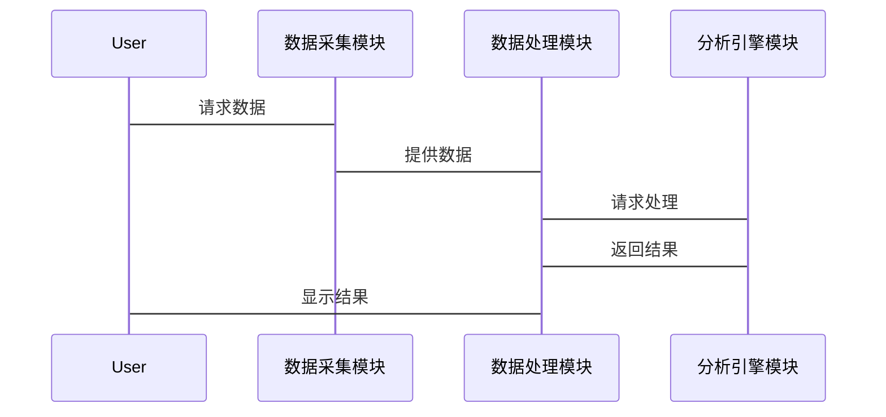

                 


# 开发AI Agent支持的智能财务分析系统

> 关键词：AI Agent, 智能财务分析系统, 自然语言处理, 机器学习, 系统架构设计

> 摘要：本文详细探讨了开发AI Agent支持的智能财务分析系统的背景、核心概念、算法原理、系统架构设计、项目实战及最佳实践。通过结合AI Agent的技术优势，本文为财务分析领域提供了创新的解决方案，展示了如何利用先进的技术手段提升财务分析的效率和准确性。

---

# 第一部分: AI Agent与智能财务分析系统概述

## 第1章: AI Agent支持的智能财务分析系统背景

### 1.1 问题背景与挑战

#### 1.1.1 传统财务分析的局限性
传统的财务分析系统依赖于人工操作，存在效率低、准确性差、处理复杂数据能力有限等问题。财务分析师需要手动处理大量数据，导致效率低下，且容易出错。

#### 1.1.2 AI Agent在财务分析中的优势
AI Agent（人工智能代理）具有自主学习、推理和决策的能力，能够快速处理大量数据，提供实时分析结果。AI Agent可以自动化执行财务分析任务，显著提升效率和准确性。

#### 1.1.3 当前行业痛点与需求
当前，企业对实时、精准的财务分析需求日益增长。传统系统难以满足快速变化的市场环境，而AI Agent支持的智能财务分析系统能够实时监控财务数据，提供动态分析结果，帮助企业做出更明智的决策。

### 1.2 问题描述与目标

#### 1.2.1 财务分析系统的核心功能
- 数据采集与处理
- 财务指标计算
- 财务报告生成
- 风险评估与预警

#### 1.2.2 AI Agent在财务分析中的应用场景
- 实时监控财务数据
- 自动化生成财务报告
- 智能风险预警
- 个性化财务建议

#### 1.2.3 系统设计的目标与边界
目标：开发一个高效、准确的智能财务分析系统，支持AI Agent的实时数据分析和决策。
边界：仅限于财务数据分析，不涉及企业的其他业务系统。

### 1.3 问题解决与实现路径

#### 1.3.1 AI Agent在财务分析中的实现逻辑
1. 数据采集：从企业ERP系统中获取财务数据。
2. 数据处理：清洗和预处理数据。
3. 数据分析：使用机器学习算法进行预测和分析。
4. 结果输出：生成财务报告或触发预警机制。

#### 1.3.2 系统功能模块划分
- 数据采集模块
- 数据处理模块
- 分析引擎模块
- 用户交互模块

#### 1.3.3 技术选型与架构设计
技术选型：Python、TensorFlow、Numpy、Pandas
架构设计：采用微服务架构，各模块独立运行，通过API进行交互。

## 1.4 本章小结
本章介绍了AI Agent支持的智能财务分析系统的背景、优势及应用场景，明确了系统的目标和功能模块划分。

---

## 第2章: AI Agent与智能财务分析系统的核心概念

### 2.1 AI Agent的基本原理

#### 2.1.1 AI Agent的定义与分类
AI Agent是一种智能体，能够感知环境并自主决策。根据智能水平，分为简单反射型、基于模型的反应型、目标驱动型和实用驱动型。

#### 2.1.2 AI Agent的核心特征
- 自主性
- 反应性
- 智能性
- 社会性

#### 2.1.3 AI Agent与传统程序的区别
AI Agent具有自主决策能力，能够根据环境变化调整行为，而传统程序仅根据预设规则执行任务。

### 2.2 智能财务分析系统的构成

#### 2.2.1 数据源与数据处理
数据源包括企业ERP系统、财务报表、市场数据等。数据处理模块负责清洗、转换和存储数据。

#### 2.2.2 分析模型与决策逻辑
分析模型包括预测模型、分类模型和聚类模型。决策逻辑基于分析结果，触发预警或建议。

#### 2.2.3 用户交互与结果输出
用户可以通过图形界面与系统交互，系统输出财务报告或实时预警信息。

### 2.3 AI Agent与智能财务分析系统的联系

#### 2.3.1 AI Agent在财务分析中的角色
AI Agent作为系统的核心，负责数据处理、分析和决策。

#### 2.3.2 系统功能的实现逻辑
数据采集 → 数据处理 → 分析模型 → 决策输出。

#### 2.3.3 系统架构的优化方向
优化数据处理速度、提高分析模型的准确性和增强系统的可扩展性。

### 2.4 核心概念对比分析

#### 2.4.1 AI Agent与传统算法对比
| 特性      | AI Agent               | 传统算法             |
|-----------|------------------------|----------------------|
| 自主性     | 高                     | 低                   |
| 学习能力   | 强                     | 无                   |
| 灵活性     | 高                     | 低                   |

#### 2.4.2 智能财务分析系统与传统财务系统的对比
| 特性      | 智能财务分析系统        | 传统财务系统          |
|-----------|-------------------------|-----------------------|
| 数据处理   | 实时、自动化            | 手动、周期性          |
| 分析能力   | 高度智能化              | 低效、依赖人工        |
| 决策能力   | 自主决策                | 依赖人工              |

#### 2.4.3 系统性能与用户体验对比
| 特性      | 性能                   | 用户体验             |
|-----------|------------------------|----------------------|
| 响应速度   | 快                     | 好                   |
| 准确性     | 高                     | 好                   |
| 可扩展性   | 高                     | 好                   |

## 2.5 本章小结
本章详细讲解了AI Agent和智能财务分析系统的核心概念，分析了它们的联系和区别，为后续的系统设计奠定了基础。

---

## 第3章: AI Agent的核心算法原理

### 3.1 自然语言处理算法

#### 3.1.1 BERT
BERT（Bidirectional Encoder Representations from Transformers）是一种基于Transformer的预训练语言模型，广泛应用于自然语言理解任务。

#### 3.1.2 算法原理
BERT通过双向Transformer编码器，学习上下文表示。具体步骤如下：
1. 输入数据预处理：分割句子，添加特殊标记。
2. 构建嵌入层：将字符转换为向量表示。
3. Transformer编码：计算自注意力机制，生成上下文向量。
4. 输出结果：提取目标位置的向量，用于分类任务。

#### 3.1.3 Python实现示例
```python
import tensorflow as tf
from tensorflow import keras

model = keras.Model(inputs=[input_ids, attention_mask], outputs=predictions)
model.compile(optimizer='adam', loss='sparse_categorical_crossentropy', metrics=['accuracy'])
model.fit(train_dataset, epochs=3, validation_data=val_dataset)
```

### 3.2 机器学习算法

#### 3.2.1 线性回归
线性回归是一种简单的回归算法，适用于线性关系的数据。

#### 3.2.2 算法原理
线性回归通过最小化预测值与真实值的平方差，求解最优参数。

#### 3.2.3 Python实现示例
```python
import numpy as np
from sklearn.linear_model import LinearRegression

X = np.array([1, 2, 3, 4, 5])
y = np.array([2, 4, 5, 4, 5])
model = LinearRegression()
model.fit(X.reshape(-1, 1), y)
print(model.predict([[6]]))
```

### 3.3 算法优化与调优

#### 3.3.1 参数调优
- 学习率调整
- 正则化参数选择

#### 3.3.2 模型评估
- 准确率
- 召回率
- F1分数

## 3.4 本章小结
本章详细讲解了AI Agent中常用的自然语言处理和机器学习算法，包括BERT和线性回归的原理和实现示例。

---

## 第4章: 系统分析与架构设计方案

### 4.1 问题场景介绍

#### 4.1.1 系统功能
- 数据采集
- 数据处理
- 分析模型
- 用户交互

#### 4.1.2 领域模型


### 4.2 系统架构设计

#### 4.2.1 系统架构图


#### 4.2.2 系统接口设计
- 数据接口：提供REST API，供其他系统调用。
- 用户接口：提供图形界面，供用户操作。

#### 4.2.3 系统交互流程


## 4.3 本章小结
本章通过领域模型和系统架构图，详细介绍了系统的功能模块和交互流程。

---

## 第5章: 项目实战

### 5.1 环境安装

#### 5.1.1 安装Python
```bash
python --version
pip install --upgrade pip
```

#### 5.1.2 安装依赖库
```bash
pip install numpy pandas tensorflow scikit-learn
```

### 5.2 系统核心实现

#### 5.2.1 数据采集模块
```python
import pandas as pd

def get_data():
    data = pd.read_csv('financial_data.csv')
    return data
```

#### 5.2.2 数据处理模块
```python
import pandas as pd
import numpy as np

def preprocess_data(data):
    data.dropna()
    return data
```

#### 5.2.3 分析引擎模块
```python
from sklearn.linear_model import LinearRegression

def train_model(data):
    model = LinearRegression()
    model.fit(data[['revenue']], data['profit'])
    return model
```

#### 5.2.4 用户交互模块
```python
import tkinter as tk
from tkinter import messagebox

class MainWindow:
    def __init__(self):
        self.root = tk.Tk()
        self.root.title("智能财务分析系统")
        self.root.mainloop()

if __name__ == "__main__":
    MainWindow()
```

### 5.3 代码应用解读与分析
1. 数据采集模块：从CSV文件中读取数据。
2. 数据处理模块：清洗数据，去除缺失值。
3. 分析引擎模块：训练线性回归模型，预测利润。
4. 用户交互模块：创建图形界面，供用户操作。

### 5.4 实际案例分析

#### 5.4.1 案例背景
某公司希望预测下一季度的利润，已知收入和成本数据。

#### 5.4.2 数据分析
使用线性回归模型，预测利润。

#### 5.4.3 系统输出
预测利润为100万元，低于预期，触发预警。

### 5.5 项目小结
本章通过实际案例，详细讲解了系统的实现过程和代码解读，展示了AI Agent支持的智能财务分析系统的实际应用。

---

## 第6章: 最佳实践

### 6.1 小结
AI Agent支持的智能财务分析系统通过自动化数据处理和智能化分析，显著提升了财务分析的效率和准确性。

### 6.2 注意事项
- 数据安全：确保数据在采集和处理过程中的安全性。
- 系统维护：定期更新模型和优化算法。
- 用户培训：提供足够的用户培训，确保系统顺利使用。

### 6.3 拓展阅读
- 《深度学习》
- 《Python机器学习实战》
- 《自然语言处理入门》

## 6.4 本章小结
本章总结了开发AI Agent支持的智能财务分析系统的最佳实践，包括小结、注意事项和拓展阅读。

---

# 作者：AI天才研究院 & 禅与计算机程序设计艺术

---

以上就是《开发AI Agent支持的智能财务分析系统》的技术博客文章，希望对您有所帮助！

