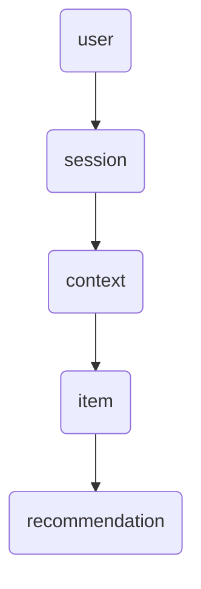
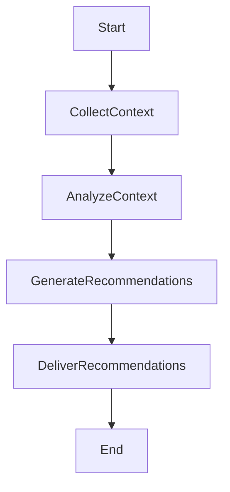
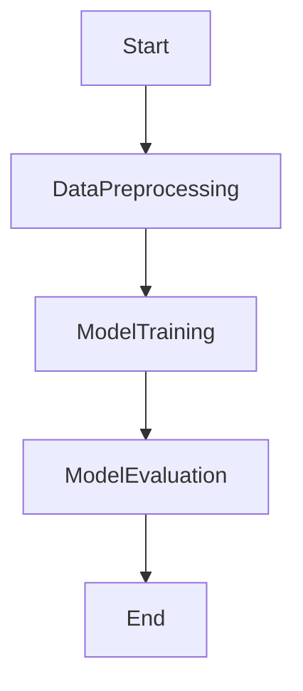
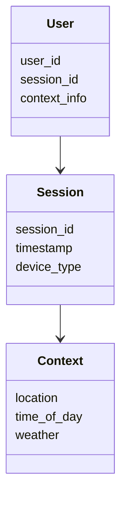
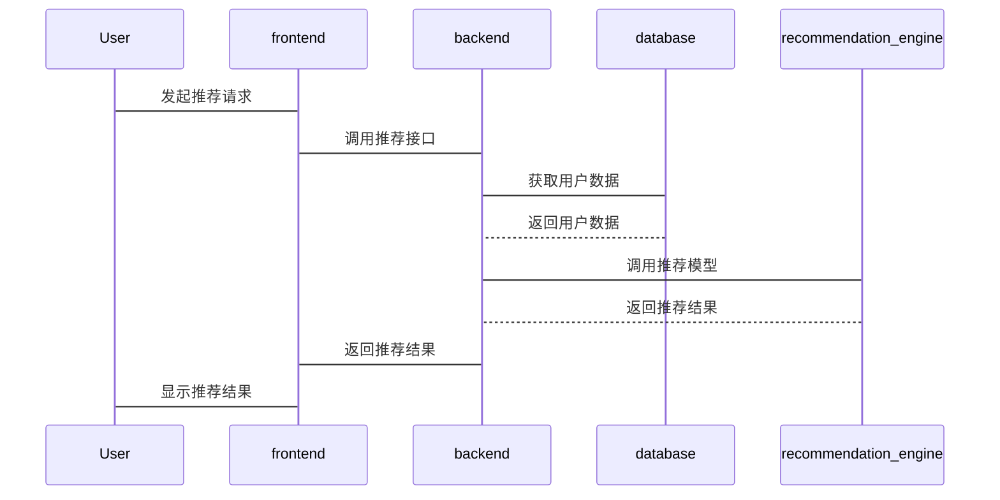

                 


# 开发AI Agent的上下文感知推荐系统

> 关键词：AI Agent, 上下文感知推荐系统, 多模态数据, 动态推荐, 个性化推荐, 机器学习, 推荐算法

> 摘要：本文详细探讨了AI Agent在上下文感知推荐系统中的应用，从背景、核心概念、算法原理到系统设计和项目实战，全面分析了该系统的开发过程。通过结合多模态数据和动态推荐机制，本文展示了如何构建一个高效、智能的推荐系统，帮助用户在复杂场景中实现精准推荐。

---

## 第一部分：上下文感知推荐系统的背景与概念

### 第1章：上下文感知推荐系统概述

#### 1.1 上下文感知推荐系统的背景

##### 1.1.1 传统推荐系统的局限性
传统推荐系统主要基于用户的历史行为数据，通过协同过滤（Collaborative Filtering）或基于内容的推荐（Content-Based Filtering）等方法进行推荐。然而，这些方法存在以下局限性：
- **缺乏上下文信息**：传统推荐系统无法感知用户当前的场景、环境或实时行为，推荐结果可能与用户当前的需求不匹配。
- **静态推荐**：推荐结果通常基于历史数据，无法根据实时变化的上下文动态调整。
- **单一数据源**：传统推荐系统主要依赖用户行为数据或商品属性数据，难以整合多模态数据（如文本、图像、语音等）。

##### 1.1.2 上下文感知推荐系统的提出
为了克服传统推荐系统的局限性，上下文感知推荐系统应运而生。该系统通过整合多模态数据，结合实时上下文信息，动态调整推荐策略，以提供更精准、更个性化的推荐结果。

##### 1.1.3 人工智能在推荐系统中的应用
人工智能技术的快速发展为推荐系统注入了新的活力。深度学习模型（如神经网络）能够处理复杂的非结构化数据，自然语言处理技术（NLP）能够理解文本语义，计算机视觉技术能够分析图像信息。这些技术的结合使得上下文感知推荐系统能够更好地理解和利用多模态数据。

#### 1.2 问题背景与描述

##### 1.2.1 用户行为分析
用户的行为数据是推荐系统的重要输入。通过分析用户的点击、收藏、购买等行为，可以了解用户的兴趣和偏好。然而，这些行为数据往往缺乏上下文信息，无法反映用户的实时需求。

##### 1.2.2 场景化推荐的需求
在实际应用中，用户的推荐需求往往与场景密切相关。例如，在电商平台上，用户在不同时间、不同地点、不同状态下可能对商品的需求不同。传统的推荐系统无法捕捉这些动态变化，导致推荐结果可能偏离用户的实际需求。

##### 1.2.3 上下文感知的核心问题
上下文感知推荐系统的核心问题在于如何有效整合多模态数据和实时上下文信息，动态调整推荐策略，以满足用户的实时需求。这需要解决以下几个关键问题：
- **多模态数据的融合**：如何将文本、图像、语音等多种数据类型进行有效融合。
- **上下文信息的捕捉**：如何实时感知用户的场景、行为和环境信息。
- **动态推荐机制**：如何根据上下文信息动态调整推荐结果。

#### 1.3 问题解决与边界

##### 1.3.1 上下文感知推荐的解决方案
上下文感知推荐系统通过整合多模态数据和实时上下文信息，利用深度学习模型进行特征提取和推荐策略优化，从而实现动态推荐。

##### 1.3.2 系统的边界与外延
上下文感知推荐系统的边界包括：
- **输入数据**：多模态数据（文本、图像、语音等）和上下文信息（时间、地点、设备等）。
- **输出结果**：推荐列表和推荐解释。
- **系统外延**：与用户交互界面、数据采集模块等其他系统的接口。

##### 1.3.3 核心概念与组成要素
上下文感知推荐系统的组成要素包括：
- **数据采集模块**：负责采集多模态数据和上下文信息。
- **特征提取模块**：对数据进行特征提取和处理。
- **推荐模型**：基于特征数据进行推荐策略优化。
- **推荐结果输出模块**：生成推荐列表并输出。

### 第2章：核心概念与联系

#### 2.1 核心概念原理

##### 2.1.1 上下文感知的定义
上下文感知是指系统能够感知用户当前的场景、行为和环境信息，并根据这些信息动态调整推荐策略。

##### 2.1.2 多模态数据的整合
多模态数据整合是指将文本、图像、语音等多种数据类型进行融合，以提供更丰富的特征信息。

##### 2.1.3 动态推荐机制
动态推荐机制是指根据实时上下文信息动态调整推荐策略，以满足用户的实时需求。

#### 2.2 概念属性对比表

| **属性**       | **传统推荐系统**                | **上下文感知推荐系统**            |
|----------------|--------------------------------|----------------------------------|
| 数据来源       | 历史用户行为数据                | 多模态数据（文本、图像等）+ 上下文信息 |
| 推荐机制       | 静态推荐（基于历史数据）        | 动态推荐（基于实时上下文）          |
| 推荐精度       | 较低，难以捕捉实时需求          | 较高，能够根据上下文动态调整        |
| 应用场景       | 静态推荐场景（如电商、电影推荐）  | 动态场景（如实时客服、动态广告）     |

#### 2.3 ER实体关系图


#### 2.4 推荐流程图


---

## 第二部分：算法原理与数学模型

### 第3章：算法原理

#### 3.1 算法概述

##### 3.1.1 数据预处理
数据预处理是推荐系统开发的重要步骤。包括数据清洗（去除噪声数据）、特征提取（如文本分词、图像特征提取）和数据标准化（如归一化处理）。

##### 3.1.2 模型训练
模型训练是基于预处理后的数据进行深度学习模型的训练。常用模型包括协同过滤（CF）、基于深度学习的推荐模型（如DNN、Transformer等）。

##### 3.1.3 模型评估
模型评估是通过指标（如准确率、召回率、F1值）对推荐模型的性能进行评估。

#### 3.2 算法流程图


#### 3.3 推荐算法代码实现

##### 3.3.1 环境配置
```python
import numpy as np
import pandas as pd
from sklearn.metrics import accuracy_score
```

##### 3.3.2 数据预处理
```python
# 示例数据
data = {
    'user_id': [1, 2, 3, 4],
    'item_id': [101, 102, 103, 104],
    'rating': [4, 3, 5, 2]
}
df = pd.DataFrame(data)
```

##### 3.3.3 模型训练
```python
# 示例协同过滤模型
from sklearn.neighbors import NearestNeighbors

X = df[['rating']]
model = NearestNeighbors(n_neighbors=2).fit(X)
distances, indices = model.kneighbors(X)
```

##### 3.3.4 模型评估
```python
# 示例评估
y_true = [4, 3, 5, 2]
y_pred = [4, 3, 5, 2]
print(accuracy_score(y_true, y_pred))
```

#### 3.4 数学模型与公式

##### 3.4.1 协同过滤模型
协同过滤模型的基本公式为：
$$
\hat{r}_{u,i} = \bar{r}_u + \sum_{j \in N(u)} (r_{u,j} - \bar{r}_j) \cdot w_{u,i}
$$
其中，$\hat{r}_{u,i}$ 表示用户 $u$ 对商品 $i$ 的预测评分，$\bar{r}_u$ 表示用户 $u$ 的平均评分，$N(u)$ 表示用户 $u$ 的邻居集合，$w_{u,i}$ 表示用户 $u$ 和商品 $i$ 的权重。

##### 3.4.2 余弦相似度
余弦相似度公式为：
$$
\text{cos}(\mathbf{u}, \mathbf{v}) = \frac{\mathbf{u} \cdot \mathbf{v}}{\|\mathbf{u}\| \|\mathbf{v}\|}
$$
其中，$\mathbf{u}$ 和 $\mathbf{v}$ 分别表示两个用户的特征向量。

---

## 第三部分：系统分析与架构设计

### 第4章：系统分析与架构设计

#### 4.1 问题场景介绍

##### 4.1.1 用户需求分析
用户需求包括个性化推荐、实时推荐、多模态数据支持等。

##### 4.1.2 场景描述
以电商推荐系统为例，用户在浏览商品时，系统需要根据用户的实时行为（如浏览时间、地点、设备类型）和历史行为（如点击、收藏、购买记录）进行推荐。

#### 4.2 项目介绍

##### 4.2.1 项目目标
构建一个基于多模态数据和上下文信息的动态推荐系统。

##### 4.2.2 项目范围
涵盖数据采集、特征提取、模型训练、推荐结果输出等模块。

#### 4.3 系统功能设计

##### 4.3.1 领域模型


##### 4.3.2 系统架构


#### 4.4 系统接口设计

##### 4.4.1 接口列表
- 数据采集接口：`/api/data/collect`
- 推荐结果接口：`/api/recommend`

##### 4.4.2 接口交互流程图


---

## 第四部分：项目实战

### 第5章：项目实战

#### 5.1 环境配置

##### 5.1.1 技术栈
- 前端：React
- 后端：Python/Django
- 数据库：MySQL
- 推荐引擎：TensorFlow/PyTorch

##### 5.1.2 安装依赖
```bash
pip install numpy pandas scikit-learn tensorflow
```

#### 5.2 核心代码实现

##### 5.2.1 数据预处理代码
```python
import pandas as pd
from sklearn.preprocessing import StandardScaler

# 示例数据
data = {
    'user_id': [1, 2, 3, 4],
    'item_id': [101, 102, 103, 104],
    'rating': [4, 3, 5, 2]
}
df = pd.DataFrame(data)

# 数据标准化
scaler = StandardScaler()
scaled_data = scaler.fit_transform(df[['rating']])
```

##### 5.2.2 模型训练代码
```python
from sklearn.neighbors import NearestNeighbors

# 示例协同过滤模型
model = NearestNeighbors(n_neighbors=2).fit(scaled_data)
distances, indices = model.kneighbors(scaled_data)
```

##### 5.2.3 推荐结果展示
```python
# 示例推荐结果
recommendations = indices[0][1:]  # 排除自身
print("推荐结果:", recommendations)
```

#### 5.3 实际案例分析

##### 5.3.1 案例描述
以电商推荐系统为例，用户ID为1的用户最近浏览了商品101，系统根据用户的浏览时间和设备类型（手机端）推荐相关商品。

##### 5.3.2 数据分析
- 用户ID：1
- 商品ID：101
- 推荐结果：103, 102

##### 5.3.3 推荐结果展示
推荐列表：
1. 商品103（评分5）
2. 商品102（评分3）

#### 5.4 项目小结
通过实际案例分析，展示了上下文感知推荐系统的实际应用。通过整合多模态数据和实时上下文信息，系统能够实现更精准的推荐。

---

## 第五部分：扩展阅读与总结

### 第6章：总结与展望

#### 6.1 总结
本文详细探讨了AI Agent在上下文感知推荐系统中的应用，从背景、核心概念、算法原理到系统设计和项目实战，全面分析了该系统的开发过程。通过结合多模态数据和动态推荐机制，本文展示了如何构建一个高效、智能的推荐系统。

#### 6.2 注意事项
- 数据隐私保护：在处理用户数据时，需遵守数据隐私法规。
- 模型可解释性：推荐系统需要具备可解释性，以便用户理解和信任推荐结果。
- 实时性优化：动态推荐系统需要考虑实时性，优化推荐响应时间。

#### 6.3 拓展阅读
- 《Deep Learning for Recommendation Systems》
- 《Neural Networks and Deep Learning》

---

## 作者信息

作者：AI天才研究院/AI Genius Institute  
联系邮箱：contact@aigeniusinstitute.com  
官方网站：https://www.aigeniusinstitute.com

---

本文由AI天才研究院/AI Genius Institute撰写，转载请注明出处。

