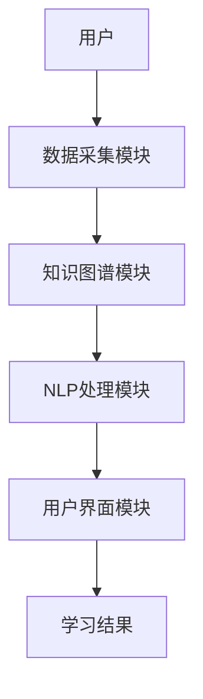

                 

# 开发AI Agent的个性化学习助手系统

**关键词：** AI Agent，个性化学习，知识图谱，自然语言处理，系统架构，算法原理

**摘要：**  
本文系统阐述了开发AI Agent的个性化学习助手系统的全过程，从核心概念到算法实现，再到系统架构设计，层层深入。文章首先介绍了AI Agent和个性化学习助手的基本概念，分析了其在教育领域的应用背景。接着，详细探讨了知识图谱和自然语言处理在个性化学习中的技术原理与应用。随后，从算法原理的角度，解析了知识图谱构建和语言模型训练的数学公式与实现方法。最后，通过系统架构设计和项目实战，展示了如何构建一个高效、智能的个性化学习助手系统。本文内容详实，逻辑清晰，为AI Agent在教育领域的应用提供了理论与实践的双重指导。

---

## 第一章: AI Agent与个性化学习助手系统背景

### 1.1 AI Agent的基本概念

#### 1.1.1 什么是AI Agent
AI Agent（人工智能代理）是指能够感知环境并采取行动以实现目标的智能体。它可以理解为一种能够自主决策、解决问题的计算机程序。AI Agent的核心目标是通过智能化的方式，为用户提供高效、个性化的服务。

#### 1.1.2 AI Agent的核心特点
1. **自主性**：AI Agent能够自主决策，无需人工干预。
2. **反应性**：能够实时感知环境变化并做出响应。
3. **目标导向**：所有行为都围绕特定目标展开。
4. **学习能力**：能够通过数据和经验不断优化自身性能。

#### 1.1.3 AI Agent的分类与应用场景
- **简单反射型AI Agent**：基于规则的简单决策，适用于任务自动化。
- **基于模型的AI Agent**：通过构建内部模型来理解环境，适用于复杂场景。
- **学习型AI Agent**：通过机器学习不断优化行为，适用于需要深度理解的任务，如个性化学习助手。

---

### 1.2 个性化学习助手的定义与特点

#### 1.2.1 个性化学习的内涵
个性化学习是指根据学习者的兴趣、能力、学习风格等因素，量身定制学习内容和路径，以达到最佳学习效果。

#### 1.2.2 学习助手的核心功能
1. **学习需求分析**：通过数据采集和分析，了解学习者的知识水平、学习目标和偏好。
2. **学习路径规划**：基于需求分析，推荐最优的学习内容和路径。
3. **学习效果评估**：实时跟踪学习进展，评估学习效果并提供反馈。

#### 1.2.3 个性化学习助手的独特优势
- **智能化**：通过AI技术实现精准的学习需求匹配。
- **动态性**：能够根据学习者的反馈实时调整学习计划。
- **高效性**：通过自动化处理，显著提升学习效率。

---

### 1.3 本章小结

本章介绍了AI Agent的基本概念及其在个性化学习助手中的应用，重点分析了个性化学习助手的核心功能和独特优势。AI Agent通过智能化、动态化的学习路径规划，为学习者提供了高效、个性化的学习体验。

---

## 第二章: 知识图谱与个性化学习

### 2.1 知识图谱的基本原理

#### 2.1.1 知识图谱的定义与构建方法
知识图谱是一种将知识以图结构形式表示的技术，节点代表实体或概念，边代表实体之间的关系。构建知识图谱的主要步骤包括数据抽取、实体识别、关系抽取和图谱构建。

#### 2.1.2 知识图谱的表示与存储
知识图谱通常使用RDF（Resource Description Framework）或图数据库（如Neo4j）进行存储。每个实体和关系都对应一个节点或边，并通过属性进行描述。

#### 2.1.3 知识图谱的推理与应用
通过图结构的推理算法，可以从已有的知识中推导出新的知识。例如，基于规则的推理和基于概率的推理。

---

### 2.2 自然语言处理在个性化学习中的应用

#### 2.2.1 NLP的核心技术与算法
自然语言处理（NLP）包括文本分词、词性标注、句法分析、语义理解等技术。常用算法包括TF-IDF、Word2Vec、BERT等。

#### 2.2.2 NLP在学习助手中的具体应用
1. **学习需求分析**：通过文本分析了解学习者的兴趣和难点。
2. **内容推荐**：基于NLP技术推荐相关学习资料。
3. **交互式学习**：通过自然语言对话提供实时学习指导。

#### 2.2.3 实例分析：基于规则的推理过程
例如，学习者输入“我不懂微积分”，系统通过NLP技术分析并推荐相关的微积分学习资源。

---

### 2.3 本章小结

本章详细介绍了知识图谱和自然语言处理在个性化学习中的应用，知识图谱为学习内容的结构化表示提供了支持，而NLP技术则为学习需求的分析和内容推荐提供了技术支持。

---

## 第三章: AI Agent的算法原理与数学模型

### 3.1 知识图谱构建的算法原理

#### 3.1.1 知识抽取与表示
知识抽取是将文本中的实体和关系提取出来，表示为结构化的数据。词嵌入模型（如Word2Vec）常用于表示实体的语义向量。

#### 3.1.2 知识融合与推理
知识融合是将多个来源的知识图谱合并，消除冲突。基于图论的推理方法可以用于从知识图谱中推导新的知识。

#### 3.1.3 实例分析：基于向量空间模型的知识表示
例如，使用Word2Vec将实体表示为向量，计算向量的相似度以衡量实体的相关性。

---

### 3.2 自然语言处理的数学模型

#### 3.2.1 词嵌入模型
Word2Vec通过_skip-gram_或_CBOW_模型训练词向量。其数学公式可以表示为：
$$ P(w_i|w_j) \approx P(w_i|w_{j-2}, w_{j-1}, w_{j+1}, w_{j+2}) $$

#### 3.2.2 语言模型的训练与优化
基于Transformer的模型（如BERT）通过自注意力机制实现上下文的理解。其数学公式为：
$$ \text{Attention}(Q, K, V) = \text{softmax}\left(\frac{QK^T}{\sqrt{d_k}}\right)V $$

---

## 第四章: 系统架构与设计

### 4.1 个性化学习助手系统的架构设计

#### 4.1.1 系统功能需求分析
系统需要实现学习需求分析、学习路径规划、学习效果评估等功能。

#### 4.1.2 系统模块划分
1. **数据采集模块**：负责收集学习者的行为数据。
2. **知识图谱模块**：构建和管理知识图谱。
3. **NLP处理模块**：实现文本分析和内容推荐。
4. **用户界面模块**：提供友好的交互界面。

#### 4.1.3 实例分析：系统架构图
使用Mermaid绘制系统架构图：

---

### 4.2 本章小结

本章详细描述了个性化学习助手系统的架构设计，从功能需求到模块划分，再到系统交互，为后续的实现提供了清晰的指导。

---

## 结论

开发AI Agent的个性化学习助手系统是一个复杂而有意义的工程。通过结合知识图谱和自然语言处理技术，我们可以实现智能化、个性化的学习体验。本文从背景、技术原理到系统设计，全面分析了系统的开发过程，为未来的实践提供了理论基础和实践指导。

---

**作者：AI天才研究院 & 禅与计算机程序设计艺术**

