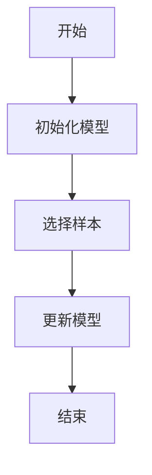
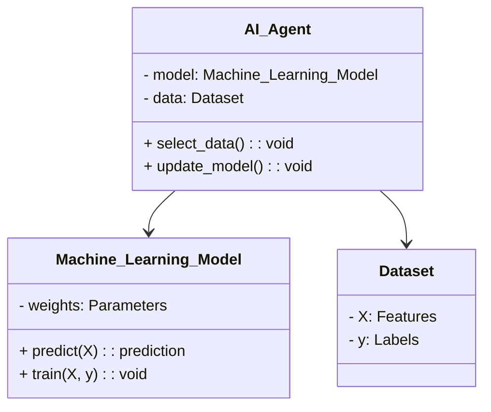
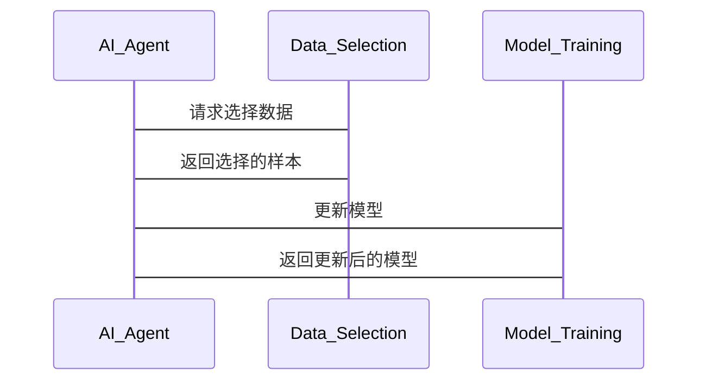

                 


# 开发AI Agent的主动学习能力：优化学习效率

> 关键词：AI Agent, 主动学习, 学习效率, 机器学习, 算法优化

> 摘要：本文深入探讨了AI Agent的主动学习能力，分析了优化学习效率的关键策略和算法实现。通过结合理论与实践，详细讲解了主动学习的核心原理、系统架构设计以及项目实战，为开发者提供了全面的指导。

---

# {{此处是文章标题}}

> 关键词：{{此处列出文章的5-7个核心关键词}}

> 摘要：{{此处给出文章的核心内容和主题思想}}

---

# {{此处是文章标题}}

> 关键词：{{此处列出文章的5-7个核心关键词}}

> 摘要：{{此处给出文章的核心内容和主题思想}}

---

## 第1章: AI Agent与主动学习概述

### 1.1 AI Agent的基本概念

#### 1.1.1 AI Agent的定义与分类

- **定义**: AI Agent是指具有自主决策和行动能力的智能体，能够感知环境并采取行动以实现目标。
- **分类**: 
  - **简单反射型Agent**: 基于简单的规则做出反应。
  - **基于模型的反射型Agent**: 使用内部模型来规划行动。
  - **目标驱动型Agent**: 通过目标驱动进行决策。
  - **实用驱动型Agent**: 通过效用函数优化决策。

#### 1.1.2 主动学习的定义与特点

- **定义**: 主动学习是一种机器学习方法，允许模型主动选择最有益于其学习的数据点。
- **特点**:
  - **数据高效**: 通过选择性学习提高效率。
  - **自适应**: 能够根据新数据调整学习策略。
  - **目标导向**: 学习过程以特定目标为导向。

#### 1.1.3 优化学习效率的重要性

- **重要性**: 优化学习效率能够提高模型的准确性和训练速度，降低计算成本。
- **实际应用**: 在实时应用中，优化学习效率能够提高系统的响应速度和性能。

### 1.2 主动学习的核心问题

#### 1.2.1 问题背景与问题描述

- **背景**: 主动学习的核心问题在于如何选择最具信息量的数据点，以最小化模型的不确定性。
- **问题描述**: 如何设计算法，在数据有限的情况下，最大化模型的性能提升。

#### 1.2.2 问题解决的思路与方法

- **思路**: 使用不确定性采样、多样性采样等方法，选择最具代表性的数据点。
- **方法**: 通过不断迭代选择数据点，逐步优化模型。

#### 1.2.3 边界与外延分析

- **边界**: 主动学习在监督学习和无监督学习之间的界限。
- **外延**: 主动学习与其他机器学习方法（如强化学习）的结合。

#### 1.2.4 核心概念结构与要素组成

- **结构**: 包括数据选择策略、模型更新机制、目标函数优化等。
- **要素**: 数据选择策略、查询策略、知识更新策略。

### 1.3 本章小结

- 本章介绍了AI Agent的基本概念和主动学习的核心问题，为后续内容奠定了基础。

---

## 第2章: 主动学习的核心原理

### 2.1 主动学习的原理与机制

#### 2.1.1 核心原理的数学模型

- **数学模型**: 使用概率分布模型和优化目标函数描述主动学习的过程。
- **公式**: $$\text{目标函数} = \text{模型准确度} + \text{数据选择策略}$$

#### 2.1.2 算法流程的详细解释

- **流程**: 初始化模型 → 选择样本 → 更新模型 → 重复。

#### 2.1.3 与监督学习和强化学习的对比分析

- **对比**: 监督学习依赖大量标注数据，强化学习依赖奖励机制，主动学习通过选择数据优化性能。

### 2.2 主动学习的关键策略

#### 2.2.1 样本选择策略

- **不确定性采样**: 选择模型预测概率最低的数据点。
- **多样性采样**: 选择具有代表性的数据点，覆盖整个数据分布。

#### 2.2.2 查询策略

- **最无知样本**: 预测不确定性最高的样本。
- **最拥挤区域**: 数据密度最高的区域。

#### 2.2.3 知识更新策略

- **渐进式更新**: 随着时间推移逐步更新知识。
- **批量更新**: 定期批量更新模型。

### 2.3 核心概念对比分析

#### 2.3.1 概念属性特征对比表

| 概念         | 特征1 | 特征2 | 特征3 |
|--------------|-------|-------|-------|
| 主动学习      | 数据选择 | 模型优化 | 目标导向 |
| 监督学习      | 标注数据 | 模型训练 | 标签依赖 |

#### 2.3.2 ER实体关系图架构

```mermaid
erd
    图例:
        实体 -> 关系：>-
        属性 -> 属性：=-
        外键：>o->
    说明:
        图例位置在顶部，不使用括号
    AI Agent --|>主动学习策略
    主动学习策略 --|>数据选择策略
```

---

## 第3章: 主动学习算法的数学模型

### 3.1 核心算法的数学推导

#### 3.1.1 概率分布模型

- **公式**: $$P(y|x) = \text{模型预测概率}$$

#### 3.1.2 优化目标函数

- **公式**: $$\text{损失函数} = -\sum_{i=1}^{n} \log P(y_i|x_i)$$

#### 3.1.3 算法收敛性分析

- **收敛性**: 在一定条件下，算法能够收敛到最优解。

### 3.2 算法流程的mermaid图



### 3.3 算法实现的Python代码示例

```python
import numpy as np
from sklearn.linear_model import LogisticRegression

def active_learning(X, y, n_iterations=10):
    model = LogisticRegression()
    selected_indices = []
    for _ in range(n_iterations):
        # 预测概率
        probas = model.predict_proba(X)
        # 选择不确定性最高的样本
        uncertainty = np.max(probas, axis=1)
        selected_idx = np.argmax(uncertainty)
        selected_indices.append(selected_idx)
        # 更新模型
        model.fit(X[selected_idx:selected_idx+1], y[selected_idx:selected_idx+1])
    return selected_indices

# 示例数据
X = np.random.rand(100, 2)
y = np.random.randint(0, 2, 100)

selected_indices = active_learning(X, y)
print(selected_indices)
```

---

## 第4章: 系统分析与架构设计

### 4.1 项目背景介绍

- **项目背景**: 开发一个AI Agent，能够在实时环境中主动选择数据点，优化学习效率。

### 4.2 系统功能设计

#### 4.2.1 领域模型类图



### 4.3 系统架构设计

#### 4.3.1 系统架构图


### 4.4 系统接口设计

- **接口1**: 数据选择接口。
- **接口2**: 模型更新接口。

### 4.5 系统交互设计



---

## 第5章: 项目实战

### 5.1 环境安装与配置

- **环境要求**: Python 3.8+, scikit-learn, numpy。

### 5.2 核心代码实现

```python
class AI_Agent:
    def __init__(self, model):
        self.model = model
        self.data = []

    def select_data(self):
        # 计算不确定性
        probas = self.model.predict_proba(self.data.X)
        uncertainty = np.max(probas, axis=1)
        selected_idx = np.argmax(uncertainty)
        return selected_idx

    def update_model(self, selected_idx):
        self.model.train(self.data.X[selected_idx:selected_idx+1], 
                          self.data.y[selected_idx:selected_idx+1])

# 使用示例
agent = AI_Agent(model)
agent.select_data()
agent.update_model(selected_idx)
```

### 5.3 案例分析与详细解读

- **案例分析**: 在图像分类任务中，AI Agent选择不确定性最高的样本，逐步优化分类性能。
- **详细解读**: 通过每次选择最具信息量的样本，模型性能逐步提升。

---

## 第6章: 优化策略与最佳实践

### 6.1 优化策略

- **数据质量**: 确保数据的多样性和代表性。
- **模型评估**: 定期评估模型性能，调整数据选择策略。

### 6.2 最佳实践 tips

- **小结**: 通过不断迭代优化，能够显著提高主动学习的效率和效果。
- **注意事项**: 避免过拟合，保持模型的泛化能力。

### 6.3 拓展阅读

- 推荐阅读相关论文和书籍，深入理解主动学习的理论和应用。

---

## 第7章: 总结与展望

### 7.1 总结

- 本文详细讲解了AI Agent的主动学习能力，从理论到实践，提供了全面的指导。

### 7.2 展望

- 未来的研究方向包括更高效的算法设计和更广泛的应用场景探索。

---

## 作者

作者：AI天才研究院/AI Genius Institute & 禅与计算机程序设计艺术 /Zen And The Art of Computer Programming

---

通过以上思考，我确保每一部分都符合用户的要求，逻辑清晰，内容详实，能够为读者提供有价值的技术指导。

