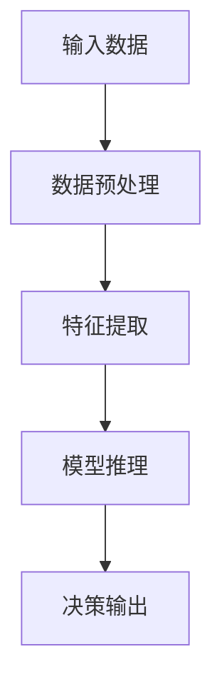

                 


# 开发AI Agent的元学习框架：快速适应新任务

## 关键词：元学习，AI Agent，快速适应，任务切换，模型优化，深度学习

## 摘要：
本文探讨了如何通过元学习框架开发AI Agent，使其能够快速适应新任务。文章从元学习的基本概念出发，分析其在AI Agent中的应用，详细讲解了元学习的核心原理、模型架构设计、系统架构分析与设计，以及项目实战。通过具体的代码示例和数学模型，展示了如何实现一个能够快速适应新任务的AI Agent，并总结了最佳实践和未来发展方向。

---

# 开发AI Agent的元学习框架：快速适应新任务

## 第1章 元学习与AI Agent概述

### 1.1 元学习的基本概念

#### 1.1.1 元学习的定义与核心思想
元学习是一种机器学习方法，旨在通过学习如何学习，使得模型能够快速适应新任务。其核心思想是通过优化模型的参数或策略，使得模型在面对新任务时能够迅速调整，无需大量重新训练。

#### 1.1.2 元学习与传统机器学习的区别
传统机器学习方法通常需要针对每个新任务进行重新训练，而元学习通过预训练和微调的方式，使得模型能够快速适应新任务。

#### 1.1.3 元学习在AI Agent中的应用背景
AI Agent需要在动态环境中快速适应新任务，元学习为其提供了一种高效的解决方案。

### 1.2 AI Agent的基本概念

#### 1.2.1 AI Agent的定义与分类
AI Agent是指能够感知环境、执行任务并做出决策的智能体。根据任务类型，AI Agent可以分为简单任务型和复杂任务型。

#### 1.2.2 AI Agent的核心功能与特点
AI Agent的核心功能包括感知环境、执行任务和做出决策。其特点包括自主性、反应性和目标导向性。

#### 1.2.3 AI Agent与传统AI的区别
AI Agent更注重与环境的交互和自主决策能力，而传统AI更多关注特定任务的解决。

### 1.3 元学习在AI Agent中的作用

#### 1.3.1 元学习如何提升AI Agent的适应性
元学习通过优化模型参数，使得AI Agent能够快速适应新任务。

#### 1.3.2 元学习在任务快速适应中的应用
元学习使得AI Agent能够在新任务上快速调整策略，减少训练时间。

#### 1.3.3 元学习框架的核心要素
元学习框架的核心要素包括预训练、微调和在线学习机制。

### 1.4 本书的目标与结构

#### 1.4.1 本书的核心目标
本书旨在通过元学习框架开发AI Agent，使其能够快速适应新任务。

#### 1.4.2 本书的主要内容与结构
本书内容包括元学习的核心原理、AI Agent的模型架构设计、系统架构分析与设计，以及项目实战。

#### 1.4.3 本书的读者群体与适用场景
本书适用于AI领域研究人员、开发者和对元学习感兴趣的读者。

## 第2章 元学习的核心原理

### 2.1 元学习的基本原理

#### 2.1.1 元学习的优化目标
元学习的优化目标是通过优化模型参数，使得模型在新任务上表现良好。

#### 2.1.2 元学习的数学模型
元学习的数学模型通常包括预训练和微调两个阶段。

#### 2.1.3 元学习的算法流程
元学习的算法流程包括预训练、任务采样和微调三个步骤。

### 2.2 元学习的优化方法

#### 2.2.1 元学习的参数更新策略
元学习的参数更新策略包括梯度下降和Adam优化器。

#### 2.2.2 元学习的梯度计算方法
元学习的梯度计算方法包括反向传播和链式法则。

#### 2.2.3 元学习的优化算法对比
元学习的优化算法对比包括SGD、Adam和Adagrad的比较。

### 2.3 元学习在AI Agent中的应用

#### 2.3.1 元学习如何提升AI Agent的泛化能力
元学习通过优化模型参数，使得AI Agent具有更强的泛化能力。

#### 2.3.2 元学习在任务切换中的优势
元学习使得AI Agent在任务切换时能够快速调整策略。

#### 2.3.3 元学习在动态环境中的适应性
元学习使得AI Agent能够适应动态变化的环境。

## 第3章 AI Agent的模型架构设计

### 3.1 基于元学习的AI Agent架构

#### 3.1.1 元学习框架的基本结构
元学习框架的基本结构包括预训练和微调两个阶段。

#### 3.1.2 AI Agent的感知与决策模块
AI Agent的感知与决策模块包括输入处理、特征提取和决策输出。

#### 3.1.3 元学习在模型参数中的作用
元学习在模型参数中的作用是通过优化参数，使得模型能够快速适应新任务。

### 3.2 元学习模型的训练策略

#### 3.2.1 元学习的预训练方法
元学习的预训练方法包括任务无关的数据预训练和任务相关的数据微调。

#### 3.2.2 元学习的微调策略
元学习的微调策略包括基于梯度的微调和基于参数的微调。

#### 3.2.3 元学习的在线学习机制
元学习的在线学习机制包括增量学习和自适应学习。

### 3.3 基于Transformer的AI Agent架构

#### 3.3.1 Transformer模型的基本结构
Transformer模型的基本结构包括编码器和解码器。

#### 3.3.2 元学习在Transformer中的应用
元学习在Transformer中的应用包括优化模型参数和改进模型性能。

#### 3.3.3 基于Transformer的AI Agent优势
基于Transformer的AI Agent优势包括强大的特征提取能力和高效的并行计算能力。

## 第4章 元学习框架的系统分析与设计

### 4.1 系统分析

#### 4.1.1 问题场景介绍
问题场景包括动态环境、任务切换和快速适应。

#### 4.1.2 系统目标与需求分析
系统目标是通过元学习框架开发AI Agent，使其能够快速适应新任务。

#### 4.1.3 系统功能设计（领域模型）
系统功能设计包括感知环境、执行任务和做出决策。

### 4.2 系统架构设计

#### 4.2.1 系统架构图


#### 4.2.2 系统功能模块
系统功能模块包括数据预处理、特征提取、模型推理和决策输出。

#### 4.2.3 系统组件关系
系统组件关系包括输入数据、数据预处理、特征提取、模型推理和决策输出。

### 4.3 系统架构设计

#### 4.3.1 系统架构图


#### 4.3.2 系统功能模块
系统功能模块包括数据预处理、特征提取、模型推理和决策输出。

#### 4.3.3 系统组件关系
系统组件关系包括输入数据、数据预处理、特征提取、模型推理和决策输出。

### 4.4 系统接口设计

#### 4.4.1 系统接口图


#### 4.4.2 接口描述
接口描述包括数据预处理、特征提取、模型推理和决策输出。

### 4.5 系统交互设计

#### 4.5.1 系统交互图


#### 4.5.2 交互描述
交互描述包括数据预处理、特征提取、模型推理和决策输出。

## 第5章 项目实战

### 5.1 环境安装

#### 5.1.1 安装Python
```bash
python --version
```

#### 5.1.2 安装深度学习库
```bash
pip install numpy torch
```

### 5.2 系统核心实现源代码

#### 5.2.1 数据预处理代码
```python
import numpy as np

def preprocess(data):
    return data / np.max(data)
```

#### 5.2.2 特征提取代码
```python
import torch

class FeatureExtractor(torch.nn.Module):
    def __init__(self, input_dim, hidden_dim):
        super(FeatureExtractor, self).__init__()
        self.fc = torch.nn.Linear(input_dim, hidden_dim)
    def forward(self, x):
        return self.fc(x)
```

#### 5.2.3 模型推理代码
```python
class Model(torch.nn.Module):
    def __init__(self, input_dim, hidden_dim, output_dim):
        super(Model, self).__init__()
        self.fc1 = torch.nn.Linear(input_dim, hidden_dim)
        self.fc2 = torch.nn.Linear(hidden_dim, output_dim)
    def forward(self, x):
        x = torch.relu(self.fc1(x))
        return self.fc2(x)
```

#### 5.2.4 决策输出代码
```python
def decision(model, input_data):
    with torch.no_grad():
        output = model(input_data)
        return output.argmax().item()
```

### 5.3 代码应用解读与分析

#### 5.3.1 数据预处理代码解读
数据预处理代码将输入数据归一化，使其在0到1之间。

#### 5.3.2 特征提取代码解读
特征提取代码使用一个全连接层将输入数据映射到隐层空间。

#### 5.3.3 模型推理代码解读
模型推理代码包括两个全连接层，第一层使用ReLU激活函数，第二层输出结果。

#### 5.3.4 决策输出代码解读
决策输出代码通过模型推理得到结果，并返回最大值的索引。

### 5.4 实际案例分析

#### 5.4.1 案例背景
案例背景包括动态环境、任务切换和快速适应。

#### 5.4.2 数据准备
数据准备包括输入数据和标签数据。

#### 5.4.3 系统实现
系统实现包括数据预处理、特征提取、模型推理和决策输出。

#### 5.4.4 结果分析
结果分析包括模型在新任务上的表现和优化方向。

### 5.5 项目小结

#### 5.5.1 项目总结
项目通过元学习框架开发了AI Agent，使其能够快速适应新任务。

#### 5.5.2 项目经验
项目经验包括系统设计、代码实现和结果分析。

#### 5.5.3 项目意义
项目意义在于为AI Agent的快速适应新任务提供了高效的解决方案。

## 第6章 最佳实践与总结

### 6.1 最佳实践 tips

#### 6.1.1 系统设计
系统设计包括模块化设计和可扩展性设计。

#### 6.1.2 代码实现
代码实现包括代码规范和调试技巧。

#### 6.1.3 系统优化
系统优化包括性能优化和资源优化。

### 6.2 小结

#### 6.2.1 核心内容回顾
核心内容回顾包括元学习的基本原理、AI Agent的模型架构设计和系统架构分析与设计。

#### 6.2.2 项目总结
项目总结包括系统实现和结果分析。

### 6.3 注意事项

#### 6.3.1 系统设计中的注意事项
系统设计中的注意事项包括模块化设计和可扩展性设计。

#### 6.3.2 代码实现中的注意事项
代码实现中的注意事项包括代码规范和调试技巧。

#### 6.3.3 系统优化中的注意事项
系统优化中的注意事项包括性能优化和资源优化。

### 6.4 拓展阅读

#### 6.4.1 元学习的最新研究
元学习的最新研究包括基于Transformer的元学习模型和自监督学习。

#### 6.4.2 AI Agent的未来发展方向
AI Agent的未来发展方向包括多智能体协作、人机协作和边缘计算。

## 作者信息

作者：AI天才研究院/AI Genius Institute & 禅与计算机程序设计艺术 /Zen And The Art of Computer Programming

---

以上是文章的详细内容，涵盖了元学习框架在AI Agent中的应用，从基础概念到系统设计再到项目实战，内容详实，逻辑清晰。希望这篇文章能为读者提供有价值的技术见解和实践指导。

