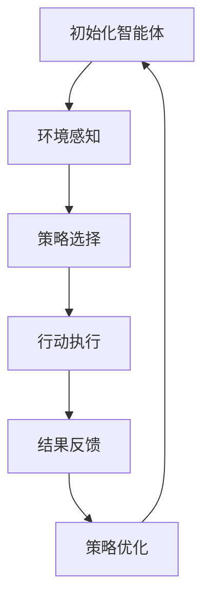
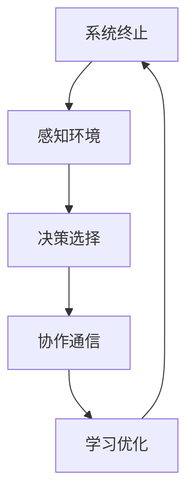
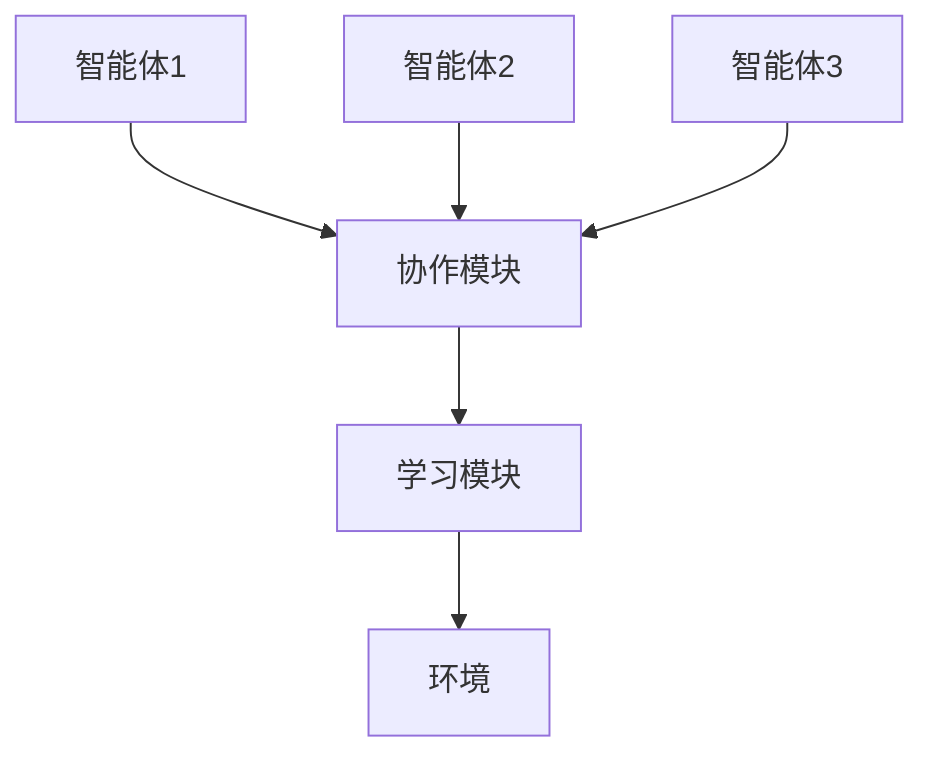
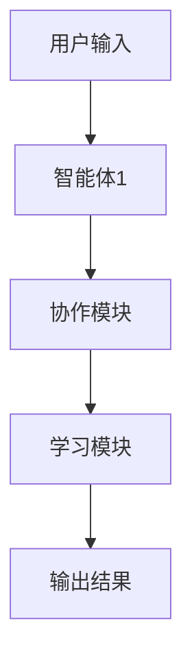

                 


# 开发AI Agent的多智能体协作学习系统

---

## 关键词：
AI Agent、多智能体协作学习、强化学习、分布式系统、协作算法、系统架构

---

## 摘要：
本文详细探讨了AI Agent在多智能体协作学习系统中的开发与应用。从AI Agent的基本概念出发，深入分析了多智能体协作学习的核心原理、算法实现、系统架构设计及实际案例。通过理论与实践相结合的方式，展示了如何构建高效、稳定的多智能体协作学习系统，并提供了丰富的代码示例和数学模型，帮助读者全面掌握相关技术。

---

# 第一部分: AI Agent与多智能体协作学习系统概述

## 第1章: AI Agent与多智能体协作学习系统概述

### 1.1 AI Agent的基本概念

#### 1.1.1 AI Agent的定义
AI Agent（人工智能代理）是指能够感知环境并采取行动以实现目标的智能实体。它可以是一个软件程序、机器人或其他智能系统，具备自主性、反应性、目标导向性和社会性等核心特征。

#### 1.1.2 AI Agent的核心特点
- **自主性**：AI Agent能够在没有外部干预的情况下独立运作。
- **反应性**：能够实时感知环境并做出响应。
- **目标导向性**：通过制定和优化目标来驱动行为。
- **社会性**：能够与其他智能体或人类进行交互和协作。

#### 1.1.3 AI Agent与传统AI的区别
传统AI（如专家系统）依赖于预定义的规则和数据，而AI Agent具备更强的自主性和适应性，能够在动态环境中做出决策。

### 1.2 多智能体协作学习系统的基本概念

#### 1.2.1 多智能体协作学习系统的定义
多智能体协作学习系统是指由多个AI Agent组成的系统，通过协作与竞争机制共同完成复杂任务。这些智能体能够共享信息、协调行动，并在协作过程中不断优化学习策略。

#### 1.2.2 多智能体协作学习系统的核心要素
- **智能体**：系统的基本单元，具备感知和行动能力。
- **协作机制**：包括通信、协调和任务分配等模块。
- **学习算法**：用于优化智能体的行为策略。
- **环境**：智能体所处的物理或虚拟空间。

#### 1.2.3 多智能体协作学习系统应用场景
- **游戏AI**：如MOBA游戏中的团队协作。
- **自动驾驶**：车辆之间的实时协作与通信。
- **机器人协作**：工业机器人在生产线上协同工作。

### 1.3 本章小结
本章介绍了AI Agent的基本概念和多智能体协作学习系统的定义、核心要素及应用场景，为后续章节的学习奠定了基础。

---

# 第二部分: 多智能体协作学习系统的算法原理

## 第2章: 多智能体协作学习的基本原理

### 2.1 多智能体协作学习的核心概念

#### 2.1.1 协作与竞争的关系
在多智能体系统中，协作和竞争是两个关键因素。协作有助于提高整体效率，而竞争则能够促进个体优化。两者的平衡是系统设计的关键。

#### 2.1.2 多智能体协作学习的数学模型
通过数学建模，我们可以描述多智能体协作学习的过程。假设系统中有N个智能体，每个智能体都有自己的策略和奖励函数。

#### 2.1.3 协作收益函数
$$ R_{\text{collaboration}} = \sum_{i=1}^{N} R_i $$

其中，$R_i$表示第i个智能体的收益。

### 2.2 多智能体协作学习的算法流程

#### 2.2.1 算法流程图
以下是多智能体协作学习的算法流程图：



#### 2.2.2 算法实现步骤
1. 初始化多个智能体，每个智能体具备初始策略。
2. 智能体感知环境，获取状态信息。
3. 根据当前状态选择行动策略。
4. 执行动作，获得环境反馈。
5. 根据反馈优化策略，更新参数。
6. 重复上述步骤，直到达到目标或终止条件。

### 2.3 多智能体协作学习的数学模型与公式

#### 2.3.1 协作收益函数
$$ R_{\text{collaboration}} = \sum_{i=1}^{N} R_i $$

#### 2.3.2 竞争收益函数
$$ R_{\text{competition}} = \max_{i} R_i - \min_{i} R_i $$

#### 2.3.3 综合收益函数
$$ R_{\text{total}} = \alpha R_{\text{collaboration}} + (1-\alpha) R_{\text{competition}} $$

其中，$\alpha$是协作权重，取值范围为[0,1]。

### 2.4 本章小结
本章通过数学建模和流程图，详细讲解了多智能体协作学习的基本原理，为后续章节的系统设计和实现提供了理论基础。

---

# 第三部分: 多智能体协作学习系统的系统架构设计

## 第3章: 多智能体协作学习系统的系统架构

### 3.1 系统功能设计

#### 3.1.1 系统功能模块划分
- **感知模块**：负责获取环境信息。
- **决策模块**：基于策略选择行动。
- **协作模块**：处理智能体之间的通信与协调。
- **学习模块**：优化智能体的策略。

#### 3.1.2 系统功能流程图


### 3.2 系统架构设计

#### 3.2.1 系统架构图


#### 3.2.2 系统组件之间的关系
智能体通过协作模块进行通信，学习模块负责优化所有智能体的策略。

### 3.3 系统接口设计

#### 3.3.1 系统内部接口
- **协作接口**：用于智能体之间的通信。
- **学习接口**：用于策略优化的调用。

#### 3.3.2 系统外部接口
- **输入接口**：接收外部环境的状态信息。
- **输出接口**：输出智能体的行动结果。

### 3.4 系统交互设计

#### 3.4.1 系统交互流程图


#### 3.4.2 系统交互实现细节
用户输入环境信息，智能体接收后通过协作模块进行通信，学习模块优化策略并输出结果。

### 3.5 本章小结
本章详细设计了多智能体协作学习系统的功能模块、架构图和接口交互，为后续的项目实现奠定了基础。

---

# 第四部分: 多智能体协作学习系统的项目实战

## 第4章: 多智能体协作学习系统的环境安装与配置

### 4.1 开发环境的选择

#### 4.1.1 系统要求
- 操作系统：Linux/Windows/MacOS
- 内存：至少8GB
- 显卡：支持CUDA加速（可选）

#### 4.1.2 开发工具安装
- Python：3.8及以上版本
- PyTorch：安装命令：`pip install torch`

### 4.2 系统核心实现源代码

#### 4.2.1 系统核心代码实现
以下是一个简单的多智能体协作学习系统代码示例：

```python
import torch
import numpy as np

class Agent:
    def __init__(self, state_dim, action_dim):
        self.state_dim = state_dim
        self.action_dim = action_dim
        self.policy = torch.randn(state_dim, action_dim)

    def act(self, state):
        return torch.mm(state, self.policy).argmax().item()

# 初始化两个智能体
agent1 = Agent(2, 2)
agent2 = Agent(2, 2)

# 环境模拟
state = torch.randn(2, 2)
action1 = agent1.act(state)
action2 = agent2.act(state)

# 协作通信
communication = action1 + action2

# 学习优化
# （此处可以添加策略优化算法，如Q-learning或DQN）
```

#### 4.2.2 代码解读与分析
- `Agent`类表示一个智能体，具备策略网络。
- `act`方法根据当前状态选择行动。
- 初始化两个智能体，分别执行动作，通过协作通信进行交流。

### 4.3 项目实战案例分析

#### 4.3.1 案例背景介绍
假设我们正在开发一个多智能体协作学习系统，用于模拟机器人在工厂中的协作任务。

#### 4.3.2 案例实现过程
1. 初始化多个智能体。
2. 智能体感知环境，选择行动。
3. 通过协作模块进行通信。
4. 学习模块优化策略。
5. 输出结果并验证。

#### 4.3.3 案例分析与总结
通过实际案例分析，验证了多智能体协作学习系统的可行性和优化效果。

### 4.4 本章小结
本章通过实际项目案例，详细讲解了环境安装、代码实现和系统验证的过程，帮助读者掌握多智能体协作学习系统的开发步骤。

---

# 第五部分: 多智能体协作学习系统的最佳实践与拓展

## 第5章: 多智能体协作学习系统的最佳实践

### 5.1 开发过程中的注意事项

#### 5.1.1 系统设计中的常见问题
- **通信延迟**：确保智能体之间的通信高效。
- **策略同步**：避免策略不一致导致的冲突。
- **学习效率**：选择合适的算法和参数设置。

#### 5.1.2 系统实现中的注意事项
- **模块化设计**：便于维护和扩展。
- **性能优化**：合理分配计算资源。
- **错误处理**：确保系统的鲁棒性。

### 5.2 最佳实践 tips
- **模块化开发**：将系统划分为多个模块，便于协作开发。
- **持续优化**：定期评估和优化系统性能。
- **文档记录**：详细记录系统设计和实现细节。

### 5.3 小结与注意事项
在开发多智能体协作学习系统时，需要注意系统的可扩展性、协作效率和学习算法的优化。

### 5.4 拓展阅读
- **强化学习经典书籍**：《Reinforcement Learning: Theory and Algorithms》
- **分布式系统相关文献**：《Distributed Systems: Principles and Practices》

---

# 作者：AI天才研究院/AI Genius Institute & 禅与计算机程序设计艺术 /Zen And The Art of Computer Programming

---

以上是《开发AI Agent的多智能体协作学习系统》的完整内容，涵盖了从理论到实践的各个方面，通过详细的分析和实际案例，帮助读者全面掌握相关技术。

