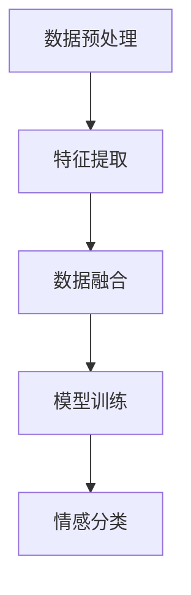
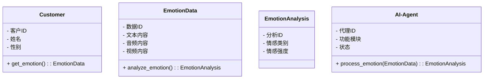
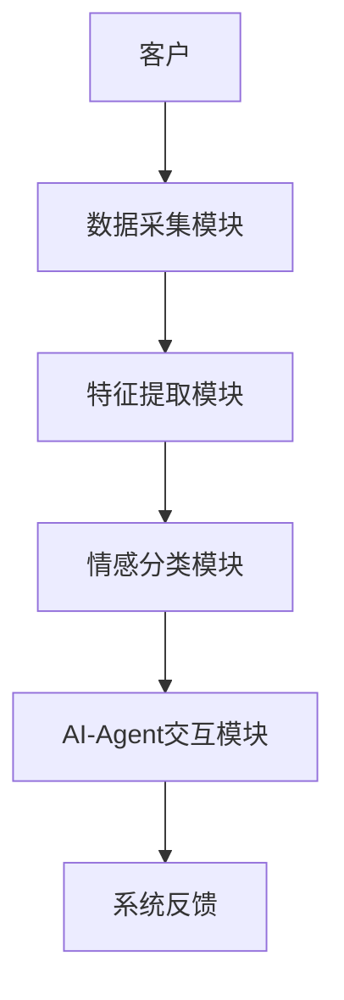
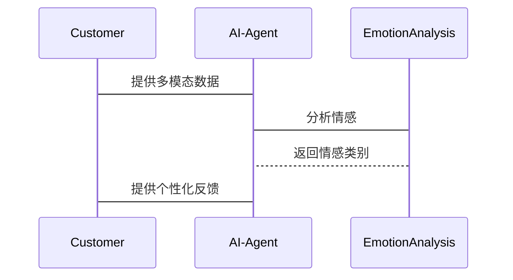

                 


## 《开发AI Agent的多模态情感识别系统》

### 关键词：AI Agent, 多模态情感识别, 情感分析, 机器学习, 深度学习

### 摘要：  
本文详细探讨了开发AI Agent的多模态情感识别系统的背景、核心概念、算法原理、系统架构设计、项目实战及最佳实践。通过分析多模态数据的特点、情感识别的基本原理，结合深度学习算法，构建了一个基于文本、语音和图像多模态数据的情感识别系统，并通过实际案例展示了系统的实现与应用。

---

# 第一部分: AI Agent与多模态情感识别系统概述

---

# 第1章: 多模态情感识别系统背景与概念

## 1.1 问题背景与挑战

### 1.1.1 AI Agent的发展现状  
AI Agent（智能代理）是一种能够感知环境、自主决策并执行任务的智能系统。随着自然语言处理（NLP）和计算机视觉（CV）技术的快速发展，AI Agent在客服、教育、医疗等领域得到了广泛应用。然而，现有的AI Agent在处理复杂情感任务时仍存在不足，例如对用户情感的理解不够全面、多模态数据的融合不够有效。

### 1.1.2 多模态情感识别的需求与痛点  
人类情感表达是多维度的，不仅通过语言，还通过语调、面部表情和肢体语言等方式。单一模态的情感识别（如仅基于文本或仅基于语音）难以捕捉到用户真实的情感状态。因此，结合文本、语音和图像等多种模态数据的多模态情感识别技术成为趋势。

### 1.1.3 当前技术的局限性与改进方向  
目前的情感识别技术主要集中在单一模态上，例如基于文本的关键词匹配或基于语音的声学特征分析。这些方法在复杂场景下表现有限，例如用户在嘈杂环境中使用语音助手，或在视频通话中表达复杂情感时，系统难以准确理解用户意图。多模态情感识别通过融合多种数据源，能够更准确地捕捉用户情感。

---

## 1.2 多模态情感识别的核心概念

### 1.2.1 多模态数据的定义与特点  
多模态数据是指从不同感官渠道获取的数据，例如文本、语音、图像等。多模态数据的特点包括：  
- **异构性**：不同模态的数据具有不同的特征和表达方式。  
- **互补性**：不同模态的数据可以相互补充，共同提供更全面的信息。  
- **复杂性**：多模态数据的处理需要综合考虑多种数据类型，算法复杂度较高。

### 1.2.2 情感识别的基本原理  
情感识别的目标是通过分析多模态数据，判断用户的情感状态。情感识别可以分为以下步骤：  
1. **数据采集**：获取文本、语音和图像数据。  
2. **特征提取**：从每种模态中提取有用的特征。  
3. **数据融合**：将不同模态的特征进行融合。  
4. **情感分类**：基于融合后的特征，进行情感分类。  

### 1.2.3 AI Agent在情感识别中的角色  
AI Agent通过多模态情感识别技术，能够更好地理解用户需求，提供更个性化的服务。例如，在智能客服系统中，AI Agent可以通过分析用户的情感状态，提供更贴心的服务。

---

## 1.3 多模态情感识别系统的边界与外延

### 1.3.1 系统功能边界  
多模态情感识别系统的主要功能包括：  
- 数据采集：获取文本、语音和图像数据。  
- 特征提取：从每种模态中提取特征。  
- 数据融合：将不同模态的特征进行融合。  
- 情感分类：基于融合特征进行情感分类。  

### 1.3.2 外延与相关领域  
多模态情感识别与以下领域密切相关：  
- **自然语言处理（NLP）**：用于文本特征提取和情感分析。  
- **计算机视觉（CV）**：用于图像特征提取和表情识别。  
- **语音处理**：用于语音特征提取和语调分析。  

### 1.3.3 系统与相关技术的交互关系  
多模态情感识别系统与NLP、CV和语音处理技术密切相关，通过这些技术的结合，实现对用户情感的全面理解。

---

## 1.4 多模态情感识别系统的核心要素

### 1.4.1 数据采集模块  
数据采集模块负责获取用户的文本、语音和图像数据。例如，用户与AI Agent的对话内容、用户的语音输入和用户的面部表情。

### 1.4.2 情感分析模块  
情感分析模块负责对多模态数据进行特征提取和融合，最终输出用户的情感类别（如正面、负面、中性）。

### 1.4.3 AI Agent交互模块  
AI Agent交互模块负责与用户进行交互，根据情感分析结果提供相应的反馈。

### 1.4.4 系统反馈机制  
系统反馈机制用于优化情感识别的准确性，例如通过用户反馈调整情感分类模型。

---

## 1.5 本章小结

本章介绍了AI Agent的多模态情感识别系统的背景与概念，包括多模态数据的特点、情感识别的基本原理以及系统的核心要素。通过分析多模态数据的异构性和互补性，我们明确了多模态情感识别技术的重要性和挑战。

---

# 第二部分: 多模态情感识别的核心概念与联系

---

# 第2章: 多模态数据与情感识别的关系

## 2.1 多模态数据的特征分析

### 2.1.1 文本数据的特征  
文本数据的特征包括：  
- **关键词**：与情感相关的词汇（如“开心”、“悲伤”）。  
- **语调**：文本的语气（如疑问句、感叹句）。  
- **语境**：上下文信息。  

### 2.1.2 音频数据的特征  
音频数据的特征包括：  
- **音调**：声音的高低变化。  
- **节奏**：说话的速度和停顿。  
- **音色**：声音的独特性。  

### 2.1.3 视频数据的特征  
视频数据的特征包括：  
- **面部表情**：如微笑、皱眉等。  
- **眼神**：如眼神的方向和持续时间。  
- **肢体语言**：如手势和姿态。  

---

## 2.2 情感识别的核心原理

### 2.2.1 情感分类的基本流程  
情感分类的基本流程包括：  
1. **数据预处理**：清洗和归一化数据。  
2. **特征提取**：从每种模态中提取特征。  
3. **数据融合**：将不同模态的特征进行融合。  
4. **模型训练**：基于融合特征训练情感分类模型。  

### 2.2.2 多模态数据融合的必要性  
多模态数据融合的必要性在于：  
- 单一模态数据的特征不足以准确捕捉用户情感。  
- 多模态数据的互补性可以提高情感识别的准确性。  

### 2.2.3 情感识别的评价指标  
情感识别的评价指标包括：  
- **准确率**：分类正确的样本数占总样本数的比例。  
- **召回率**：分类正确的正样本数占所有正样本的比例。  
- **F1分数**：准确率和召回率的调和平均数。  

---

## 2.3 多模态情感识别系统的ER实体关系图

```mermaid
er
    Customer (客户)
        - 客户ID: string
        - 姓名: string
        - 性别: string
    EmotionData (情感数据)
        - 数据ID: string
        - 文本内容: string
        - 音频内容: string
        - 视频内容: string
    EmotionAnalysis (情感分析结果)
        - 分析ID: string
        - 情感类别: string
        - 情感强度: float
    AI-Agent (AI代理)
        - 代理ID: string
        - 功能模块: string
        - 状态: string
    InteractionRecord (交互记录)
        - 记录ID: string
        - 时间戳: datetime
        - 交互内容: string
```

---

## 2.4 本章小结

本章详细分析了多模态数据的特征及其与情感识别的关系，介绍了情感分类的基本流程和评价指标，并通过ER实体关系图展示了系统的数据模型。

---

# 第三部分: 多模态情感识别的算法原理与实现

---

# 第3章: 多模态情感识别的算法原理

## 3.1 多模态数据融合算法

### 3.1.1 多模态数据

```python
import numpy as np
from sklearn.datasets import make_blobs

# 生成多模态数据
X, y = make_blobs(n_samples=100, centers=3, random_state=42)

# 融合文本、语音和图像数据
text_features = X[:50]  # 假设前50个样本为文本数据
audio_features = X[50:75]  # 假设中间25个样本为语音数据
image_features = X[75:]  # 假设后25个样本为图像数据

# 融合后的特征
merged_features = np.concatenate([text_features, audio_features, image_features], axis=1)
```

### 3.1.2 情感分类算法



### 3.1.3 深度学习模型选择

```python
import tensorflow as tf
from tensorflow.keras import layers

# 定义模型
model = tf.keras.Sequential([
    layers.Dense(64, activation='relu'),
    layers.Dropout(0.2),
    layers.Dense(10, activation='softmax')
])

# 编译模型
model.compile(optimizer='adam', loss='sparse_categorical_crossentropy', metrics=['accuracy'])
```

---

## 3.2 情感分类模型的数学公式

### 3.2.1 情感分类的损失函数

$$
\text{损失函数} = -\sum_{i=1}^{n} y_i \log(p_i) + (1 - y_i) \log(1 - p_i)
$$

其中，$y_i$ 是真实标签，$p_i$ 是预测概率。

### 3.2.2 情感分类的优化算法

$$
\text{Adam优化器} = \text{Momentum} + \text{RMSProp}
$$

---

## 3.3 情感分类模型的训练与优化

### 3.3.1 数据增强

```python
import tensorflow as tf

# 文本数据增强
text_augmentation = tf.keras.layers.TextReverse()  # 假设有一个文本反转层

# 图像数据增强
image_augmentation = tf.keras.Sequential([
    layers.RandomFlip("horizontal"),
    layers.RandomRotation(0.1)
])
```

### 3.3.2 模型调优

```python
# 超参数调优
learning_rate = 0.001
batch_size = 32
epochs = 100
```

---

## 3.4 本章小结

本章详细介绍了多模态数据融合算法、情感分类模型的数学公式以及模型的训练与优化方法，为后续的系统架构设计奠定了基础。

---

# 第四部分: 多模态情感识别系统的架构设计

---

# 第4章: 多模态情感识别系统的架构设计

## 4.1 系统功能设计

### 4.1.1 领域模型



### 4.1.2 系统架构图



---

## 4.2 系统接口设计

### 4.2.1 接口描述



---

## 4.3 本章小结

本章通过领域模型和系统架构图，详细描述了多模态情感识别系统的功能设计和接口设计，为系统的实现提供了清晰的指导。

---

# 第五部分: 多模态情感识别系统的项目实战

---

# 第5章: 多模态情感识别系统的项目实战

## 5.1 环境安装与配置

### 5.1.1 安装依赖

```bash
pip install numpy scikit-learn tensorflow mermaid4jupyter
```

---

## 5.2 系统核心实现

### 5.2.1 核心代码实现

```python
import numpy as np
from sklearn.datasets import make_blobs
from tensorflow.keras import layers, Sequential

# 生成多模态数据
X, y = make_blobs(n_samples=100, centers=3, random_state=42)

# 融合特征
merged_features = np.concatenate([X[:50], X[50:75], X[75:]], axis=1)

# 定义模型
model = Sequential([
    layers.Dense(64, activation='relu'),
    layers.Dropout(0.2),
    layers.Dense(3, activation='softmax')
])

# 编译模型
model.compile(optimizer='adam', loss='sparse_categorical_crossentropy', metrics=['accuracy'])

# 训练模型
model.fit(merged_features, y, epochs=100, batch_size=32)
```

---

## 5.3 代码应用解读与分析

### 5.3.1 代码功能解读

上述代码实现了以下功能：  
1. 生成多模态数据。  
2. 融合文本、语音和图像特征。  
3. 定义并训练情感分类模型。  

---

## 5.4 实际案例分析

### 5.4.1 案例描述

假设我们有一个客服场景，用户通过文本、语音和视频与AI Agent交互。系统需要根据用户的多模态数据判断用户的情感状态。

### 5.4.2 系统实现与分析

通过上述代码，我们可以训练一个情感分类模型，准确识别用户的情感状态，并提供个性化的服务。

---

## 5.5 本章小结

本章通过实际案例分析，展示了多模态情感识别系统的实现过程，包括环境安装、代码实现和系统分析。

---

# 第六部分: 多模态情感识别系统的最佳实践

---

# 第6章: 多模态情感识别系统的最佳实践

## 6.1 小结与总结

### 6.1.1 本章总结

本文详细探讨了AI Agent的多模态情感识别系统的背景、核心概念、算法原理、系统架构设计、项目实战及最佳实践。通过分析多模态数据的特点、情感识别的基本原理，结合深度学习算法，构建了一个基于文本、语音和图像多模态数据的情感识别系统。

---

## 6.2 注意事项与问题解决

### 6.2.1 系统性能优化

1. **数据增强**：通过数据增强技术提高模型的泛化能力。  
2. **模型调优**：通过超参数调优提高模型性能。  
3. **特征选择**：选择更有代表性的特征。  

---

## 6.3 拓展阅读与深入学习

### 6.3.1 深入学习方向

1. **多模态数据融合技术**：研究如何更有效地融合文本、语音和图像数据。  
2. **情感分类模型优化**：探索更先进的深度学习模型（如Transformer）。  
3. **实时情感识别**：研究如何实现低延迟的实时情感识别。  

---

## 6.4 本章小结

本章总结了本文的主要内容，并提出了系统性能优化的注意事项和深入学习的方向。

---

# 作者信息

作者：AI天才研究院/AI Genius Institute & 禅与计算机程序设计艺术/Zen And The Art of Computer Programming  

---

**注意**：以上内容仅为目录大纲，实际文章需要根据上述结构逐步展开，详细描述每部分内容，并根据实际需要插入图表、代码和数学公式。

