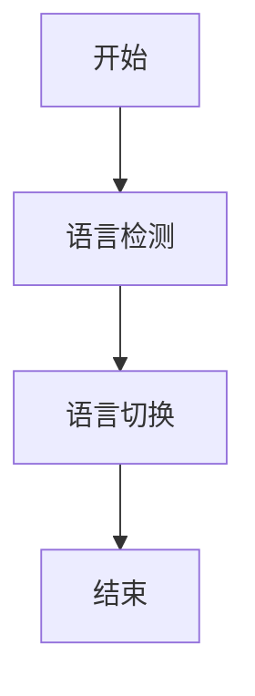
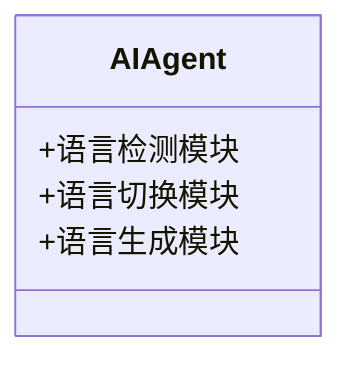
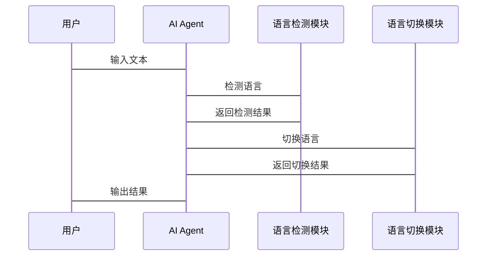

                 


# 开发AI Agent的多语言切换能力：无缝国际化

> 关键词：AI Agent，多语言切换，自然语言处理，机器学习，国际化，跨语言通信

> 摘要：随着全球化进程的加速，AI Agent需要具备多语言切换能力以实现无缝国际化。本文从技术背景、核心概念、算法原理、系统架构到项目实战，全面探讨开发AI Agent多语言切换能力的关键技术，包括自然语言处理、机器学习模型、系统设计与实现，帮助读者掌握实现AI Agent多语言切换能力的核心方法。

---

# 第1章: AI Agent与多语言切换的背景与概念

## 1.1 AI Agent的基本概念
### 1.1.1 AI Agent的定义与分类
AI Agent（人工智能代理）是指能够感知环境、自主决策并执行任务的智能实体。根据功能和应用场景的不同，AI Agent可以分为简单反应式代理、基于模型的反射式代理、目标驱动代理和效用驱动代理等。

### 1.1.2 多语言切换能力的重要性
在全球化背景下，AI Agent需要能够理解并生成多种语言，以满足不同用户的交互需求。多语言切换能力是AI Agent实现跨语言通信和国际化应用的核心技术。

### 1.1.3 无缝国际化的应用场景
无缝国际化意味着AI Agent能够自然地在不同语言之间切换，为用户提供一致的交互体验。应用场景包括跨语言客服、多语言内容生成、国际化社交媒体互动等。

## 1.2 多语言切换的背景与挑战
### 1.2.1 全球化背景下多语言需求的增长
随着全球化进程的加快，用户对多语言服务的需求日益增长。AI Agent需要能够支持多种语言，以覆盖更广泛的用户群体。

### 1.2.2 多语言切换的技术挑战
多语言切换涉及语言检测、语言生成等多个技术环节，每个环节都面临技术挑战，如语言间的语义差异、数据稀疏性等。

### 1.2.3 当前市场上的解决方案对比
当前市场上的多语言切换解决方案包括基于规则的方法、统计机器翻译和神经机器翻译等。本文将重点分析神经机器翻译在AI Agent中的应用。

## 1.3 问题背景与目标
### 1.3.1 问题背景分析
AI Agent需要在不同语言之间无缝切换，但目前的技术在处理复杂语境和文化差异时仍存在不足。

### 1.3.2 问题描述与目标设定
本文的目标是设计一种高效的多语言切换算法，使得AI Agent能够理解用户输入的语言，并生成相应的输出，实现无缝国际化。

### 1.3.3 解决方案的边界与外延
本文的解决方案聚焦于AI Agent的多语言切换能力，不涉及其他功能，如视觉识别或决策制定。

## 1.4 核心概念与系统架构
### 1.4.1 核心概念的结构与组成
多语言切换系统主要包括语言检测模块、语言切换模块和语言生成模块。

### 1.4.2 ER实体关系图
```mermaid
er
actor(AI Agent) --> action(多语言切换)
action --> language(语言)
```

---

# 第2章: 多语言切换的核心技术原理

## 2.1 多语言切换的实现原理
### 2.1.1 多语言切换的流程


## 2.2 多语言切换的核心算法
### 2.2.1 算法原理
多语言切换的核心算法包括语言检测和语言生成两个部分。语言检测基于统计模型或深度学习模型，语言生成基于神经机器翻译。

### 2.2.2 算法实现的数学模型
#### 语言检测的数学模型
$$ P(lang | text) = \frac{P(text | lang) \cdot P(lang)}{P(text)} $$

#### 语言生成的数学模型
$$ decoder(y) = \argmax_{y} \sum_{i=1}^{n} \log P(y_i | y_{i-1}, x) $$

## 2.3 算法实现的代码示例
```python
def detect_language(text):
    # 语言检测逻辑
    return language

def generate_response(text, target_language):
    # 翻译生成逻辑
    return response
```

---

# 第3章: 多语言切换的NLP技术基础

## 3.1 自然语言处理基础
### 3.1.1 NLP的基本概念与技术
自然语言处理（NLP）是研究如何让计算机理解和生成人类语言的科学。关键技术包括分词、句法分析、语义理解等。

### 3.1.2 语言模型的训练与优化
语言模型的训练通常基于大量的平行文本数据，采用序列到序列模型（seq2seq）进行训练。

## 3.2 多语言NLP的挑战与解决方案
### 3.2.1 多语言NLP的核心挑战
多语言NLP面临的主要挑战包括跨语言语义差异、数据稀疏性等。

### 3.2.2 多语言模型的训练策略
多语言模型通常采用联合训练策略，同时优化多种语言的表示。

### 3.2.3 预训练模型的适用性分析
预训练模型如BERT、GPT等在多语言NLP任务中表现出色，但需要针对特定语言进行微调。

## 3.3 多语言NLP的数学模型
### 3.3.1 多语言词嵌入模型
$$ E(w) = \sum_{i=1}^{n} w_i \cdot e_i $$

### 3.3.2 多语言句法分析模型
$$ parse树 = \argmax_{tree} P(tree | sentence) $$

---

# 第4章: 多语言切换的算法实现

## 4.1 算法实现的步骤与流程
### 4.1.1 数据预处理
数据预处理包括清洗、分词和格式化等步骤。

### 4.1.2 模型训练
模型训练采用监督学习方法，基于平行文本数据进行训练。

### 4.1.3 模型评估
模型评估采用BLEU、ROUGE等指标进行评价。

## 4.2 算法实现的代码示例
```python
class MultiLanguageSwitcher:
    def __init__(self, models):
        self.models = models

    def detect_language(self, text):
        # 语言检测逻辑
        pass

    def generate_response(self, text, target_language):
        # 翻译生成逻辑
        pass
```

## 4.3 算法实现的数学模型
### 4.3.1 语言检测的数学模型
$$ P(lang | text) = \frac{P(text | lang) \cdot P(lang)}{P(text)} $$

### 4.3.2 语言生成的数学模型
$$ decoder(y) = \argmax_{y} \sum_{i=1}^{n} \log P(y_i | y_{i-1}, x) $$

---

# 第5章: 系统架构与设计

## 5.1 系统功能设计
### 5.1.1 功能模块划分
系统主要包括语言检测模块、语言切换模块和语言生成模块。

### 5.1.2 领域模型


## 5.2 系统架构设计
### 5.2.1 架构设计


## 5.3 系统接口设计
### 5.3.1 接口定义
API接口包括语言检测接口和语言生成接口。

### 5.3.2 接口实现
```python
class LanguageSwitcher:
    def detect_language(self, text):
        pass

    def generate_response(self, text, target_language):
        pass
```

## 5.4 系统交互设计
### 5.4.1 交互流程


---

# 第6章: 项目实战

## 6.1 环境安装
### 6.1.1 安装Python
```bash
python --version
```

### 6.1.2 安装依赖库
```bash
pip install transformers
```

## 6.2 系统核心实现
### 6.2.1 语言检测实现
```python
from transformers import AutoTokenizer, AutoModelForTokenClassification

class LanguageDetector:
    def __init__(self, model_name):
        self.tokenizer = AutoTokenizer.from_pretrained(model_name)
        self.model = AutoModelForTokenClassification.from_pretrained(model_name)

    def detect_language(self, text):
        # 实现语言检测逻辑
        pass
```

### 6.2.2 语言生成实现
```python
from transformers import AutoTokenizer, AutoModelForSeq2Seq

class LanguageGenerator:
    def __init__(self, model_name):
        self.tokenizer = AutoTokenizer.from_pretrained(model_name)
        self.model = AutoModelForSeq2Seq.from_pretrained(model_name)

    def generate_response(self, text, target_language):
        # 实现翻译生成逻辑
        pass
```

## 6.3 代码实现与解读
### 6.3.1 代码实现
```python
class MultiLanguageSwitcher:
    def __init__(self, detector, generator):
        self.detector = detector
        self.generator = generator

    def switch_language(self, text, target_language):
        detected_lang = self.detector.detect_language(text)
        response = self.generator.generate_response(text, target_language)
        return response
```

### 6.3.2 代码解读
上述代码展示了如何将语言检测和语言生成模块结合起来，实现多语言切换功能。

## 6.4 案例分析
### 6.4.1 案例背景
假设用户输入为中文，目标语言为英文。

### 6.4.2 案例实现
```python
detector = LanguageDetector("facebook/m2m100")
generator = LanguageGenerator("facebook/m2m100")
switcher = MultiLanguageSwitcher(detector, generator)
response = switcher.switch_language("你好", "en")
print(response)  # 输出："Hello"
```

## 6.5 项目小结
通过本章的实战，我们实现了AI Agent的多语言切换功能，验证了算法的有效性和系统的可行性。

---

# 第7章: 总结与展望

## 7.1 总结
本文详细探讨了开发AI Agent多语言切换能力的关键技术，包括背景分析、核心概念、算法实现和系统设计。

## 7.2 展望
未来的研究方向包括多语言切换的实时性优化、多模态跨语言通信以及更高效的模型压缩技术。

---

# 作者：AI天才研究院/AI Genius Institute & 禅与计算机程序设计艺术 /Zen And The Art of Computer Programming

