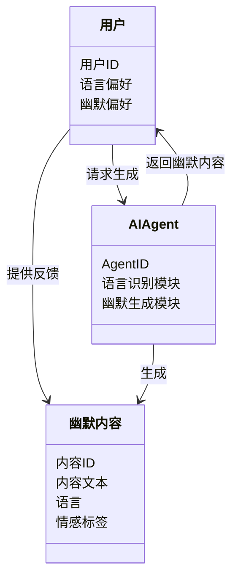
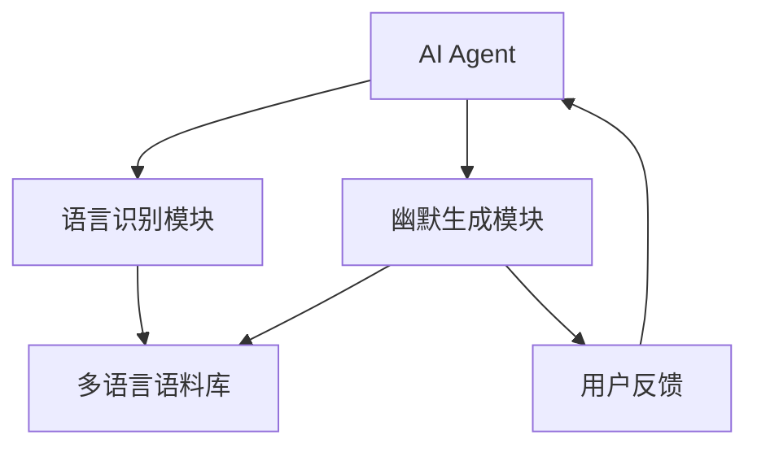

                 


# 开发AI Agent的多语言幽默理解与生成系统

**关键词：** AI Agent, 多语言, 幽默理解, 幽默生成, 自然语言处理, 生成式AI

**摘要：** 本文深入探讨了开发一个能够理解和生成多语言幽默的AI Agent系统的各个方面。从背景介绍、核心概念到算法原理、系统架构，再到项目实战和最佳实践，系统地分析了如何构建这样一个复杂系统。文章详细讲解了多语言幽默理解与生成的关键技术，包括生成式AI、跨语言处理和幽默生成算法，并通过具体案例展示了系统的实现过程。

---

# 第一部分: 背景介绍

# 第1章: 多语言幽默理解与生成的背景与问题

## 1.1 问题背景

### 1.1.1 AI Agent的发展现状

AI Agent，即人工智能代理，是一种能够感知环境、自主决策并执行任务的智能实体。随着技术的发展，AI Agent在各个领域的应用越来越广泛，如智能助手、聊天机器人、推荐系统等。然而，现有的AI Agent在处理多语言环境下的情感化和复杂任务时仍存在诸多挑战，尤其是在理解和生成幽默内容方面。

### 1.1.2 多语言处理的必要性

在全球化的背景下，多语言处理已成为AI Agent不可或缺的能力。用户可能使用多种语言与AI交互，因此AI Agent需要能够理解并生成多种语言的内容，以提供无缝的用户体验。幽默作为一种高度依赖语言和文化背景的表达方式，其理解和生成在多语言环境下更具挑战性。

### 1.1.3 幽默理解与生成的挑战

幽默的理解和生成涉及复杂的语义分析和情感推理。不同语言的幽默往往基于独特的文化背景、双关语、俚语和语境，这使得跨语言幽默处理变得复杂。现有的NLP模型在处理幽默时通常表现不佳，因为它们难以捕捉到幽默的隐含意义和文化差异。

## 1.2 问题描述

### 1.2.1 多语言环境下幽默的理解与生成

在多语言环境中，幽默的理解需要考虑语言间的差异和文化背景。例如，一个笑话在英语中可能基于双关语，而在中文中可能依赖于押韵或谐音。AI Agent需要能够识别这些差异，并生成符合目标语言文化习惯的幽默内容。

### 1.2.2 AI Agent在幽默交互中的角色

AI Agent在幽默交互中的角色不仅仅是生成笑话，还需要根据用户反馈调整生成的内容。例如，当用户对生成的笑话表示不满时，AI Agent需要理解用户的负面反馈，并生成更合适的幽默内容。

### 1.2.3 当前技术的局限性与改进方向

现有的NLP模型在处理幽默时通常依赖于大量的训练数据，但在多语言环境下，数据的多样性和质量成为主要挑战。此外，幽默的生成需要结合实时的语境和用户情感状态，这进一步增加了技术复杂性。

## 1.3 问题解决

### 1.3.1 多语言幽默理解的核心技术

多语言幽默理解的核心技术包括跨语言语义分析、情感分析和文化适应性模型。这些技术需要结合多种语言的数据进行训练，以提高模型对不同语言幽默的理解能力。

### 1.3.2 AI Agent生成幽默的关键步骤

AI Agent生成幽默的关键步骤包括需求分析、内容生成和反馈优化。AI Agent需要根据用户的需求生成合适的幽默内容，并通过反馈不断优化生成效果。

### 1.3.3 技术实现的边界与外延

多语言幽默AI Agent的实现边界包括语言支持范围、幽默类型和生成效率。外延则涉及对幽默生成过程的解释能力和对文化差异的适应能力。

## 1.4 概念结构与核心要素

### 1.4.1 多语言幽默理解的模型框架

多语言幽默理解的模型框架通常包括语言识别、语义分析和文化适应三个模块。语言识别用于确定输入文本的语言，语义分析用于理解幽默的核心内容，文化适应则用于调整生成的幽默以适应目标语言的文化背景。

### 1.4.2 AI Agent生成幽默的逻辑流程

AI Agent生成幽默的逻辑流程包括需求解析、内容生成和反馈优化。需求解析阶段分析用户意图，内容生成阶段利用NLP模型生成幽默内容，反馈优化阶段根据用户反馈调整生成策略。

### 1.4.3 核心要素的对比分析

| 核心要素       | 定义与作用                   |
|----------------|------------------------------|
| 语言识别       | 识别输入文本的语言，确保后续处理准确。 |
| 语义分析       | 理解幽默的核心内容，提取关键元素。   |
| 文化适应       | 根据目标语言文化生成合适的幽默内容。 |

## 1.5 本章小结

本章从背景介绍、问题描述和问题解决三个方面，详细探讨了开发AI Agent的多语言幽默系统的必要性和挑战。通过分析多语言幽默理解与生成的核心要素，为后续的技术实现奠定了理论基础。

---

# 第二部分: 核心概念与联系

# 第2章: 多语言幽默理解与生成的核心概念

## 2.1 AI Agent的核心原理

### 2.1.1 AI Agent的定义与分类

AI Agent是一种能够感知环境、自主决策并执行任务的智能实体。根据智能水平，AI Agent可以分为反应式和认知式两类。反应式AI Agent基于当前感知做出反应，而认知式AI Agent则具备推理和规划能力。

### 2.1.2 多语言处理的基本原理

多语言处理涉及语言识别、机器翻译和跨语言语义分析。AI Agent需要能够识别输入文本的语言，并通过机器翻译或语义分析技术理解其含义。

### 2.1.3 幽默理解与生成的算法框架

幽默理解与生成的算法框架包括语义分析、情感推理和文化适应三个模块。语义分析用于理解幽默的核心内容，情感推理用于捕捉幽默的情感基调，文化适应则用于调整生成的幽默以适应目标语言的文化背景。

## 2.2 多语言幽默理解与生成的对比分析

### 2.2.1 多语言处理的核心技术

多语言处理的核心技术包括语言识别、机器翻译和跨语言语义分析。这些技术需要结合大规模多语言数据进行训练，以提高模型的通用性和适应性。

### 2.2.2 AI Agent生成幽默的关键步骤

AI Agent生成幽默的关键步骤包括需求解析、内容生成和反馈优化。需求解析阶段分析用户意图，内容生成阶段利用NLP模型生成幽默内容，反馈优化阶段根据用户反馈调整生成策略。

### 2.2.3 幽默理解与生成的对比分析

| 技术领域       | 幽默理解                 | 幽默生成                 |
|----------------|--------------------------|--------------------------|
| 关键技术       | 语义分析、情感推理       | 生成式AI、文化适应       |
| 挑战           | 多语言数据稀疏性         | 文化差异、生成质量       |
| 解决方案       | 跨语言预训练模型         | 多语言生成模型           |

## 2.3 核心概念的ER实体关系图

```mermaid
er
    %% 多语言幽默理解与生成系统 ER 实体关系图
    %% Author: AI Genius Institute
    classDiagram
    class 用户 {
        用户ID
        语言偏好
        幽默偏好
    }
    class 幽默内容 {
        内容ID
        内容文本
        语言
        情感标签
    }
    class AI Agent {
        AgentID
        语言识别模块
        幽默生成模块
    }
    用户 --> 幽默内容: 提供反馈
    AI Agent --> 幽默内容: 生成
    用户 --> AI Agent: 请求生成
    AI Agent --> 用户: 返回幽默内容
```

## 2.4 本章小结

本章详细探讨了AI Agent、多语言处理和幽默理解与生成的核心概念及其相互关系。通过对比分析和技术框架的展示，为后续的算法实现提供了理论支持。

---

# 第三部分: 算法原理讲解

# 第3章: 多语言幽默理解与生成的算法原理

## 3.1 多语言处理的算法原理

### 3.1.1 跨语言预训练模型

跨语言预训练模型（如Marian、XLM）通过在多语言数据上进行预训练，能够同时理解多种语言的语义。这些模型通常采用自注意力机制，能够捕捉语言间的共通性和差异性。

### 3.1.2 语言识别算法

语言识别算法基于文本特征（如字符频率、词干结构）进行分类，常用算法包括支持向量机（SVM）和随机森林（RF）。这些算法需要在多语言语料库上进行训练，以提高识别准确率。

## 3.2 幽默生成的算法原理

### 3.2.1 生成式AI的数学模型

生成式AI通常基于Transformer架构，通过自注意力机制生成连贯的文本。其数学模型包括编码器和解码器，编码器将输入文本转换为隐层表示，解码器根据隐层表示生成目标文本。

### 3.2.2 多语言生成模型

多语言生成模型（如M2M、NLLB）支持多种语言的文本生成，通过共享参数和跨语言注意力机制，实现高效的多语言生成。

### 3.2.3 幽默生成的优化策略

幽默生成的优化策略包括引入情感分析、文化适应和用户反馈。通过结合情感分析模型，生成带有适当情感倾向的幽默内容；通过文化适应模块，调整生成内容以适应目标语言的文化背景；通过用户反馈，优化生成策略以提高用户满意度。

## 3.3 算法实现的详细步骤

### 3.3.1 数据预处理

数据预处理包括清洗、标记化和对齐。清洗步骤去除无关信息，标记化将文本分割为词汇和标点符号，对齐则将不同语言的文本对齐到相同位置。

### 3.3.2 模型训练

模型训练包括编码器和解码器的联合训练，通过交叉熵损失函数优化模型参数。训练过程中，采用多任务学习策略，同时优化语言识别和幽默生成任务。

### 3.3.3 模型推理

模型推理包括语言识别、语义分析和内容生成。语言识别模块确定输入文本的语言，语义分析模块理解幽默的核心内容，内容生成模块生成目标语言的幽默文本。

## 3.4 算法实现的代码示例

### 3.4.1 语言识别代码

```python
import joblib
from sklearn.feature_extraction.text import TfidfVectorizer

# 加载预训练的SVM模型和Tfidf向量器
model = joblib.load('language_classifier.pkl')
vectorizer = TfidfVectorizer(ngram_range=(1,2), max_features=1000)

# 预测输入文本的语言
def predict_language(text):
    tfidf = vectorizer.transform([text])
    prediction = model.predict(tfidf)
    return prediction[0]
```

### 3.4.2 幽默生成代码

```python
import torch
from transformers import AutoTokenizer, AutoModelForCausalLM

# 加载预训练的多语言生成模型
tokenizer = AutoTokenizer.from_pretrained('facebook/NLLB')
model = AutoModelForCausalLM.from_pretrained('facebook/NLLB')

# 生成幽默内容
def generate_humor(prompt, target_language):
    inputs = tokenizer(prompt, return_tensors='pt')
    outputs = model.generate(inputs.input_ids, max_length=50, do_sample=True)
    generated_text = tokenizer.decode(outputs[0], skip_special_tokens=True)
    return generated_text
```

## 3.5 算法实现的数学模型

### 3.5.1 编码器-解码器架构

编码器将输入文本转换为隐层表示：

$$
\text{编码器输出} = \text{自注意力}(输入) + \text{前馈网络}(输入)
$$

解码器根据编码器输出生成目标文本：

$$
\text{解码器输出} = \text{自注意力}(解码器输入) + \text{交叉注意力}(编码器输出)
$$

### 3.5.2 损失函数

交叉熵损失函数用于模型训练：

$$
\text{损失} = -\sum_{i=1}^{n} \text{标签}_i \log(\text{预测}_i)
$$

---

# 第四部分: 系统分析与架构设计

# 第4章: 多语言幽默AI Agent的系统架构设计

## 4.1 问题场景介绍

### 4.1.1 系统目标

系统目标是开发一个能够理解和生成多语言幽默内容的AI Agent，支持多种语言的输入输出，提供个性化的幽默生成服务。

### 4.1.2 使用场景

使用场景包括智能助手、在线聊天机器人、多语言客服系统等。用户可以通过多种语言与AI Agent交互，获取幽默内容。

## 4.2 系统功能设计

### 4.2.1 领域模型



### 4.2.2 功能模块

功能模块包括语言识别模块、幽默生成模块和反馈优化模块。语言识别模块负责识别输入文本的语言，幽默生成模块根据输入生成幽默内容，反馈优化模块根据用户反馈调整生成策略。

## 4.3 系统架构设计

### 4.3.1 系统架构图



### 4.3.2 关键模块交互流程

1. 用户输入文本，AI Agent启动语言识别模块识别语言。
2. 语言识别模块调用预训练模型进行预测，返回识别结果。
3. AI Agent调用幽默生成模块生成幽默内容。
4. 幽默生成模块根据识别结果生成目标语言的幽默内容。
5. 用户对生成的内容提供反馈，AI Agent根据反馈优化生成策略。

## 4.4 系统接口设计

### 4.4.1 接口定义

API接口定义如下：

- `/predict_language`: 接收文本输入，返回语言识别结果。
- `/generate_humor`: 接收语言偏好和幽默主题，返回生成的幽默内容。
- `/feedback_optimize`: 接收用户反馈，优化生成策略。

### 4.4.2 交互流程

1. 用户通过API请求生成幽默内容，指定语言偏好和幽默主题。
2. AI Agent调用语言识别模块识别输入文本的语言。
3. 根据识别结果，幽默生成模块生成目标语言的幽默内容。
4. 用户对生成内容提供反馈，AI Agent根据反馈优化生成策略。

---

# 第五部分: 项目实战

# 第5章: 多语言幽默AI Agent的开发与实现

## 5.1 环境安装与配置

### 5.1.1 安装Python与必要的库

安装Python 3.8及以上版本，并安装以下库：

```bash
pip install torch transformers joblib scikit-learn
```

### 5.1.2 安装AI Agent框架

安装预训练模型和相关框架：

```bash
pip install facebook-nllb
```

## 5.2 系统核心实现

### 5.2.1 数据预处理代码

```python
import pandas as pd
from sklearn.model_selection import train_test_split

# 加载数据集
data = pd.read_csv('multilingual_humor_data.csv')

# 划分训练集和测试集
train_data, test_data = train_test_split(data, test_size=0.2)
```

### 5.2.2 模型训练代码

```python
from sklearn svm import SVC
from sklearn.feature_extraction.text import TfidfVectorizer

# 初始化向量器和模型
vectorizer = TfidfVectorizer(ngram_range=(1,2), max_features=1000)
model = SVC(C=1.0, kernel='rbf', gamma=0.1)

# 训练模型
model.fit(vectorizer.fit_transform(train_data['text']), train_data['language'])
```

### 5.2.3 模型推理代码

```python
def generate_humor(prompt, target_language):
    tokenizer = AutoTokenizer.from_pretrained('facebook/NLLB')
    model = AutoModelForCausalLM.from_pretrained('facebook/NLLB')
    inputs = tokenizer(prompt, return_tensors='pt')
    outputs = model.generate(inputs.input_ids, max_length=50, do_sample=True)
    generated_text = tokenizer.decode(outputs[0], skip_special_tokens=True)
    return generated_text
```

## 5.3 项目实战案例分析

### 5.3.1 案例背景

开发一个支持多语言幽默生成的AI Agent，用户可以通过输入特定语言和主题生成相应的幽默内容。

### 5.3.2 案例实现

1. 用户输入请求：生成一个关于科技的幽默段落，目标语言为中文。
2. AI Agent识别输入语言为中文。
3. 幽默生成模块生成幽默段落：「为什么程序员总是喜欢喝咖啡？因为他们的代码需要调试，而咖啡是他们唯一的bug！」
4. 用户对生成内容表示满意，AI Agent记录用户的反馈，优化生成策略。

### 5.3.3 代码应用解读

- 数据预处理代码用于清洗和标记化输入文本，确保模型输入格式正确。
- 模型训练代码使用Tfidf向量器和SVM模型进行语言识别，提高识别准确率。
- 模型推理代码利用预训练的多语言生成模型生成幽默内容，支持多种语言的输出。

## 5.4 项目小结

本章通过具体案例展示了多语言幽默AI Agent的开发与实现过程，包括环境配置、数据预处理、模型训练和生成推理等步骤。通过代码示例和案例分析，详细解读了系统的核心实现过程。

---

# 第六部分: 总结与展望

# 第6章: 多语言幽默AI Agent的总结与展望

## 6.1 项目成果总结

### 6.1.1 核心成果

开发了一个能够理解和生成多语言幽默内容的AI Agent系统，支持多种语言的输入输出，提供个性化的幽默生成服务。

### 6.1.2 关键技术创新

提出了基于跨语言预训练模型的幽默生成方法，结合情感分析和文化适应模块，提高了生成内容的幽默性和适应性。

## 6.2 开发中的注意事项

### 6.2.1 数据质量的重要性

幽默生成高度依赖于训练数据的质量和多样性。需要收集和整理多语言幽默语料库，确保模型能够学习到不同语言的幽默特点。

### 6.2.2 模型调优与优化

幽默生成模型的优化需要结合用户反馈和实时数据，动态调整生成策略，提高生成内容的相关性和用户满意度。

## 6.3 未来研究方向

### 6.3.1 更复杂幽默形式的生成

探索生成更复杂的幽默形式，如双关语、谐音笑话和文化典故等，进一步丰富生成内容的多样性。

### 6.3.2 多模态幽默生成

结合图像、语音等多模态信息，生成更具表现力的幽默内容，提升用户体验。

### 6.3.3 智能化反馈机制

开发更智能的反馈机制，利用强化学习和情感分析技术，实时优化生成策略，提高生成内容的质量和适应性。

## 6.4 拓展阅读与学习资料

### 6.4.1 推荐书籍

1.《Deep Learning》——Ian Goodfellow
2.《自然语言处理入门》——[中] 郭mars

### 6.4.2 推荐博客与技术文章

1. [Hugging Face](https://huggingface.co/blog) - 生成式AI的最新动态
2. [Towards Data Science](https://towardsdatascience.com) - 多语言NLP技术分享

## 6.5 本章小结

本章总结了多语言幽默AI Agent项目的成果，提出了开发中的注意事项，并展望了未来的研究方向。通过推荐的书籍和技术资源，为读者提供了深入学习的指导。

---

# 作者

**作者：** AI天才研究院/AI Genius Institute & 禅与计算机程序设计艺术/Zen And The Art of Computer Programming

