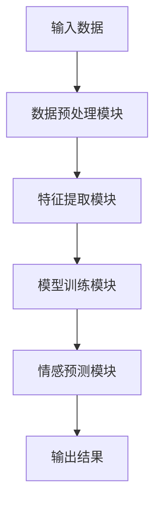

                 


# 《开发AI Agent的多语言情感分析引擎》

## 关键词：AI Agent，情感分析，多语言，自然语言处理，机器学习，深度学习

## 摘要：  
本文探讨了开发AI Agent驱动的多语言情感分析引擎的关键技术与实现方法。文章首先介绍了情感分析和AI Agent的基本概念及其在多语言环境中的重要性，接着深入分析了多语言情感分析的核心算法和实现原理，提出了基于深度学习的模型优化方法。最后，文章详细讲解了系统的架构设计、项目实战与实际应用案例，并总结了开发过程中需要注意的关键点和未来发展方向。

---

# 第1章: 多语言情感分析的背景与问题背景

## 1.1 情感分析的定义与应用
### 1.1.1 情感分析的定义
情感分析是自然语言处理（NLP）中的一个分支，旨在通过分析文本内容来判断作者的情感倾向（如正面、负面、中性等）。它广泛应用于社交媒体分析、客户反馈分析、产品推荐等领域。

### 1.1.2 情感分析的应用场景
- **社交媒体分析**：分析用户评论、点赞、分享等行为的情感倾向。
- **客户反馈分析**：帮助企业了解客户满意度，优化产品和服务。
- **舆情监控**：实时监测媒体和网络上的舆论趋势。
- **智能客服**：通过分析用户问题和语气，提供更智能的回复。

### 1.1.3 多语言情感分析的必要性
随着全球化的发展，企业需要处理来自不同语言的用户反馈，单一语言的情感分析已无法满足需求。多语言情感分析能够帮助企业更好地理解全球用户的需求和情感。

---

## 1.2 AI Agent的基本概念
### 1.2.1 AI Agent的定义
AI Agent（人工智能代理）是指能够感知环境、执行任务并做出决策的智能实体。它可以是一个软件程序，也可以是一个物理设备，通过与用户或环境交互来完成特定目标。

### 1.2.2 AI Agent的核心特征
- **自主性**：能够在没有外部干预的情况下自主决策。
- **反应性**：能够实时感知环境并做出反应。
- **目标导向**：所有行为都围绕特定目标展开。
- **学习能力**：能够通过经验改进自身的决策能力。

### 1.2.3 AI Agent在情感分析中的作用
AI Agent可以作为情感分析引擎的驱动者，负责接收输入、处理数据、分析情感，并根据结果做出相应的决策或反馈。

---

## 1.3 问题背景与挑战
### 1.3.1 多语言情感分析的难点
- **语言差异**：不同语言的语法、词汇和文化背景差异使得情感分析的实现更加复杂。
- **数据稀疏性**：某些语言的标注数据较少，导致模型训练困难。
- **文化差异**：情感表达在不同文化中有很大差异，需要专门的处理方法。

### 1.3.2 AI Agent在情感分析中的优势
- **智能化**：AI Agent能够自动化处理多语言情感数据，减少人工干预。
- **高效性**：通过机器学习算法，AI Agent可以快速分析大量数据并得出结果。
- **适应性**：AI Agent可以根据不同语言的特点进行自适应优化。

### 1.3.3 当前技术的局限性与未来发展方向
- **技术局限性**：现有模型在跨语言情感分析中表现还不够理想，尤其是在低资源语言（如小语种）上。
- **未来发展方向**：结合多模态数据（如图像、语音）进行情感分析，探索更高效的模型架构（如Transformer变体）。

---

## 1.4 本章小结
本章介绍了情感分析和AI Agent的基本概念，分析了多语言情感分析的背景和必要性，并指出了当前技术的挑战和未来发展方向。接下来，我们将深入探讨多语言情感分析与AI Agent之间的联系。

---

# 第2章: 多语言情感分析与AI Agent的联系

## 2.1 多语言情感分析的实现方式
### 2.1.1 多语言情感分析的定义
多语言情感分析是指在多种语言中进行情感分析，能够同时处理多种语言的情感数据。

### 2.1.2 多语言情感分析的核心技术
- **语言识别**：识别文本的语言类型。
- **跨语言特征提取**：提取适用于多种语言的特征。
- **模型训练**：训练能够处理多语言数据的模型。

### 2.1.3 多语言情感分析的实现步骤
1. 数据预处理：清洗和标注多语言文本数据。
2. 特征提取：提取文本的关键词、句法特征等。
3. 模型训练：训练情感分类器。
4. 情感预测：对未标注的数据进行情感预测。

---

## 2.2 AI Agent在情感分析中的应用
### 2.2.1 AI Agent如何处理多语言情感数据
AI Agent可以通过多语言情感分析引擎接收输入数据，自动识别语言并进行情感分析，然后根据结果做出决策。

### 2.2.2 AI Agent在情感分析中的决策机制
1. **输入处理**：接收用户的输入数据（如评论、反馈）。
2. **语言识别**：确定输入数据的语言类型。
3. **情感分析**：调用多语言情感分析模型进行情感预测。
4. **结果处理**：根据情感分析结果生成响应或执行任务。

### 2.2.3 AI Agent与其他情感分析工具的对比
- **传统工具**：通常只能处理单一语言数据，且需要人工干预。
- **AI Agent**：能够处理多语言数据，具备自主决策能力。

---

## 2.3 多语言情感分析与AI Agent的核心概念联系
### 2.3.1 情感分析引擎的构建
情感分析引擎是AI Agent的核心模块，负责接收输入数据并输出情感分析结果。

### 2.3.2 AI Agent的驱动作用
AI Agent通过调用情感分析引擎，能够自动化地处理多语言情感数据，实现智能化的决策和反馈。

### 2.3.3 多语言处理的实现原理
通过语言识别和跨语言特征提取，AI Agent能够将多种语言的情感数据转化为统一的特征表示，从而实现高效的处理和分析。

---

## 2.4 本章小结
本章探讨了多语言情感分析与AI Agent之间的联系，分析了AI Agent在情感分析中的应用和优势。接下来，我们将深入探讨多语言情感分析的核心算法和实现原理。

---

# 第3章: 多语言情感分析与AI Agent的核心概念

## 3.1 情感分析引擎的结构
### 3.1.1 引擎的输入与输出
- **输入**：多语言文本数据。
- **输出**：文本的情感倾向（如正面、负面、中性）。

### 3.1.2 引擎的核心模块
- **数据预处理模块**：清洗和标注数据。
- **特征提取模块**：提取文本特征。
- **模型训练模块**：训练情感分类器。
- **情感预测模块**：对未标注数据进行情感预测。

### 3.1.3 引擎的性能指标
- **准确率**：模型预测的准确程度。
- **召回率**：模型识别出的所有相关实例的比例。
- **F1分数**：准确率和召回率的调和平均数。

---

## 3.2 AI Agent的决策机制
### 3.2.1 信息处理流程
1. 接收输入数据。
2. 识别数据的语言类型。
3. 调用情感分析引擎进行情感预测。
4. 根据预测结果生成响应或执行任务。

### 3.2.2 情感分析结果的处理方式
- **直接反馈**：根据情感分析结果直接生成反馈信息。
- **任务执行**：根据情感分析结果执行相应的任务（如发送通知、调整策略）。

### 3.2.3 AI Agent与其他情感分析工具的对比
- **传统工具**：通常只能处理单一语言数据，且需要人工干预。
- **AI Agent**：能够处理多语言数据，具备自主决策能力。

---

## 3.3 多语言情感分析与AI Agent的核心概念联系
### 3.3.1 情感分析引擎的构建
情感分析引擎是AI Agent的核心模块，负责接收输入数据并输出情感分析结果。

### 3.3.2 AI Agent的驱动作用
AI Agent通过调用情感分析引擎，能够自动化地处理多语言情感数据，实现智能化的决策和反馈。

### 3.3.3 多语言处理的实现原理
通过语言识别和跨语言特征提取，AI Agent能够将多种语言的情感数据转化为统一的特征表示，从而实现高效的处理和分析。

---

## 3.4 本章小结
本章详细探讨了多语言情感分析与AI Agent的核心概念，分析了情感分析引擎的结构和AI Agent的决策机制。接下来，我们将通过具体的算法和案例，进一步深入探讨多语言情感分析的实现细节。

---

# 第4章: 多语言情感分析算法原理与实现

## 4.1 情感分析算法概述
### 4.1.1 基于规则的情感分析
- **规则定义**：通过预定义的关键词和规则进行情感分类。
- **优缺点**：简单易实现，但规则难以覆盖所有情况。

### 4.1.2 基于机器学习的情感分析
- **特征提取**：文本特征向量化（如TF-IDF）。
- **模型训练**：使用SVM、随机森林等传统机器学习模型进行训练。

### 4.1.3 基于深度学习的情感分析
- **模型选择**：使用词嵌入（如Word2Vec、GloVe）和深度神经网络（如LSTM、Transformer）进行情感分析。
- **优势**：能够自动提取文本特征，模型表达能力强。

---

## 4.2 多语言情感分析的算法实现
### 4.2.1 多语言情感分析的核心算法
- **跨语言特征提取**：通过语言无关的特征（如词性、句法结构）进行情感分类。
- **多任务学习**：同时学习多种语言的情感分析任务，共享模型参数。

### 4.2.2 基于深度学习的多语言情感分析
- **模型选择**：使用多语言预训练模型（如mBert、XLM-R）进行微调。
- **微调策略**：在特定领域数据上进行微调，提升模型的性能。

### 4.2.3 算法实现步骤
1. 数据收集与预处理：收集多语言文本数据并进行清洗和标注。
2. 特征提取：使用词嵌入模型生成词向量。
3. 模型训练：使用深度学习模型进行训练。
4. 模型评估：通过准确率、召回率等指标评估模型性能。

---

## 4.3 基于深度学习的情感分析算法实现
### 4.3.1 Transformer模型概述
- **基本结构**：由编码器和解码器组成，具有自注意力机制。
- **优势**：能够捕捉长距离依赖关系，适合处理文本数据。

### 4.3.2 多语言情感分析的模型优化
- **语言嵌入**：为每种语言添加语言嵌入向量。
- **跨语言注意力**：在编码器中引入跨语言注意力机制，增强模型的跨语言理解能力。

### 4.3.3 模型训练与优化
- **训练策略**：使用多语言数据进行预训练，然后在特定任务上进行微调。
- **优化方法**：使用Adam优化器，设置适当的 learning rate。

---

## 4.4 本章小结
本章详细介绍了情感分析算法的基本原理和实现方法，特别是基于深度学习的多语言情感分析算法。接下来，我们将通过具体的项目实战，进一步探讨多语言情感分析引擎的系统设计和实现。

---

# 第5章: 多语言情感分析引擎的系统设计与实现

## 5.1 系统设计概述
### 5.1.1 项目目标
开发一个多语言情感分析引擎，能够支持多种语言的情感分析，并通过AI Agent进行自动化处理。

### 5.1.2 系统功能设计
- **数据预处理模块**：清洗和标注多语言文本数据。
- **特征提取模块**：提取文本特征。
- **模型训练模块**：训练情感分类器。
- **情感预测模块**：对未标注数据进行情感预测。
- **API接口模块**：提供外部调用接口。

---

## 5.2 系统架构设计
### 5.2.1 系统架构图


### 5.2.2 系统功能模块
- **数据预处理模块**：接收原始文本数据，进行清洗和标注。
- **特征提取模块**：将文本数据转化为特征向量。
- **模型训练模块**：训练情感分类器。
- **情感预测模块**：对未标注数据进行情感预测。
- **API接口模块**：提供外部调用接口，接收输入数据并返回情感分析结果。

---

## 5.3 系统实现与优化
### 5.3.1 数据预处理实现
- **文本清洗**：去除停用词、标点符号等。
- **文本标注**：人工或自动标注情感倾向。

### 5.3.2 特征提取实现
- **词嵌入**：使用Word2Vec、GloVe等模型生成词向量。
- **句法特征**：提取句法结构特征（如名词、动词等）。

### 5.3.3 模型训练实现
- **模型选择**：选择合适的深度学习模型（如Transformer）。
- **模型优化**：调整模型参数，提升性能。

---

## 5.4 项目实战与实现
### 5.4.1 项目环境安装
```bash
pip install numpy
pip install pandas
pip install tensorflow
pip install matplotlib
```

### 5.4.2 核心代码实现
```python
import tensorflow as tf
from tensorflow import keras
from tensorflow.keras import layers

# 定义模型结构
model = keras.Sequential()
model.add(layers.Embedding(input_dim=10000, output_dim=16))
model.add(layers.Dropout(0.5))
model.add(layers.GlobalAveragePooling1D())
model.add(layers.Dense(3, activation='softmax'))
```

### 5.4.3 代码功能解读
- **数据预处理**：对输入数据进行清洗和标注。
- **模型训练**：使用训练数据训练情感分类器。
- **情感预测**：对测试数据进行情感预测并输出结果。

---

## 5.5 本章小结
本章详细探讨了多语言情感分析引擎的系统设计与实现，通过具体的项目实战，展示了如何通过AI Agent实现多语言情感分析。接下来，我们将总结开发过程中需要注意的关键点，并提供一些最佳实践建议。

---

# 第6章: 多语言情感分析引擎的优化与扩展

## 6.1 优化建议
### 6.1.1 数据优化
- **数据增强**：通过数据增强技术（如同义词替换）增加训练数据的多样性。
- **数据平衡**：解决数据不平衡问题，提升模型的泛化能力。

### 6.1.2 模型优化
- **模型调整**：选择更适合任务的模型架构（如更深层的Transformer）。
- **超参数优化**：通过网格搜索等方法找到最优的超参数。

### 6.1.3 性能优化
- **并行计算**：利用多GPU进行并行训练，提升训练效率。
- **模型压缩**：通过模型剪枝等技术减少模型的大小，提升推理速度。

---

## 6.2 最佳实践
### 6.2.1 数据收集与标注
- **数据来源**：优先选择高质量的数据源。
- **数据标注**：确保标注的准确性和一致性。

### 6.2.2 模型选择与训练
- **模型选择**：根据任务需求选择合适的模型架构。
- **训练策略**：合理设置训练参数，避免过拟合。

### 6.2.3 系统部署与维护
- **系统部署**：将情感分析引擎部署到生产环境，提供API接口。
- **系统维护**：定期更新模型，修复潜在的bug。

---

## 6.3 未来发展方向
### 6.3.1 技术进步
- **更高效的模型架构**：探索更高效的模型架构（如轻量级Transformer）。
- **多模态情感分析**：结合图像、语音等多模态数据进行情感分析。

### 6.3.2 应用场景扩展
- **实时情感监控**：通过流处理技术实现实时情感监控。
- **个性化情感分析**：根据用户的个性化需求进行定制化情感分析。

---

## 6.4 本章小结
本章总结了开发多语言情感分析引擎的优化建议和最佳实践，并展望了未来的发展方向。通过不断的优化和创新，我们可以开发出更高效、更准确的多语言情感分析引擎。

---

# 作者：AI天才研究院/AI Genius Institute & 禅与计算机程序设计艺术 /Zen And The Art of Computer Programming

---

本文通过对多语言情感分析引擎的系统设计、算法实现和项目实战的详细探讨，展示了如何利用AI Agent开发一个多语言情感分析引擎。希望本文能够为相关领域的研究者和开发者提供有价值的参考和启示。

