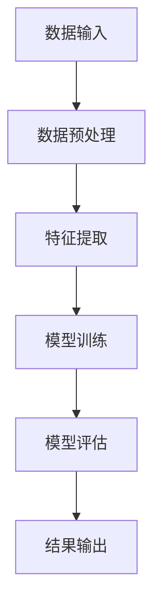
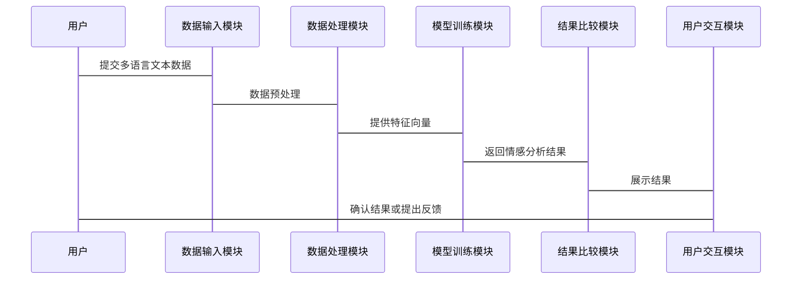

                 


# 开发AI Agent的多语言情感分析比较系统

> 关键词：AI Agent，多语言情感分析，情感分析，机器学习，自然语言处理

> 摘要：本文详细探讨了开发AI Agent的多语言情感分析比较系统的核心概念、算法原理、系统设计和项目实现。通过分析情感分析的基本原理、多语言处理的挑战以及AI Agent在其中的作用，本文为读者提供了一套完整的开发方案，包括系统架构设计、接口设计和实际案例分析。

---

## 第一部分: AI Agent与多语言情感分析概述

### 第1章: 情感分析与AI Agent的背景介绍

#### 1.1 情感分析的基本概念
- **情感分析的定义**: 情感分析是自然语言处理中的一个重要任务，旨在判断文本中的情感倾向（如正面、负面或中性）。
- **情感分析的应用场景**: 包括社交媒体分析、客户反馈分析、市场调研等。
- **多语言情感分析的挑战**: 不同语言的情感表达方式不同，数据分布不均衡，跨语言模型的构建难度较大。

#### 1.2 AI Agent的核心概念
- **AI Agent的定义**: AI Agent是一种智能代理，能够感知环境并采取行动以实现目标。
- **AI Agent的功能与特点**: 包括自主性、反应性、主动性、社会性等。
- **AI Agent在情感分析中的应用**: AI Agent可以作为情感分析的工具，帮助处理和分析数据。

#### 1.3 多语言情感分析的背景与意义
- **多语言处理的必要性**: 随着全球化的推进，跨语言信息处理的需求日益增加。
- **情感分析的跨语言比较需求**: 不同语言的情感表达可能存在差异，需要进行跨语言比较。
- **AI Agent在多语言情感分析中的角色**: AI Agent可以作为情感分析系统的核心组件，实现多语言情感分析的自动化和高效化。

---

## 第二部分: 多语言情感分析的核心概念与联系

### 第2章: 多语言情感分析的核心原理

#### 2.1 情感分析的分类与方法
- **基于规则的情感分析**: 通过预定义规则匹配文本，判断情感倾向。
- **基于统计模型的情感分析**: 使用机器学习算法，如SVM、NB等。
- **基于深度学习的情感分析**: 使用神经网络模型，如LSTM、BERT等。

#### 2.2 多语言情感分析的实现步骤
- **数据预处理**: 包括文本清洗、分词、停用词处理等。
- **模型训练**: 使用多语言数据训练情感分析模型。
- **结果分析与优化**: 对模型结果进行评估，并进行优化。

#### 2.3 多语言情感分析的模型比较
- **常见情感分析模型对比**: 比较不同模型在不同语言上的表现。
- **多语言模型的优缺点**: 例如，使用跨语言迁移学习的模型可能在资源不足的语言上表现较差。
- **模型选择与优化策略**: 根据具体任务选择合适的模型，并进行微调优化。

#### 2.4 AI Agent在情感分析中的作用
- **AI Agent作为情感分析工具**: 可以自动化地处理大量文本数据。
- **AI Agent作为情感分析结果的解释者**: 可以将情感分析结果转化为易于理解的解释。
- **AI Agent作为情感分析系统的优化者**: 可以动态调整模型参数，优化系统性能。

---

## 第三部分: 多语言情感分析的算法原理

### 第3章: 情感分析的算法原理

#### 3.1 常见情感分析算法
- **基于词袋模型的算法**: 例如，使用TF-IDF特征向量进行分类。
- **基于词嵌入的算法**: 例如，使用Word2Vec生成词向量。
- **基于深度学习的算法**: 例如，使用LSTM或BERT进行情感分类。

#### 3.2 多语言情感分析的算法选择
- **多语言词嵌入模型**: 例如，使用mBERT（multi-language BERT）进行跨语言表示。
- **多任务学习模型**: 例如，同时学习多种语言的情感分析任务。
- **跨语言迁移学习模型**: 例如，使用预训练的多语言模型进行迁移学习。

#### 3.3 情感分析的数学模型
- **线性分类模型**: 例如，使用逻辑回归（Logistic Regression）进行分类。
  $$ P(y|x) = \frac{e^{\beta x}}{1 + e^{\beta x}} $$
- **深度神经网络模型**: 例如，使用LSTM进行序列建模。
  $$ h_t = \text{tanh}(W_h h_{t-1} + U_x x_t + b_h) $$

#### 3.4 算法实现的流程图


---

## 第四部分: 多语言情感分析系统的架构设计

### 第4章: 系统分析与架构设计方案

#### 4.1 系统功能模块划分
- **数据输入模块**: 负责接收多语言文本数据。
- **模型训练模块**: 负责训练情感分析模型。
- **结果比较模块**: 负责比较不同语言的情感分析结果。
- **用户交互模块**: 负责与用户进行交互，展示结果。

#### 4.2 系统架构设计
- **分层架构设计**: 包括数据层、业务逻辑层和表现层。
- **微服务架构设计**: 各功能模块独立部署，通过API进行交互。

#### 4.3 系统接口设计
- **数据接口**: 包括数据输入接口和数据输出接口。
- **模型接口**: 包括模型训练接口和模型预测接口。
- **结果接口**: 包括结果展示接口和结果导出接口。

#### 4.4 系统交互流程图


---

## 第五部分: 项目实战

### 第5章: 项目实战与分析

#### 5.1 环境安装
- 安装必要的Python库，如`transformers`、`scikit-learn`、`tensorflow`等。

#### 5.2 系统核心实现源代码
```python
from transformers import pipeline

# 初始化情感分析模型
sentiment_analysis = pipeline("sentiment-analysis", model="mBERT")

# 处理多语言文本数据
def analyze_sentiment(texts):
    results = []
    for text in texts:
        result = sentiment_analysis(text)
        results.append(result)
    return results

# 比较不同语言的情感分析结果
def compare_sentiments(results):
    for res in results:
        print(f"Language: {res['language']}, Sentiment: {res['label']}, Score: {res['score']}")
```

#### 5.3 代码应用解读与分析
- **代码功能**: 该代码使用mBERT模型进行多语言情感分析，处理输入的多语言文本，并输出情感分析结果。
- **代码实现细节**: 使用Hugging Face的`transformers`库，支持多种语言的情感分析。

#### 5.4 实际案例分析
- **案例1**: 分析中文和英文的客户反馈，比较不同语言的情感倾向。
- **案例2**: 对比不同模型在多语言情感分析中的表现。

---

## 第六部分: 总结与展望

### 第6章: 总结与展望

#### 6.1 最佳实践 tips
- **数据预处理**: 确保数据的清洗和分词质量。
- **模型选择**: 根据具体任务选择合适的模型，并进行微调优化。
- **结果比较**: 使用可视化工具帮助比较不同语言的情感分析结果。

#### 6.2 小结
本文详细探讨了开发AI Agent的多语言情感分析比较系统的各个关键环节，包括背景、核心概念、算法原理、系统设计和项目实现。通过理论与实践的结合，为读者提供了一套完整的开发方案。

#### 6.3 注意事项
- **数据隐私**: 注意保护用户数据的隐私和安全。
- **模型性能**: 持续优化模型性能，提高情感分析的准确率。

#### 6.4 拓展阅读
- 推荐阅读《Deep Learning for NLP》和《Multi-Language Natural Language Processing》等书籍，深入了解相关知识。

---

## 作者：AI天才研究院 & 禅与计算机程序设计艺术

感谢您的阅读！希望本文对您开发AI Agent的多语言情感分析比较系统有所帮助！如果需要进一步探讨，欢迎随时联系！

