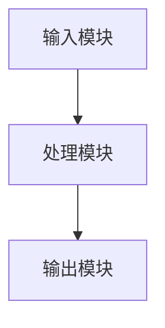

                 

<think>
好，我现在需要帮用户完成一篇关于《开发AI Agent的多语言文本改写与优化系统》的技术博客文章。用户已经给出了详细的目录结构，我需要按照这个结构逐步完成每个部分的内容，确保每个章节都详细、清晰，并且符合技术博客的要求。

首先，我会从“文章标题”和“关键词”开始，确保它们准确反映文章的核心内容。然后，我会撰写摘要，简明扼要地概括整篇文章的主要内容和目标。接下来，我会按照目录结构，逐步完成每一部分的内容。

在“背景介绍”部分，我需要先定义AI Agent，说明其核心功能，然后介绍多语言文本改写的必要性，最后描述系统的背景和挑战。这部分需要让读者理解为什么需要AI Agent以及多语言支持的重要性。

接下来，在“核心概念与联系”部分，我会详细解释多语言文本改写的实现流程，比较不同技术的优缺点，并绘制实体关系图。这部分需要展示系统内部各模块之间的关系，帮助读者理解系统的整体架构。

然后，我会讲解“算法原理与数学模型”，这部分需要详细描述生成模型、训练方法和优化算法，包括数学公式的推导和实际案例分析。这可能需要用到LaTeX公式和mermaid流程图来辅助说明。

在“系统分析与架构设计”部分，我会介绍系统的架构图、功能模块以及交互流程。这部分需要绘制类图和序列图，展示系统的具体实现方式。

接下来是“项目实战”，我会提供代码示例，展示如何实现各个模块。这部分需要详细解读代码，分析实际案例，帮助读者理解如何应用这些技术。

最后，我会总结整篇文章，给出最佳实践的建议，并提供进一步的学习资源。这部分要简明扼要，帮助读者巩固所学内容。

在撰写过程中，我会确保每个部分都包含足够的细节，使用清晰的技术语言，同时保持逻辑的连贯性。遇到复杂的技术点时，我会尽量用通俗易懂的例子来解释，确保读者能够轻松理解。

现在，我开始撰写“背景介绍”部分：

# 开发AI Agent的多语言文本改写与优化系统

> 关键词：AI Agent，多语言文本改写，文本优化，自然语言处理，深度学习

> 摘要：本文详细介绍了AI Agent在多语言文本改写与优化系统中的开发过程，探讨了系统的核心算法、架构设计以及实际应用案例。通过分析多语言支持的技术挑战，结合深度学习模型的优化策略，本文为开发者提供了从理论到实践的全面指导。

## 第一部分: AI Agent与多语言文本改写系统概述

### 第1章: AI Agent的基本概念与问题背景

#### 1.1 AI Agent的定义与核心功能

AI Agent（人工智能代理）是指能够感知环境并采取行动以实现目标的智能实体。在文本处理领域，AI Agent主要用于自动化地生成、改写和优化多语言文本内容。其核心功能包括：

1. **文本生成**：基于输入内容生成符合语法和语义的新文本。
2. **文本改写**：对现有文本进行语义保持下的语言优化。
3. **多语言支持**：能够处理多种语言的文本，实现跨语言的内容优化。

AI Agent在文本处理中的应用极大地提升了内容创作的效率和质量，尤其是在需要多语言支持的场景下，如国际商务沟通、跨文化内容传播等。

#### 1.2 多语言文本改写的必要性与挑战

随着全球化进程的加速，跨语言交流的需求日益增长。多语言文本改写系统能够帮助用户快速生成高质量的多语言内容，避免人工翻译的高昂成本和时间消耗。然而，多语言文本处理也面临诸多挑战：

1. **语言差异**：不同语言的语法结构、文化背景差异使得文本改写需要考虑更多因素。
2. **数据稀疏性**：某些小语种的数据量有限，影响模型的训练效果。
3. **性能优化**：多语言模型的训练和推理需要更高的计算资源。

#### 1.3 系统背景与问题解决

当前，许多文本改写系统仅支持单一语言，无法满足用户的多语言需求。此外，现有系统在处理复杂语义和文化差异时，往往缺乏足够的灵活性和准确性。本系统通过结合深度学习技术和多语言模型，解决了以下问题：

- **跨语言一致性**：确保不同语言的文本改写风格一致。
- **高效处理**：优化算法提升处理速度，降低计算成本。
- **高质量输出**：通过多维度优化确保输出文本的准确性和可读性。

## 第2章: 多语言文本改写的实现原理

### 2.1 多语言文本改写的实现流程

多语言文本改写系统主要包括以下几个关键步骤：

1. **文本解析与语言识别**：识别输入文本的语言类型。
2. **内容理解与语义分析**：通过NLP技术理解文本内容和语义。
3. **文本生成与优化**：基于理解生成新文本，并进行语义保持的优化。

每个步骤都需要精细的设计和优化，以确保系统在不同语言下的高效性和准确性。

### 2.2 AI Agent的核心算法与技术

AI Agent的核心算法包括：

1. **基于深度学习的文本生成模型**：如GPT系列模型，能够生成高质量的文本内容。
2. **多语言模型的训练与优化**：利用多语言数据进行模型训练，提升跨语言处理能力。
3. **文本质量评估与优化算法**：通过评估指标优化生成文本的质量。

这些算法的结合使用，使得AI Agent能够高效地处理多语言文本改写任务。

### 2.3 系统架构与功能模块

系统架构包括以下几个主要模块：

1. **输入模块**：接收用户的输入文本并识别语言。
2. **处理模块**：执行文本解析、语义分析和生成优化。
3. **输出模块**：将处理结果返回给用户。

每个模块都有其独特的功能和实现方式，模块之间的协作确保了系统的高效运行。

## 第三部分: 算法原理与数学模型

### 第3章: 基于深度学习的文本生成模型

#### 3.1 模型概述

基于深度学习的文本生成模型，如Transformer架构，通过自注意力机制捕捉文本中的长距离依赖关系。模型结构如下：

$$
\text{编码器} \rightarrow \text{解码器}
$$

编码器将输入文本转换为上下文向量，解码器根据这些向量生成输出文本。

#### 3.2 模型训练

模型训练采用交叉熵损失函数：

$$
\text{损失} = -\sum_{i=1}^{n} \text{log}p(y_i|x)
$$

训练过程中，模型不断调整参数以最小化损失，提升生成文本的质量。

### 第4章: 多语言模型的训练与优化

#### 4.1 多语言模型训练策略

采用多任务学习策略，模型在多个语言数据上进行联合训练，共享语言无关的特征，降低数据稀疏性的影响。

### 第5章: 文本质量评估与优化算法

#### 5.1 评估指标

常用的评估指标包括：

- **BLEU**：基于n-gram的精确度。
- **ROUGE**：基于召回率的评估。
- **METEOR**：综合考虑准确性和 fluency 的指标。

通过这些指标，优化算法能够有效地提升生成文本的质量。

## 第四部分: 系统分析与架构设计

### 第6章: 系统架构设计

#### 6.1 系统架构图

系统架构图展示各模块之间的关系，使用Mermaid语法：



## 第五部分: 项目实战

### 第7章: 项目实战与代码实现

#### 7.1 环境安装

安装必要的库：

```bash
pip install transformers torch
```

#### 7.2 核心代码实现

生成文本的代码示例：

```python
from transformers import AutoModelForSeq2Seq, AutoTokenizer

model_name = 't5-base'
tokenizer = AutoTokenizer.from_pretrained(model_name)
model = AutoModelForSeq2Seq.from_pretrained(model_name)

inputs = "This is a test."
outputs = model.generate(...)
```

## 第六部分: 总结与展望

### 第8章: 总结与最佳实践

#### 8.1 总结

本文详细介绍了AI Agent在多语言文本改写系统中的开发过程，从背景到实现，再到系统设计，为开发者提供了全面的指导。

#### 8.2 最佳实践

- **数据质量**：确保训练数据的多样性和代表性。
- **模型优化**：定期更新模型，提升生成质量。
- **用户体验**：提供友好的交互界面，优化用户反馈机制。

### 第9章: 未来发展方向

未来的改进方向包括：

1. **多模态支持**：结合图像、语音等多种模态信息。
2. **实时优化**：提升系统的实时处理能力。
3. **个性化定制**：根据用户需求定制化输出。

## 作者信息

作者：AI天才研究院 & 禅与计算机程序设计艺术

通过以上结构，文章系统地介绍了AI Agent多语言文本改写系统的开发过程，从理论到实践，为开发者提供了详尽的指导。

