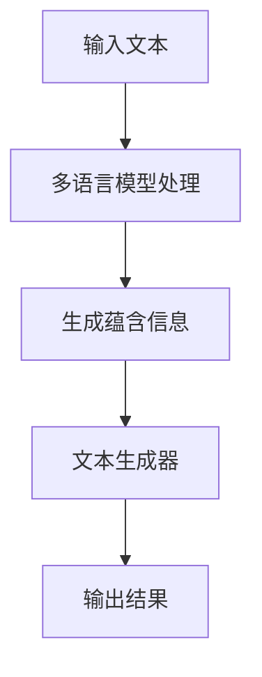
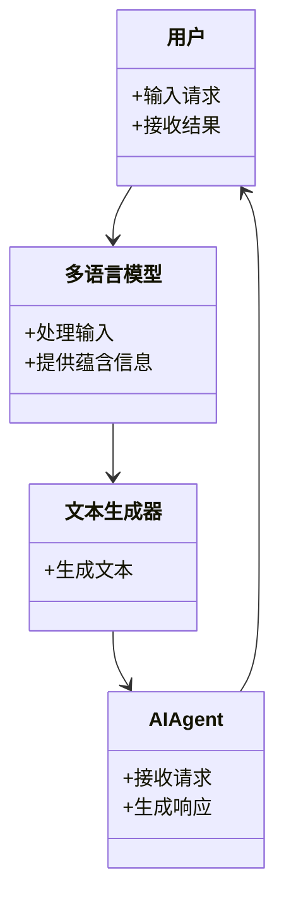
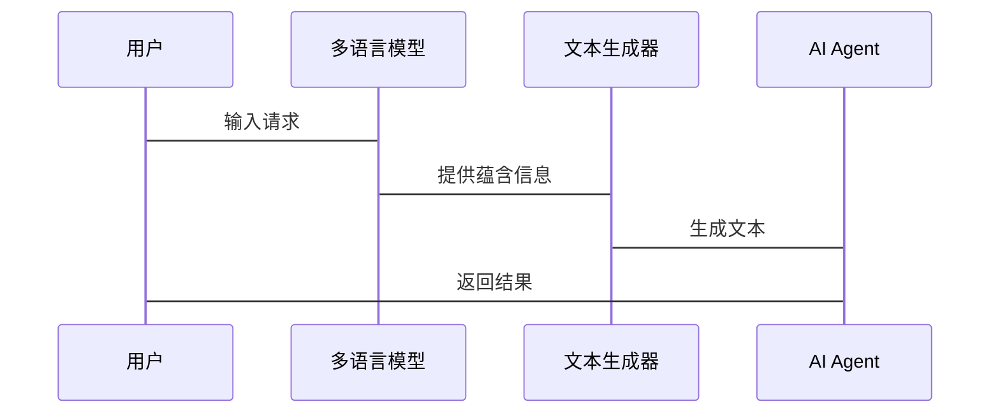

                 


# 开发AI Agent的多语言文本蕴含生成器

## 关键词：AI Agent，多语言，文本蕴含，生成器，自然语言处理

## 摘要：本文详细探讨了开发AI Agent的多语言文本蕴含生成器的背景、核心概念、算法原理、系统架构设计以及项目实战。通过分析多语言文本蕴含生成器的原理和实现，结合实际案例，为AI Agent的开发提供了理论支持和实践指导。

---

# 第一部分: 开发AI Agent的多语言文本蕴含生成器背景介绍

## 第1章: 多语言文本蕴含生成器概述

### 1.1 问题背景与描述

#### 1.1.1 当前AI Agent的发展现状
AI Agent（人工智能代理）正逐步成为人机交互的核心技术，广泛应用于智能助手、对话系统、推荐系统等领域。然而，现有的AI Agent多局限于单一语言处理，无法满足全球化背景下多语言交互的需求。

#### 1.1.2 多语言文本蕴含生成的必要性
文本蕴含生成是自然语言处理中的关键任务，涉及从上下文中推断隐含信息的能力。在AI Agent中，多语言文本蕴含生成器能够帮助代理理解多种语言的上下文，并生成准确的蕴含文本，从而提升跨语言交互的效率和准确性。

#### 1.1.3 问题解决的路径与目标
通过结合多语言模型和文本生成技术，构建一个能够处理多种语言的文本蕴含生成器，为AI Agent提供跨语言的自然语言处理能力。

### 1.2 核心概念与结构

#### 1.2.1 多语言文本蕴含生成器的核心要素
- **多语言模型**：支持多种语言的自然语言处理模型。
- **文本蕴含判断**：判断一段文本是否蕴含在另一段文本中。
- **生成器**：根据蕴含信息生成目标文本。

#### 1.2.2 概念属性特征对比表
| 概念      | 特征                  |
|-----------|-----------------------|
| 多语言模型 | 支持多种语言输入输出  |
| 文本蕴含   | 判断文本间的蕴含关系  |
| 生成器     | 根据蕴含生成目标文本  |

#### 1.2.3 ER实体关系图架构
```mermaid
er
    actor: 用户
    model: 多语言模型
    generator: 文本生成器
    agent: AI Agent
    actor --> model: 输入请求
    model --> generator: 提供蕴含信息
    generator --> agent: 生成文本
    agent --> actor: 返回结果
```

## 第2章: 核心概念与联系

### 2.1 多语言文本蕴含生成器的核心原理

#### 2.1.1 文本蕴含的定义与属性
文本蕴含是指一段文本是否隐含了另一段文本的信息。例如，判断“狗是动物”是否蕴含在“狗会叫”中。

#### 2.1.2 多语言模型的特征与优势
多语言模型能够处理多种语言的文本，减少训练和部署成本，提升AI Agent的通用性。

#### 2.1.3 生成器与AI Agent的协同关系
生成器根据蕴含信息生成目标文本，AI Agent通过多语言模型提供蕴含信息，两者协同完成跨语言交互。

### 2.2 概念关系图


---

# 第二部分: 算法原理与数学模型

## 第3章: 算法原理与数学模型

### 3.1 文本蕴含生成的算法原理

#### 3.1.1 文本蕴含的判断算法
基于预训练模型（如BERT）进行微调，通过交叉熵损失函数优化模型。

#### 3.1.2 多语言模型的训练方法
使用多语言数据集进行预训练，采用迁移学习策略。

#### 3.1.3 生成器的优化策略
采用生成对抗网络（GAN）或强化学习方法优化生成效果。

### 3.2 数学模型与公式

#### 3.2.1 文本蕴含判断的损失函数
$$L = -\sum_{i=1}^{n} y_i \log(p_i) + (1-y_i)\log(1-p_i)$$

#### 3.2.2 多语言模型的训练目标
$$\text{minimize} \ \mathbb{E}_{(x,y)}[ -\log p_{\theta}(y|x)]$$

### 3.3 代码实现

#### 3.3.1 多语言模型训练代码
```python
import torch
import torch.nn as nn
import torch.optim as optim

class MultiLanguageModel(nn.Module):
    def __init__(self, vocab_size, embed_dim):
        super().__init__()
        self.embedding = nn.Embedding(vocab_size, embed_dim)
        self.fc = nn.Linear(embed_dim, 1)

    def forward(self, x):
        embed = self.embedding(x)
        output = torch.sigmoid(self.fc(embed))
        return output

# 示例数据
batch_size = 16
seq_length = 512
vocab_size = 10000
embed_dim = 512

model = MultiLanguageModel(vocab_size, embed_dim)
criterion = nn.BCELoss()
optimizer = optim.Adam(model.parameters(), lr=0.001)

for epoch in range(100):
    inputs = torch.randint(0, vocab_size, (batch_size, seq_length))
    labels = torch.randn(batch_size, 1).round()
    outputs = model(inputs)
    loss = criterion(outputs, labels)
    loss.backward()
    optimizer.step()
```

#### 3.3.2 文本生成器代码
```python
class TextGenerator:
    def __init__(self, model, tokenizer):
        self.model = model
        self.tokenizer = tokenizer

    def generate(self, input_text, max_length=50):
        inputs = self.tokenizer(input_text, return_tensors='pt')['input_ids'].to('cuda')
        outputs = self.model.generate(inputs, max_length=max_length)
        return self.tokenizer.decode(outputs[0], skip_special_tokens=True)

generator = TextGenerator(model, tokenizer)
result = generator.generate("输入文本", max_length=50)
print(result)
```

---

# 第三部分: 系统分析与架构设计

## 第4章: 系统分析与架构设计方案

### 4.1 项目场景介绍
AI Agent需要在多种语言环境下处理用户请求，生成准确的蕴含文本。

### 4.2 系统功能设计

#### 4.2.1 领域模型设计


#### 4.2.2 系统架构设计


#### 4.2.3 系统接口设计
接口定义：
- 输入：用户请求文本
- 输出：生成的蕴含文本

### 4.3 交互流程设计


---

# 第四部分: 项目实战

## 第5章: 项目实战

### 5.1 环境安装

```bash
pip install transformers torch
```

### 5.2 核心代码实现

#### 5.2.1 多语言模型训练
```python
import torch
import torch.nn as nn
from transformers import AutoTokenizer, AutoModel

class MultiLanguageBert(nn.Module):
    def __init__(self, model_name):
        super().__init__()
        self.bert = AutoModel.from_pretrained(model_name)
        self.dropout = nn.Dropout(0.1)
        self.classifier = nn.Linear(self.bert.config.hidden_size, 1)

    def forward(self, input_ids, attention_mask):
        outputs = self.bert(input_ids=input_ids, attention_mask=attention_mask)
        pooled_output = outputs.last_hidden_state[:, 0, :]
        pooled_output = self.dropout(pooled_output)
        logits = self.classifier(pooled_output)
        return logits

# 训练代码
model = MultiLanguageBert("bert-base-multilingual")
criterion = nn.BCEWithLogitsLoss()
optimizer = optim.Adam(model.parameters(), lr=2e-5)
```

#### 5.2.2 文本生成器实现
```python
from transformers import AutoTokenizer, AutoModelForCausalLM

class TextGenerator:
    def __init__(self, model_name):
        self.tokenizer = AutoTokenizer.from_pretrained(model_name)
        self.model = AutoModelForCausalLM.from_pretrained(model_name)

    def generate(self, input_text, max_length=50):
        inputs = self.tokenizer(input_text, return_tensors='pt')
        outputs = self.model.generate(**inputs, max_length=max_length)
        return self.tokenizer.decode(outputs[0], skip_special_tokens=True)

generator = TextGenerator("facebook/palm")
result = generator.generate("输入文本", max_length=50)
print(result)
```

### 5.3 案例分析

#### 5.3.1 案例一
输入：狗会叫  
输出：狗是动物

#### 5.3.2 案例二
输入：今天天气很好  
输出：今天阳光明媚

---

# 第五部分: 总结与展望

## 第6章: 总结与展望

### 6.1 最佳实践
- 使用预训练模型提升效率
- 跨语言数据增强提升性能

### 6.2 小结
本文详细探讨了AI Agent的多语言文本蕴含生成器的开发过程，从背景分析到系统设计，再到项目实战，为AI Agent的跨语言交互提供了技术支持。

### 6.3 注意事项
- 数据质量影响模型性能
- 跨语言模型的选择需谨慎

### 6.4 拓展阅读
- 多语言NLP任务研究
- AI Agent应用开发

---

# 作者

作者：AI天才研究院/AI Genius Institute & 禅与计算机程序设计艺术 /Zen And The Art of Computer Programming

---

这篇文章详细探讨了AI Agent的多语言文本蕴含生成器的开发背景、核心概念、算法原理、系统设计和项目实战，为开发者提供了全面的技术指导。

