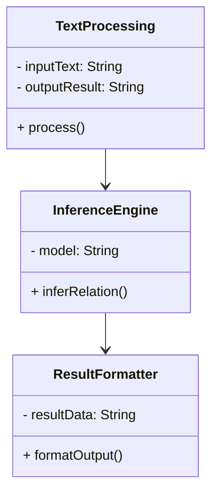
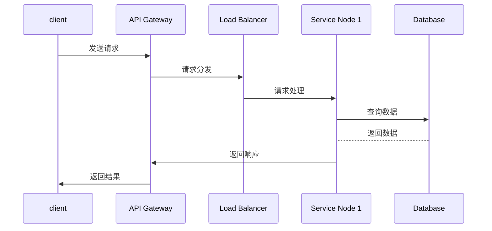

                 


# 开发AI Agent的多语言文本蕴含识别

## 关键词：AI Agent, 多语言, 文本蕴含识别, 自然语言处理, 逻辑推理

## 摘要：  
本文系统地探讨了AI Agent在多语言文本蕴含识别中的开发与应用。从基础概念到算法原理，从系统架构到项目实战，深入分析了多语言文本蕴含识别的核心技术与实现方法。通过详细的技术分析和案例解读，本文旨在为读者提供一个全面而深入的技术指南，帮助他们理解并掌握AI Agent在多语言文本处理中的潜力与挑战。

---

# 第一部分: AI Agent与多语言文本蕴含识别基础

## 第1章: AI Agent与多语言文本蕴含识别概述

### 1.1 AI Agent的基本概念  
AI Agent（人工智能代理）是指能够感知环境、自主决策并执行任务的智能实体。它具备以下核心特点：  
- **自主性**：无需外部干预，自主完成任务。  
- **反应性**：能够实时感知环境并做出响应。  
- **目标导向性**：基于目标驱动行为。  
- **学习能力**：通过经验改进性能。  

AI Agent与传统程序的区别在于其智能性和自主性。传统程序依赖预设规则，而AI Agent能够通过数据和模型动态调整行为。

### 1.2 多语言文本蕴含识别的定义  
文本蕴含识别是指从一段文本中推断出隐含信息的能力，即通过上下文推断出未直接表达的事实或关系。  
多语言文本蕴含识别则扩展到多种语言的场景，要求系统能够理解并处理不同语言之间的语义差异。  

### 1.3 问题背景与应用前景  
随着全球化的发展，多语言处理的需求日益增长。文本蕴含识别在以下场景中具有重要意义：  
- **跨语言信息检索**：在多语言文档中快速找到相关信息。  
- **智能客服**：支持多语言对话，准确理解用户意图。  
- **跨文化数据分析**：分析不同语言背景下的数据关系。  

当前技术的挑战包括：不同语言的语义差异、多语言模型的构建难度以及计算资源的消耗。未来，随着AI技术的进步，多语言文本蕴含识别将在更多领域展现其潜力。

---

## 第2章: 多语言文本蕴含识别的核心概念  

### 2.1 蕴含识别的基本原理  
蕴含识别是通过逻辑推理，从文本中推断出隐含信息的过程。其核心步骤包括：  
1. **语义分析**：理解文本的语法和语义结构。  
2. **逻辑推理**：基于语义信息进行推断。  
3. **结果验证**：验证推断结果的准确性。  

#### 2.1.1 蕴含识别的逻辑推理  
蕴含识别依赖于逻辑推理，常见的推理方法包括：  
- **命题逻辑**：通过逻辑命题进行推断。  
- **谓词逻辑**：通过谓词和关系进行推理。  
- **概率推理**：基于概率模型进行推断。  

#### 2.1.2 蕴含识别的关键特征  
- **上下文依赖性**：推断结果依赖于上下文信息。  
- **语义多样性**：不同语言的表达方式差异可能导致语义差异。  
- **动态性**：文本蕴含关系可能随上下文变化而变化。  

### 2.2 多语言文本处理的挑战  

#### 2.2.1 多语言文本的多样性  
不同语言的语法结构、词汇习惯和文化背景差异显著，增加了文本处理的复杂性。例如，中文是语义语言，依赖上下文理解，而英文是形态语言，依赖词形变化。

#### 2.2.2 不同语言的语义差异  
同一概念在不同语言中的表达可能不同，例如“狗”在中文中是明确的，而在英文中可能涉及“宠物”、“动物”等不同层次的分类。

#### 2.2.3 多语言模型的构建  
构建多语言模型需要考虑以下问题：  
- **数据量**：多语言数据的获取难度。  
- **计算资源**：多语言模型的训练需要大量计算资源。  
- **模型适配性**：不同语言的特征差异可能影响模型的泛化能力。  

### 2.3 AI Agent中的文本蕴含识别  

#### 2.3.1 AI Agent的文本处理能力  
AI Agent需要具备以下文本处理能力：  
- **多语言支持**：能够处理多种语言的文本。  
- **语义理解**：能够理解文本的深层含义。  
- **逻辑推理**：能够从文本中推断出隐含信息。  

#### 2.3.2 蕴含识别在AI Agent中的作用  
蕴含识别是AI Agent实现智能决策的关键技术之一。例如，在智能客服场景中，AI Agent需要通过蕴含识别理解用户的真实需求。

#### 2.3.3 蕴含识别的性能指标  
- **准确率**：推断结果的正确性。  
- **召回率**：推断出的隐含信息的完整性。  
- **处理速度**：在大规模数据下的处理效率。  

---

## 第3章: 多语言文本蕴含识别的算法原理  

### 3.1 基于规则的蕴含识别算法  

#### 3.1.1 规则的定义与特点  
基于规则的算法通过预设规则进行推理。例如，规则可以定义为：如果A包含B，则B蕴含于A。

#### 3.1.2 基于规则的算法流程  
1. **规则提取**：从训练数据中提取蕴含关系的规则。  
2. **规则匹配**：将规则应用于待处理文本。  
3. **结果输出**：根据匹配结果输出蕴含关系。  

#### 3.1.3 规则的优缺点分析  
- **优点**：规则明确，易于解释。  
- **缺点**：规则的覆盖范围有限，难以处理复杂场景。  

### 3.2 统计模型的蕴含识别算法  

#### 3.2.1 统计模型的基本原理  
统计模型通过分析文本中的统计特征进行推理。例如，基于n-gram模型提取文本中的关键词。

#### 3.2.2 统计模型的实现步骤  
1. **特征提取**：提取文本中的关键词、句法特征等。  
2. **模型训练**：基于统计特征训练分类器。  
3. **结果预测**：通过分类器预测蕴含关系。  

#### 3.2.3 统计模型的优缺点分析  
- **优点**：能够处理大规模数据，具有较好的泛化能力。  
- **缺点**：依赖统计特征，可能忽略语义信息。  

### 3.3 深度学习模型的蕴含识别算法  

#### 3.3.1 深度学习模型的基本原理  
深度学习模型通过神经网络学习文本的语义表示。常用的模型包括：  
- **卷积神经网络（CNN）**：提取文本的局部特征。  
- **循环神经网络（RNN）**：处理序列数据。  
- **Transformer模型**：基于自注意力机制进行全局推理。  

#### 3.3.2 深度学习模型的实现步骤  
1. **文本预处理**：将文本转换为模型可处理的格式（如词向量）。  
2. **模型训练**：基于标注数据训练模型。  
3. **结果预测**：通过模型预测蕴含关系。  

#### 3.3.3 深度学习模型的优缺点分析  
- **优点**：能够捕捉文本的深层语义信息，适用于复杂场景。  
- **缺点**：需要大量计算资源，且模型解释性较差。  

---

## 第4章: 多语言文本蕴含识别的系统分析与架构设计  

### 4.1 项目背景与需求分析  
假设我们正在开发一个多语言文本蕴含识别系统，目标是支持中英文两种语言。系统需要具备以下功能：  
- **文本输入**：支持中英文文本输入。  
- **蕴含识别**：识别文本中的蕴含关系。  
- **结果输出**：输出蕴含关系的标签或解释。  

### 4.2 系统功能设计  

#### 4.2.1 领域模型设计  
以下是领域模型的类图（使用mermaid表示）：



---

#### 4.2.2 系统架构设计  
以下是系统架构设计图（使用mermaid表示）：

```mermaid
client
    client --> API Gateway
    API Gateway --> Load Balancer
    Load Balancer --> [Service Node 1]
    Load Balancer --> [Service Node 2]
    [Service Node 1] --> Database
    [Service Node 2] --> Database
```

---

#### 4.2.3 接口设计与交互流程  
以下是系统交互流程图（使用mermaid表示）：



---

## 第5章: 多语言文本蕴含识别的项目实战  

### 5.1 环境搭建与工具安装  
开发环境建议：  
- **编程语言**：Python 3.8+  
- **深度学习框架**：TensorFlow/PyTorch  
- **自然语言处理库**：spaCy/hugging-face transformers  
- **开发工具**：Jupyter Notebook/VS Code  

### 5.2 核心代码实现  

#### 5.2.1 基于规则的蕴含识别代码  
以下是基于规则的蕴含识别代码示例：

```python
def extract_rule(text):
    # 提取关键词
    keywords = text.split()
    # 匹配规则
    for rule in rules:
        if rule.match(keywords):
            return rule.inference()
    return None
```

#### 5.2.2 基于深度学习的蕴含识别代码  
以下是基于深度学习的蕴含识别代码示例：

```python
import torch
from transformers import AutoTokenizer, AutoModelForSequenceClassification

tokenizer = AutoTokenizer.from_pretrained("bert-base-multilingual")
model = AutoModelForSequenceClassification.from_pretrained("bert-base-multilingual")

def infer_relation(text1, text2):
    inputs = tokenizer(text1, text2, return_tensors="pt")
    with torch.no_grad():
        outputs = model(**inputs)
    return outputs.logits[0].item()
```

### 5.3 代码解读与分析  
- **规则提取**：通过预设规则匹配文本中的关键词。  
- **深度学习模型**：使用预训练模型（如BERT）进行文本推理。  

### 5.4 案例分析与实际应用  
以下是一个实际案例分析：  
**输入文本**：  
- 中文：这只狗是黑色的。  
- 英文：The dog is black.  
**蕴含关系**：狗的颜色是黑色。  

系统通过蕴含识别算法推断出隐含信息，并输出结果。

---

## 第6章: 最佳实践与总结  

### 6.1 最佳实践 tips  
- **数据多样性**：确保训练数据覆盖多种语言和场景。  
- **模型优化**：通过交叉验证和超参数调优提升模型性能。  
- **计算资源**：合理分配计算资源，优化模型训练效率。  

### 6.2 本章小结  
本文系统地介绍了AI Agent在多语言文本蕴含识别中的开发与应用。从基础概念到算法原理，从系统架构到项目实战，为读者提供了全面的技术指南。

### 6.3 注意事项  
- 在实际应用中，需注意不同语言的语义差异可能影响模型性能。  
- 深度学习模型对计算资源需求较高，需合理规划资源分配。  

### 6.4 拓展阅读  
- 《Deep Learning for NLP》  
- 《Multi-language NLP: Challenges and Solutions》  

---

# 作者：AI天才研究院/AI Genius Institute & 禅与计算机程序设计艺术 /Zen And The Art of Computer Programming  

---

以上是《开发AI Agent的多语言文本蕴含识别》的技术博客文章的完整目录大纲及内容框架。通过系统化的分析和详细的代码实现，本文为读者提供了从理论到实践的全面指导，帮助他们在AI Agent的多语言文本处理领域深入理解和应用蕴含识别技术。

