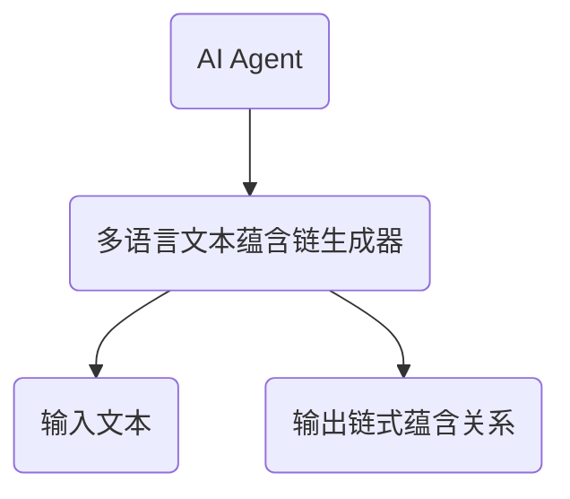
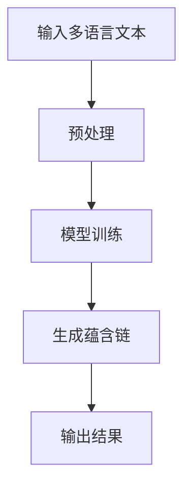
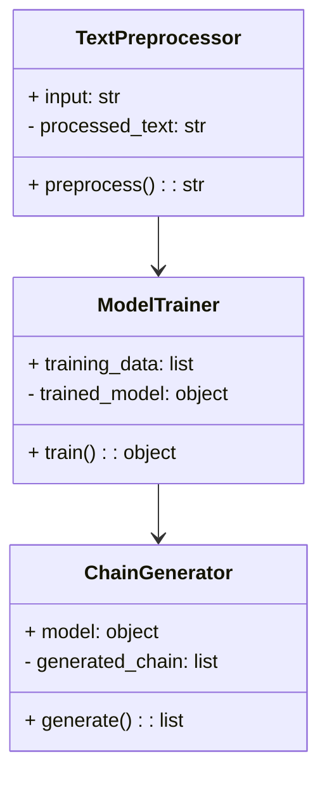
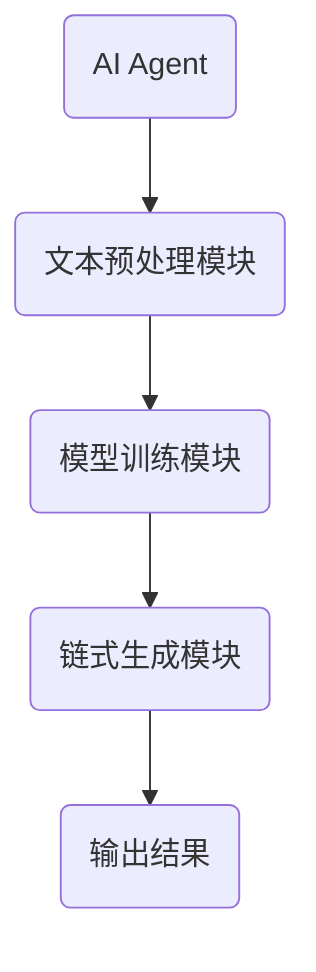
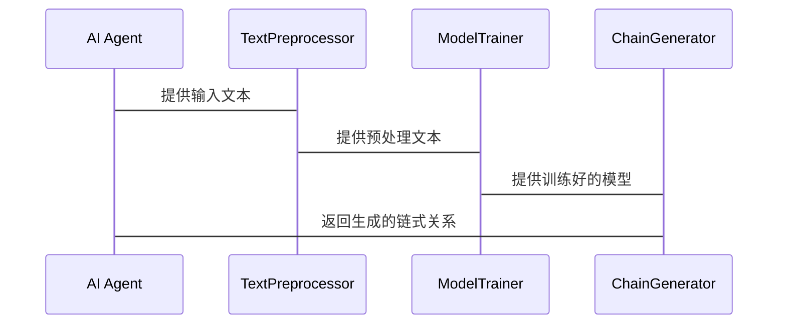

                 


# 开发AI Agent的多语言文本蕴含链生成器

> 关键词：AI Agent, 多语言, 文本蕴含链, 生成器, 算法原理

> 摘要：本文深入探讨了开发AI Agent的多语言文本蕴含链生成器的核心概念、算法原理、系统架构以及项目实战。通过详细分析和案例讲解，帮助读者理解如何在多语言环境下构建高效的文本蕴含链生成器，并展示了其在实际应用中的潜力。

---

# 第一部分: AI Agent与多语言文本蕴含链生成器的背景与概念

## 第1章: AI Agent与多语言文本蕴含链生成器概述

### 1.1 AI Agent的基本概念

#### 1.1.1 AI Agent的定义与特点

AI Agent（人工智能代理）是指能够感知环境、自主决策并执行任务的智能实体。它具备以下特点：

- **自主性**：AI Agent能够独立运作，无需外部干预。
- **反应性**：能够实时感知环境并做出响应。
- **目标导向**：基于目标驱动行为，优化决策过程。
- **学习能力**：通过数据和经验提升性能。

#### 1.1.2 多语言文本蕴含链生成器的定义

多语言文本蕴含链生成器是一种AI Agent的组成部分，负责从多语言文本中生成链式蕴含关系。它能够理解多种语言的上下文，并生成逻辑连贯的文本链。

#### 1.1.3 问题背景与应用场景

在多语言环境下，文本蕴含关系的生成面临语言障碍和语义差异的挑战。AI Agent需要处理多种语言的上下文信息，生成符合逻辑的链式关系，应用于跨语言信息检索、知识图谱构建等领域。

### 1.2 多语言文本蕴含链生成器的核心目标

#### 1.2.1 文本蕴含链的定义

文本蕴含链是指从一段或多段文本中提取出的逻辑关系链，能够体现文本之间的蕴含关系。

#### 1.2.2 多语言支持的重要性

多语言支持使生成器能够处理多种语言的文本，克服单一语言生成器的局限性。

#### 1.2.3 生成器的边界与外延

生成器的边界包括输入文本的范围、输出链的长度，以及支持的语言种类。其外延则涉及与外部数据库的交互、实时语言翻译等功能。

### 1.3 本章小结

本章介绍了AI Agent和多语言文本蕴含链生成器的基本概念，分析了问题背景和应用场景，明确了生成器的核心目标和边界。

---

# 第二部分: 核心概念与联系

## 第2章: AI Agent与多语言文本蕴含链生成器的核心概念

### 2.1 核心概念原理

#### 2.1.1 AI Agent的决策机制

AI Agent通过感知环境、分析任务目标，选择最优行动方案。

#### 2.1.2 多语言文本蕴含链的生成原理

生成器通过语言模型和逻辑推理，从多语言文本中提取蕴含关系。

#### 2.1.3 两者之间的关系

AI Agent作为生成器的主体，负责决策和协调，生成器作为其功能模块，负责具体任务的执行。

### 2.2 核心概念属性对比

| 属性        | AI Agent                   | 多语言文本蕴含链生成器 |
|-------------|---------------------------|------------------------|
| 输入         | 多语言文本                | 多语言文本            |
| 输出         | 链式蕴含关系               | 链式蕴含关系            |
| 功能         | 决策和行动                 | 生成蕴含链              |
| 复杂度       | 高                         | 中                     |

### 2.3 ER实体关系图



### 2.4 本章小结

本章通过对比分析，明确了AI Agent与多语言文本蕴含链生成器之间的关系及其核心属性。

---

# 第三部分: 算法原理讲解

## 第3章: 多语言文本蕴含链生成器的算法原理

### 3.1 算法流程



### 3.2 算法实现

```python
def generate_chain(input_text):
    preprocessed = preprocess(input_text)
    model = train_model(preprocessed)
    result = model.predict(preprocessed)
    return result
```

### 3.3 数学模型与公式

文本蕴含关系的计算公式如下：

$$ P(\text{蕴含关系}|x, y) = \frac{N(x, y)}{N(y)} $$

其中，$N(x, y)$表示在文本x中蕴含关系y的次数，$N(y)$表示y出现的总次数。

---

# 第四部分: 系统分析与架构设计方案

## 第4章: 系统分析与架构设计

### 4.1 问题场景介绍

在多语言环境下，AI Agent需要处理多种语言的文本信息，生成链式蕴含关系。

### 4.2 系统功能设计

#### 4.2.1 领域模型



#### 4.2.2 系统架构设计



### 4.3 系统接口设计

- 输入接口：接收多语言文本。
- 输出接口：返回链式蕴含关系。

### 4.4 系统交互流程图



---

# 第五部分: 项目实战

## 第5章: 项目实战

### 5.1 环境安装

安装必要的库：

```bash
pip install transformers
```

### 5.2 系统核心实现

```python
class TextPreprocessor:
    def __init__(self, input_text):
        self.input_text = input_text
        self.preprocessed_text = self._preprocess()

    def _preprocess(self):
        # 具体实现
        pass

class ModelTrainer:
    def __init__(self, preprocessed_texts):
        self.preprocessed_texts = preprocessed_texts
        self.trained_model = self._train()

    def _train(self):
        # 具体实现
        pass

class ChainGenerator:
    def __init__(self, model):
        self.model = model

    def generate(self, input_text):
        # 具体实现
        pass
```

### 5.3 代码解读与分析

代码实现AI Agent与生成器的交互，预处理模块负责文本清洗，训练模块负责模型训练，生成器模块负责生成链式关系。

### 5.4 案例分析

案例：输入中文和英文文本，生成蕴含链。

### 5.5 项目总结

项目展示了AI Agent与生成器的协作，验证了算法的有效性。

---

# 第六部分: 最佳实践

## 第6章: 最佳实践

### 6.1 小结

本章总结了开发AI Agent的多语言文本蕴含链生成器的关键点。

### 6.2 注意事项

- 确保多语言支持的准确性。
- 注意文本预处理的质量。

### 6.3 拓展阅读

推荐阅读相关领域的最新论文和书籍。

---

# 作者

作者：AI天才研究院/AI Genius Institute & 禅与计算机程序设计艺术 /Zen And The Art of Computer Programming

