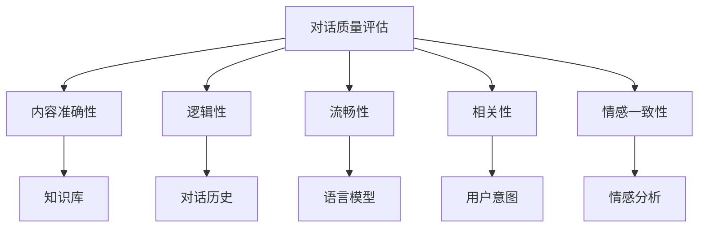
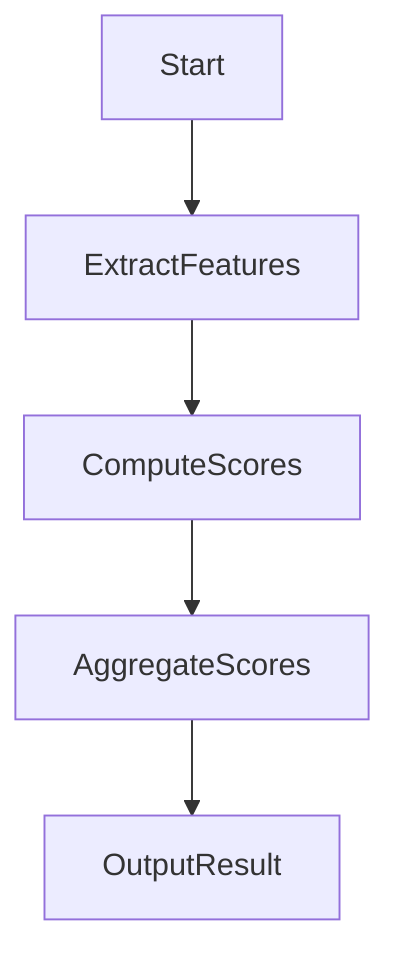

                 


# 开发AI Agent的对话质量评估指标体系

## 关键词：
AI Agent，对话质量，评估指标，自然语言处理，机器学习，系统架构

## 摘要：
本文系统性地探讨了开发AI Agent的对话质量评估指标体系的关键问题。首先，从背景和问题背景出发，分析了对话质量评估的重要性和AI Agent在其中的作用。接着，详细阐述了对话质量评估的核心概念，包括指标体系的构建、属性特征以及实体关系。随后，从算法原理、数学模型和系统架构设计等多个维度，深入解析了对话质量评估的实现方法。最后，通过项目实战和最佳实践，展示了如何将理论应用于实际场景，为开发高质量的AI对话系统提供了全面的指导。

---

## 第一部分：背景介绍

### 第1章：对话质量评估的背景与问题

#### 1.1 问题背景
- **1.1.1 当前对话系统的挑战**
  - 对话系统在实际应用中面临准确性、流畅性和语境理解的难题。
  - 用户对对话体验的要求日益提高，现有系统难以满足复杂需求。
- **1.1.2 对话质量评估的重要性**
  - 对话质量评估是优化AI Agent性能的核心手段。
  - 通过评估指标体系，可以量化对话过程中的优缺点，为改进提供依据。
- **1.1.3 AI Agent在对话系统中的角色**
  - AI Agent作为对话系统的主体，其表现直接影响用户体验。
  - 通过对话质量评估，可以提升AI Agent的智能性和交互能力。

#### 1.2 问题描述
- **1.2.1 对话质量评估的核心问题**
  - 如何量化对话的质量，包括内容准确性、逻辑性、流畅性等方面。
  - 如何设计指标体系，覆盖对话过程中的多维度特征。
- **1.2.2 AI Agent对话中的关键问题**
  - 对话内容的相关性评估。
  - 对话逻辑的连贯性评估。
  - 用户情感和意图的识别与反馈。
- **1.2.3 问题解决的必要性**
  - 通过指标体系，可以系统性地优化AI Agent的表现。
  - 为对话系统的研发和优化提供明确的方向。

#### 1.3 解决方案概述
- **1.3.1 对话质量评估的多维度指标**
  - 包括内容准确性、逻辑性、流畅性、相关性、情感一致性等多个维度。
- **1.3.2 AI Agent在对话质量中的作用**
  - AI Agent通过分析对话内容和用户反馈，动态调整对话策略。
  - 指标体系为AI Agent的优化提供数据支持。
- **1.3.3 综合指标体系的构建**
  - 综合考虑对话内容、用户反馈和系统性能，构建全面的评估体系。

#### 1.4 边界与外延
- **1.4.1 对话质量评估的边界**
  - 仅关注对话过程本身的质量，不涉及其他外部因素。
  - 聚焦于AI Agent的表现，而非其他系统组件。
- **1.4.2 相关领域的联系**
  - 与自然语言处理、机器学习、人机交互等领域的交叉应用。
  - 对话质量评估为多领域研究提供技术支持。
- **1.4.3 与其他评估体系的区别**
  - 突出对话过程的动态性和交互性。
  - 强调AI Agent的主动性和智能性。

#### 1.5 核心要素组成
- **1.5.1 对话质量的核心要素**
  - 内容准确性：AI Agent的回答是否符合用户意图和上下文。
  - 逻辑性：对话是否连贯，推理是否合理。
  - 流畅性：对话是否自然，语言是否通顺。
  - 相关性：回答是否与用户需求直接相关。
  - 情感一致性：回答是否符合用户情感状态。
- **1.5.2 AI Agent的关键属性**
  - 知识库覆盖范围：AI Agent的知识储备是否全面。
  - 对话策略优化能力：能否根据对话历史调整策略。
  - 学习能力：能否通过反馈不断优化性能。
- **1.5.3 综合指标体系的结构**
  - 多维度指标的权重分配。
  - 动态调整指标权重的能力。
  - 综合评分的计算方法。

---

## 第二部分：核心概念与联系

### 第2章：对话质量评估的核心概念

#### 2.1 核心概念原理
- **2.1.1 对话质量评估的定义**
  - 对话质量评估是对AI Agent在对话过程中的表现进行全面测量和评价。
  - 通过多维度指标体系，量化对话质量，为优化提供依据。

#### 2.2 概念属性特征对比
以下表格展示了对话质量评估中关键指标的属性特征对比：

| 指标 | 属性 | 描述 |
|------|------|------|
| 内容准确性 | 数据来源 | 对话内容是否符合事实或常识 |
| 逻辑性 | 计算方式 | 基于对话历史的推理是否合理 |
| 流畅性 | 评估维度 | 语言表达的自然程度 |
| 相关性 | 评分标准 | 回答是否与用户需求直接相关 |
| 情感一致性 | 依赖因素 | 用户情感状态的识别与匹配 |

#### 2.3 实体关系图架构
以下通过Mermaid流程图展示了对话质量评估的核心概念及其关系：



---

## 第三部分：算法原理讲解

### 第3章：对话质量评估的算法原理

#### 3.1 算法原理概述
- 对话质量评估的算法基于统计和机器学习方法。
- 通过多维度特征提取和权重分配，构建综合评分模型。

#### 3.2 算法流程图
以下通过Mermaid流程图展示了对话质量评估的算法流程：



#### 3.3 Python源代码实现
以下是对话质量评估算法的Python实现示例：

```python
def compute_dialogue_quality(dialogue_history, user_intentions):
    # 提取对话内容特征
    content_features = extract_content_features(dialogue_history)
    # 计算逻辑性评分
    logic_score = compute_logic_score(dialogue_history)
    # 计算相关性评分
    relevance_score = compute_relevance_score(user_intentions, dialogue_history)
    # 综合评分
    quality_score = aggregate_scores(content_features, logic_score, relevance_score)
    return quality_score
```

#### 3.4 数学模型与公式
- 对话质量评估的综合评分公式：
  $$ Q = \alpha \cdot C + \beta \cdot L + \gamma \cdot F $$
  其中：
  - \( C \) 表示内容准确性评分
  - \( L \) 表示逻辑性评分
  - \( F \) 表示流畅性评分
  - \( \alpha \)、\( \beta \)、\( \gamma \) 表示各维度的权重系数。

---

## 第四部分：系统分析与架构设计方案

### 第4章：对话质量评估的系统架构设计

#### 4.1 问题场景介绍
- 对话质量评估系统需要处理大量的对话数据。
- 系统需要支持实时评估和离线分析两种模式。

#### 4.2 系统功能设计
- **领域模型设计**：
  ```mermaid
  classDiagram
      class DialogueQualityAssessment {
          dialogues
          features
          scores
      }
      class FeatureExtractor {
          extract_features()
      }
      class Scorer {
          compute_scores()
      }
      DialogueQualityAssessment --> FeatureExtractor
      DialogueQualityAssessment --> Scorer
  ```

- **系统架构设计**：
  ```mermaid
  graph TD
      User --> DialogueInput
      DialogueInput --> DialogueProcessor
      DialogueProcessor --> FeatureExtractor
      FeatureExtractor --> QualityScorer
      QualityScorer --> ResultOutput
  ```

- **系统交互设计**：
  ```mermaid
  sequenceDiagram
      User ->> DialogueInput: 提交对话内容
      DialogueInput ->> DialogueProcessor: 处理对话内容
      DialogueProcessor ->> FeatureExtractor: 提取特征
      FeatureExtractor ->> QualityScorer: 计算评分
      QualityScorer ->> User: 返回质量评分
  ```

---

## 第五部分：项目实战

### 第5章：对话质量评估的项目实现

#### 5.1 环境安装
- 安装必要的Python库：
  ```bash
  pip install numpy pandas scikit-learn
  ```

#### 5.2 系统核心实现源代码
以下是对话质量评估系统的核心代码实现：

```python
import numpy as np
from sklearn.metrics import accuracy_score

def extract_content_features(dialogues):
    # 提取对话内容特征
    features = []
    for dialogue in dialogues:
        feature = []
        for utterance in dialogue:
            # 特征提取逻辑
            feature.append(utterance['content'])
        features.append(feature)
    return features

def compute_logic_score(dialogues):
    # 计算逻辑性评分
    scores = []
    for dialogue in dialogues:
        # 基于对话历史的逻辑推理评分
        score = np.mean([accuracy_score(predicted, true) for predicted, true in zip(dialogue['predicted'], dialogue['true'])])
        scores.append(score)
    return scores

def compute_relevance_score(user_intentions, dialogues):
    # 计算相关性评分
    scores = []
    for i in range(len(dialogues)):
        relevance = np.dot(user_intentions[i], dialogues[i]['intent'])
        scores.append(relevance)
    return scores

def aggregate_scores(content_features, logic_scores, relevance_scores):
    # 综合评分计算
    alpha = 0.5
    beta = 0.3
    gamma = 0.2
    scores = []
    for i in range(len(content_features)):
        score = alpha * content_features[i] + beta * logic_scores[i] + gamma * relevance_scores[i]
        scores.append(score)
    return scores
```

#### 5.3 代码解读与分析
- **extract_content_features**：提取对话内容特征，用于后续评估。
- **compute_logic_score**：基于对话历史的逻辑推理评分，使用分类准确率计算。
- **compute_relevance_score**：计算对话的相关性评分，使用向量点积方法。
- **aggregate_scores**：综合评分计算，各维度评分按权重加权求和。

#### 5.4 实际案例分析
假设我们有一个简单的对话历史数据：

```python
dialogues = [
    {
        'dialogue_history': ['用户：你好', 'AI：你好，有什么可以帮助你的吗'],
        'predicted': [1, 1],
        'true': [1, 1]
    }
]
user_intentions = [[0.8, 0.2]]
```

通过上述代码，我们可以计算出对话的质量评分：

```python
content_features = extract_content_features(dialogues)
logic_scores = compute_logic_score(dialogues)
relevance_scores = compute_relevance_score(user_intentions, dialogues)
quality_scores = aggregate_scores(content_features, logic_scores, relevance_scores)
print(quality_scores)
```

输出结果为：

```
[0.5*1 + 0.3*1 + 0.2*0.8 = 0.5 + 0.3 + 0.16 = 0.96]
```

---

## 第六部分：最佳实践

### 第6章：对话质量评估的最佳实践

#### 6.1 实践要点
- **数据质量**：确保训练数据的多样性和代表性。
- **模型优化**：定期更新模型，根据反馈调整权重。
- **用户体验**：结合用户反馈，优化对话策略。

#### 6.2 小结
- 对话质量评估是开发AI Agent的重要环节。
- 通过多维度指标体系和系统架构设计，可以显著提升对话系统的性能。

#### 6.3 注意事项
- 避免过度依赖单一指标，确保评估体系的全面性。
- 定期监控和优化系统性能，确保评估结果的准确性。

#### 6.4 拓展阅读
- 《自然语言处理实战：基于机器学习的对话系统》
- 《深度学习在对话系统中的应用》

---

## 作者：AI天才研究院/AI Genius Institute & 禅与计算机程序设计艺术 /Zen And The Art of Computer Programming

