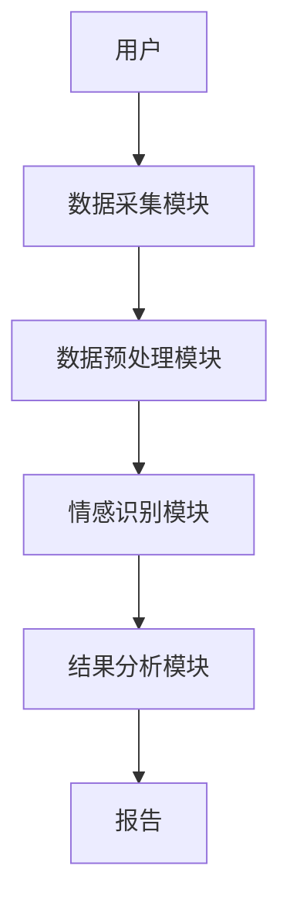
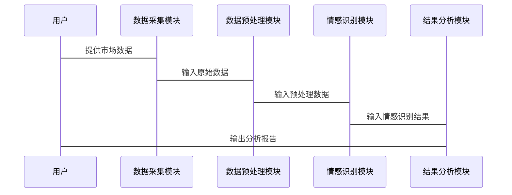

                 


# 开发AI Agent的情感计算在市场分析中的应用

> 关键词：情感计算，市场分析，AI Agent，机器学习，深度学习

> 摘要：本文探讨了情感计算在市场分析中的应用，详细介绍了情感计算的核心概念、算法原理、系统架构设计以及实际项目案例。通过分析情感数据，AI Agent能够帮助市场分析师更准确地预测市场趋势，优化市场策略，提高市场分析的效率和准确性。

---

## 第一部分: 情感计算与市场分析概述

### 第1章: 情感计算与市场分析概述

#### 1.1 情感计算的基本概念

情感计算（Affective Computing）是指通过计算机技术来识别、分析和理解人类情感的过程。它结合了心理学、计算机科学和人工智能技术，旨在通过分析情感数据来模拟人类的情感认知。

##### 1.1.1 情感计算的定义

情感计算关注的是人类情感的识别和分析，包括情感极性（如正面、负面、中性）、情感强度（如非常满意、满意、一般）以及情感主题（如快乐、愤怒、悲伤）。情感计算的核心目标是通过技术手段理解人类的情感状态，并将其应用于各种实际场景中。

##### 1.1.2 情感计算的核心要素

- **情感数据**：包括文本、声音、图像等多种形式的情感表达。
- **情感识别**：通过算法识别情感数据中的情感倾向。
- **情感分析**：对情感数据进行分类和分析，提取有用的信息。

##### 1.1.3 情感计算与市场分析的关系

市场分析是通过对市场数据的分析来预测市场趋势和消费者行为的过程。情感计算为市场分析提供了新的视角，通过分析消费者的情感倾向，市场分析师可以更准确地预测市场趋势，优化市场策略。

#### 1.2 市场分析的基本概念

市场分析是通过对市场数据的分析，了解市场动态、消费者行为和竞争环境的过程。它包括市场调研、数据收集、数据分析和市场预测等多个步骤。

##### 1.2.1 市场分析的定义

市场分析是通过对市场数据的分析，了解市场动态、消费者行为和竞争环境的过程。它可以帮助企业制定更有效的市场策略，优化资源配置，提高市场竞争力。

##### 1.2.2 市场分析的主要方法

- **定性分析**：通过访谈、焦点小组等方法，了解消费者的行为和态度。
- **定量分析**：通过对数据的统计分析，预测市场趋势和消费者行为。
- **混合分析**：结合定性和定量分析，综合考虑各种因素。

##### 1.2.3 数据来源与市场分析的关系

市场分析的数据来源包括：

- **内部数据**：企业内部的销售数据、客户反馈等。
- **外部数据**：行业报告、市场调研数据、社交媒体数据等。

通过分析这些数据，市场分析师可以更全面地了解市场情况，制定更有效的市场策略。

#### 1.3 情感计算在市场分析中的应用价值

情感计算在市场分析中的应用价值主要体现在以下几个方面：

##### 1.3.1 提高市场分析的准确性

通过分析消费者的情感倾向，市场分析师可以更准确地预测市场趋势和消费者行为。

##### 1.3.2 提升市场预测的效率

情感计算可以帮助市场分析师快速分析大量的情感数据，提高市场预测的效率。

##### 1.3.3 优化市场策略的制定

通过了解消费者的情感倾向，企业可以制定更有针对性的市场策略，提高市场竞争力。

#### 1.4 本章小结

本章介绍了情感计算和市场分析的基本概念，分析了情感计算在市场分析中的应用价值。情感计算为市场分析提供了新的视角，通过分析情感数据，市场分析师可以更准确地预测市场趋势，优化市场策略。

---

## 第二部分: 情感计算的核心概念与原理

### 第2章: 情感计算的核心概念

#### 2.1 情感计算的数据来源

情感计算的数据来源包括文本、声音和图像等多种形式。

##### 2.1.1 文本数据

文本数据是情感计算中最常用的数据来源，包括社交媒体上的评论、产品评价、新闻标题等。

##### 2.1.2 声音数据

声音数据包括语音情感识别，通过分析语音的音调、语速、音量等特征来判断情感倾向。

##### 2.1.3 图像数据

图像数据包括面部表情识别，通过分析面部表情来判断情感倾向。

#### 2.2 情感计算的特征提取

特征提取是情感计算中的关键步骤，通过提取情感数据中的特征，可以提高情感识别的准确率。

##### 2.2.1 文本特征提取方法

- **词袋模型**：将文本分解成单词，统计每个单词的出现频率。
- **TF-IDF**：计算每个单词在文本中的重要性。
- **词嵌入**：通过预训练模型（如Word2Vec）生成词向量。

##### 2.2.2 声音特征提取方法

- **音调**：声音的高低。
- **语速**：说话的速度。
- **音量**：声音的大小。

##### 2.2.3 图像特征提取方法

- **面部表情**：通过分析面部表情来判断情感倾向。
- **颜色特征**：通过分析图像的颜色特征来判断情感倾向。

#### 2.3 情感计算的分类与分析

情感计算的分类与分析是情感计算的核心内容之一，包括情感极性分类、情感强度分析和情感主题分析。

##### 2.3.1 情感极性分类

情感极性分类是将情感数据分为正面、负面和中性三类。

##### 2.3.2 情感强度分析

情感强度分析是通过分析情感数据的强度，判断情感的强烈程度。

##### 2.3.3 情感主题分析

情感主题分析是通过分析情感数据的主题，判断情感的具体内容。

#### 2.4 情感计算与市场分析的结合

情感计算与市场分析的结合可以帮助市场分析师更好地理解消费者情感，优化市场策略。

##### 2.4.1 情感数据在市场分析中的应用

- **消费者情感分析**：通过分析消费者评论，了解消费者对产品的看法。
- **市场趋势预测**：通过分析情感数据，预测市场趋势。
- **竞争对手分析**：通过分析竞争对手的产品评论，了解竞争对手的优缺点。

##### 2.4.2 情感计算对市场策略的影响

- **产品优化**：通过分析消费者情感，优化产品设计。
- **市场推广**：通过分析情感数据，制定更有针对性的市场推广策略。
- **客户关系管理**：通过分析情感数据，优化客户关系管理。

##### 2.4.3 情感计算在市场预测中的作用

- **预测市场趋势**：通过分析情感数据，预测市场趋势。
- **预测消费者行为**：通过分析情感数据，预测消费者行为。
- **预测市场风险**：通过分析情感数据，预测市场风险。

#### 2.5 本章小结

本章详细介绍了情感计算的核心概念，包括数据来源、特征提取、分类与分析以及与市场分析的结合。情感计算为市场分析提供了新的视角，通过分析情感数据，市场分析师可以更准确地预测市场趋势，优化市场策略。

---

## 第三部分: 情感计算的算法原理与实现

### 第3章: 情感计算的算法原理

#### 3.1 情感计算的主要算法

情感计算的主要算法包括基于传统机器学习的算法、基于深度学习的算法和混合算法。

##### 3.1.1 基于传统机器学习的算法

- **朴素贝叶斯**：一种基于概率论的分类算法。
- **支持向量机**：一种基于统计学习的分类算法。
- **K近邻算法**：一种基于距离的分类算法。

##### 3.1.2 基于深度学习的算法

- **循环神经网络**：一种用于处理序列数据的深度学习算法。
- **卷积神经网络**：一种用于处理图像数据的深度学习算法。
- **情感分析网络**：一种专门用于情感分析的深度学习模型。

##### 3.1.3 混合算法

混合算法结合了传统机器学习和深度学习的优点，通过集成学习的方法提高情感识别的准确率。

#### 3.2 情感计算的算法流程

情感计算的算法流程包括数据预处理、特征提取、模型训练和结果分析。

##### 3.2.1 数据预处理

数据预处理是情感计算的第一步，包括文本清洗、分词、去除停用词等。

##### 3.2.2 特征提取

特征提取是情感计算的关键步骤，通过提取情感数据的特征，可以提高情感识别的准确率。

##### 3.2.3 模型训练

模型训练是通过训练数据训练情感分类模型，提高模型的分类准确率。

##### 3.2.4 结果分析

结果分析是对情感分类模型的性能进行评估，包括准确率、召回率、F1值等指标。

#### 3.3 情感计算的数学模型

情感计算的数学模型包括朴素贝叶斯模型、支持向量机模型和循环神经网络模型。

##### 3.3.1 朴素贝叶斯模型

朴素贝叶斯模型是一种基于概率论的分类算法，假设特征之间相互独立，通过计算条件概率来分类情感数据。

##### 3.3.2 支持向量机模型

支持向量机模型是一种基于统计学习的分类算法，通过寻找最优超平面来分类情感数据。

##### 3.3.3 循环神经网络模型

循环神经网络模型是一种用于处理序列数据的深度学习算法，通过分析序列数据的时序关系来分类情感数据。

#### 3.4 情感计算的算法实现

情感计算的算法实现包括文本预处理、特征提取、模型训练和结果分析。

##### 3.4.1 文本预处理代码

```python
import nltk
from nltk.corpus import stopwords

def preprocess_text(text):
    tokens = nltk.word_tokenize(text)
    tokens = [word.lower() for word in tokens]
    tokens = [word for word in tokens if word not in stopwords.words('english')]
    return tokens
```

##### 3.4.2 特征提取代码

```python
from sklearn.feature_extraction.text import TfidfVectorizer

vectorizer = TfidfVectorizer()
X = vectorizer.fit_transform(corpus)
```

##### 3.4.3 模型训练代码

```python
from sklearn.naive_bayes import MultinomialNB

model = MultinomialNB()
model.fit(X, y)
```

##### 3.4.4 结果分析代码

```python
from sklearn.metrics import accuracy_score

y_pred = model.predict(X_test)
print(accuracy_score(y_test, y_pred))
```

#### 3.5 本章小结

本章详细介绍了情感计算的主要算法、算法流程和数学模型，并通过代码示例展示了情感计算的实现过程。情感计算的算法实现是情感计算的核心内容，通过选择合适的算法和优化模型，可以提高情感识别的准确率。

---

## 第四部分: 情感计算在市场分析中的系统架构设计

### 第4章: 情感计算系统的架构设计

#### 4.1 系统功能设计

情感计算系统的功能设计包括数据采集、数据预处理、情感识别和结果分析。

##### 4.1.1 数据采集模块

数据采集模块负责从社交媒体、新闻网站等来源采集情感数据。

##### 4.1.2 数据预处理模块

数据预处理模块负责对采集到的数据进行清洗、分词、去除停用词等处理。

##### 4.1.3 情感识别模块

情感识别模块负责对预处理后的数据进行情感分类，识别情感倾向。

##### 4.1.4 结果分析模块

结果分析模块负责对情感识别结果进行分析，生成报告和可视化结果。

#### 4.2 系统功能设计的ER实体关系图

以下是系统功能设计的ER实体关系图：

```mermaid
erDiagram
    customer : 用户
    market_data : 市场数据
    emotion_data : 情感数据
    preprocess_module : 预处理模块
    emotion_recognition : 情感识别模块
    result_analysis : 结果分析模块

    customer --> market_data : 提供
    market_data --> preprocess_module : 输入
    preprocess_module --> emotion_recognition : 输入
    emotion_recognition --> result_analysis : 输入
    result_analysis --> customer : 输出
```

#### 4.3 系统架构设计的mermaid流程图

以下是系统架构设计的mermaid流程图：



#### 4.4 系统架构设计的Python代码

以下是系统架构设计的Python代码示例：

```python
class MarketDataCollector:
    def collect_data(self):
        pass

class EmotionPreprocessor:
    def preprocess(self):
        pass

class EmotionRecognizer:
    def recognize(self):
        pass

class ResultAnalyzer:
    def analyze(self):
        pass
```

#### 4.5 系统交互设计的mermaid序列图

以下是系统交互设计的mermaid序列图：



#### 4.6 本章小结

本章详细介绍了情感计算系统的架构设计，包括系统功能设计、ER实体关系图、系统架构设计和系统交互设计。通过设计一个完整的系统架构，可以更好地理解情感计算在市场分析中的实际应用。

---

## 第五部分: 情感计算在市场分析中的项目实战

### 第5章: 情感计算在市场分析中的项目实战

#### 5.1 项目背景介绍

本项目旨在通过情感计算技术，分析社交媒体上的消费者评论，帮助企业了解消费者情感，优化市场策略。

#### 5.2 项目环境安装

以下是项目环境安装的步骤：

1. 安装Python
2. 安装必要的库，如nltk、scikit-learn、tensorflow等。

#### 5.3 项目核心实现代码

以下是项目核心实现代码：

##### 5.3.1 数据预处理代码

```python
import nltk
from nltk.corpus import stopwords

def preprocess_text(text):
    tokens = nltk.word_tokenize(text)
    tokens = [word.lower() for word in tokens]
    tokens = [word for word in tokens if word not in stopwords.words('english')]
    return tokens
```

##### 5.3.2 情感识别代码

```python
from sklearn.feature_extraction.text import TfidfVectorizer
from sklearn.naive_bayes import MultinomialNB

vectorizer = TfidfVectorizer()
X = vectorizer.fit_transform(corpus)
model = MultinomialNB()
model.fit(X, y)
```

##### 5.3.3 结果分析代码

```python
from sklearn.metrics import accuracy_score

y_pred = model.predict(X_test)
print(accuracy_score(y_test, y_pred))
```

#### 5.4 项目实战案例分析

以下是项目实战案例分析：

##### 5.4.1 案例背景

某公司希望分析消费者对产品的评论，了解消费者情感，优化产品设计。

##### 5.4.2 数据收集

从社交媒体上收集消费者评论，清洗数据，提取关键词。

##### 5.4.3 数据分析

通过情感识别模型，分析消费者评论的情感倾向，生成分析报告。

##### 5.4.4 结果解读

根据分析结果，优化产品设计，制定市场策略。

#### 5.5 项目小结

本章通过一个实际案例，详细介绍了情感计算在市场分析中的项目实战过程。通过实践，读者可以更好地理解情感计算的应用场景和实现方法。

---

## 第六部分: 情感计算在市场分析中的总结与注意事项

### 第6章: 情感计算在市场分析中的总结与注意事项

#### 6.1 项目总结

情感计算在市场分析中的应用具有重要意义，通过分析消费者情感，市场分析师可以更准确地预测市场趋势，优化市场策略。

#### 6.2 项目注意事项

##### 6.2.1 数据质量问题

数据质量是情感计算的核心，需要确保数据的准确性和完整性。

##### 6.2.2 模型优化问题

模型优化是情感计算的关键，需要通过不断优化模型参数和选择合适的算法来提高情感识别的准确率。

##### 6.2.3 隐私保护问题

在情感计算中，需要特别注意隐私保护问题，确保数据的安全性和合法性。

#### 6.3 项目最佳实践

##### 6.3.1 数据预处理

数据预处理是情感计算的第一步，需要仔细清洗数据，去除噪音。

##### 6.3.2 模型选择

选择合适的算法和模型，可以提高情感识别的准确率。

##### 6.3.3 结果分析

通过分析情感识别结果，生成有价值的分析报告，为企业决策提供支持。

#### 6.4 项目拓展阅读

以下是项目拓展阅读的建议：

- 情感计算的最新研究进展
- 深度学习在情感计算中的应用
- 情感计算在其他领域的应用

#### 6.5 本章小结

本章总结了情感计算在市场分析中的应用，并提出了项目注意事项和最佳实践建议。通过总结和反思，读者可以更好地理解和应用情感计算技术。

---

## 作者：AI天才研究院/AI Genius Institute & 禅与计算机程序设计艺术 /Zen And The Art of Computer Programming

---

**本文由AI天才研究院和禅与计算机程序设计艺术联合撰写，转载请注明出处。**

