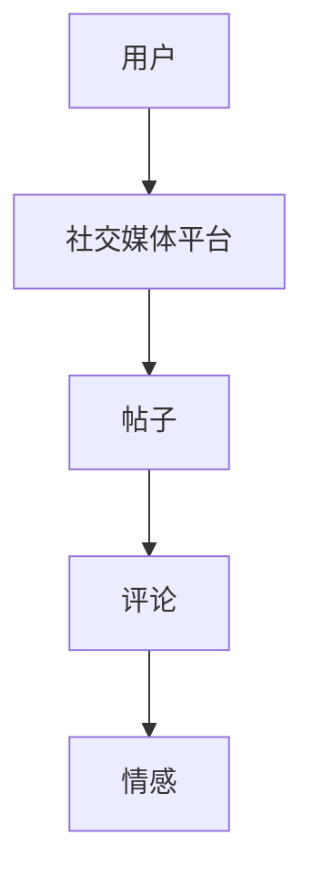
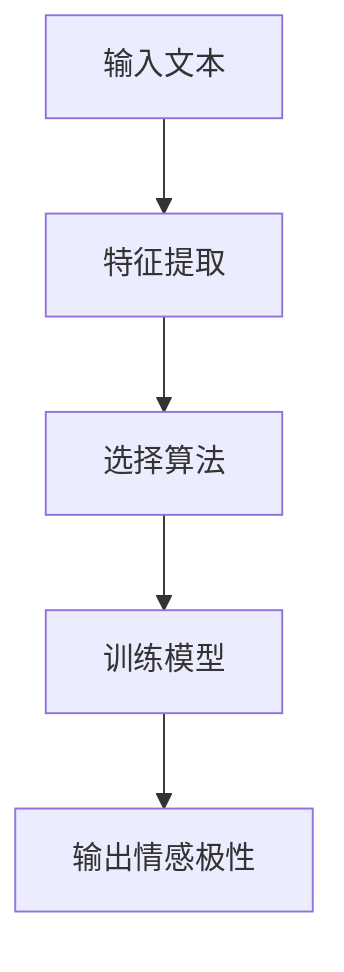
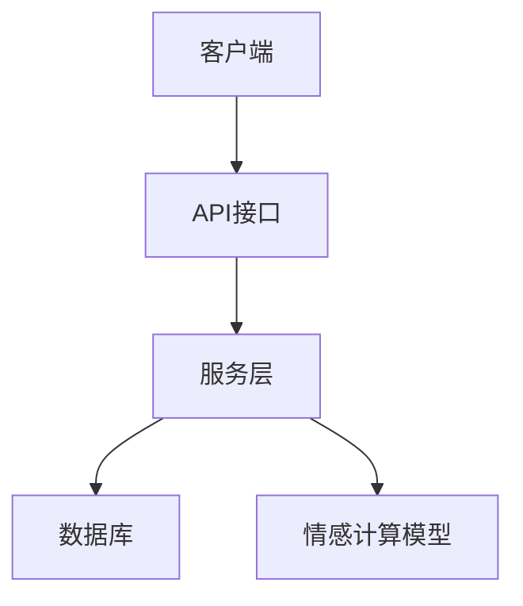
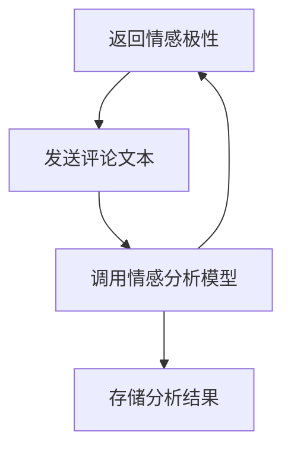

                 


```markdown
# 开发AI Agent的情感计算在社交媒体分析中的应用

> 关键词：情感计算，AI Agent，社交媒体分析，自然语言处理，机器学习，深度学习，文本挖掘

> 摘要：本文详细探讨了AI Agent在社交媒体情感计算中的应用，从情感计算的基本概念到算法实现，再到系统架构设计，结合实际案例分析，全面解析情感计算在社交媒体分析中的技术细节与应用价值。文章内容涵盖情感计算的核心概念、算法原理、数学模型、系统架构设计、项目实战等，为读者提供从理论到实践的完整指南。

---

# 第一部分: 情感计算与社交媒体分析基础

# 第1章: 情感计算与社交媒体分析概述

## 1.1 情感计算的定义与背景

### 1.1.1 情感计算的定义
情感计算（Affective Computing）是通过计算机技术分析、识别和理解人类情感的过程。它关注的是人类情感的表达、识别和应用，广泛应用于人机交互、自然语言处理、社交媒体分析等领域。

### 1.1.2 情感计算的应用场景
- **社交媒体分析**：通过分析用户评论、点赞、分享等行为，挖掘用户情感倾向。
- **舆情监控**：帮助企业实时监控市场动态，了解消费者反馈。
- **个性化推荐**：基于用户情感偏好，推荐相关内容或产品。
- **情感健康监测**：通过分析社交媒体上的情感数据，监测用户心理健康。

### 1.1.3 社交媒体分析的背景
社交媒体已成为人们日常生活的重要组成部分，每天产生海量的数据。通过分析这些数据，可以提取有价值的信息，帮助企业和个人做出更明智的决策。

## 1.2 情感计算的核心概念

### 1.2.1 情感极性分析
情感极性分析是情感计算的核心任务之一，旨在判断一段文本的情感倾向是积极、消极还是中性。

### 1.2.2 情感强度分析
情感强度分析是对情感极性的强度进行量化，例如将情感强度分为1到5级，从“非常消极”到“非常积极”。

### 1.2.3 情感分类与主题分析
情感分类是将文本分类到特定的情感类别中，例如将评论分类为“满意”或“不满”。主题分析则是结合情感计算，分析文本的主题和情感的结合。

## 1.3 情感计算与AI Agent的结合

### 1.3.1 AI Agent的定义
AI Agent（人工智能代理）是一种智能实体，能够感知环境并采取行动以实现目标。在社交媒体分析中，AI Agent可以用于自动分析和处理用户情感数据。

### 1.3.2 情感计算在AI Agent中的作用
情感计算为AI Agent提供了情感分析的能力，使其能够理解用户的情感需求，并根据这些需求提供个性化的服务。

### 1.3.3 社交媒体分析的复杂性与挑战
社交媒体数据具有多样性、实时性和情感表达复杂性的特点，这些特点给情感计算带来了挑战。

## 1.4 本章小结
本章介绍了情感计算的定义、应用场景和核心概念，并探讨了情感计算与AI Agent的结合。通过这些内容，读者可以理解情感计算在社交媒体分析中的重要性。

---

# 第二部分: 情感计算的核心概念与原理

# 第2章: 情感计算的核心概念与联系

## 2.1 情感计算的核心要素

### 2.1.1 情感分析的输入与输出
- **输入**：文本数据（如评论、帖子、消息）
- **输出**：情感极性（如积极、消极、中性）

### 2.1.2 情感计算的特征提取
- **词袋模型**：基于词语频率的特征提取
- **TF-IDF**：基于词频和逆文档频率的特征提取
- **词嵌入**：如Word2Vec、GloVe等

### 2.1.3 情感计算的分类模型
- **二分类模型**：如积极/消极分类
- **多分类模型**：如情感强度分类

## 2.2 情感计算与相关技术的对比

### 2.2.1 与自然语言处理的对比
- **自然语言处理**：关注文本的语法结构和语义理解
- **情感计算**：关注文本的情感倾向和情感强度

### 2.2.2 与机器学习的对比
- **机器学习**：广泛应用于分类、回归等任务
- **情感计算**：是机器学习在情感分析领域的具体应用

### 2.2.3 与数据挖掘的对比
- **数据挖掘**：从大数据中提取模式和知识
- **情感计算**：从文本数据中提取情感信息

## 2.3 情感计算的ER实体关系图



## 2.4 本章小结
本章从情感计算的核心要素出发，分析了其与相关技术的联系，并通过ER实体关系图展示了情感计算在社交媒体分析中的数据流。

---

# 第三部分: 情感计算的算法原理与数学模型

# 第3章: 情感计算的算法原理

## 3.1 基于规则的情感分析算法

### 3.1.1 规则的定义与应用
- **规则**：预定义的关键词和情感词典
- **应用**：通过匹配关键词来判断情感倾向

### 3.1.2 正则表达式的使用
- **示例**：使用正则表达式匹配情感词

## 3.2 基于机器学习的情感分析算法

### 3.2.1 朴素贝叶斯算法
- **原理**：基于概率论的分类方法
- **公式**：$$ P(c|d) = \frac{P(d|c)P(c)}{P(d)} $$

### 3.2.2 支持向量机（SVM）算法
- **原理**：通过构建超平面进行分类
- **公式**：$$ \text{目标函数} = \sum_{i=1}^{n} \xi_i + \lambda \sum_{i=1}^{n} \xi_i $$

### 3.2.3 随机森林算法
- **原理**：基于决策树的集成学习方法

## 3.3 深度学习在情感计算中的应用

### 3.3.1 RNN与LSTM网络
- **原理**：通过循环结构处理序列数据
- **公式**：$$ h_t = \tanh(W_{hh}h_{t-1} + W_{xh}x_t + b_h) $$

### 3.3.2 Transformer架构
- **原理**：基于自注意力机制处理文本

### 3.3.3 BERT模型在情感分析中的应用
- **原理**：预训练的双向Transformer模型

## 3.4 情感计算的算法流程图



## 3.5 本章小结
本章详细介绍了情感计算的算法原理，包括基于规则、机器学习和深度学习的方法，并通过流程图展示了情感计算的实现过程。

---

# 第四章: 情感计算的数学模型与公式

## 4.1 情感计算中的概率模型

### 4.1.1 朴素贝叶斯分类器
- **公式**：$$ P(c|d) = \frac{P(d|c)P(c)}{P(d)} $$
- **应用**：常用于二分类任务

### 4.1.2 条件概率的应用
- **示例**：通过条件概率计算某个关键词在积极文本中的概率

## 4.2 支持向量机（SVM）模型

### 4.2.1 SVM的数学表达
- **公式**：$$ \text{目标函数} = \sum_{i=1}^{n} \xi_i + \lambda \sum_{i=1}^{n} \xi_i $$
- **应用**：适用于高维数据分类

### 4.2.2 核函数的选择
- **线性核**：适用于线性可分数据
- **多项式核**：适用于非线性数据
- **高斯核**：适用于复杂数据

## 4.3 深度学习模型的数学基础

### 4.3.1 RNN的递推公式
- **公式**：$$ h_t = \tanh(W_{hh}h_{t-1} + W_{xh}x_t + b_h) $$

### 4.3.2 Transformer的注意力机制
- **公式**：$$ \text{Attention}(Q,K,V) = \text{softmax}\left(\frac{QK^T}{\sqrt{d_k}}\right)V $$

## 4.4 本章小结
本章通过数学公式详细解析了情感计算中的概率模型和深度学习模型，为读者提供了从理论到实践的数学基础。

---

# 第五部分: 情感计算的系统架构与项目实战

# 第4章: 情感计算的系统架构设计

## 4.1 项目介绍

### 4.1.1 项目目标
- 开发一个基于AI Agent的社交媒体情感分析系统
- 实现情感计算的核心功能，包括情感极性分析、情感强度分析和主题分析

### 4.1.2 系统功能设计
- **数据采集**：从社交媒体平台获取用户评论
- **情感分析**：对评论进行情感计算
- **结果展示**：将情感分析结果可视化

## 4.2 系统架构设计

### 4.2.1 系统架构图



### 4.2.2 系统功能模块
- **数据采集模块**：负责从社交媒体平台获取数据
- **情感分析模块**：负责对数据进行情感计算
- **结果展示模块**：负责将情感分析结果可视化

## 4.3 系统接口设计

### 4.3.1 API接口
- **输入接口**：用户评论文本
- **输出接口**：情感极性（如积极、消极、中性）

## 4.4 系统交互流程图



## 4.5 本章小结
本章通过系统架构设计和交互流程图，展示了情感计算在社交媒体分析中的实现过程。

---

# 第5章: 情感计算的项目实战

## 5.1 环境安装

### 5.1.1 安装Python
- **命令**：```bash
  python --version
  ```

### 5.1.2 安装必要的库
- **库列表**：numpy、pandas、scikit-learn、tensorflow、transformers

## 5.2 系统核心实现源代码

### 5.2.1 情感计算模型实现

```python
from sklearn.feature_extraction.text import TfidfVectorizer
from sklearn.svm import SVC

# 数据预处理
vectorizer = TfidfVectorizer()
X = vectorizer.fit_transform(corpus)
y = [0, 1, 0, 1]  # 0代表消极，1代表积极

# 训练模型
model = SVC()
model.fit(X, y)

# 预测
test_text = ["I love this product!", "This is terrible."]
X_test = vectorizer.transform(test_text)
predictions = model.predict(X_test)
print(predictions)
```

### 5.2.2 系统交互设计

```python
class SentimentAgent:
    def __init__(self):
        self.model = SVC()
        self.vectorizer = TfidfVectorizer()

    def train(self, corpus, labels):
        self.model.fit(self.vectorizer.fit_transform(corpus), labels)

    def predict(self, text):
        return self.model.predict(self.vectorizer.transform([text]))

# 使用示例
agent = SentimentAgent()
agent.train(["I love you", "I hate you"], [1, 0])
print(agent.predict("I love you"))  # 输出：[1]
print(agent.predict("I hate you"))  # 输出：[0]
```

## 5.3 代码应用解读与分析

### 5.3.1 代码功能分析
- **SentimentAgent类**：封装情感计算模型
- **train方法**：训练模型
- **predict方法**：预测情感极性

### 5.3.2 代码实现细节
- **TfidfVectorizer**：用于特征提取
- **SVC**：支持向量机分类器

## 5.4 实际案例分析与详细讲解剖析

### 5.4.1 案例分析
- **案例背景**：某电商平台的用户评论分析
- **数据来源**：用户评论数据
- **分析过程**：训练情感计算模型，预测评论情感极性

### 5.4.2 分析结果解读
- **积极评论**：用户对产品满意
- **消极评论**：用户对产品不满

## 5.5 本章小结
本章通过实际案例分析，详细解读了情感计算在社交媒体分析中的实现过程，并通过代码示例展示了情感计算模型的应用。

---

# 第六部分: 总结与展望

## 6.1 本章总结
本文详细探讨了情感计算在社交媒体分析中的应用，从核心概念到算法实现，再到系统架构设计，为读者提供了从理论到实践的完整指南。

## 6.2 未来展望
随着深度学习技术的不断发展，情感计算在社交媒体分析中的应用将更加广泛和深入。未来的研究方向包括更复杂的情感分析任务、多模态情感计算以及情感计算的实时性优化。

## 6.3 最佳实践 Tips
- **数据预处理**：确保数据质量，进行必要的清洗和归一化处理
- **特征提取**：选择合适的特征提取方法，提高模型性能
- **模型选择**：根据任务需求选择合适的算法，避免过度拟合

## 6.4 小结
情感计算在社交媒体分析中的应用前景广阔，通过不断的技术创新和实践积累，我们可以更好地理解和利用社交媒体上的情感信息。

---

# 作者：AI天才研究院/AI Genius Institute & 禅与计算机程序设计艺术 /Zen And The Art of Computer Programming
```

