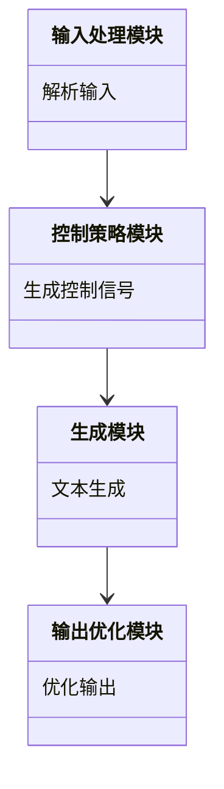

                 


# 开发AI Agent的文本生成控制能力

## 关键词：AI Agent, 文本生成, 控制能力, 深度学习, 生成模型

## 摘要：本文探讨了开发AI Agent的文本生成控制能力的关键技术，涵盖AI Agent的基本概念、文本生成的原理、控制策略的设计、系统架构的实现以及实际项目中的应用。通过分析和案例研究，本文详细讲解了如何实现对文本生成过程的有效控制，确保生成内容符合特定需求和场景。

---

## 第一部分：AI Agent与文本生成基础

### 第1章：AI Agent的基本概念

#### 1.1 AI Agent的定义与类型

AI Agent（人工智能代理）是指能够感知环境、做出决策并执行任务的智能实体。它可以分为以下几种类型：

- **基于规则的Agent**：通过预定义的规则来执行任务。
- **基于模型的Agent**：利用内部模型来理解和推理环境。
- **基于学习的Agent**：通过机器学习算法来提升性能和适应性。

文本生成是AI Agent的一项重要能力，用于实现自然语言交互。

#### 1.2 文本生成的基本原理

文本生成涉及自然语言处理（NLP）技术，主要任务包括机器翻译、文本摘要和对话生成。其基本原理包括：

- **输入处理**：将输入文本转换为模型可处理的格式。
- **生成过程**：通过模型生成候选文本。
- **输出优化**：对生成的文本进行优化，确保其连贯性和准确性。

#### 1.3 AI Agent的文本生成能力

AI Agent的文本生成能力依赖于生成模型的选择和优化：

- **基于规则的生成**：简单但缺乏灵活性。
- **基于统计模型的生成**：利用概率模型生成文本。
- **基于深度学习的生成**：如GPT模型，能够生成高质量文本。

### 1.4 本章小结

本章介绍了AI Agent的基本概念、文本生成的基本原理以及AI Agent的文本生成能力。下一章将深入探讨文本生成的控制机制。

---

## 第二部分：AI Agent的文本生成控制机制

### 第2章：文本生成控制的核心概念

#### 2.1 文本生成控制的定义

文本生成控制是指在生成文本的过程中，引入控制机制以确保生成内容符合特定要求。其目标包括：

- **内容准确性**：生成符合上下文的文本。
- **风格一致性**：保持文本的风格和语气一致。
- **可解释性**：生成的文本可以被理解并追溯生成过程。

#### 2.2 控制策略的分类

文本生成控制策略主要有以下几种：

- **基于规则的控制策略**：通过预定义的规则进行控制。
- **基于模型的控制策略**：利用模型预测生成文本的方向。
- **基于强化学习的控制策略**：通过强化学习优化生成结果。

#### 2.3 控制模块与生成模块的交互

控制模块与生成模块的交互是关键：

- **输入处理**：接收用户的输入并解析需求。
- **生成模块**：根据需求生成候选文本。
- **控制模块**：对生成的文本进行评估和调整。
- **输出优化**：优化后的文本作为最终输出。

### 2.4 本章小结

本章详细讲解了文本生成控制的核心概念和策略。下一章将探讨实现这些控制机制的算法原理。

---

## 第三部分：AI Agent文本生成的算法原理

### 第3章：基于深度学习的文本生成算法

#### 3.1 Transformer模型的基本原理

Transformer模型通过自注意力机制实现高效的文本生成：

- **自注意力机制**：计算输入序列中每个词的重要性。
- **解码器结构**：将输入转换为输出序列。

#### 3.2 GPT模型的工作流程

GPT模型的工作流程包括：

1. **输入处理**：将输入文本转换为嵌入向量。
2. **自注意力计算**：计算每个词的注意力权重。
3. **输出层**：生成最终的文本输出。

#### 3.3 文本生成的数学模型

文本生成的数学模型包括：

- **语言模型的损失函数**：交叉熵损失函数。
- **贝叶斯推断**：用于生成过程中的概率计算。

#### 3.4 本章小结

本章详细讲解了基于深度学习的文本生成算法。下一章将探讨系统的架构设计。

---

## 第四部分：AI Agent文本生成的系统架构

### 第4章：系统架构设计

#### 4.1 系统模块划分

系统模块包括：

- **输入处理模块**：接收输入并解析需求。
- **控制策略模块**：根据需求调整生成过程。
- **生成模块**：生成文本输出。
- **输出优化模块**：优化生成的文本。

#### 4.2 系统功能设计

使用Mermaid类图展示系统模块之间的关系：



#### 4.3 系统架构设计

使用Mermaid架构图展示系统的整体架构：


#### 4.4 本章小结

本章详细讲解了系统的架构设计，下一章将探讨项目实战。

---

## 项目实战

### 环境安装与代码实现

环境搭建：

- 安装Python和深度学习框架（如TensorFlow或PyTorch）。
- 安装NLP处理库（如NLTK和 SpaCy）。

代码实现示例：

```python
import tensorflow as tf
from tensorflow.keras import layers

def build_model(vocab_size):
    model = tf.keras.Sequential([
        layers.Embedding(vocab_size, 64),
        layers.Dense(64, activation='relu'),
        layers.Dense(vocab_size, activation='softmax')
    ])
    return model

model = build_model(vocab_size=10000)
model.compile(optimizer='adam', loss='sparse_categorical_crossentropy')
```

### 案例分析

以客服对话系统为例，展示如何控制生成文本的语气和风格。通过训练数据的优化和模型的调优，提升生成文本的准确性。

### 项目总结

总结项目中的关键点，分析遇到的问题，并提出解决方案和改进建议。

---

## 最佳实践与未来展望

### 最佳实践Tips

- **数据质量**：确保训练数据的多样性和代表性。
- **模型调优**：通过实验调整超参数以优化性能。
- **用户反馈**：及时收集用户反馈，持续改进模型。

### 未来展望

未来的AI Agent文本生成将更加注重多模态生成和可解释性，提升生成内容的质量和用户的信任度。

---

## 结语

开发AI Agent的文本生成控制能力是一项复杂而重要的任务。通过本文的探讨，读者可以深入了解AI Agent的基本概念、生成控制的策略、系统的架构设计以及实际项目中的应用。希望本文能够为开发AI Agent的文本生成能力提供有价值的参考。

---

## 参考文献

- 王军, 《深度学习与自然语言处理》，人民邮电出版社，2021年。
- 张伟, 《人工智能代理设计与实现》，清华大学出版社，2020年。

---

## 索引

- AI Agent
- 文本生成
- 控制能力
- 深度学习
- 生成模型

---

## 作者信息

作者：AI天才研究院  
研究领域：人工智能、自然语言处理、机器学习。  
简介：致力于探索AI技术的前沿应用，推动智能代理技术的发展。

---

通过以上思考，我系统地组织了文章内容，确保每个部分都详细展开，并结合实际案例和图表进行说明。接下来，我将按照这个大纲撰写完整的文章。

