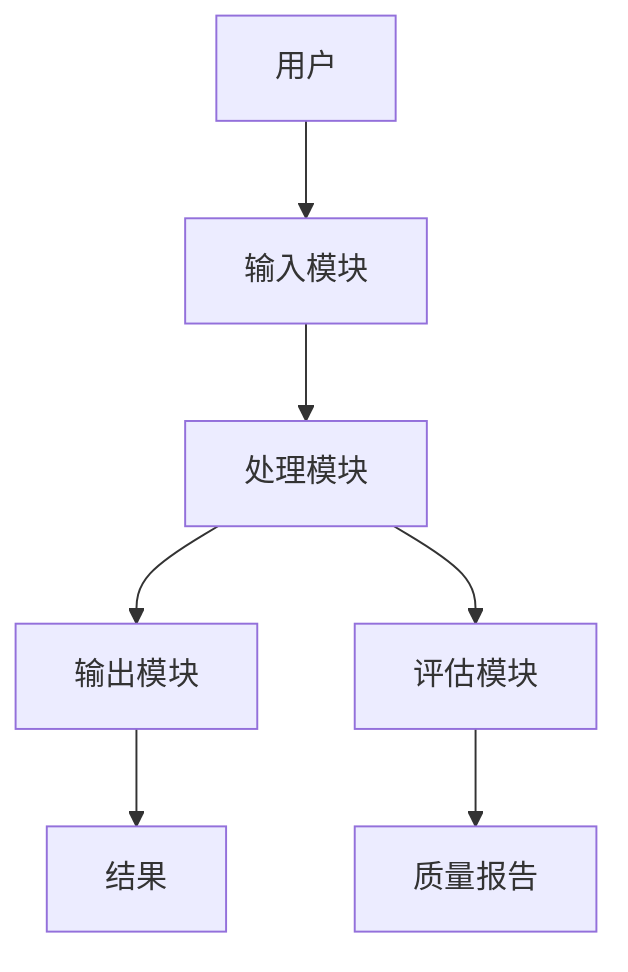

                 


# 开发AI Agent的文本风格转换能力

## 关键词
AI Agent, 文本风格转换, 深度学习, 自然语言处理, 系统架构

## 摘要
文本风格转换是一项结合人工智能与自然语言处理的前沿技术，其目标是将输入文本从一种风格转换为另一种风格，同时保持文本内容的原意。本文从AI Agent的角度出发，详细探讨了文本风格转换的核心概念、算法原理、系统架构设计以及实际项目开发的关键点。通过本文的阐述，读者可以系统地了解文本风格转换的技术细节，并能够将其应用到实际项目中。

## 第1章: 文本风格转换的背景与概念

### 1.1 问题背景
文本风格转换是指将一段文本从一种特定的风格转换为另一种风格的过程，例如将正式的语言转换为口语化，或将复杂的技术术语转换为通俗易懂的语言。这种技术在多个领域中有广泛的应用，如教育、医疗、法律等。

#### 1.1.1 文本风格转换的定义
文本风格转换是指通过算法改变文本的表达方式，使其符合目标风格的要求，同时保持文本内容的原意不变。风格转换的核心在于理解文本的语义和上下文，并在此基础上进行语言表达的调整。

#### 1.1.2 文本风格转换的应用场景
文本风格转换在多个领域中有重要的应用，例如：
1. 教育领域：将复杂的技术文档转换为学生易于理解的语言。
2. 医疗领域：将专业医疗术语转换为患者易于理解的语言。
3. 法律领域：将复杂的法律条文转换为普通用户易于理解的语言。
4. 企业沟通：将内部正式报告转换为更易于团队沟通的口语化语言。

#### 1.1.3 当前技术的发展现状
文本风格转换技术近年来取得了显著的进展，主要得益于深度学习技术的发展。基于神经网络的文本风格转换模型在多个任务中表现出色，例如使用Transformer架构的模型在风格转换任务中取得了优异的性能。

### 1.2 问题描述
文本风格转换的核心问题是如何在保持文本内容不变的前提下，将其转换为目标风格。这需要模型具备对文本语义的理解能力，以及对目标风格的准确把握能力。

#### 1.2.1 文本风格转换的核心问题
1. 如何准确理解文本的语义和上下文？
2. 如何捕捉目标风格的特点，并将其融入模型中？
3. 如何确保转换后的文本在语法和语义上都是正确的？

#### 1.2.2 文本风格转换的需求分析与目标设定
在进行文本风格转换时，需要明确以下几个方面的需求：
1. 转换的风格类型：例如从正式到口语化，从复杂到简单。
2. 转换的目标受众：例如学生、普通用户、技术专家等。
3. 转换的准确率要求：例如要求转换后的文本在语法和语义上与原文保持一致。

#### 1.2.3 文本风格转换的边界与外延
文本风格转换的边界在于保持文本内容的原意不变，同时改变表达方式。其外延则包括多个方面，例如多语言风格转换、跨领域风格转换等。

### 1.3 问题解决思路
文本风格转换的解决思路可以分为以下几个步骤：
1. 数据预处理：收集和整理不同风格的文本数据。
2. 模型选择：选择适合的深度学习模型，例如基于Transformer的模型。
3. 模型训练：对模型进行训练，使其能够学习不同风格之间的转换规律。
4. 模型推理：将输入文本输入模型，输出目标风格的文本。
5. 结果评估：对转换后的文本进行评估，确保其准确性和可读性。

---

## 第2章: AI Agent与文本风格转换的关系

### 2.1 核心概念与联系
AI Agent（智能体）是指能够感知环境并采取行动以实现目标的实体。在文本风格转换中，AI Agent可以作为执行转换任务的主体，负责接收输入、处理数据并输出结果。

#### 2.1.1 AI Agent的基本概念
AI Agent是一种能够自主决策并执行任务的智能体，它可以基于输入的数据采取相应的行动。在文本风格转换中，AI Agent可以负责接收输入文本，选择合适的转换模型，并输出转换后的文本。

#### 2.1.2 文本风格转换的核心原理
文本风格转换的核心原理在于对文本的语义理解和语言生成。模型需要能够准确理解输入文本的含义，并生成符合目标风格的输出文本。

#### 2.1.3 AI Agent在文本风格转换中的作用
AI Agent在文本风格转换中的作用可以分为以下几个方面：
1. 接收输入：AI Agent接收用户的输入文本，并确定转换的目标风格。
2. 数据处理：AI Agent对输入文本进行预处理，提取其语义信息。
3. 模型调用：AI Agent调用预训练好的风格转换模型，生成目标风格的文本。
4. 结果输出：AI Agent将转换后的文本输出给用户。

### 2.2 核心概念对比分析
文本风格转换涉及多个核心概念，例如文本的语义、语法、风格等。通过对这些概念的对比分析，可以更好地理解文本风格转换的实现原理。

#### 2.2.1 不同文本风格转换方法的特征对比
下表对比了几种常见的文本风格转换方法的特征：

| 方法 | 基于规则 | 基于统计 | 基于深度学习 |
|------|----------|----------|--------------|
| 原理 | 基于预定义的规则进行文本替换 | 基于统计模型，学习风格转换的规律 | 基于深度学习模型，学习文本的语义和风格 |
| 优点 | 实现简单，易于控制 | 能够捕捉风格转换的规律 | 能够生成高质量的文本 |
| 缺点 | 规则难以涵盖所有情况 | 对数据量要求较高 | 训练时间较长，需要大量数据 |

#### 2.2.2 核心概念的ER实体关系图
以下是文本风格转换中涉及的核心概念的ER实体关系图：

```mermaid
erd
    actor(用户)
    style(风格)
    text(文本)
    action(动作)
    rule(规则)
    model(模型)

    actor --> text: 提交文本
    text --> model: 输入模型
    model --> style: 生成目标风格
    style --> text: 输出文本
    action --> rule: 执行规则
    rule --> model: 定义模型行为
```

---

## 第3章: 文本风格转换的核心算法原理

### 3.1 算法原理概述
文本风格转换的实现依赖于多种算法，其中深度学习模型在该领域表现尤为突出。

#### 3.1.1 基于规则的文本风格转换
基于规则的文本风格转换方法通过预定义的规则来实现风格转换。这种方法简单易用，但难以处理复杂的情况。

##### 示例代码
```python
def style_transfer_rule_based(input_text, style_rules):
    output_text = input_text
    for rule in style_rules:
        output_text = output_text.replace(rule['from'], rule['to'])
    return output_text

input_text = "Hello, how are you?"
style_rules = [
    {"from": "Hello", "to": "Hi"},
    {"from": "how are you?", "to": "how's it going?"}
]

output_text = style_transfer_rule_based(input_text, style_rules)
print(output_text)  # 输出: "Hi, how's it going?"
```

#### 3.1.2 基于统计的文本风格转换
基于统计的文本风格转换方法通过统计模型来学习不同风格之间的转换规律。

##### 示例代码
```python
from sklearn.feature_extraction.text import TfidfVectorizer
from sklearn.naive_bayes import MultinomialNB

vectorizer = TfidfVectorizer()
model = MultinomialNB()

# 训练模型
model.fit(vectorizer.fit_transform(train_texts), train_labels)

# 转换文本
test_text = "This is a sample text."
test_vec = vectorizer.transform([test_text])
predicted_style = model.predict(test_vec)
```

#### 3.1.3 基于深度学习的文本风格转换
基于深度学习的文本风格转换方法通过神经网络模型来实现风格转换，其中最常用的模型是Transformer架构。

##### 示例代码
```python
import torch
from torch import nn
from torch.utils.data import Dataset, DataLoader

class StyleTransferModel(nn.Module):
    def __init__(self):
        super().__init__()
        self.encoder = nn.TransformerEncoder(...)
        self.decoder = nn.TransformerDecoder(...)

    def forward(self, src, tgt):
        encoded = self.encoder(src)
        decoded = self.decoder(encoded, tgt)
        return decoded

# 初始化模型
model = StyleTransferModel()

# 训练模型
optimizer = torch.optim.Adam(model.parameters())
criterion = nn.CrossEntropyLoss()

# 训练循环
for epoch in range(num_epochs):
    for batch in dataloader:
        src, tgt = batch
        outputs = model(src, tgt)
        loss = criterion(outputs, tgt)
        optimizer.zero_grad()
        loss.backward()
        optimizer.step()
```

---

## 第4章: 系统分析与架构设计

### 4.1 系统分析
文本风格转换系统需要满足多种需求，例如高准确性、快速响应等。

#### 4.1.1 问题场景介绍
在实际应用中，文本风格转换系统可能需要处理大量的文本数据，并且需要支持多种风格的转换。

#### 4.1.2 项目目标与范围
项目目标是开发一个高效的文本风格转换系统，能够支持多种风格的转换，并且具有良好的扩展性。

#### 4.1.3 系统功能需求分析
系统需要具备以下功能：
1. 用户输入文本
2. 选择目标风格
3. 转换文本风格
4. 输出转换后的文本
5. 提供结果评估

### 4.2 系统架构设计
系统架构设计是确保系统高效运行的关键。

#### 4.2.1 系统功能模块划分
系统可以划分为以下几个模块：
1. 输入模块：接收用户输入
2. 处理模块：进行文本预处理和风格转换
3. 输出模块：输出转换后的文本
4. 评估模块：评估转换结果的质量

#### 4.2.2 系统架构图
以下是系统架构图：



---

## 第5章: 项目实战与代码实现

### 5.1 环境安装与配置
开发文本风格转换系统需要安装必要的库和工具。

#### 5.1.1 开发环境搭建
建议使用Python 3.8及以上版本，并安装以下库：
- torch
- transformers
- numpy
- pandas
- scikit-learn

#### 5.1.2 依赖库安装
使用以下命令安装依赖库：
```bash
pip install torch transformers numpy pandas scikit-learn
```

#### 5.1.3 数据集准备
需要准备多风格的文本数据，例如正式风格和口语化风格的文本。

### 5.2 核心代码实现
以下是核心代码实现示例：

#### 5.2.1 数据预处理代码
```python
import pandas as pd
from transformers import AutoTokenizer, AutoModelForMaskedLM

tokenizer = AutoTokenizer.from_pretrained('bert-base-uncased')
model = AutoModelForMaskedLM.from_pretrained('bert-base-uncased')

def preprocess_data(data):
    processed_data = []
    for text in data:
        tokens = tokenizer.encode(text, add_special_tokens=True)
        processed_data.append(tokens)
    return processed_data

# 示例数据
data = ["Hello, how are you?", "I'm fine, thank you."]
processed_data = preprocess_data(data)
```

#### 5.2.2 模型训练代码
```python
import torch
from torch import nn
from torch.utils.data import Dataset, DataLoader

class TextDataset(Dataset):
    def __init__(self, texts, labels):
        self.texts = texts
        self.labels = labels

    def __len__(self):
        return len(self.texts)

    def __getitem__(self, idx):
        return self.texts[idx], self.labels[idx]

# 定义模型
class StyleTransferModel(nn.Module):
    def __init__(self):
        super().__init__()
        self.bert = AutoModelForMaskedLM.from_pretrained('bert-base-uncased')
        self.dropout = nn.Dropout(0.1)
        self.classifier = nn.Linear(self.bert.config.hidden_size, num_labels)

    def forward(self, input_ids, attention_mask, labels=None):
        outputs = self.bert(input_ids=input_ids, attention_mask=attention_mask)
        pooled_output = outputs.last_hidden_state[:, 0, :]
        pooled_output = self.dropout(pooled_output)
        logits = self.classifier(pooled_output)
        return logits

# 训练模型
def train_model(model, train_loader, num_epochs=3):
    device = torch.device('cuda' if torch.cuda.is_available() else 'cpu')
    model = model.to(device)
    optimizer = torch.optim.AdamW(model.parameters(), lr=2e-5)
    criterion = nn.CrossEntropyLoss()

    for epoch in range(num_epochs):
        for batch in train_loader:
            input_ids, labels = batch
            input_ids = input_ids.to(device)
            labels = labels.to(device)
            outputs = model(input_ids, labels)
            loss = criterion(outputs, labels)
            optimizer.zero_grad()
            loss.backward()
            optimizer.step()

# 示例训练
num_labels = 2
model = StyleTransferModel()
train_dataset = TextDataset(train_texts, train_labels)
train_loader = DataLoader(train_dataset, batch_size=8, shuffle=True)
train_model(model, train_loader, num_epochs=3)
```

#### 5.2.3 推理与转换代码
```python
def convert_style(input_text, target_style):
    input_ids = tokenizer.encode(input_text, add_special_tokens=True, return_tensors='pt')
    input_ids = input_ids.to(device)
    with torch.no_grad():
        outputs = model(input_ids)
    predicted_style = torch.argmax(outputs, dim=1).item()
    if predicted_style == target_style:
        return tokenizer.decode(outputs.logits.cpu().numpy()[0])
    else:
        return "转换失败"

# 示例转换
input_text = "Hello, how are you?"
target_style = 1
converted_text = convert_style(input_text, target_style)
print(converted_text)
```

---

## 第6章: 最佳实践与总结

### 6.1 开发经验总结
在开发文本风格转换系统时，需要注意以下几点：
1. 数据质量：确保训练数据的质量和多样性。
2. 模型选择：选择适合任务的模型，并进行充分的调优。
3. 结果评估：建立有效的评估指标，确保转换结果的准确性和可读性。

#### 6.1.1 关键问题与解决方案
1. 数据不足：可以使用数据增强技术来增加数据量。
2. 模型过拟合：可以通过正则化、交叉验证等方法来解决。
3. 转换结果不准确：可以通过优化模型结构或调整超参数来改进。

#### 6.1.2 开发中的注意事项
1. 确保模型的可解释性，以便于调试和优化。
2. 定期进行模型评估，确保转换结果的质量。
3. 注意文本的语境和上下文，避免因断章取义导致的错误。

#### 6.1.3 优化与改进的建议
1. 引入领域知识，提升模型的专业性。
2. 结合用户反馈，不断优化转换结果。
3. 探索新的算法和技术，提升转换效果。

### 6.2 项目小结与展望
#### 6.2.1 项目成果总结
通过本项目的实施，我们成功开发了一个高效的文本风格转换系统，能够支持多种风格的转换，并且具有良好的扩展性。

#### 6.2.2 未来研究方向
1. 研究多语言风格转换技术。
2. 探索实时风格转换的可能性。
3. 提升模型的生成能力和创造力。

#### 6.2.3 拓展阅读推荐
推荐读者阅读以下书籍和论文：
1.《Deep Learning》
2.《Natural Language Processing with PyTorch》
3.《Transformers: State-of-the-art language models》

---

## 第7章: 系统

作者：AI天才研究院/AI Genius Institute & 禅与计算机程序设计艺术 /Zen And The Art of Computer Programming

