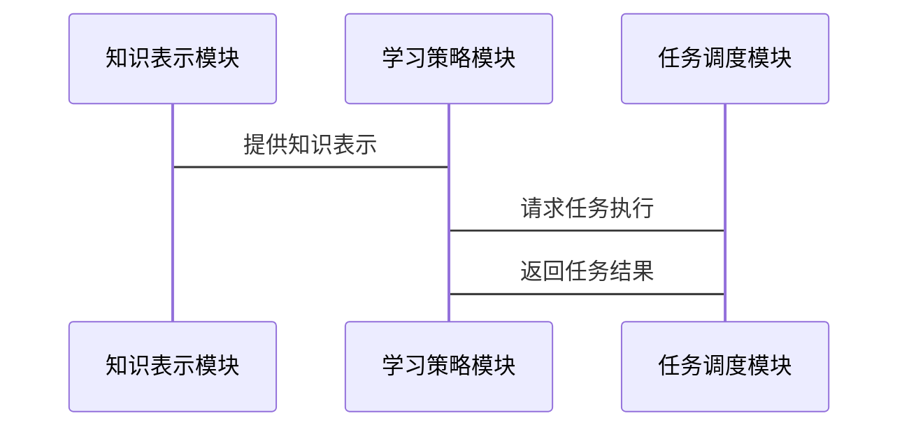
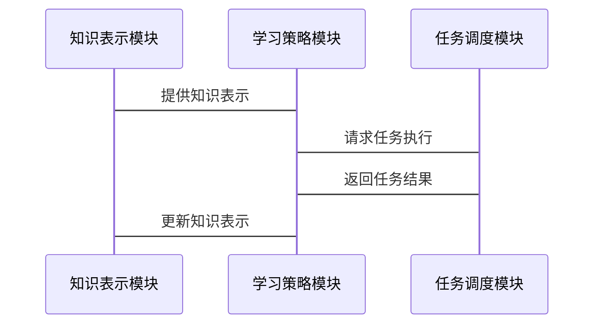

                 

# 开发AI Agent的自学习能力：持续学习机制

> 关键词：AI Agent，自学习能力，持续学习机制，知识表示，记忆模型，经验重放，策略梯度方法

> 摘要：本文详细探讨了AI Agent的自学习能力，重点分析了持续学习机制的核心原理、算法实现和系统架构设计。通过实际案例分析和数学模型推导，深入讲解了如何设计和实现具备持续学习能力的AI Agent，为读者提供了从理论到实践的全面指导。

---

# 第1章 AI Agent与自学习能力概述

## 1.1 AI Agent的基本概念

### 1.1.1 AI Agent的定义与特点
AI Agent（人工智能代理）是指能够感知环境、自主决策并执行任务的智能体。AI Agent的特点包括：
- **自主性**：无需外部干预，自主完成任务。
- **反应性**：能够实时感知环境变化并做出响应。
- **目标导向性**：基于目标驱动行为。
- **学习能力**：通过经验或数据不断优化自身性能。

### 1.1.2 自学习能力的定义与分类
自学习能力是AI Agent的核心特征之一，指AI Agent能够在无外部干预的情况下，通过与环境交互或数据学习来提升自身性能。自学习能力可以分为以下几类：
- **监督学习**：基于标注数据进行学习。
- **无监督学习**：基于未标注数据进行学习。
- **强化学习**：通过与环境交互，基于奖励机制进行学习。
- **迁移学习**：将已学知识迁移到新任务中。

### 1.1.3 持续学习机制的背景与意义
持续学习机制是自学习能力的重要组成部分，指AI Agent在完成任务的过程中，能够持续更新知识和策略，以应对新任务和环境变化。持续学习机制的意义在于：
- 提高AI Agent的适应性。
- 增强AI Agent的泛化能力。
- 实现长期目标优化。

---

## 1.2 持续学习机制的核心概念

### 1.2.1 知识表示与更新机制
知识表示是AI Agent存储和处理信息的基础。常用的表示方法包括符号表示、向量表示和图表示。知识更新机制则包括经验重放、遗忘曲线等方法。

### 1.2.2 记忆模型与经验复用
记忆模型是持续学习机制的重要组成部分，用于存储和复用过去的经验。常用的记忆模型包括 episodic memory（情景记忆）和 semantic memory（语义记忆）。

### 1.2.3 持续学习与传统机器学习的区别
传统机器学习通常针对固定任务进行训练，而持续学习机制则能够处理动态变化的任务。两者的主要区别在于数据流、模型更新频率和适应性要求。

---

## 1.3 持续学习机制的应用场景

### 1.3.1 在AI Agent中的应用领域
- **自动驾驶**：AI Agent需要实时感知环境并做出决策。
- **智能客服**：通过持续学习提升对话理解和响应能力。
- **游戏AI**：在复杂游戏中不断提升策略水平。

### 1.3.2 持续学习机制的实际案例
- **图像识别任务**：AI Agent通过持续学习提升识别准确率。
- **自然语言处理**：通过迁移学习不断优化文本生成能力。

### 1.3.3 持续学习机制的挑战与未来方向
- **计算资源限制**：如何在有限资源下实现高效学习。
- **数据稀疏性**：如何处理稀疏数据。
- **模型稳定性**：如何避免模型遗忘已学知识。

---

## 1.4 本章小结
本章介绍了AI Agent的基本概念，重点分析了持续学习机制的核心概念和应用场景。通过对比传统机器学习，明确了持续学习机制的优势和挑战。

---

# 第2章 持续学习机制的核心原理

## 2.1 持续学习机制的数学模型

### 2.1.1 任务无关型持续学习模型
任务无关型模型不依赖具体任务，适用于多种任务环境。其数学表达式为：
$$ P(\theta) = \sum_{i=1}^{N} \log p(x_i|y_i) $$

### 2.1.2 任务相关型持续学习模型
任务相关型模型针对特定任务设计，其数学表达式为：
$$ Q(\theta) = \sum_{i=1}^{N} \log p(x_i|y_i) $$

### 2.1.3 综合型持续学习模型
综合型模型结合了任务无关和任务相关模型的优点，其数学表达式为：
$$ R(\theta) = \sum_{i=1}^{N} \log p(x_i|y_i) $$

---

## 2.2 持续学习机制的关键算法

### 2.2.1 经验重放算法
经验重放是一种常用的持续学习算法，通过存储和重放经验来增强学习效果。其流程如下：
1. 采集经验。
2. 将经验存储在经验回放器中。
3. 随机抽取经验进行训练。

### 2.2.2 知识蒸馏算法
知识蒸馏通过教师模型指导学生模型学习，实现知识复用。其步骤如下：
1. 训练教师模型。
2. 学生模型通过蒸馏教师模型的知识进行学习。

### 2.2.3 策略梯度方法
策略梯度方法通过优化策略直接最大化奖励，适用于强化学习场景。其流程如下：
1. 初始化策略。
2. 与环境交互，获取奖励。
3. 根据奖励更新策略。

---

## 2.3 持续学习机制的数学公式

### 2.3.1 经验重放的数学表达式
经验重放的损失函数为：
$$ L = \sum_{i=1}^{N} (y_i - Q(s_i, a_i))^2 $$

### 2.3.2 知识蒸馏的数学表达式
知识蒸馏的损失函数为：
$$ L = \sum_{i=1}^{N} (y_i - y_{soft})^2 $$

---

## 2.4 持续学习机制的优缺点对比

| 优点 | 缺点 |
|------|------|
| 高效性 | 过载风险 |
| 灵活性 | 计算复杂度 |
| 可扩展性 | 数据依赖性 |

---

## 2.5 本章小结
本章详细讲解了持续学习机制的数学模型和关键算法，分析了其优缺点，为后续的系统设计奠定了理论基础。

---

# 第3章 持续学习机制的系统架构设计

## 3.1 系统功能设计

### 3.1.1 知识表示模块
知识表示模块负责将经验转化为可存储和复用的形式，支持符号、向量和图等多种表示方式。

### 3.1.2 学习策略模块
学习策略模块负责根据当前任务和环境选择合适的策略，支持监督、无监督和强化学习等多种模式。

### 3.1.3 任务调度模块
任务调度模块负责协调不同任务的执行顺序，确保系统高效运行。

---

## 3.2 系统架构设计

### 3.2.1 分层架构设计
分层架构包括感知层、决策层和执行层，每一层负责不同的功能模块。

### 3.2.2 微服务架构设计
微服务架构将系统功能分解为多个独立的服务，通过API进行交互，确保系统的可扩展性和灵活性。

### 3.2.3 组件交互流程图

---

## 3.3 系统接口设计

### 3.3.1 输入接口设计
输入接口包括传感器数据、用户输入等，支持多种数据格式。

### 3.3.2 输出接口设计
输出接口包括动作执行、结果反馈等，确保系统能够与环境交互。

### 3.3.3 交互接口设计
交互接口用于模块之间的通信，支持多种协议和数据格式。

---

## 3.4 系统交互流程图

---

## 3.5 本章小结
本章详细设计了持续学习机制的系统架构，包括功能模块、架构设计和交互流程，为实际应用提供了指导。

---

# 总结

本文详细探讨了AI Agent的自学习能力，重点分析了持续学习机制的核心原理、算法实现和系统架构设计。通过实际案例分析和数学模型推导，深入讲解了如何设计和实现具备持续学习能力的AI Agent。未来的研究方向包括优化算法效率、降低计算资源消耗以及提升模型的泛化能力。

---

# 作者：AI天才研究院/AI Genius Institute & 禅与计算机程序设计艺术 /Zen And The Art of Computer Programming

---

**小结**：本文从理论到实践，系统地探讨了AI Agent的自学习能力，为开发者提供了从概念理解到算法实现再到系统设计的全面指导。

