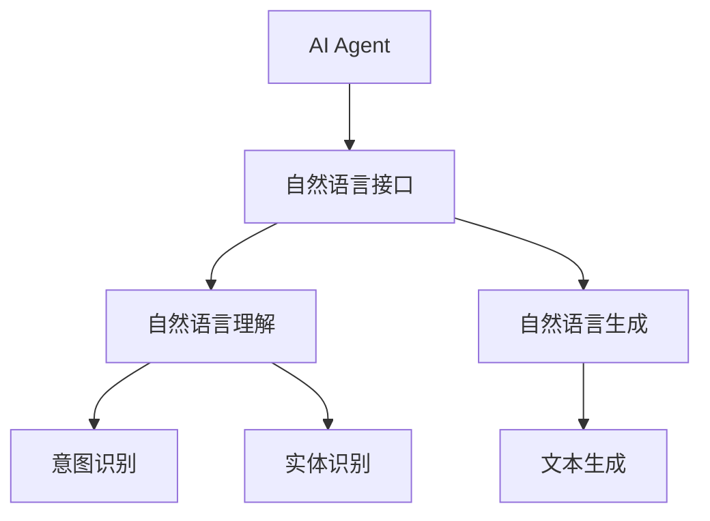
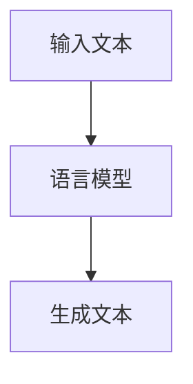
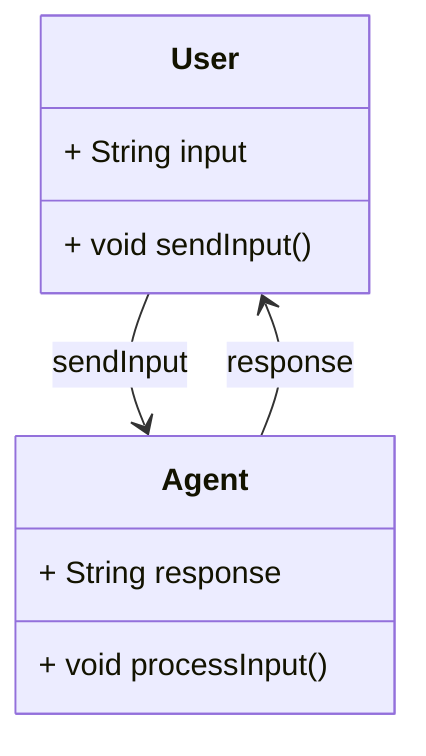
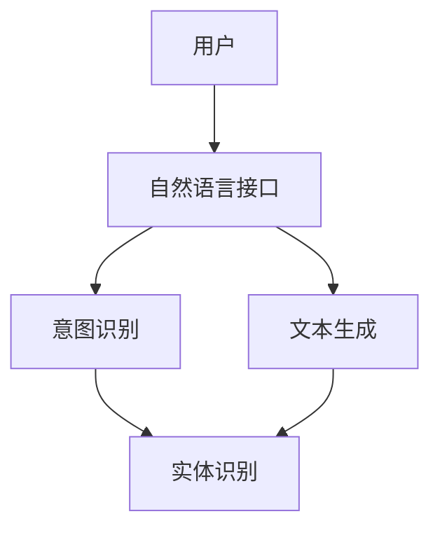

                 


# 开发AI Agent的自然语言接口设计

## 关键词：自然语言处理, AI Agent, 对话系统, 系统架构设计, 交互设计

## 摘要：  
随着人工智能技术的快速发展，AI Agent（智能体）在各个领域的应用越来越广泛。然而，AI Agent的核心能力——自然语言处理（NLP）接口设计，仍然是当前技术挑战的核心之一。本文将系统地探讨AI Agent自然语言接口的设计方法，从背景分析到算法原理，从系统架构设计到项目实战，全面解析如何构建高效、智能的自然语言处理系统。通过本文的讲解，读者将能够深入了解AI Agent自然语言接口的设计要点，并掌握实际开发中的关键技巧。

---

## 第一部分: AI Agent的自然语言接口开发背景

### 第1章: 问题背景与问题描述

#### 1.1 问题背景
##### 1.1.1 当前AI Agent的发展现状
AI Agent（人工智能代理）是一种能够感知环境、自主决策并执行任务的智能系统。随着深度学习和自然语言处理技术的成熟，AI Agent已经在多个领域得到了广泛应用，例如智能客服、智能家居、自动驾驶等。然而，AI Agent的核心能力——自然语言处理接口的设计，仍然是技术挑战的核心之一。

##### 1.1.2 自然语言处理在AI Agent中的重要性
自然语言处理（NLP）是AI Agent与用户交互的核心技术。通过NLP，AI Agent能够理解用户的意图、生成自然的回复，并实现与用户的高效互动。一个优秀的自然语言处理接口能够显著提升用户体验，降低用户使用门槛。

##### 1.1.3 当前存在的问题与挑战
尽管NLP技术取得了显著进展，但在AI Agent中的应用仍然面临诸多挑战。例如：
- **意图识别**：如何准确理解用户的意图，尤其是在复杂场景下。
- **上下文理解**：如何处理多轮对话中的上下文信息。
- **语言生成**：如何生成自然流畅且符合用户需求的语言。
- **多语言支持**：如何在多语言环境下实现高效的自然语言处理。

#### 1.2 问题描述
##### 1.2.1 AI Agent自然语言接口的核心问题
AI Agent的自然语言接口设计需要解决以下核心问题：
- 如何将用户的自然语言输入转化为系统可理解的结构化数据。
- 如何根据上下文信息生成连贯、合理的回复。
- 如何处理用户的意图偏差和歧义。

##### 1.2.2 用户需求与系统功能的矛盾
用户期望AI Agent能够像人类一样自然地理解和回应语言输入，但系统功能的限制（例如计算能力、数据量等）往往难以完全满足用户的期望。

##### 1.2.3 现有解决方案的优缺点分析
现有的自然语言处理技术（如基于规则的方法、统计方法和深度学习方法）各有优缺点。例如：
- 基于规则的方法简单易懂，但难以应对复杂场景。
- 统计方法依赖大量数据，且难以解释。
- 深度学习方法表现优异，但计算资源消耗较大。

#### 1.3 问题解决思路
##### 1.3.1 自然语言理解的关键技术
自然语言理解（NLU）是AI Agent自然语言接口的核心技术之一。常见的NLU技术包括：
- 词袋模型（Bag-of-Words）。
- 词嵌入（Word Embedding）。
- 意图识别（Intent Recognition）。
- 实体识别（Entity Recognition）。

##### 1.3.2 对话系统设计的要点
对话系统设计需要关注以下要点：
- 对话流管理。
- 上下文记忆。
- 多轮对话中的状态跟踪。

##### 1.3.3 AI Agent交互流程的优化
通过优化交互流程，可以显著提升用户体验。例如：
- 简化用户输入，降低用户使用门槛。
- 提供多模态交互方式（如语音和文本结合）。

#### 1.4 边界与外延
##### 1.4.1 AI Agent的定义与范围
AI Agent是一种能够感知环境、自主决策并执行任务的智能系统。其范围包括感知、决策、执行和交互四个环节。

##### 1.4.2 自然语言接口的边界条件
自然语言接口的边界条件包括：
- 输入格式：支持的自然语言形式（如文本、语音）。
- 输出格式：生成的自然语言形式。
- 支持的语言：单语言或多语言支持。

##### 1.4.3 相关领域的关联与区别
- **自然语言处理（NLP）**：研究如何让计算机理解、生成和处理人类语言。
- **对话系统**：研究如何构建能够与人类进行有效对话的系统。
- **AI Agent**：研究如何构建能够自主决策的智能体。

---

## 第二部分: 核心概念与联系

### 第2章: 核心概念原理

#### 2.1 AI Agent的基本原理
##### 2.1.1 AI Agent的定义与分类
AI Agent可以分为两类：
- **反应式AI Agent**：基于当前感知做出实时反应。
- **认知式AI Agent**：具有复杂推理和规划能力。

##### 2.1.2 自然语言处理的核心原理
自然语言处理的核心原理包括：
- 语言模型：用于生成自然语言。
- 解析模型：用于理解自然语言。

#### 2.2 核心概念对比
##### 2.2.1 核心概念属性特征对比
| 属性 | AI Agent | 自然语言接口 |
|------|----------|--------------|
| 输入 | 结构化数据或自然语言 | 自然语言 |
| 输出 | 结构化数据或自然语言 | 自然语言 |
| 功能 | 执行任务 | 与用户交互 |

##### 2.2.2 核心概念的结构与关系


---

## 第三部分: 算法原理讲解

### 第3章: 核心算法原理

#### 3.1 概率生成模型
##### 3.1.1 概率生成模型的定义
概率生成模型是一种基于概率分布的生成模型。例如，语言模型可以表示为：
$$ P(y|x) $$
其中，$y$是生成的文本，$x$是输入文本。

##### 3.1.2 概率生成模型的工作流程


##### 3.1.3 概率生成模型的实现代码
```python
import numpy as np

def generate_text(input_text):
    # 假设语言模型已训练好
    model = LanguageModel()
    return model.generate(input_text)
```

#### 3.2 解析模型
##### 3.2.1 解析模型的定义
解析模型是一种基于规则或统计模型的解析方法。例如，基于规则的解析模型可以表示为：
$$ parse(sentence) \rightarrow structure $$

##### 3.2.2 解析模型的实现代码
```python
def parse_sentence(sentence):
    # 假设解析模型已训练好
    parser = Parser()
    return parser.parse(sentence)
```

---

## 第四部分: 系统分析与架构设计方案

### 第4章: 系统分析与架构设计

#### 4.1 问题场景介绍
##### 4.1.1 系统功能需求
AI Agent的自然语言接口需要支持以下功能：
- 用户输入解析。
- 意图识别。
- 多轮对话管理。

##### 4.1.2 系统性能要求
- 响应时间：小于2秒。
- 支持的语言：至少支持中文和英文。

#### 4.2 系统功能设计
##### 4.2.1 领域模型类图


##### 4.2.2 系统架构图


#### 4.3 系统接口设计
##### 4.3.1 API接口定义
```http
POST /api/agent
Content-Type: application/json

{
    "input": "你好，我需要帮助..."
}
```

##### 4.3.2 API返回示例
```json
{
    "status": "success",
    "response": "你好！我能为您做些什么？"
}
```

---

## 第五部分: 项目实战

### 第5章: 项目实战

#### 5.1 项目介绍
##### 5.1.1 项目背景
开发一个智能客服AI Agent的自然语言接口。

#### 5.2 系统核心实现
##### 5.2.1 环境安装
```bash
pip install numpy
pip install tensorflow
pip install transformers
```

##### 5.2.2 核心代码实现
```python
from transformers import pipeline

# 初始化自然语言处理 pipeline
nlp = pipeline("text-classification", model="bert-base")

def process_input(input_text):
    # 解析输入文本
    result = nlp(input_text)
    # 生成回复
    response = "您好！我是智能客服。请问您需要帮助什么？"
    return response
```

#### 5.3 代码应用解读与分析
##### 5.3.1 代码功能分析
上述代码使用了BERT模型进行意图识别，并生成标准回复。

#### 5.4 案例分析与详细讲解
##### 5.4.1 案例场景
用户输入：“我的订单在哪里？”
系统回复：“您好！请问您的订单号是多少？”

##### 5.4.2 代码实现分析
- 解析输入文本：使用BERT模型进行意图识别。
- 生成回复：根据解析结果生成标准回复。

#### 5.5 项目小结
通过本项目，我们实现了AI Agent的自然语言接口，并验证了其在智能客服中的应用。

---

## 第六部分: 最佳实践

### 第6章: 最佳实践

#### 6.1 开发中的注意事项
##### 6.1.1 数据质量的重要性
- 数据清洗：确保数据的干净和一致性。
- 数据标注：提供高质量的标注数据。

##### 6.1.2 模型优化技巧
- 超参数调优：通过网格搜索优化模型性能。
- 模型融合：结合多种模型提升性能。

#### 6.2 小结
通过本文的讲解，我们系统地探讨了AI Agent自然语言接口的设计方法，并通过实际案例展示了其开发过程。

#### 6.3 注意事项
- 在实际项目中，需根据具体需求选择合适的算法和模型。
- 注意模型的可解释性和用户体验。

#### 6.4 拓展阅读
- 《自然语言处理入门》
- 《深度学习入门》

---

## 作者：AI天才研究院/AI Genius Institute & 禅与计算机程序设计艺术/Zen And The Art of Computer Programming

---

通过本文的详细讲解，读者可以全面理解AI Agent自然语言接口的设计方法，并掌握实际开发中的关键技巧。

