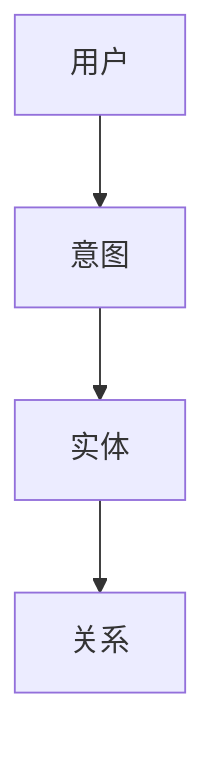
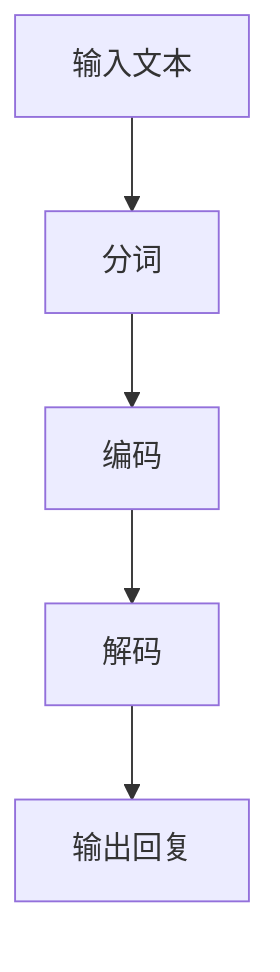
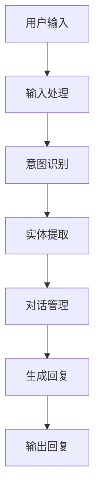

                 


# 开发AI Agent的自然语言接口设计原则

## 关键词：AI Agent，自然语言接口，NLP，对话管理，系统架构

## 摘要：  
本文详细探讨了开发AI Agent的自然语言接口设计原则，从核心概念到算法原理，再到系统架构，结合实际案例，为开发者提供全面的指导。

---

## 第一部分：AI Agent与自然语言接口概述

### 第1章：AI Agent的基本概念

#### 1.1 AI Agent的定义与特点
AI Agent是一种智能体，具备自主性、反应性、目标导向性和社会性。它能够感知环境并采取行动以实现目标。

#### 1.2 自然语言接口的定义与作用
自然语言接口是用户与AI Agent交互的媒介，使用户能够通过自然语言与AI Agent进行对话，提升用户体验。

#### 1.3 AI Agent与自然语言接口的关系
自然语言接口是AI Agent与用户交互的核心部分，直接影响用户体验和系统的可用性。

### 第2章：AI Agent自然语言接口设计的核心问题

#### 2.1 问题背景与描述
当前AI Agent接口设计的痛点在于用户体验差，自然语言处理技术尚未成熟，导致交互效率低下。

#### 2.2 核心概念与边界
明确AI Agent与自然语言接口的边界，确保设计的模块化和可扩展性。

#### 2.3 问题解决思路与方法
采用模块化设计，结合先进的NLP技术，优化对话管理和意图识别。

---

## 第二部分：自然语言接口设计的核心概念与联系

### 第3章：核心概念原理

#### 3.1 自然语言理解（NLU）的原理
NLU通过词法分析、句法分析和语义分析，将用户输入转换为系统可理解的结构化数据。

#### 3.2 自然语言生成（NLG）的原理
NLG根据系统生成的结构化数据，生成符合语法和语义的自然语言文本。

#### 3.3 对话管理的原理
对话管理负责维护对话状态，理解用户意图，并生成适当的系统回复。

### 第3.2 核心概念对比表
| 概念       | 描述                                                                 |
|------------|----------------------------------------------------------------------|
| NLU        | 解释用户输入，提取意图和实体                                         |
| NLG        | 根据意图生成回复                                                     |
| 对话管理    | 维护对话状态，确保对话流畅                                           |

### 第3.3 ER实体关系图


---

## 第三部分：自然语言接口设计的算法原理

### 第4章：算法原理概述

#### 4.1 基于规则的NLP算法
通过预定义规则进行词法分析和句法分析，适用于简单场景。

#### 4.2 统计学习的NLP算法
利用统计模型（如马尔可夫链）进行语义分析，提升准确性。

#### 4.3 深度学习的NLP算法
采用神经网络模型（如LSTM）进行语义理解，适用于复杂场景。

### 第4.2 算法实现流程

#### 4.2.1 数据预处理代码
```python
def preprocess(text):
    # 分词处理
    tokens = text.split()
    return tokens
```

#### 4.2.2 模型训练代码
```python
import tensorflow as tf
model = tf.keras.Sequential([
    tf.keras.layers.Embedding(input_dim=1000, output_dim=32),
    tf.keras.layers.LSTM(64),
    tf.keras.layers.Dense(1, activation='sigmoid')
])
model.compile(optimizer='adam', loss='binary_crossentropy', metrics=['accuracy'])
```

#### 4.2.3 接口生成代码
```python
def generate_response(text):
    # 调用NLP模型生成回复
    response = nlp_model.generate(text)
    return response
```

### 第4.4 算法流程图


---

## 第四部分：自然语言接口设计的系统架构

### 第5章：系统架构概述

#### 5.1 系统功能模块划分
- NLU模块：负责解析用户输入
- NLG模块：生成系统回复
- 对话管理模块：维护对话状态

#### 5.2 系统架构设计原则
模块化设计，确保各模块独立且易于扩展。

#### 5.3 系统架构图


---

## 第五部分：项目实战

### 第6章：项目实战

#### 6.1 环境安装
安装必要的Python库，如TensorFlow、NLTK等。

#### 6.2 核心代码实现
实现NLU、NLG和对话管理模块。

#### 6.3 案例分析
通过实际案例分析，展示系统设计的优缺点及改进方法。

---

## 第六部分：最佳实践与总结

### 第7章：最佳实践

#### 7.1 设计原则
模块化设计，确保各模块独立且易于扩展。

#### 7.2 小结
自然语言接口设计是AI Agent开发中的关键部分，需综合运用NLP技术，优化用户体验。

#### 7.3 注意事项
注意数据质量和模型训练，确保系统的准确性和流畅性。

#### 7.4 拓展阅读
推荐相关书籍和论文，进一步深入学习。

---

## 作者：AI天才研究院 & 禅与计算机程序设计艺术

这篇文章详细探讨了AI Agent的自然语言接口设计原则，从背景到系统架构，结合实际案例，为开发者提供了全面的指导。

