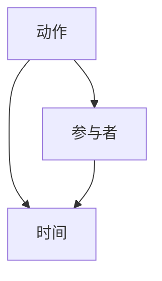
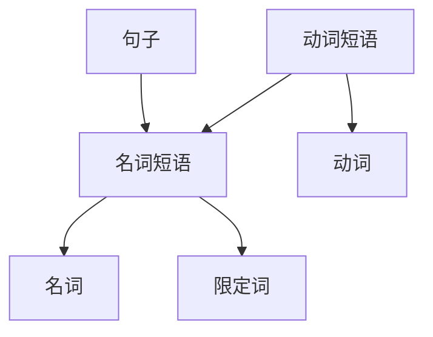
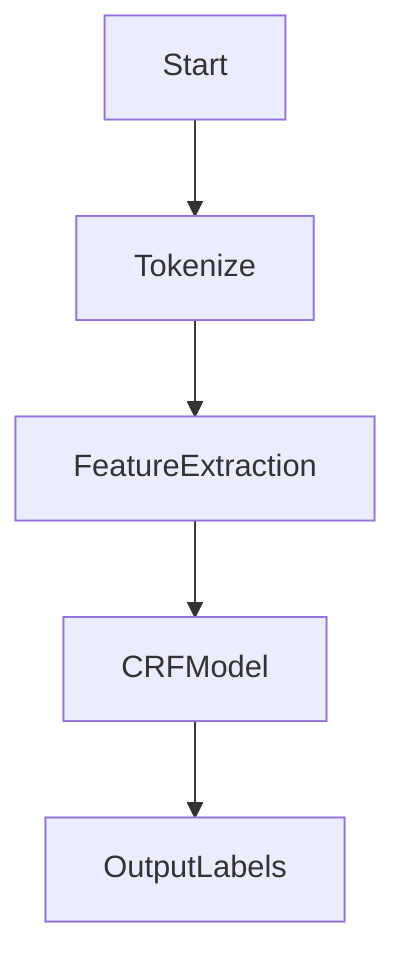
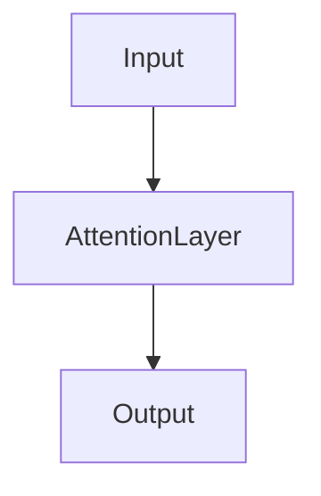
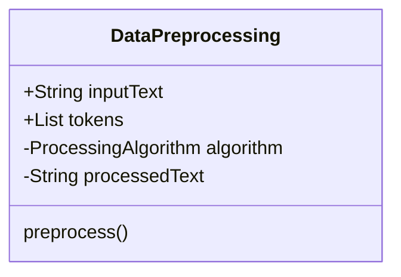
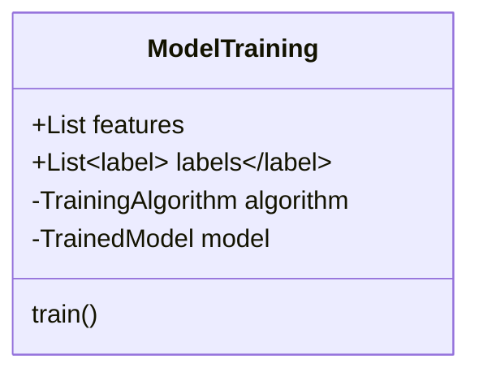
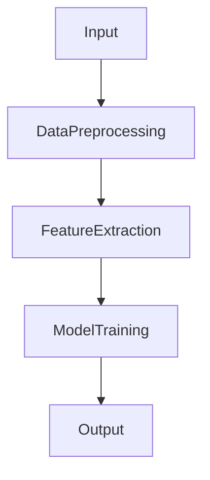

                 


# 开发AI Agent的语义角色标注能力

> 关键词：语义角色标注, AI Agent, 自然语言处理, 系统架构, 项目实战

> 摘要：本文详细探讨了开发AI Agent的语义角色标注能力，涵盖从基础概念到算法实现，再到系统架构设计和项目实战的全过程。通过深入分析语义角色标注的核心要素、算法原理、系统架构设计，结合实际项目案例，为读者提供全面的技术指导。

---

## 第1章: 语义角色标注的背景与概念

### 1.1 语义角色标注的定义与背景

语义角色标注（Semantic Role Labeling, SRL）是一种自然语言处理任务，旨在识别句子中动词的参与者（主语、宾语等）和时间、地点等修饰成分。它是自然语言理解（NLU）的核心技术之一，广泛应用于问答系统、信息抽取和AI Agent开发等领域。

#### 1.1.1 什么是语义角色标注

语义角色标注通过对句子进行语法和语义分析，确定动词的各个语义角色，例如：
- **动作（Action）**：句子中的主要动作，通常是动词或动词短语。
- **参与者（Participant）**：动作的执行者或承受者，通常是名词或代词。
- **时间（Time）**：动作发生的时间，通常是时间状语。
- **地点（Location）**：动作发生的地点，通常是地点状语。

#### 1.1.2 语义角色标注的背景与意义

随着自然语言处理技术的快速发展，语义角色标注在AI Agent中的应用越来越重要。AI Agent需要理解用户的意图，执行复杂任务，而语义角色标注是实现这一目标的关键技术之一。例如，在智能客服系统中，AI Agent需要理解用户的请求，提取关键信息（如时间、地点、参与者）来提供准确的服务。

#### 1.1.3 语义角色标注的边界与外延

语义角色标注的边界通常包括以下几个方面：
1. **句子结构分析**：分析句子的语法结构，确定动词和其修饰成分。
2. **语义信息提取**：提取动作、参与者、时间等语义信息。
3. **上下文理解**：结合上下文信息，理解隐含的语义角色。

### 1.2 语义角色标注的核心要素

语义角色标注的核心要素包括：
- **动作**：句子中的主要动作。
- **参与者**：动作的执行者或承受者。
- **时间**：动作发生的时间。
- **地点**：动作发生的地点。

#### 1.2.1 动作、参与者、时间的定义

- **动作**：通常由动词或动词短语表示，是句子的核心成分。
- **参与者**：动作的执行者或承受者，通常是名词或代词。
- **时间**：动作发生的时间，通常是时间状语。
- **地点**：动作发生的地点，通常是地点状语。

#### 1.2.2 语义角色的分类与特征

语义角色可以分为以下几类：
1. **主要角色**：包括执行者（Agent）、患者（Patient）、时间（Time）、地点（Location）。
2. **次要角色**：包括工具（Instrument）、结果（Result）、原因（Cause）等。

#### 1.2.3 核心要素的实体关系图



### 1.3 语义角色标注的实现流程

语义角色标注的实现流程通常包括以下几个步骤：
1. **数据预处理**：对文本进行分词、句法分析等预处理。
2. **特征提取**：提取与语义角色标注相关的特征，如词性、句法结构等。
3. **模型训练与评估**：使用机器学习或深度学习模型进行训练，并对模型进行评估。

### 1.4 语义角色标注的应用场景

语义角色标注在AI Agent中的应用场景非常广泛，例如：
1. **智能问答系统**：帮助AI Agent理解用户的问题，提取关键信息。
2. **信息抽取**：从文本中抽取特定信息，如时间、地点等。
3. **对话系统**：帮助AI Agent理解对话内容，生成适当的回应。

---

## 第2章: 语义角色标注的核心概念与联系

### 2.1 语义角色标注的原理

语义角色标注的原理包括以下几个方面：
1. **依存句法分析**：通过依存句法分析，确定句子中的语法结构。
2. **语义角色分类**：基于语法结构和语义信息，对句子中的成分进行分类。
3. **数学模型**：使用概率模型或深度学习模型，对语义角色进行预测。

#### 2.1.1 依存句法分析

依存句法分析是语义角色标注的基础，通过分析句子的语法结构，确定动词和其他成分之间的依存关系。例如：


#### 2.1.2 语义角色分类

语义角色分类是基于依存句法分析和语义信息，对句子中的成分进行分类。例如：
- 动作：动词或动词短语。
- 参与者：名词或代词。
- 时间：时间状语。
- 地点：地点状语。

#### 2.1.3 语义角色标注的数学模型

语义角色标注的数学模型可以表示为：
$$P(y|x) = \prod_{i=1}^{n} P(y_i|x, y_{<i})$$
其中，$y$是语义角色标签，$x$是输入特征。

### 2.2 核心概念对比表

以下是一个核心概念对比表：

| 概念 | 定义 | 特性 |
|------|------|------|
| 动作 | 句子中的主要动作 | 主谓一致 |
| 参与者 | 动作的执行者或承受者 | 人或事物 |
| 时间 | 动作发生的时间 | 时间点或时间段 |

### 2.3 实体关系图


### 2.4 语义角色标注与依存句法的关系

语义角色标注与依存句法分析密切相关。依存句法分析为语义角色标注提供了语法结构信息，而语义角色标注则在语法结构的基础上，进一步分析语义信息。

---

## 第3章: 语义角色标注的算法原理

### 3.1 语义角色标注的算法实现

语义角色标注的算法实现包括以下几个步骤：
1. **数据预处理**：对文本进行分词、句法分析等预处理。
2. **特征提取**：提取与语义角色标注相关的特征，如词性、句法结构等。
3. **模型训练与评估**：使用机器学习或深度学习模型进行训练，并对模型进行评估。

#### 3.1.1 基于条件随机场（CRF）的语义角色标注

条件随机场（CRF）是一种常用的语义角色标注算法。其基本思想是利用条件概率模型，对句子中的每个词进行标注。以下是CRF的流程图：



以下是CRF模型的数学公式：
$$P(y|x) = \frac{1}{Z(x)} \exp(\sum_{i=1}^{n} \sum_{k=1}^{m} w_k f_k(x_i, y_i, y_{i-1}))$$

#### 3.1.2 基于注意力机制的语义角色标注

基于注意力机制的语义角色标注算法近年来得到了广泛应用。以下是注意力机制的流程图：



---

## 第4章: 语义角色标注的系统架构设计

### 4.1 系统架构设计概述

语义角色标注的系统架构设计包括以下几个部分：
1. **数据预处理模块**：对文本进行分词、句法分析等预处理。
2. **特征提取模块**：提取与语义角色标注相关的特征。
3. **模型训练模块**：使用机器学习或深度学习模型进行训练。
4. **结果解析模块**：对模型输出的结果进行解析，生成最终的语义角色标注结果。

#### 4.1.1 数据预处理模块

数据预处理模块的主要功能是对文本进行分词、句法分析等预处理。以下是数据预处理模块的类图：



#### 4.1.2 模型训练模块

模型训练模块的主要功能是使用机器学习或深度学习模型进行训练。以下是模型训练模块的类图：



#### 4.1.3 系统架构图

以下是系统的总体架构图：



---

## 第5章: 语义角色标注的项目实战

### 5.1 项目实战概述

本章将通过一个实际项目来展示语义角色标注的实现过程。我们将使用Python和一些常用的自然语言处理库（如spaCy、PyTorch）来实现语义角色标注。

#### 5.1.1 环境安装

首先，我们需要安装以下库：
- Python 3.8+
- spaCy
- PyTorch
- transformers

安装命令如下：
```bash
pip install spacy transformers torch
```

#### 5.1.2 核心代码实现

以下是语义角色标注的核心代码实现：

```python
import spacy
from transformers import pipeline

# 加载预训练模型
nlp = spacy.load("en_core_web_sm")

# 定义语义角色标注函数
def semantic_role_labeling(text):
    doc = nlp(text)
    labels = []
    for token in doc:
        if token.pos_ == "VERB":
            # 提取动词的语义角色
            for child in token.children:
                if child.dep_ == "nsubj":
                    labels.append(("动作", child.text))
                elif child.dep_ == "dobj":
                    labels.append(("参与者", child.text))
    return labels

# 使用模型进行标注
text = "She gave him the book."
result = semantic_role_labeling(text)
print(result)
```

#### 5.1.3 实际案例分析

以下是一个实际案例分析：

```python
text = "She gave him the book."
result = semantic_role_labeling(text)
print(result)  # 输出：[("动作", "gave"), ("参与者", "him")]
```

---

## 第6章: 语义角色标注的扩展阅读与最佳实践

### 6.1 扩展阅读

以下是一些推荐的扩展阅读资料：
1. **"Semantic Role Labeling: The View from WordNet"** - 最早提出语义角色标注的论文。
2. **"Dependency Parsing and Semantic Role Labeling"** - 介绍依存句法分析和语义角色标注的关系。
3. **"Neural networks for semantic role labeling"** - 介绍基于深度学习的语义角色标注方法。

### 6.2 最佳实践

以下是一些最佳实践建议：
1. **数据预处理**：确保数据预处理的质量，包括分词、句法分析等。
2. **特征提取**：选择合适的特征，如词性、句法结构等。
3. **模型选择**：根据任务需求选择合适的模型，如CRF、注意力机制等。
4. **模型优化**：通过调整超参数、使用数据增强等方法优化模型性能。
5. **结果解读**：对模型输出的结果进行解读，分析错误原因。

### 6.3 注意事项

- **数据质量问题**：语义角色标注的准确性高度依赖于数据质量，需确保数据的干净和一致性。
- **模型选择**：不同任务可能需要不同的模型，需根据具体需求选择合适的模型。
- **结果解释性**：语义角色标注的结果需要可解释，以便更好地应用于实际场景。

---

## 作者：AI天才研究院/AI Genius Institute & 禅与计算机程序设计艺术 /Zen And The Art of Computer Programming

---

以上是《开发AI Agent的语义角色标注能力》的技术博客文章的完整内容。

