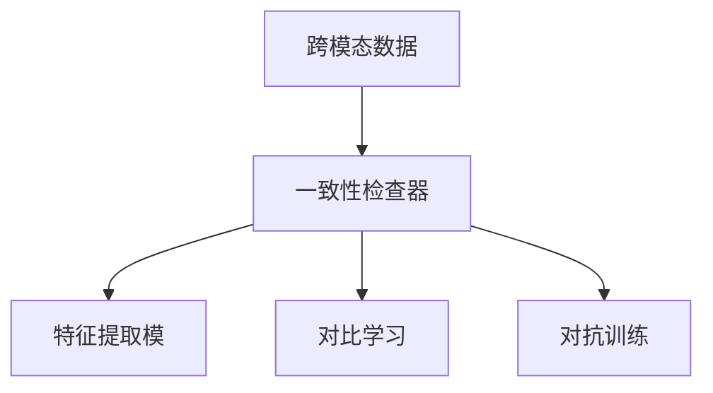
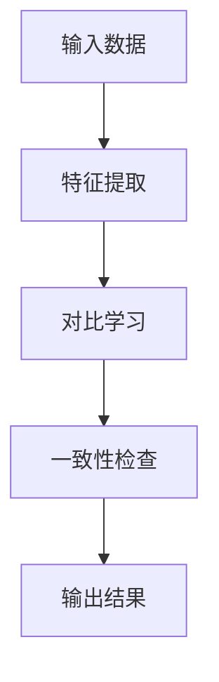
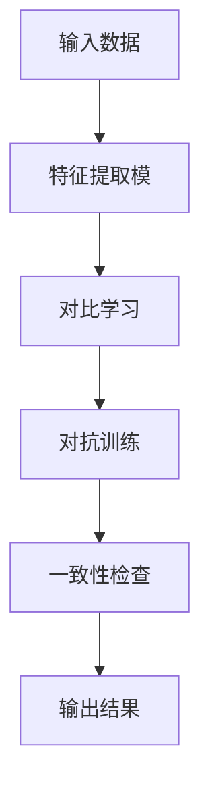
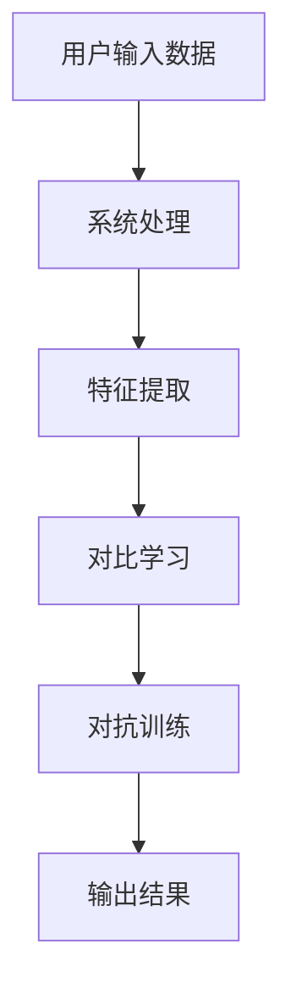

                 


# 开发AI Agent的跨模态内容一致性检查器

## 关键词：AI Agent，跨模态数据，内容一致性，检查器，算法，系统架构

## 摘要：本文详细探讨了开发AI Agent的跨模态内容一致性检查器的各个方面，包括背景、核心概念、算法原理、系统架构、项目实战以及最佳实践。通过对比学习和生成对抗网络等算法，结合系统架构设计，为AI Agent提供高效的内容一致性检查方案。

---

# 第1章: AI Agent与跨模态内容一致性检查器的背景介绍

## 1.1 AI Agent的基本概念

### 1.1.1 AI Agent的定义与分类
AI Agent（人工智能代理）是指能够感知环境、自主决策并执行任务的智能实体。根据智能水平，AI Agent可分为简单反射型、基于模型的反应型、基于效用的推理型和完全自主型。

### 1.1.2 跨模态数据的定义与特点
跨模态数据指来自不同模态（如文本、图像、语音）的数据。其特点包括多维度性、异构性和关联性。

### 1.1.3 内容一致性检查的必要性
AI Agent在处理跨模态数据时，需要确保不同模态的数据一致，以提高决策的准确性。

## 1.2 跨模态内容一致性检查的背景

### 1.2.1 跨模态数据的应用场景
跨模态数据广泛应用于图像描述、语音识别等领域。

### 1.2.2 内容一致性问题的挑战
跨模态数据可能来自不同来源，存在不一致问题，影响AI Agent的性能。

### 1.2.3 检查器在AI Agent中的作用
检查器用于识别和纠正跨模态数据中的不一致，提升AI Agent的决策能力。

## 1.3 本书的核心目标与内容框架

### 1.3.1 本书的核心目标
提供跨模态内容一致性检查器的设计与实现方法。

### 1.3.2 内容框架与逻辑结构
涵盖背景介绍、核心概念、算法原理、系统架构、项目实战和总结。

### 1.3.3 预期读者与学习路径
适合AI开发者和研究人员，建议具备机器学习和多模态数据处理基础。

---

# 第2章: 跨模态数据的特性与一致性问题

## 2.1 跨模态数据的特性分析

### 2.1.1 跨模态数据的多维度性
数据来自不同模态，具有多个维度。

### 2.1.2 跨模态数据的异构性
不同模态的数据结构和特征不同。

### 2.1.3 跨模态数据的关联性
不同模态的数据之间存在关联关系。

## 2.2 跨模态数据一致性问题的定义

### 2.2.1 内容一致性的定义
数据在不同模态下表达同一事实时的统一性。

### 2.2.2 不一致性的表现形式
数据在不同模态下的表达存在矛盾或不匹配。

### 2.2.3 不一致性的度量方法
基于相似度、距离或冲突检测的方法。

## 2.3 跨模态一致性问题的边界与外延

### 2.3.1 问题边界
仅关注数据的一致性，不涉及数据的正确性或真实性。

### 2.3.2 问题外延
扩展到多模态数据的对齐和融合问题。

## 2.4 跨模态一致性问题的核心要素

### 2.4.1 数据来源
数据来自不同的模态。

### 2.4.2 数据类型
包括文本、图像、语音等多种类型。

### 2.4.3 数据关联性
数据在语义上的关联关系。

---

# 第3章: 跨模态内容一致性检查器的核心概念与联系

## 3.1 跨模态一致性检查器的原理

### 3.1.1 对比学习
通过对比不同模态的特征，学习一致性。

### 3.1.2 对抗训练
使用生成对抗网络，训练一致的表示。

### 3.1.3 多模态特征对齐
将不同模态的特征对齐，确保一致性。

## 3.2 跨模态一致性检查器的核心要素

### 3.2.1 特征提取模块
从不同模态中提取特征。

### 3.2.2 对比损失函数
衡量不同模态特征的一致性。

### 3.2.3 调节参数
控制对比学习的强度。

## 3.3 跨模态一致性检查器的属性特征对比

### 3.3.1 模块化对比
对比学习模块与其他模块的对比。

### 3.3.2 损失函数对比
对比损失与其他损失函数的对比。

### 3.3.3 调节参数对比
不同参数对一致性的影响对比。

## 3.4 跨模态一致性检查器的ER实体关系图



---

# 第4章: 跨模态内容一致性检查器的算法原理

## 4.1 对比学习算法的原理

### 4.1.1 对比学习的定义
通过比较不同样本的特征差异，学习一致的表示。

### 4.1.2 对比学习的实现
使用对比损失函数，优化特征表示。

### 4.1.3 对比学习的优势
提升特征的区分度和一致性。

## 4.2 生成对抗网络的原理

### 4.2.1 对抗训练的定义
两个网络互相竞争，生成一致的特征。

### 4.2.2 对抗训练的实现
使用生成器和判别器，优化特征表示。

### 4.2.3 对抗训练的优势
增强特征的多样性和一致性。

## 4.3 跨模态内容一致性检查器的算法流程



## 4.4 对比学习的数学模型

### 4.4.1 对比损失函数
$$ L_{\text{contrast}} = -\log\left(\frac{e^{sim(x,y)}}{e^{sim(x,y)} + \sum_{z \neq y} e^{sim(x,z)}}\right) $$

### 4.4.2 对比学习的优势
提升特征的区分度和一致性。

## 4.5 生成对抗网络的数学模型

### 4.5.1 生成器的损失函数
$$ L_{\text{gen}} = \log\left(1 - D(x)\right) $$

### 4.5.2 判别器的损失函数
$$ L_{\text{dis}} = -\log(D(x)) - \log(1 - D(z)) $$

## 4.6 算法的Python实现示例

```python
import torch
import torch.nn as nn

class ContrastiveLoss(nn.Module):
    def __init__(self, temperature=0.1):
        super(ContrastiveLoss, self).__init__()
        self.temperature = temperature

    def forward(self, features):
        # 计算相似度矩阵
        sim_matrix = torch.mm(features, features.t())
        # 计算正向相似度
        positives = torch.diag(sim_matrix)
        # 计算反向相似度
        negatives = torch.sum(sim_matrix) - positives.sum()
        # 计算损失
        loss = -torch.mean(torch.log(positives / (positives + negatives)))
        return loss
```

---

# 第5章: 跨模态内容一致性检查器的系统架构

## 5.1 系统整体架构设计

### 5.1.1 系统功能模块
包括特征提取、对比学习、对抗训练和一致性检查模块。

### 5.1.2 系统架构图


## 5.2 系统功能模块设计

### 5.2.1 特征提取模块
使用预训练模型提取多模态特征。

### 5.2.2 对比学习模块
计算特征的相似度矩阵，优化对比损失函数。

### 5.2.3 对抗训练模块
使用生成器和判别器，进行对抗训练。

## 5.3 系统接口设计

### 5.3.1 输入接口
接收多模态数据，如文本和图像。

### 5.3.2 输出接口
输出一致性检查结果，如一致或不一致。

## 5.4 系统交互流程设计



---

# 第6章: 跨模态内容一致性检查器的项目实战

## 6.1 项目环境安装

### 6.1.1 安装Python和相关库
安装PyTorch和其它必要的库。

### 6.1.2 安装深度学习框架
安装TensorFlow或PyTorch。

## 6.2 系统核心实现源代码

### 6.2.1 特征提取模块
```python
def extract_features(data):
    # 使用预训练模型提取特征
    features = model(data)
    return features
```

### 6.2.2 对比学习模块
```python
def contrastive_loss(features):
    # 计算相似度矩阵
    sim_matrix = torch.mm(features, features.t())
    # 计算正向相似度
    positives = torch.diag(sim_matrix)
    # 计算反向相似度
    negatives = torch.sum(sim_matrix) - positives.sum()
    # 计算损失
    loss = -torch.mean(torch.log(positives / (positives + negatives)))
    return loss
```

### 6.2.3 对抗训练模块
```python
def generator_loss(x):
    # 生成器损失函数
    return -torch.mean(torch.log(1 - x))

def discriminator_loss(x, z):
    # 判别器损失函数
    return -torch.mean(torch.log(x) - torch.log(1 - z))
```

## 6.3 案例分析与详细解读

### 6.3.1 案例场景
图像和文本描述的一致性检查。

### 6.3.2 数据准备
加载图像和对应的文本描述。

### 6.3.3 系统实现
使用特征提取、对比学习和对抗训练模块进行一致性检查。

## 6.4 项目小结

### 6.4.1 项目实现的关键点
确保特征提取和对比学习的有效性。

### 6.4.2 项目实现的难点
处理多模态数据的异构性问题。

### 6.4.3 项目实现的优化点
优化对比学习和对抗训练的参数设置。

---

# 第7章: 跨模态内容一致性检查器的总结与展望

## 7.1 总结

### 7.1.1 核心知识点总结
总结跨模态一致性检查器的核心概念、算法原理和系统架构。

### 7.1.2 实战经验总结
总结项目实战中的经验教训。

### 7.1.3 本书的主要收获
读者通过本书掌握了跨模态一致性检查器的设计与实现方法。

## 7.2 本书的不足之处

### 7.2.1 理论深度
部分理论内容需要更深入的探讨。

### 7.2.2 实战案例
案例数量和多样性可以进一步增加。

## 7.3 未来研究方向

### 7.3.1 算法优化
优化对比学习和对抗训练算法。

### 7.3.2 应用场景拓展
探索跨模态一致性检查器在更多领域的应用。

### 7.3.3 系统性能提升
提升系统的处理效率和准确性。

---

# 作者：AI天才研究院 & 禅与计算机程序设计艺术

---

通过以上结构化的内容，您可以逐步撰写出一篇完整的、详细的《开发AI Agent的跨模态内容一致性检查器》的技术博客文章。

