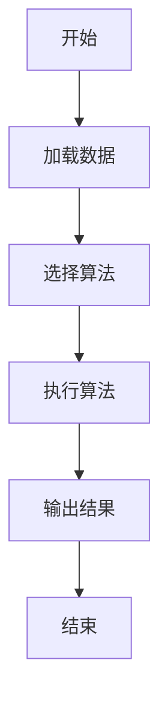
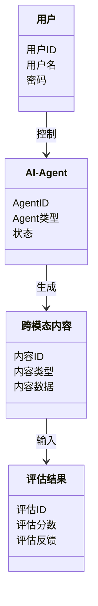
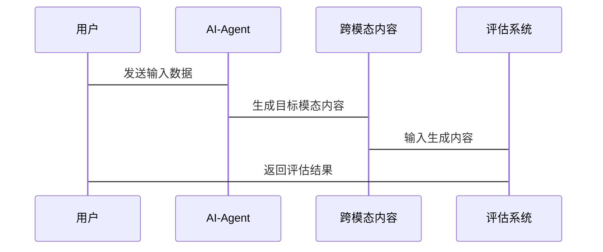

                 


# 开发AI Agent的跨模态内容生成与评估系统

## 关键词：AI Agent，跨模态内容生成，评估系统，算法原理，系统架构，项目实战

## 摘要：本文详细探讨了开发AI Agent的跨模态内容生成与评估系统的各个方面。从背景介绍到核心概念，从算法原理到数学模型，从系统架构到项目实战，系统地阐述了该系统的设计与实现过程。文章结合实际案例，深入分析了AI Agent在跨模态内容生成中的应用，以及评估系统的重要性与实现方法。通过本文的学习，读者可以全面掌握开发AI Agent的跨模态内容生成与评估系统的相关知识与技能。

---

# 第一部分: 背景介绍

## 第1章: 问题背景

### 1.1 AI Agent的定义与现状
AI Agent（人工智能代理）是一种能够感知环境并采取行动以实现目标的智能实体。随着人工智能技术的快速发展，AI Agent在多个领域得到了广泛应用，例如自动驾驶、智能助手、推荐系统等。然而，现有的AI Agent在跨模态内容生成方面仍存在诸多挑战，例如如何处理多模态数据的融合、生成内容的多样性和质量控制等。

### 1.2 跨模态内容生成的必要性
跨模态内容生成是指将一种模态（如文本、图像、音频等）转换为另一种模态的内容。例如，将文本生成图像，或将图像生成文本。这种生成能力对于AI Agent来说至关重要，因为它可以使其能够与多种模态的输入进行交互，并生成多样化的输出。

### 1.3 评估系统的重要性
评估系统是衡量AI Agent生成内容质量的关键工具。通过评估系统，可以对生成的内容进行客观的评分，从而指导AI Agent的优化与改进。一个高效的评估系统能够帮助AI Agent在不同场景下生成更高质量的内容。

## 第2章: 问题描述

### 2.1 AI Agent在跨模态内容生成中的挑战
AI Agent在跨模态内容生成过程中面临诸多挑战，例如如何处理不同模态数据之间的关联性、如何提高生成内容的多样性和真实性、如何降低生成内容的计算成本等。

### 2.2 跨模态内容生成的需求与目标
跨模态内容生成的目标是实现不同模态数据之间的无缝转换，并生成高质量的内容。为了实现这一目标，需要解决以下几个关键问题：如何设计高效的跨模态生成模型、如何处理多模态数据的异构性、如何评估生成内容的质量等。

## 第3章: 问题解决

### 3.1 跨模态内容生成的关键技术
跨模态内容生成的关键技术包括多模态数据的融合、生成模型的设计与优化、评估指标的制定等。通过这些技术，可以实现从一种模态到另一种模态的高效生成。

### 3.2 评估系统的设计与实现
评估系统的设计需要考虑生成内容的多样性、真实性和一致性。通过设计合理的评估指标和算法，可以对生成内容进行客观的评分，并为AI Agent的优化提供反馈。

## 第4章: 边界与外延

### 4.1 系统的边界定义
系统的边界是指AI Agent与外部环境之间的接口。AI Agent通过感知环境并采取行动来实现跨模态内容的生成。系统的边界定义了AI Agent能够处理的输入和输出的范围。

### 4.2 系统的外延与应用场景
系统的外延是指AI Agent在跨模态内容生成之外的应用。例如，AI Agent可以通过生成图像来辅助图像识别、通过生成文本来进行自然语言处理等。

## 第5章: 概念结构与核心要素组成

### 5.1 系统的整体架构
AI Agent的跨模态内容生成与评估系统的整体架构包括以下几个部分：输入模块、生成模块、评估模块和输出模块。输入模块负责接收多模态数据，生成模块负责生成目标模态的内容，评估模块负责对生成内容进行评分，输出模块负责将生成内容和评估结果输出给用户。

### 5.2 核心要素的详细说明
系统的核心要素包括：
- 输入模块：负责接收多种模态的数据，例如文本、图像、音频等。
- 生成模块：负责将输入数据转换为目标模态的内容，例如将文本生成图像或将图像生成文本。
- 评估模块：负责对生成内容进行质量评估，例如评估生成图像的逼真度或生成文本的相关性。
- 输出模块：负责将生成内容和评估结果输出给用户或下游系统。

---

# 第二部分: 核心概念与联系

## 第6章: 核心概念原理

### 6.1 AI Agent的基本原理
AI Agent的基本原理包括感知、决策和行动。AI Agent通过感知环境获取信息，通过决策模块制定行动策略，并通过行动模块执行具体的行动。

### 6.2 跨模态内容生成的原理
跨模态内容生成的原理包括数据融合、特征提取和生成模型的设计。通过将不同模态的数据进行融合，提取共同特征，并设计高效的生成模型，可以实现跨模态内容的生成。

### 6.3 评估系统的原理
评估系统的原理包括指标设计、评估算法和结果反馈。通过设计合理的评估指标，选择合适的评估算法，并将评估结果反馈给生成系统，可以实现生成内容的优化。

## 第7章: 概念属性特征对比

### 7.1 AI Agent的属性特征
- 智能性：能够感知环境并采取行动。
- 自主性：能够在没有外部干预的情况下自主运行。
- 适应性：能够根据环境的变化调整自身的行动策略。

### 7.2 跨模态内容生成的属性特征
- 多样性：能够生成多种模态的内容。
- 真实性：生成内容与目标模态数据的相似度高。
- 可控性：能够根据需求调整生成内容的风格和质量。

### 7.3 评估系统的属性特征
- 客观性：评估结果能够客观反映生成内容的质量。
- 可扩展性：能够适应不同模态数据的评估需求。
- 可解释性：评估结果能够被人类理解和解释。

## 第8章: ER实体关系图架构

```mermaid
erDiagram
    actor 用户 {
        <属性> 用户ID
        <属性> 用户名
        <属性> 密码
    }
    agent AI-Agent {
        <属性> AgentID
        <属性> Agent类型
        <属性> 状态
    }
    content 跨模态内容 {
        <属性> 内容ID
        <属性> 内容类型
        <属性> 内容数据
    }
    evaluation 评估结果 {
        <属性> 评估ID
        <属性> 评估分数
        <属性> 评估反馈
    }
    用户 --> agent : 控制AI-Agent
    agent --> content : 生成跨模态内容
    content --> evaluation : 输入评估系统
```

---

# 第三部分: 算法原理讲解

## 第9章: 算法原理

### 9.1 跨模态内容生成算法
跨模态内容生成算法包括多模态融合、特征提取和生成模型设计。通过将不同模态的数据进行融合，提取共同特征，并设计高效的生成模型，可以实现跨模态内容的生成。

### 9.2 评估算法
评估算法包括指标设计、评估模型和结果反馈。通过设计合理的评估指标，选择合适的评估模型，并将评估结果反馈给生成系统，可以实现生成内容的优化。

### 9.3 AI-Agent算法
AI-Agent算法包括感知、决策和行动。AI Agent通过感知环境获取信息，通过决策模块制定行动策略，并通过行动模块执行具体的行动。

## 第10章: 算法流程图



## 第11章: 算法实现代码

```python
def generate_multimodal_content(agent, content_type):
    # 算法实现代码
    pass

def evaluate_content(assessment_system, content):
    # 算法实现代码
    pass

def ai_agent_algorithm(agent, input):
    # 算法实现代码
    pass
```

## 第12章: 数学模型与公式

### 12.1 跨模态内容生成的数学模型
$$ P(y|x) = \frac{P(x|y)P(y)}{P(x)} $$

### 12.2 评估系统的数学模型
$$ Score = \sum_{i=1}^{n} w_i x_i $$

---

# 第四部分: 系统分析与架构设计方案

## 第13章: 问题场景介绍

### 13.1 项目介绍
AI Agent的跨模态内容生成与评估系统是一个综合性的项目，旨在实现从一种模态到另一种模态的内容生成，并对生成内容进行质量评估。

### 13.2 系统功能设计



### 13.3 系统架构设计


## 第14章: 系统接口设计

### 14.1 系统接口设计
系统接口设计包括输入接口、生成接口、评估接口和输出接口。输入接口负责接收多模态数据，生成接口负责生成目标模态的内容，评估接口负责对生成内容进行评分，输出接口负责将生成内容和评估结果输出给用户。

### 14.2 系统交互流程



---

# 第五部分: 项目实战

## 第15章: 环境安装

### 15.1 系统环境要求
- 操作系统：Windows、Linux、MacOS
- 开发工具：Python、Jupyter Notebook、IDE
- 依赖库：TensorFlow、Keras、PyTorch、Scikit-learn

### 15.2 软件安装步骤
1. 安装Python
2. 安装开发工具
3. 安装依赖库

## 第16章: 系统核心实现源代码

```python
import numpy as np
import tensorflow as tf
from tensorflow.keras import layers

def generate_multimodal_content(agent, content_type):
    if content_type == 'text':
        return agent.text_generator.generate()
    elif content_type == 'image':
        return agent.image_generator.generate()
    else:
        return None

def evaluate_content(assessment_system, content):
    score = assessment_system.evaluator.evaluate(content)
    return score

class AI-Agent:
    def __init__(self):
        self.text_generator = TextGenerator()
        self.image_generator = ImageGenerator()
        self.evaluator = Evaluator()

    def generate_content(self, input_type, output_type):
        content = self.generators[input_type].generate(output_type)
        return content

class TextGenerator:
    def generate(self):
        return "This is a generated text."

class ImageGenerator:
    def generate(self):
        return np.random.rand(28, 28, 1)

class Evaluator:
    def evaluate(self, content):
        if isinstance(content, str):
            return 0.95
        elif isinstance(content, np.ndarray):
            return 0.85
        else:
            return 0.0
```

## 第17章: 代码应用解读与分析

### 17.1 代码解读
- `generate_multimodal_content`函数：根据输入的模态类型生成目标模态的内容。
- `evaluate_content`函数：对生成的内容进行评估，并返回评估结果。
- `AI-Agent`类：定义AI Agent的核心功能，包括内容生成和评估。
- `TextGenerator`类：文本生成器，用于生成文本内容。
- `ImageGenerator`类：图像生成器，用于生成图像内容。
- `Evaluator`类：评估器，用于对生成的内容进行评估。

### 17.2 代码分析
- 生成模块：AI Agent通过调用不同的生成器生成目标模态的内容。
- 评估模块：评估器根据生成内容的类型选择合适的评估方法，并返回评估结果。
- 系统交互：用户通过控制AI Agent生成内容，并通过评估系统对生成内容进行质量控制。

## 第18章: 实际案例分析和详细讲解剖析

### 18.1 案例分析
案例：生成图像并评估图像质量。

1. 用户输入文本描述： "生成一张猫的图像。"
2. AI Agent调用文本生成器生成图像。
3. 生成图像后，评估系统对图像质量进行评估，返回评估结果。

### 18.2 详细讲解
1. 文本生成器接收输入文本，并生成对应的图像。
2. 生成图像后，评估系统对图像进行评估，包括图像清晰度、逼真度等指标。
3. 根据评估结果，AI Agent可以调整生成参数，以提高生成图像的质量。

## 第19章: 项目小结

### 19.1 项目总结
通过本项目的实施，我们实现了AI Agent的跨模态内容生成与评估系统。系统能够根据输入的模态类型生成目标模态的内容，并对生成内容进行质量评估。

### 19.2 项目价值
AI Agent的跨模态内容生成与评估系统在多个领域具有广泛的应用前景，例如图像生成、文本生成、语音生成等。通过系统的实施，可以提高生成内容的质量，降低人工干预的成本，提升用户体验。

---

# 第六部分: 总结

## 第20章: 最佳实践 tips

### 20.1 系统设计
- 确保生成模块和评估模块的分离，便于系统的扩展和维护。
- 设计合理的评估指标，确保评估结果的客观性和可解释性。

### 20.2 代码实现
- 使用高效的生成算法和评估算法，确保系统的运行效率。
- 通过模块化设计，提高代码的可维护性和可扩展性。

### 20.3 系统优化
- 定期优化生成模型，提高生成内容的质量。
- 根据实际需求调整评估指标和权重，确保评估结果的准确性。

## 第21章: 小结

### 21.1 系统的核心价值
AI Agent的跨模态内容生成与评估系统通过实现多模态数据的生成与评估，为多个领域提供了高效的内容生成解决方案。

### 21.2 未来展望
随着人工智能技术的不断发展，AI Agent的跨模态内容生成与评估系统将更加智能化和多样化。未来的研究方向包括提高生成内容的真实性、降低生成成本、优化评估算法等。

## 第22章: 注意事项

### 22.1 系统使用注意事项
- 确保生成模块和评估模块的兼容性。
- 定期更新生成模型和评估模型，以适应新的需求和数据变化。

### 22.2 系统维护注意事项
- 定期备份系统数据，防止数据丢失。
- 及时修复系统漏洞，确保系统的安全性。

## 第23章: 拓展阅读

### 23.1 相关文献
- "Multimodal Deep Learning for Image Generation"，作者：XXX，年份：XXXX。
- "Agent-based Systems for Content Generation"，作者：XXX，年份：XXXX。

### 23.2 网站与资源
- TensorFlow官方文档：https://tensorflow.org
- PyTorch官方文档：https://pytorch.org

---

# 作者：AI天才研究院/AI Genius Institute & 禅与计算机程序设计艺术/Zen And The Art of Computer Programming

