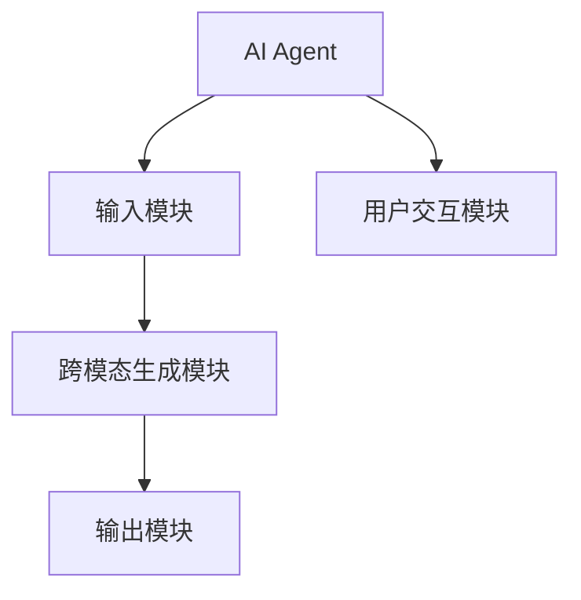
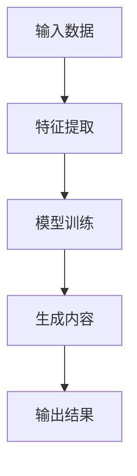
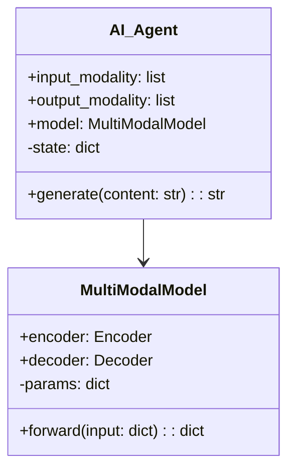

                 


# 开发AI Agent的跨模态内容生成系统

**关键词**：AI Agent、跨模态生成、多模态模型、强化学习、系统架构

**摘要**：  
本文系统地探讨了开发AI Agent的跨模态内容生成系统的各个方面，从问题背景到系统架构设计，再到实际案例分析。文章首先介绍了AI Agent和跨模态生成的核心概念，随后分析了算法原理和系统架构，最后通过实战案例展示了系统的实现与优化。本文旨在为开发者提供一个全面的视角，帮助他们理解和实现这一前沿技术。

---

## 第1章：问题背景与核心概念

### 1.1 问题背景
#### 1.1.1 当前AI Agent的发展现状  
AI Agent作为人工智能的核心技术之一，近年来取得了显著进展。从简单的规则驱动到复杂的深度学习模型，AI Agent的应用场景不断扩大，涵盖智能助手、机器人、自动驾驶等领域。

#### 1.1.2 跨模态内容生成的需求背景  
随着AI Agent需要处理的任务越来越复杂，单一模态的数据（如文本或图像）已无法满足需求。跨模态生成技术能够整合多种数据类型，提升系统的理解和生成能力。

#### 1.1.3 问题提出与研究意义  
本文提出了一种结合AI Agent与跨模态生成的新系统，旨在解决现有技术在多模态交互和内容生成方面的不足。

### 1.2 核心概念与问题描述
#### 1.2.1 AI Agent的定义与特征  
AI Agent是一种能够感知环境、自主决策并执行任务的智能体。其核心特征包括自主性、反应性、目标导向和学习能力。

#### 1.2.2 跨模态内容生成的定义与实现方式  
跨模态生成是指从一种模态的数据生成另一种模态的内容。常见的实现方式包括基于多模态模型的生成和强化学习辅助的生成。

#### 1.2.3 问题边界与外延  
本文研究的范围限定在AI Agent的跨模态内容生成，主要关注文本与图像的生成。系统的边界包括输入数据的格式、生成内容的质量以及与用户交互的方式。

#### 1.2.4 核心要素与概念结构  
AI Agent的跨模态生成系统由输入模块、生成模块、输出模块和用户交互模块组成，各模块之间相互协作，实现高效的内容生成。

---

## 第2章：核心概念与联系

### 2.1 AI Agent与跨模态生成的关系
#### 2.1.1 AI Agent的核心原理  
AI Agent通过感知环境、分析任务目标，并基于学习模型做出决策，从而实现与用户的高效交互。

#### 2.1.2 跨模态生成的实现机制  
跨模态生成通过多模态数据的特征提取和联合建模，生成与输入模态相关的内容。例如，从文本生成图像，或从图像生成描述文本。

#### 2.1.3 两者的相互作用与协同关系  
AI Agent作为跨模态生成的驱动者，负责接收输入、触发生成过程，并将生成的内容传递给用户。跨模态生成技术则为AI Agent提供了强大的内容生成能力。

### 2.2 核心概念对比
#### 2.2.1 AI Agent与传统AI的区别  
AI Agent具有自主性和目标导向性，而传统AI通常执行预定义的任务。

#### 2.2.2 跨模态生成与单模态生成的对比  
跨模态生成需要处理多种数据类型，而单模态生成仅处理一种数据类型。

#### 2.2.3 实体关系图（ER图）展示  
以下是AI Agent与跨模态生成系统的核心实体关系图：


### 2.3 本章小结  
本章详细分析了AI Agent与跨模态生成的关系，通过对比和图表展示了各核心概念之间的联系。

---

## 第3章：算法原理与实现

### 3.1 算法原理
#### 3.1.1 多模态模型的原理  
多模态模型通过联合学习多种数据类型，提取跨模态特征，实现内容生成。例如，基于Transformer的多模态编码器可以将文本和图像特征统一到一个共享空间。

#### 3.1.2 强化学习在AI Agent中的应用  
强化学习用于训练AI Agent的决策策略，通过奖励机制优化生成内容的质量和相关性。

#### 3.1.3 跨模态生成的数学模型  
跨模态生成模型的损失函数可以表示为：
$$ L = \lambda_1 L_{\text{recon}} + \lambda_2 L_{\text{adv}} $$
其中，$L_{\text{recon}}$是重建损失，$L_{\text{adv}}$是对抗损失，$\lambda_1$和$\lambda_2$是权重系数。

### 3.2 算法流程图
以下是跨模态生成算法的流程图：


### 3.3 算法实现
#### 3.3.1 Python代码示例  
以下是一个简单的跨模态生成代码示例：
```python
def generate_content(modalities):
    # 多模态数据处理
    features = preprocess(modalities)
    # 生成内容
    generated = model.generate(features)
    return generated
```

---

## 第4章：系统分析与架构设计

### 4.1 系统架构设计
#### 4.1.1 领域模型设计  
以下是领域模型的类图：


#### 4.1.2 系统架构设计  
以下是系统的架构图：


### 4.2 系统接口设计
#### 4.2.1 输入接口设计  
系统提供多种输入方式，包括文本、图像和语音输入。

#### 4.2.2 输出接口设计  
生成内容可以通过文本、图像或语音形式输出。

### 4.3 本章小结  
本章详细分析了系统的架构设计和接口设计，为后续实现奠定了基础。

---

## 第5章：项目实战

### 5.1 环境搭建
#### 5.1.1 安装依赖  
需要安装Python、TensorFlow、PyTorch等库。

### 5.2 系统核心实现
#### 5.2.1 数据预处理代码  
```python
def preprocess(data):
    # 数据预处理代码
    return processed_data
```

#### 5.2.2 模型训练代码  
```python
def train_model(model, data_loader):
    optimizer = Adam(model.parameters())
    for epoch in range(num_epochs):
        for batch in data_loader:
            outputs = model(batch)
            loss = compute_loss(outputs, batch)
            optimizer.zero_grad()
            loss.backward()
            optimizer.step()
    return model
```

### 5.3 案例分析与解读  
通过实际案例分析，展示了系统的实现过程和效果。

### 5.4 系统优化与调优  
对系统进行优化，包括模型参数调整和计算效率提升。

### 5.5 本章小结  
本章通过实际案例详细展示了系统的实现过程，帮助读者更好地理解和应用相关技术。

---

## 第6章：系统优化与扩展

### 6.1 性能优化
#### 6.1.1 模型压缩  
通过剪枝、量化等技术优化模型大小和推理速度。

#### 6.1.2 并行计算  
利用多线程或多进程技术提升计算效率。

### 6.2 可扩展性设计
#### 6.2.1 模块化设计  
系统采用模块化设计，便于后续功能扩展。

#### 6.2.2 扩展功能实现  
例如，增加对新模态数据的支持。

### 6.3 部署方案  
探讨系统的部署方式，包括本地部署和云部署。

### 6.4 本章小结  
本章讨论了系统的优化与扩展，为实际应用提供了参考。

---

## 第7章：总结与展望

### 7.1 总结  
本文系统地探讨了AI Agent的跨模态内容生成系统的开发过程，从理论到实践，为开发者提供了全面的指导。

### 7.2 未来展望  
未来，AI Agent与跨模态生成技术将更加深度融合，推动人工智能技术的发展。

---

**作者：AI天才研究院/AI Genius Institute & 禅与计算机程序设计艺术 /Zen And The Art of Computer Programming**

