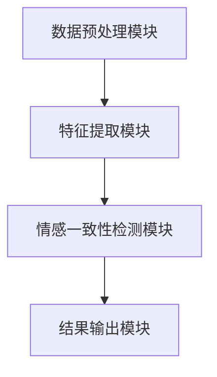
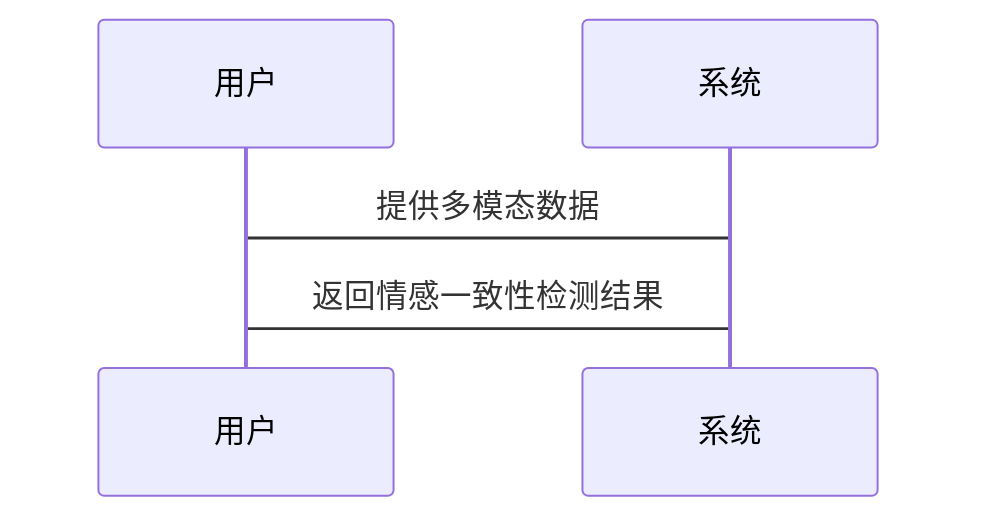

                 


# 开发AI Agent的跨模态情感一致性检测

> 关键词：AI Agent, 跨模态情感一致性检测, 机器学习, 深度学习, 跨模态数据, 情感分析, 系统架构

> 摘要：本文深入探讨了开发AI Agent的跨模态情感一致性检测技术。通过分析跨模态数据的特性，提出了一种基于深度学习的情感一致性检测算法，并结合实际案例展示了系统设计与实现。文章内容涵盖了背景介绍、核心概念、算法原理、系统架构设计以及项目实战，旨在为相关领域的研究者和开发者提供理论支持和实践指导。

---

## 第1章: 背景与基本概念

### 1.1 问题背景

#### 1.1.1 AI Agent与情感一致性检测的定义
AI Agent（人工智能代理）是指能够感知环境、自主决策并执行任务的智能体。在实际应用中，AI Agent需要与用户进行多模态交互，例如通过文本、语音和图像等多种形式进行交流。为了提高用户体验，AI Agent需要理解并保持跨模态数据的情感一致性，即在不同数据模态中表达的情感应一致。

#### 1.1.2 跨模态数据的特性与挑战
跨模态数据指的是来自不同感知渠道的数据，如文本、图像、语音等。这些数据具有多样性、异构性和语义相关性等特点。然而，跨模态数据的处理面临以下挑战：
- 数据格式多样，难以统一处理。
- 不同模态的数据特征差异较大，如何有效对齐是关键。
- 如何在复杂场景中保持情感一致性是难点。

#### 1.1.3 情感一致性检测的必要性
情感一致性检测是确保AI Agent在多模态交互中保持情感一致性的核心技术。通过检测和调整跨模态数据的情感一致性，可以提升用户体验，增强AI Agent的智能性和可信度。

---

### 1.2 核心概念与技术挑战

#### 1.2.1 跨模态数据的特征分析
跨模态数据的特征分析是情感一致性检测的基础。例如：
- 文本模态：词袋模型、词嵌入（如Word2Vec、BERT）。
- 图像模态：视觉特征提取（如CNN、ResNet）。
- 音频模态：语音特征提取（如MFCC、谱图分析）。

#### 1.2.2 情感一致性检测的原理
情感一致性检测的目标是通过跨模态数据的特征分析，计算不同模态之间情感的一致性程度。具体步骤包括：
1. 对不同模态的数据进行特征提取。
2. 对齐不同模态的特征。
3. 计算情感一致性指标。
4. 输出一致性结果。

#### 1.2.3 技术实现中的主要挑战
- 数据对齐困难：不同模态的数据具有不同的特征维度和空间分辨率。
- 情感表达的多样性：同一情感在不同模态中的表现可能不同。
- 计算效率问题：跨模态数据处理需要高效算法支持。

---

## 第2章: 跨模态情感一致性检测的核心概念

### 2.1 跨模态数据的特征分析

#### 2.1.1 文本模态的特征提取
文本模态的特征提取主要基于自然语言处理技术。例如：
- 词袋模型：统计文本中词的出现频率。
- 词嵌入：将词语映射到高维向量空间（如Word2Vec、BERT）。

#### 2.1.2 视频模态的特征提取
视频模态的特征提取主要基于计算机视觉技术。例如：
- 帧提取：提取视频的关键帧。
- 视觉特征提取：使用CNN提取帧的特征向量。

#### 2.1.3 音频模态的特征提取
音频模态的特征提取主要基于语音信号处理技术。例如：
- 频率分析：提取音频的频谱特征（如MFCC）。
- 时域分析：分析音频的时域特征（如幅度、能量）。

---

### 2.2 情感一致性检测的原理

#### 2.2.1 情感一致性检测的定义
情感一致性检测是指在跨模态数据中，不同模态之间情感表达的一致性程度。例如，在文本和语音中，文本表达的情感与语音的情感应一致。

#### 2.2.2 跨模态数据的情感关联性
跨模态数据的情感关联性是指不同模态数据之间情感的相互影响。例如，文本中表达的愤怒情感可能通过语音的音调和节奏表现出来。

#### 2.2.3 情感一致性检测的评价指标
常用的情感一致性检测指标包括：
- 一致性分数：0（完全不一致）到1（完全一致）。
- 分类准确率：基于一致性分数进行分类的准确率。

---

### 2.3 跨模态数据的对齐与融合

#### 2.3.1 跨模态数据对齐的必要性
数据对齐是跨模态数据处理的关键步骤，旨在将不同模态的数据映射到同一特征空间。

#### 2.3.2 基于对齐的情感一致性检测
通过对齐不同模态的数据，可以计算其情感一致性。例如，使用余弦相似度衡量文本和语音特征向量的一致性。

#### 2.3.3 跨模态数据融合的策略
跨模态数据融合可以通过多种策略实现，例如：
- 线性组合：将不同模态的特征向量进行线性组合。
- 对比学习：通过对比学习优化不同模态的特征对齐。

---

## 第3章: 跨模态情感一致性检测的算法原理

### 3.1 算法流程

#### 3.1.1 数据预处理
- 文本数据：分词、去停用词。
- 图像数据：归一化、提取关键帧。
- 音频数据：降噪、提取特征。

#### 3.1.2 特征提取
- 文本：使用BERT提取文本向量。
- 图像：使用ResNet提取图像向量。
- 音频：使用MFCC提取语音特征。

#### 3.1.3 情感一致性计算
- 对齐不同模态的特征向量。
- 计算一致性分数（如余弦相似度）。

#### 3.1.4 结果输出
- 输出一致性分数或分类结果。

---

### 3.2 跨模态特征对齐算法

#### 3.2.1 基于距离的对齐方法
- 使用欧氏距离或余弦相似度对齐特征向量。

#### 3.2.2 基于深度学习的对齐方法
- 使用神经网络对齐不同模态的特征。

#### 3.2.3 对齐算法的优缺点分析
- 基于距离的方法简单但可能不够鲁棒。
- 基于深度学习的方法更具灵活性但计算复杂度较高。

---

### 3.3 情感一致性检测的数学模型

#### 3.3.1 情感一致性指标的定义
一致性分数可以定义为：
$$ C = \frac{1}{n}\sum_{i=1}^{n} \text{sim}(x_i, y_i) $$
其中，\( x_i \) 和 \( y_i \) 是不同模态的特征向量，\( \text{sim} \) 是相似度计算函数。

#### 3.3.2 跨模态数据融合的数学公式
融合后的特征向量可以表示为：
$$ z = \alpha x + (1-\alpha) y $$
其中，\( \alpha \) 是融合权重。

#### 3.3.3 情感一致性检测的优化算法
优化算法可以使用梯度下降：
$$ \theta = \theta - \eta \frac{\partial L}{\partial \theta} $$
其中，\( L \) 是损失函数，\( \theta \) 是模型参数。

---

### 3.4 算法实现的代码示例

#### 3.4.1 数据预处理代码
```python
import numpy as np
from sklearn.feature_extraction.text import TfidfVectorizer

# 文本数据预处理
def preprocess_text(text):
    vectorizer = TfidfVectorizer()
    text_vectors = vectorizer.fit_transform([text]).toarray()
    return text_vectors

# 图像数据预处理
def preprocess_image(image):
    # 假设image是图像数据，归一化处理
    normalized_image = image / 255.0
    return normalized_image

# 音频数据预处理
def preprocess_audio(audio):
    # 假设audio是音频信号，提取MFCC特征
    import librosa
    mfccs = librosa.feature.mfcc(y=audio, sr=22050, n_mfcc=13)
    return mfccs
```

#### 3.4.2 特征提取代码
```python
# 文本特征提取
def extract_text_feature(text):
    return preprocess_text(text)

# 图像特征提取
def extract_image_feature(image):
    return preprocess_image(image)

# 音频特征提取
def extract_audio_feature(audio):
    return preprocess_audio(audio)
```

#### 3.4.3 情感一致性检测代码
```python
# 计算一致性分数
def compute_consistency_score(text_feature, audio_feature):
    from sklearn.metrics.pairwise import cosine_similarity
    score = cosine_similarity([text_feature], [audio_feature])[0][0]
    return score

# 情感一致性检测
def check_emotion_consistency(text, audio):
    text_feature = extract_text_feature(text)
    audio_feature = extract_audio_feature(audio)
    consistency = compute_consistency_score(text_feature, audio_feature)
    return consistency
```

---

## 第4章: 系统分析与架构设计

### 4.1 问题场景分析

#### 4.1.1 系统功能需求
- 数据预处理与特征提取。
- 情感一致性检测。
- 结果输出与反馈。

#### 4.1.2 系统性能需求
- 高效处理多模态数据。
- 实时检测情感一致性。

#### 4.1.3 系统约束条件
- 数据隐私保护。
- 系统可扩展性。

---

### 4.2 系统架构设计

#### 4.2.1 系统模块划分
- 数据预处理模块。
- 特征提取模块。
- 情感一致性检测模块。
- 结果输出模块。

#### 4.2.2 模块之间的关系
- 数据预处理模块接收输入数据并进行预处理。
- 特征提取模块将预处理后的数据转换为特征向量。
- 情感一致性检测模块计算一致性分数。
- 结果输出模块输出检测结果。

#### 4.2.3 系统架构图（Mermaid）


---

### 4.3 接口设计与交互流程

#### 4.3.1 系统接口定义
- 输入接口：接受文本、图像、音频数据。
- 输出接口：输出情感一致性分数或分类结果。

#### 4.3.2 用户交互流程
1. 用户输入多模态数据。
2. 系统预处理数据。
3. 系统提取特征。
4. 系统计算一致性分数。
5. 系统输出结果。

#### 4.3.3 系统交互图（Mermaid）


---

## 第5章: 项目实战

### 5.1 环境搭建与数据准备

#### 5.1.1 开发环境安装
- 安装Python、TensorFlow、Keras、OpenCV、Librosa等库。

#### 5.1.2 数据集准备
- 文本数据：社交媒体评论、对话记录。
- 图像数据：面部表情图像。
- 音频数据：语音录音。

---

### 5.2 系统核心实现源代码

#### 5.2.1 数据预处理代码
```python
import numpy as np
from sklearn.feature_extraction.text import TfidfVectorizer
import librosa

def preprocess_text(text):
    vectorizer = TfidfVectorizer()
    text_vectors = vectorizer.fit_transform([text]).toarray()
    return text_vectors

def preprocess_image(image):
    normalized_image = image / 255.0
    return normalized_image

def preprocess_audio(audio):
    mfccs = librosa.feature.mfcc(y=audio, sr=22050, n_mfcc=13)
    return mfccs
```

#### 5.2.2 特征提取代码
```python
def extract_text_feature(text):
    return preprocess_text(text)

def extract_image_feature(image):
    return preprocess_image(image)

def extract_audio_feature(audio):
    return preprocess_audio(audio)
```

#### 5.2.3 情感一致性检测代码
```python
def compute_consistency_score(text_feature, audio_feature):
    from sklearn.metrics.pairwise import cosine_similarity
    score = cosine_similarity([text_feature], [audio_feature])[0][0]
    return score

def check_emotion_consistency(text, audio):
    text_feature = extract_text_feature(text)
    audio_feature = extract_audio_feature(audio)
    consistency = compute_consistency_score(text_feature, audio_feature)
    return consistency
```

---

### 5.3 实际案例分析与详细讲解

#### 5.3.1 案例分析
假设我们有一个文本评论“我非常生气”，对应的语音数据。我们首先对文本进行分词和特征提取，得到文本向量；然后对语音数据进行MFCC特征提取，得到语音向量。最后，计算文本向量和语音向量的一致性分数。

#### 5.3.2 详细步骤
1. 文本预处理：
   ```python
   text = "我非常生气"
   text_vector = preprocess_text(text)
   ```

2. 语音预处理：
   ```python
   audio = np.random.randn(22050)  # 示例音频数据
   audio_feature = preprocess_audio(audio)
   ```

3. 情感一致性检测：
   ```python
   consistency = check_emotion_consistency(text, audio)
   print(f"一致性分数: {consistency}")
   ```

---

## 第6章: 总结与展望

### 6.1 最佳实践 tips
- 数据预处理是关键，确保数据质量。
- 特征提取应结合具体场景选择合适的方法。
- 算法优化需结合实际需求进行。

### 6.2 小结
本文详细介绍了开发AI Agent的跨模态情感一致性检测技术，从理论到实践，为相关领域的研究者和开发者提供了参考。

### 6.3 注意事项
- 数据隐私保护需引起重视。
- 算法的可解释性需进一步研究。

### 6.4 拓展阅读
- 深度学习在情感分析中的应用。
- 多模态数据融合的最新研究。

---

## 作者：AI天才研究院/AI Genius Institute & 禅与计算机程序设计艺术 /Zen And The Art of Computer Programming

