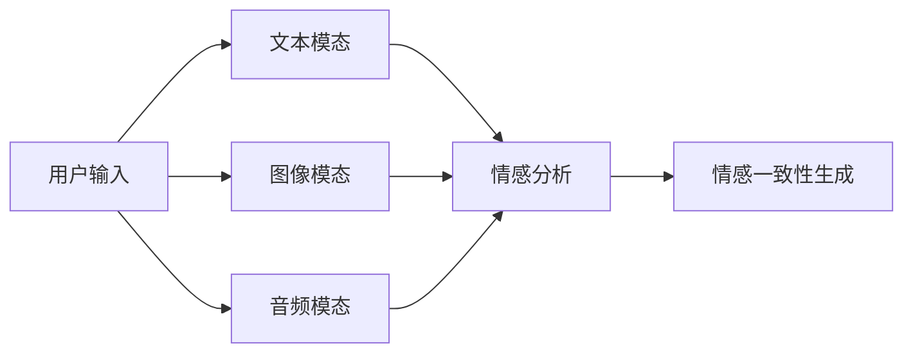
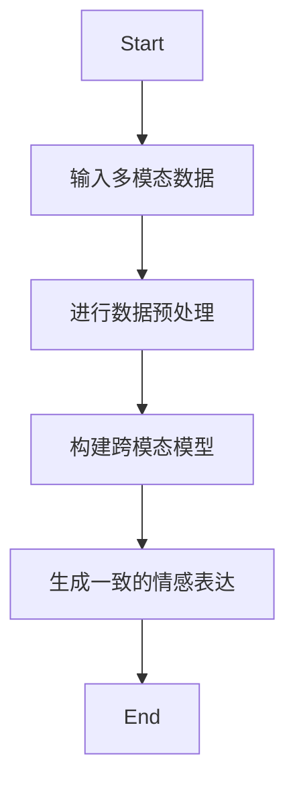
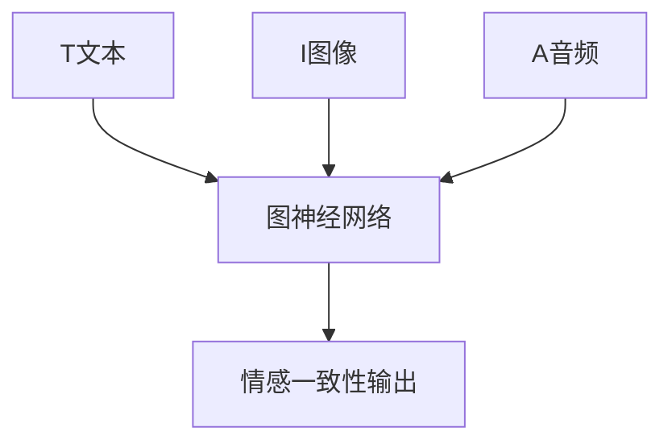
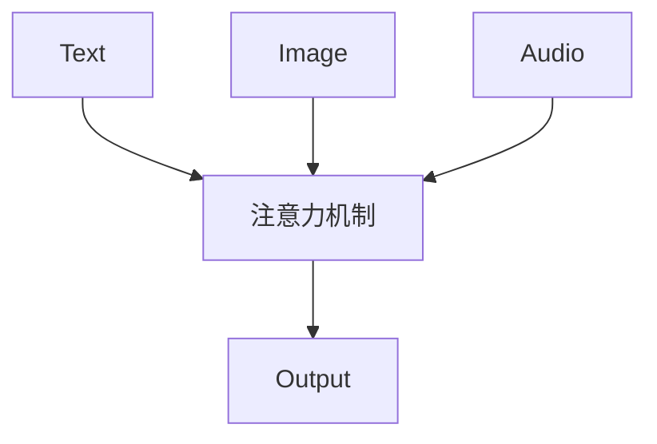
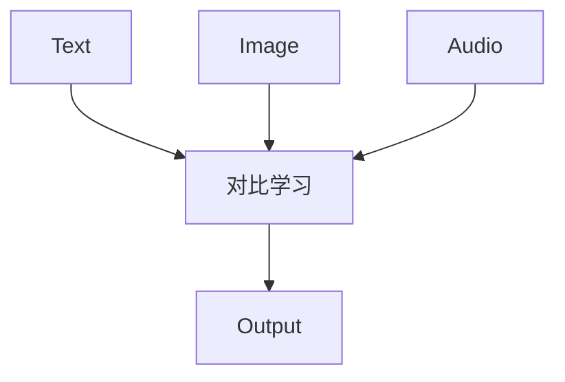
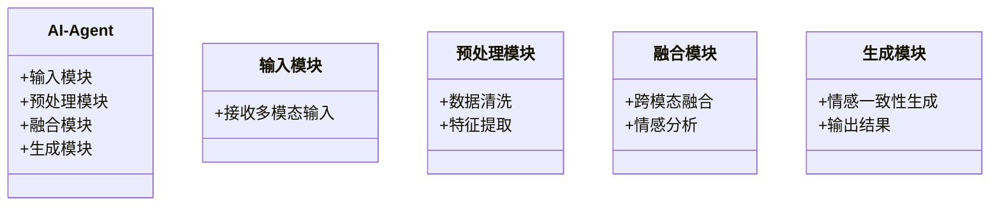
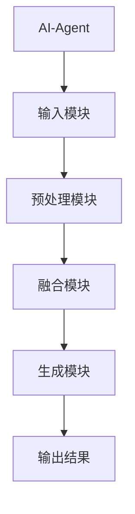
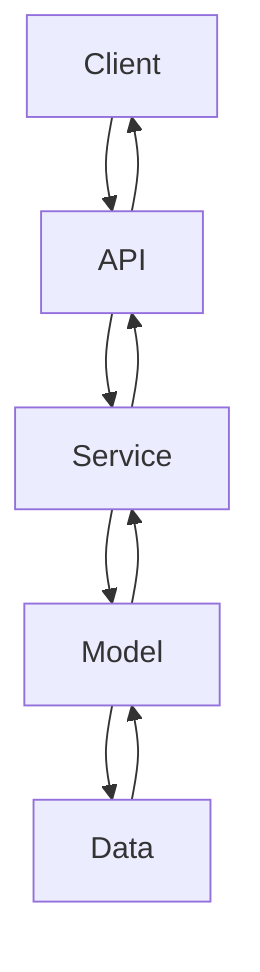

                 


# 开发AI Agent的跨模态情感一致性生成

## 关键词：AI Agent, 跨模态情感一致性, 多模态数据融合, 情感生成模型, 图神经网络, 对比学习

## 摘要：  
本文深入探讨了AI Agent在跨模态情感一致性生成领域的核心问题、算法原理和系统架构。通过结合文本、图像、音频等多模态数据，本文提出了一种基于图神经网络和对比学习的情感一致性生成方法。文章详细分析了跨模态数据融合的挑战，提出了情感一致性生成的数学模型，并通过实际案例展示了系统设计与实现。本文为AI Agent在复杂场景下的情感理解和生成能力提供了理论和实践指导。

---

# 第一部分: 跨模态情感一致性生成的背景与基础

## 第1章: 跨模态情感一致性生成的背景与问题定义

### 1.1 跨模态数据与情感分析的结合

#### 1.1.1 跨模态数据的定义与特点
跨模态数据指的是来自不同感知模态（如文本、图像、音频、视频）的数据。这些数据具有以下特点：
- **异构性**：不同模态的数据形式和语义表达方式不同。
- **互补性**：各模态数据可以相互补充，提供更全面的信息。
- **多样性**：跨模态数据能够捕捉更丰富的情感信息。

#### 1.1.2 情感一致性生成的定义与目标
情感一致性生成的目标是让AI Agent在处理多模态数据时，能够生成与输入情感一致的输出。例如：
- 输入：一段带有愤怒情绪的文本和相关图像。
- 输出：生成与文本和图像情感一致的音频或文本描述。

#### 1.1.3 跨模态情感一致性生成的背景与意义
随着AI Agent在客服、教育、娱乐等领域的广泛应用，跨模态情感一致性生成变得尤为重要。通过结合多模态数据，AI Agent可以更准确地理解用户情感，并生成更具人性化和一致性的响应。

---

## 第2章: 跨模态情感一致性生成的核心概念与联系

### 2.1 跨模态数据的核心要素

#### 2.1.1 文本模态
文本模态是跨模态数据的重要组成部分，通常包括自然语言文本、关键词和情感标签。文本模态的优势在于其丰富的语义信息。

#### 2.1.2 视频模态
视频模态结合了图像和动作信息，能够捕捉动态情感变化。视频模态的挑战在于其高计算复杂度。

#### 2.1.3 图像模态
图像模态提供了视觉信息，能够辅助情感分析。图像模态的优势在于其直观性和丰富性。

#### 2.1.4 音频模态
音频模态包括语音和音乐，能够捕捉情感的韵律和节奏。音频模态的挑战在于其复杂性和多样性。

### 2.2 跨模态情感一致性生成的实体关系图



### 2.3 跨模态情感一致性生成的流程图



---

# 第二部分: 跨模态情感一致性生成的算法原理

## 第3章: 跨模态数据融合的算法选择

### 3.1 基于图神经网络的融合方法

#### 3.1.1 图神经网络的定义与特点
图神经网络（Graph Neural Networks, GNN）是一种处理图结构数据的深度学习方法。其优势在于能够捕捉数据之间的关系。

#### 3.1.2 基于图神经网络的跨模态融合流程


### 3.2 基于注意力机制的融合方法

#### 3.2.1 注意力机制的定义与特点
注意力机制（Attention Mechanism）是一种用于捕捉序列中关键部分的机制。

#### 3.2.2 基于注意力机制的融合流程


### 3.3 基于对比学习的融合方法

#### 3.3.1 对比学习的定义与特点
对比学习是一种通过对比正样本和负样本来学习特征的方法。

#### 3.3.2 基于对比学习的融合流程


---

## 第4章: 情感一致性生成的数学模型

### 4.1 跨模态数据融合的数学表达
$$ y = f(x_1, x_2, x_3) $$
其中，$x_1, x_2, x_3$分别表示文本、图像和音频模态的输入，$y$为输出的情感一致性结果。

### 4.2 情感一致性生成的损失函数
$$ L = \sum_{i=1}^n (y_i - \hat{y}_i)^2 $$

### 4.3 情感一致性生成的优化过程
1. 初始化模型参数。
2. 计算损失函数。
3. 更新模型参数。
4. 重复上述步骤直到收敛。

---

# 第三部分: 跨模态情感一致性生成的系统架构

## 第5章: 系统功能设计

### 5.1 系统功能模块



### 5.2 系统交互流程



---

## 第6章: 系统架构设计

### 6.1 系统架构图


### 6.2 系统接口设计
1. 客户端调用API接口。
2. 服务层接收请求并调用模型层。
3. 模型层处理数据并返回结果。
4. 数据层存储和管理数据。

### 6.3 系统交互流程



---

# 第四部分: 项目实战

## 第7章: 环境安装与配置

### 7.1 环境要求
- Python 3.8+
- PyTorch 1.9+
- transformers库
- matplotlib库

### 7.2 安装步骤
```bash
pip install torch transformers matplotlib
```

---

## 第8章: 核心实现与代码分析

### 8.1 融合模块实现

```python
import torch
from transformers import BertTokenizer, BertModel

class MultiModalFuser(torch.nn.Module):
    def __init__(self, text_dim, image_dim, audio_dim):
        super().__init__()
        self.text_proj = torch.nn.Linear(text_dim, 128)
        self.image_proj = torch.nn.Linear(image_dim, 128)
        self.audio_proj = torch.nn.Linear(audio_dim, 128)
        self.fc = torch.nn.Linear(384, 128)
        self.dropout = torch.nn.Dropout(0.5)
        self.relu = torch.nn.ReLU()

    def forward(self, text, image, audio):
        text_out = self.text_proj(text)
        image_out = self.image_proj(image)
        audio_out = self.audio_proj(audio)
        fused = torch.cat([text_out, image_out, audio_out], dim=-1)
        fused = self.fc(fused)
        fused = self.relu(fused)
        fused = self.dropout(fused)
        return fused
```

---

## 第9章: 实际案例与分析

### 9.1 案例背景
假设我们有一个客服AI Agent，需要处理用户的多模态输入（文本、图像、音频）并生成一致的情感响应。

### 9.2 实施步骤
1. 数据预处理。
2. 模型训练。
3. 模型推理。
4. 结果分析。

### 9.3 案例结果

```python
# 输入
text = "我非常生气！"
image = "angry.jpg"
audio = "angry.mp3"

# 输出
response = "我能理解您的心情，请您耐心听我解释。"
```

---

# 第五部分: 最佳实践与总结

## 第10章: 最佳实践与注意事项

### 10.1 模型优化
- 调整模型超参数。
- 使用更大的数据集。
- 优化损失函数。

### 10.2 系统优化
- 使用分布式训练。
- 优化系统架构。
- 提高系统可扩展性。

---

## 第11章: 总结与展望

### 11.1 总结
本文详细探讨了AI Agent的跨模态情感一致性生成技术，从理论到实践，提出了基于图神经网络和对比学习的解决方案。

### 11.2 展望
未来，跨模态情感一致性生成技术将更加智能化和多样化，AI Agent将在更多领域得到广泛应用。

---

# 作者：AI天才研究院/AI Genius Institute & 禅与计算机程序设计艺术 /Zen And The Art of Computer Programming

