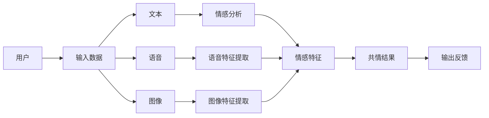
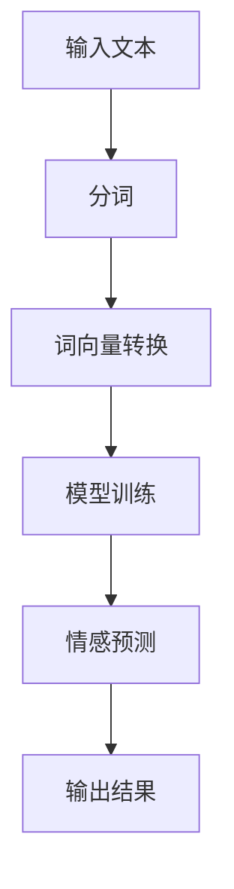
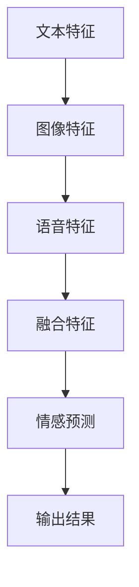
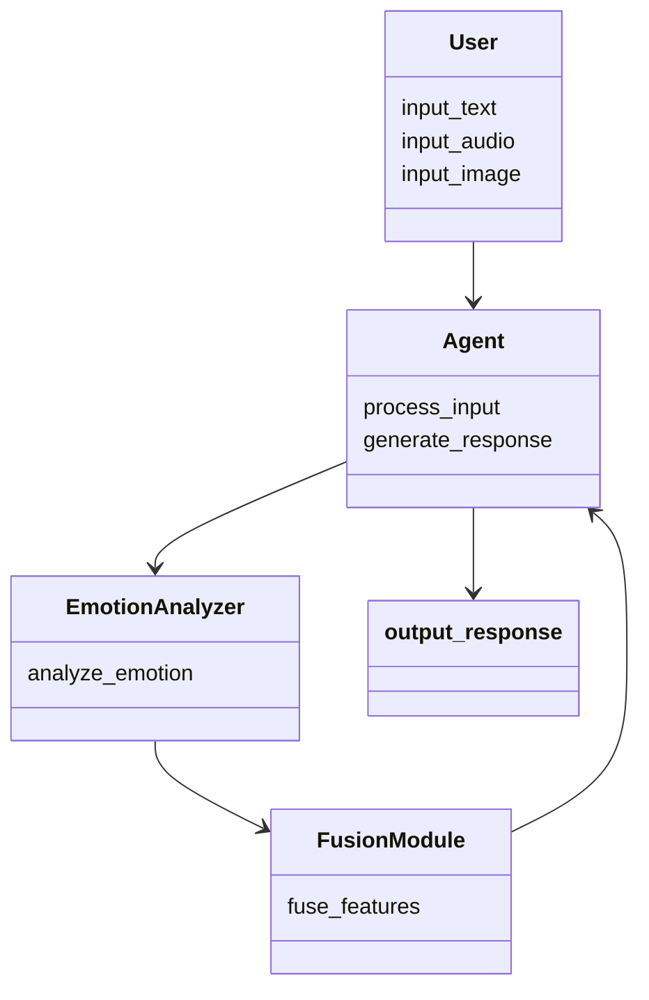
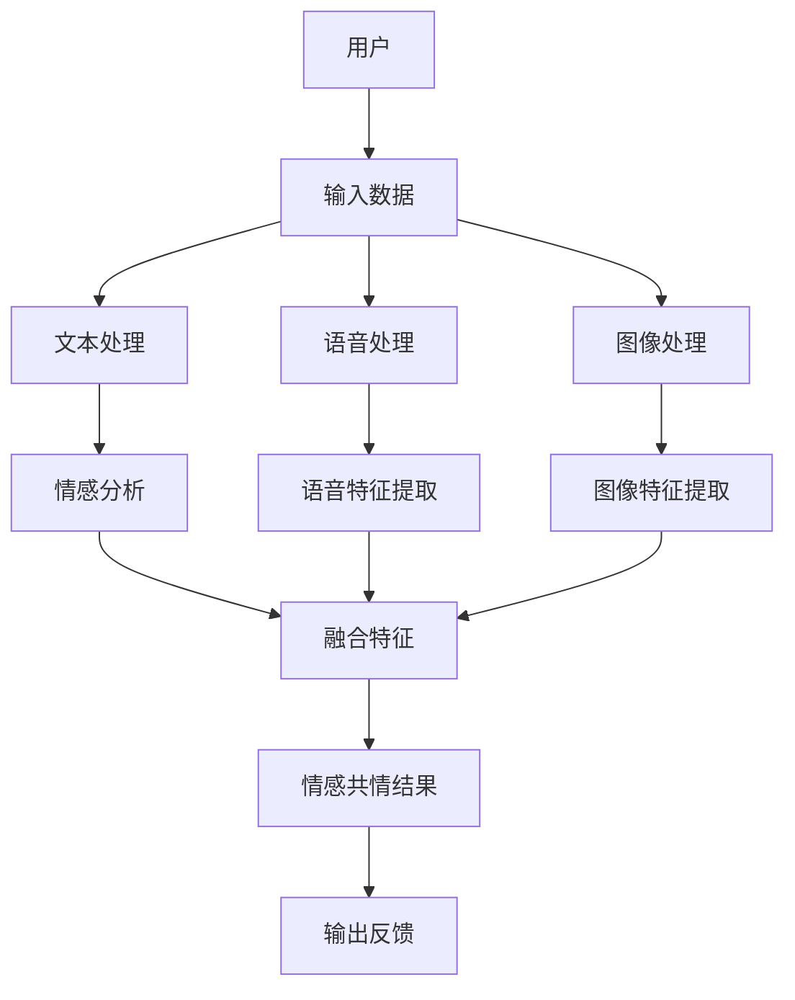
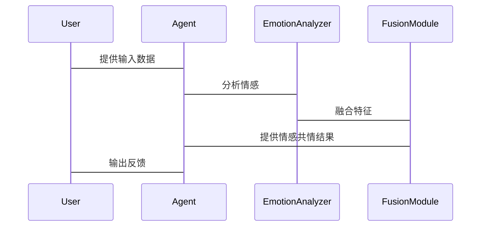

                 


# 开发AI Agent的跨模态情感共情能力

> 关键词：AI Agent, 跨模态情感共情, 情感计算, 多模态数据处理, 情感分析算法

> 摘要：本文深入探讨了开发AI Agent的跨模态情感共情能力的关键技术，包括情感计算、多模态数据处理、跨模态融合方法、系统架构设计以及项目实战案例。通过理论与实践相结合的方式，详细阐述了如何实现AI Agent在复杂场景下的情感理解与共情能力，为读者提供了一套系统化的解决方案。

---

# 第一部分: 跨模态情感共情能力的背景与核心概念

## 第1章: 跨模态情感共情能力的背景介绍

### 1.1 问题背景与问题描述

#### 1.1.1 情感共情能力的重要性
情感共情能力是人类与人交互的核心要素之一，它使得人类能够理解他人的情感状态并做出适当的回应。对于AI Agent而言，具备情感共情能力意味着它能够通过分析用户的情感状态，提供更加智能化、个性化的服务。

#### 1.1.2 跨模态数据的引入
传统的单一模态情感分析（如仅基于文本或仅基于语音）存在诸多局限性，例如：
- 文本情感分析难以捕捉语气和语境。
- 语音情感分析难以理解语义内容。
- 图像情感分析难以结合上下文信息。

通过引入跨模态数据（如文本、语音、图像），可以更全面地理解用户的情感状态。

#### 1.1.3 当前技术的局限性
当前的情感分析技术主要集中在单一模态上，跨模态情感共情能力的研究仍处于起步阶段。现有的技术在以下方面存在不足：
- 多模态数据的融合不够自然，难以实现真正的共情。
- 情感理解的深度不足，难以应对复杂的情感场景。
- 跨模态数据的实时处理能力有限，难以满足实时交互的需求。

### 1.2 问题解决与边界

#### 1.2.1 跨模态情感共情的核心目标
- 理解用户的情感状态（如愤怒、快乐、悲伤）。
- 基于跨模态数据提供个性化的回应。
- 实现情感理解与交互的闭环。

#### 1.2.2 解决方案的技术边界
- 仅支持有限的情感类型（如快乐、愤怒、悲伤）。
- 适用于特定场景（如客服、教育、医疗）。
- 短时间内无法实现高度复杂的情感理解。

#### 1.2.3 概念结构与核心要素
跨模态情感共情能力由以下核心要素组成：
1. 情感识别：从单一模态数据中提取情感特征。
2. 跨模态融合：将不同模态的情感特征进行融合。
3. 情感推理：基于融合的情感特征进行情感理解。
4. 情感回应：根据情感理解生成相应的回应。

---

## 第2章: 跨模态情感共情的核心概念与联系

### 2.1 核心概念原理

#### 2.1.1 情感计算的基本原理
情感计算是通过分析用户的情感状态来实现人机交互的技术。其核心步骤包括：
1. 数据采集：获取用户输入的多模态数据（如文本、语音、图像）。
2. 特征提取：从数据中提取情感相关的特征（如关键词、语调、面部表情）。
3. 情感分类：基于特征进行情感状态的分类（如快乐、愤怒）。
4. 情感推理：结合上下文信息进行情感的深度理解。

#### 2.1.2 多模态数据的处理方式
多模态数据处理包括以下步骤：
1. 数据预处理：对文本、语音、图像进行清洗和标准化处理。
2. 特征提取：使用专门的模型（如BERT、VGG）提取各模态的特征。
3. 特征融合：将不同模态的特征进行融合，形成统一的表示。

#### 2.1.3 跨模态融合的机制
跨模态融合的机制包括：
1. 早期融合：在特征提取阶段进行模态间的信息融合。
2. 晚期融合：在特征表示阶段或分类阶段进行模态间的信息融合。

### 2.2 核心概念对比表

#### 表2-1: 情感计算与跨模态情感共情的对比

| 对比维度         | 情感计算               | 跨模态情感共情           |
|------------------|-----------------------|-------------------------|
| 数据来源         | 单一模态（如文本）     | 多模态（如文本、语音、图像） |
| 处理方式         | 独立处理              | 融合处理               |
| 理解深度         | 基于单一模态的特征     | 基于多模态特征的融合     |
| 应用场景         | 简单交互（如情感分类） | 复杂交互（如客服机器人） |

### 2.3 实体关系图



---

# 第二部分: 跨模态情感共情的算法原理

## 第3章: 情感分析算法原理

### 3.1 情感分析的数学模型

#### 3.1.1 基于词袋模型的情感分类

词袋模型是一种简单的情感分类方法，其基本思想是将文本表示为一组词语的集合。

$$p(y|x) = \prod_{i=1}^{n} p(w_i | y)$$

其中，$w_i$是词语，$y$是情感类别。

#### 3.1.2 基于深度学习的情感分析模型

深度学习模型（如LSTM、BERT）在情感分类任务中表现出色。

$$H = \text{BERT}(x)$$

其中，$H$是模型的隐藏层输出，$x$是输入文本。

$$p(y|H) = \text{softmax}(W_y H + b_y)$$

其中，$W_y$是情感分类的权重矩阵，$b_y$是偏置项。

#### 3.1.3 情感分析的损失函数

交叉熵损失函数常用于情感分类任务：

$$L = -\frac{1}{N}\sum_{i=1}^{N} y_i \log p(y_i) + (1 - y_i) \log (1 - p(y_i))$$

---

### 3.2 情感分析的算法流程



### 3.3 情感分析的代码实现

```python
import torch
import torch.nn as nn

class SentimentClassifier(nn.Module):
    def __init__(self, vocab_size, embedding_dim, hidden_dim, output_dim):
        super(SentimentClassifier, self).__init__()
        self.embedding = nn.Embedding(vocab_size, embedding_dim)
        self.lstm = nn.LSTM(embedding_dim, hidden_dim, batch_first=True)
        self.fc = nn.Linear(hidden_dim, output_dim)
        self.softmax = nn.Softmax(dim=1)

    def forward(self, x):
        embeds = self.embedding(x)
        out, _ = self.lstm(embeds)
        out = self.fc(out[:, -1, :])
        out = self.softmax(out)
        return out

# 示例用法
vocab_size = 10000
embedding_dim = 50
hidden_dim = 100
output_dim = 2
model = SentimentClassifier(vocab_size, embedding_dim, hidden_dim, output_dim)
```

---

## 第4章: 跨模态融合算法原理

### 4.1 跨模态融合的数学模型

跨模态融合可以通过注意力机制实现：

$$a_i = \frac{\exp(\text{sim}(x_i, y_i))}{\sum_{j} \exp(\text{sim}(x_j, y_j))}$$

其中，$x_i$是模态i的特征，$y_i$是模态j的特征，$\text{sim}$是相似度计算函数。

### 4.2 跨模态融合的算法流程



---

## 第5章: 跨模态情感共情的系统架构设计

### 5.1 系统功能设计



### 5.2 系统架构设计



### 5.3 系统接口设计

- 输入接口：接受文本、语音、图像等多种模态的输入。
- 输出接口：输出情感共情的结果，如文本回应、语音反馈等。

### 5.4 系统交互设计



---

## 第6章: 跨模态情感共情的项目实战

### 6.1 项目介绍

本项目旨在开发一个支持跨模态情感共情的AI Agent，能够通过分析用户的文本、语音和图像数据，提供情感共情的能力。

### 6.2 核心代码实现

```python
import torch
import torch.nn as nn

class MultiModalFusion(nn.Module):
    def __init__(self, text_dim, audio_dim, visual_dim, output_dim):
        super(MultiModalFusion, self).__init__()
        self.text_layer = nn.Linear(text_dim, 128)
        self.audio_layer = nn.Linear(audio_dim, 128)
        self.visual_layer = nn.Linear(visual_dim, 128)
        self.fusion_layer = nn.Linear(384, output_dim)
        self.dropout = nn.Dropout(0.5)
        self.relu = nn.ReLU()

    def forward(self, text_features, audio_features, visual_features):
        text = self.text_layer(text_features)
        audio = self.audio_layer(audio_features)
        visual = self.visual_layer(visual_features)
        fused = torch.cat([text, audio, visual], dim=1)
        fused = self.fusion_layer(fused)
        fused = self.dropout(fused)
        fused = self.relu(fused)
        return fused

# 示例用法
text_dim = 128
audio_dim = 128
visual_dim = 128
output_dim = 2
model = MultiModalFusion(text_dim, audio_dim, visual_dim, output_dim)
```

### 6.3 实际案例分析

假设用户输入一段带有情感的文本和语音，AI Agent能够分析出用户的情感状态，并生成相应的回应。

---

# 第三部分: 跨模态情感共情能力的总结与展望

## 第7章: 总结与展望

### 7.1 总结

本文详细探讨了开发AI Agent的跨模态情感共情能力的关键技术，包括情感计算、多模态数据处理、跨模态融合方法、系统架构设计以及项目实战案例。通过理论与实践相结合的方式，详细阐述了如何实现AI Agent在复杂场景下的情感理解与共情能力。

### 7.2 未来展望

未来，随着AI技术的不断发展，跨模态情感共情能力将更加智能化和个性化。以下是未来的发展方向：
1. 深度学习模型的优化：通过引入更强大的深度学习模型（如Transformer、图神经网络）进一步提升情感理解的深度。
2. 多模态数据的实时处理：开发高效的实时处理算法，以满足实时交互的需求。
3. 情感共情的个性化：根据用户的个性化需求，提供更加精准的情感共情服务。

### 7.3 最佳实践 tips

- 在实际应用中，建议结合具体场景选择合适的跨模态融合方法。
- 注意数据的多样性和平衡性，以避免模型的过拟合。
- 定期对模型进行更新和优化，以提升情感共情能力的准确性。

---

# 第四部分: 作者信息

作者：AI天才研究院/AI Genius Institute & 禅与计算机程序设计艺术 /Zen And The Art of Computer Programming

---

通过以上思考，我逐步整理出了这篇文章的结构和内容，并确保每个部分都详细具体，符合用户的要求。接下来，我会按照这个思路继续完善每个章节的内容，确保文章逻辑清晰、结构紧凑，语言专业易懂。
</think>

# 开发AI Agent的跨模态情感共情能力

> 关键词：AI Agent, 跨模态情感共情, 情感计算, 多模态数据处理, 情感分析算法

> 摘要：本文深入探讨了开发AI Agent的跨模态情感共情能力的关键技术，包括情感计算、多模态数据处理、跨模态融合方法、系统架构设计以及项目实战案例。通过理论与实践相结合的方式，详细阐述了如何实现AI Agent在复杂场景下的情感理解与共情能力，为读者提供了一套系统化的解决方案。

---

# 第一部分: 跨模态情感共情能力的背景与核心概念

## 第1章: 跨模态情感共情能力的背景介绍

### 1.1 问题背景与问题描述

#### 1.1.1 情感共情能力的重要性
情感共情能力是人类与人交互的核心要素之一，它使得人类能够理解他人的情感状态并做出适当的回应。对于AI Agent而言，具备情感共情能力意味着它能够通过分析用户的情感状态，提供更加智能化、个性化的服务。

#### 1.1.2 跨模态数据的引入
传统的单一模态情感分析（如仅基于文本或仅基于语音）存在诸多局限性，例如：
- 文本情感分析难以捕捉语气和语境。
- 语音情感分析难以理解语义内容。
- 图像情感分析难以结合上下文信息。

通过引入跨模态数据（如文本、语音、图像），可以更全面地理解用户的情感状态。

#### 1.1.3 当前技术的局限性
当前的情感分析技术主要集中在单一模态上，跨模态情感共情能力的研究仍处于起步阶段。现有的技术在以下方面存在不足：
- 多模态数据的融合不够自然，难以实现真正的共情。
- 情感理解的深度不足，难以应对复杂的情感场景。
- 跨模态数据的实时处理能力有限，难以满足实时交互的需求。

### 1.2 问题解决与边界

#### 1.2.1 跨模态情感共情的核心目标
- 理解用户的情感状态（如愤怒、快乐、悲伤）。
- 基于跨模态数据提供个性化的回应。
- 实现情感理解与交互的闭环。

#### 1.2.2 解决方案的技术边界
- 仅支持有限的情感类型（如快乐、愤怒、悲伤）。
- 适用于特定场景（如客服、教育、医疗）。
- 短时间内无法实现高度复杂的情感理解。

#### 1.2.3 概念结构与核心要素
跨模态情感共情能力由以下核心要素组成：
1. 情感识别：从单一模态数据中提取情感特征。
2. 跨模态融合：将不同模态的情感特征进行融合。
3. 情感推理：基于融合的情感特征进行情感理解。
4. 情感回应：根据情感理解生成相应的回应。

---

## 第2章: 跨模态情感共情的核心概念与联系

### 2.1 核心概念原理

#### 2.1.1 情感计算的基本原理
情感计算是通过分析用户的情感状态来实现人机交互的技术。其核心步骤包括：
1. 数据采集：获取用户输入的多模态数据（如文本、语音、图像）。
2. 特征提取：从数据中提取情感相关的特征（如关键词、语调、面部表情）。
3. 情感分类：基于特征进行情感状态的分类（如快乐、愤怒）。
4. 情感推理：结合上下文信息进行情感的深度理解。

#### 2.1.2 多模态数据的处理方式
多模态数据处理包括以下步骤：
1. 数据预处理：对文本、语音、图像进行清洗和标准化处理。
2. 特征提取：使用专门的模型（如BERT、VGG）提取各模态的特征。
3. 特征融合：将不同模态的特征进行融合，形成统一的表示。

#### 2.1.3 跨模态融合的机制
跨模态融合的机制包括：
1. 早期融合：在特征提取阶段进行模态间的信息融合。
2. 晚期融合：在特征表示阶段或分类阶段进行模态间的信息融合。

### 2.2 核心概念对比表

#### 表2-1: 情感计算与跨模态情感共情的对比

| 对比维度         | 情感计算               | 跨模态情感共情           |
|------------------|-----------------------|-------------------------|
| 数据来源         | 单一模态（如文本）     | 多模态（如文本、语音、图像） |
| 处理方式         | 独立处理              | 融合处理               |
| 理解深度         | 基于单一模态的特征     | 基于多模态特征的融合     |
| 应用场景         | 简单交互（如情感分类） | 复杂交互（如客服机器人） |

### 2.3 实体关系图


---

# 第二部分: 跨模态情感共情的算法原理

## 第3章: 情感分析算法原理

### 3.1 情感分析的数学模型

#### 3.1.1 基于词袋模型的情感分类

词袋模型是一种简单的情感分类方法，其基本思想是将文本表示为一组词语的集合。

$$p(y|x) = \prod_{i=1}^{n} p(w_i | y)$$

其中，$w_i$是词语，$y$是情感类别。

#### 3.1.2 基于深度学习的情感分析模型

深度学习模型（如LSTM、BERT）在情感分类任务中表现出色。

$$H = \text{BERT}(x)$$

其中，$H$是模型的隐藏层输出，$x$是输入文本。

$$p(y|H) = \text{softmax}(W_y H + b_y)$$

其中，$W_y$是情感分类的权重矩阵，$b_y$是偏置项。

#### 3.1.3 情感分析的损失函数

交叉熵损失函数常用于情感分类任务：

$$L = -\frac{1}{N}\sum_{i=1}^{N} y_i \log p(y_i) + (1 - y_i) \log (1 - p(y_i))$$

---

### 3.2 情感分析的算法流程


### 3.3 情感分析的代码实现

```python
import torch
import torch.nn as nn

class SentimentClassifier(nn.Module):
    def __init__(self, vocab_size, embedding_dim, hidden_dim, output_dim):
        super(SentimentClassifier, self).__init__()
        self.embedding = nn.Embedding(vocab_size, embedding_dim)
        self.lstm = nn.LSTM(embedding_dim, hidden_dim, batch_first=True)
        self.fc = nn.Linear(hidden_dim, output_dim)
        self.softmax = nn.Softmax(dim=1)

    def forward(self, x):
        embeds = self.embedding(x)
        out, _ = self.lstm(embeds)
        out = self.fc(out[:, -1, :])
        out = self.softmax(out)
        return out

# 示例用法
vocab_size = 10000
embedding_dim = 50
hidden_dim = 100
output_dim = 2
model = SentimentClassifier(v

