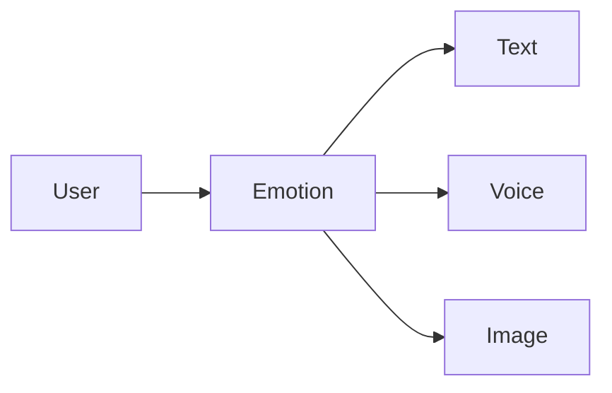
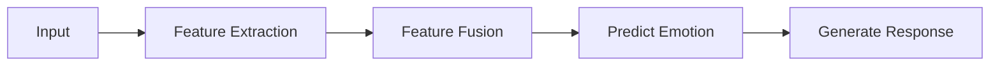
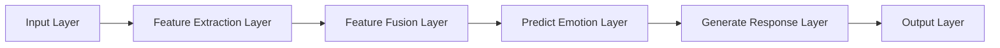

                 


# 开发AI Agent的跨模态情感调节系统

## 关键词：AI Agent，跨模态情感调节，情感计算，多模态数据融合，人机交互，情感反馈机制

## 摘要：本文详细探讨了开发AI Agent的跨模态情感调节系统的背景、核心概念、算法原理、系统架构和项目实战。通过理论分析和实践案例，展示了如何利用多模态数据（文本、语音、图像）实现情感计算和调节，构建高效的情感反馈机制，提升人机交互体验。

---

# 第一部分: 背景与核心概念

## 第1章: AI Agent与跨模态情感调节系统概述

### 1.1 问题背景与描述
#### 1.1.1 情感计算与人机交互的现状
随着人工智能技术的快速发展，AI Agent（智能体）在各个领域的应用越来越广泛。然而，现有的AI Agent在情感理解和调节方面还存在诸多不足。传统的情感计算方法主要依赖单一模态的数据（如文本或语音），难以准确捕捉用户的情感状态，尤其是在复杂场景下，情感信息的缺失会导致交互体验下降。

#### 1.1.2 跨模态数据在情感调节中的作用
跨模态数据（如文本、语音、图像）的结合能够提供更全面的情感信息。例如，通过分析用户的文本内容、语调和面部表情，可以更准确地判断其情感状态。跨模态情感调节系统能够根据多源信息提供更精准的情感反馈，从而提升人机交互的自然性和智能化水平。

#### 1.1.3 当前情感调节系统的局限性
当前的情感调节系统主要依赖单一模态的数据，难以应对复杂场景下的情感计算需求。此外，现有系统在跨模态数据融合、情感反馈机制等方面存在技术瓶颈，导致情感调节的效果有限。

### 1.2 问题解决与边界
#### 1.2.1 跨模态情感调节的核心目标
跨模态情感调节系统的核心目标是通过整合多种模态的数据，准确识别和理解用户的情感状态，并提供个性化的反馈机制，以提升人机交互的体验。

#### 1.2.2 系统的边界与适用场景
系统的边界包括：支持多种模态数据的输入（如文本、语音、图像），适用于需要情感交互的场景（如智能客服、教育辅助、智能家居等）。系统不支持实时物理环境数据的处理，也不涉及对用户行为的实时控制。

#### 1.2.3 相关概念的外延与限制
跨模态情感调节系统的外延包括情感计算、数据融合、反馈机制等技术领域。其限制主要体现在多模态数据处理的复杂性、情感计算的准确性以及系统的实时性等方面。

### 1.3 核心概念结构
#### 1.3.1 情感调节系统的基本组成
跨模态情感调节系统通常包括以下几个基本组成部分：
1. 数据采集模块：负责收集用户输入的多模态数据（如文本、语音、图像）。
2. 特征提取模块：对采集的数据进行特征提取，生成可用于情感计算的特征向量。
3. 情感计算模块：基于特征向量，利用机器学习或深度学习算法，计算用户的情感状态。
4. 反馈生成模块：根据情感计算结果，生成相应的反馈信息（如文本、语音、图像等）。
5. 反馈输出模块：将反馈信息输出给用户，完成情感调节的过程。

#### 1.3.2 跨模态数据的处理流程
跨模态数据的处理流程包括以下步骤：
1. 数据采集：通过多种传感器或接口获取用户的多模态数据。
2. 数据预处理：对采集的数据进行清洗、标准化等处理，确保数据的可用性。
3. 特征提取：从预处理后的数据中提取有助于情感计算的特征。
4. 数据融合：将不同模态的特征进行融合，生成综合特征向量。
5. 情感计算：基于综合特征向量，计算用户的情感状态。
6. 反馈生成：根据情感计算结果，生成相应的反馈信息。
7. 反馈输出：将反馈信息输出给用户，完成情感调节的过程。

#### 1.3.3 系统功能模块的划分
系统功能模块的划分如下：
1. 数据采集模块：负责采集用户的多模态数据。
2. 特征提取模块：负责从采集的数据中提取特征。
3. 数据融合模块：负责将不同模态的特征进行融合。
4. 情感计算模块：负责计算用户的情感状态。
5. 反馈生成模块：负责生成相应的反馈信息。
6. 反馈输出模块：负责将反馈信息输出给用户。

## 第2章: 跨模态情感调节系统的核心概念与联系

### 2.1 核心概念原理
#### 2.1.1 情感计算的数学模型
情感计算的数学模型可以采用多种方法，如基于统计学习的模型（如朴素贝叶斯、支持向量机）和基于深度学习的模型（如LSTM、Transformer）。这里以基于Transformer的情感计算模型为例：

$$
\text{Emotion} = f_{\text{Transformer}}(X)
$$

其中，$X$ 是输入的特征向量，$f_{\text{Transformer}}$ 是 Transformer 模型的函数。

#### 2.1.2 跨模态数据融合的机制
跨模态数据融合的机制可以采用加性融合、乘性融合或注意力机制。例如，基于注意力机制的融合方法可以表示为：

$$
\alpha_i = \frac{\exp(a_i)}{\sum_{j} \exp(a_j)}
$$

其中，$\alpha_i$ 是第 $i$ 个模态的注意力权重，$a_i$ 是对应的注意力得分。

#### 2.1.3 情感调节的反馈机制
情感调节的反馈机制可以通过生成文本、语音或图像来实现。例如，基于生成模型（如GPT、BERT）生成文本反馈：

$$
Y = G_{\text{text}}(X)
$$

其中，$Y$ 是生成的文本反馈，$G_{\text{text}}$ 是文本生成模型。

### 2.2 概念属性对比表
#### 表2.1: 不同情感计算方法的对比

| 方法          | 优点                          | 缺点                          |
|---------------|-------------------------------|-------------------------------|
| 朴素贝叶斯    | 简单、计算效率高              | 准确率较低                    |
| 支持向量机     | 准确率高                      | 对非线性数据处理能力有限      |
| LSTM          | 能够处理时序数据              | 对长序列依赖关系建模能力有限  |
| Transformer    | 并行计算能力强、效果好        | 计算资源消耗较大              |

#### 表2.2: 跨模态数据融合的特征分析

| 特征          | 文本模态    | 语音模态    | 图像模态    |
|---------------|------------|------------|------------|
| 时序性         | 高         | 高         | 低         |
| 频率          | 文本频率    | 音频频率    | 图像频率    |
| 信息密度       | 高         | 中         | 高         |

### 2.3 ER实体关系图


---

# 第二部分: 算法原理

## 第3章: 跨模态情感调节系统的算法原理

### 3.1 算法原理概述
#### 3.1.1 情感计算的模型选择
情感计算的模型选择需要考虑数据的模态、规模和计算资源。基于Transformer的模型在情感计算中表现出色，但计算资源消耗较大。因此，在实际应用中需要权衡模型的性能和资源消耗。

#### 3.1.2 跨模态数据融合的方法
跨模态数据融合的方法包括特征级融合、决策级融合和混合融合。特征级融合通过对不同模态的特征向量进行加权求和或拼接实现，而决策级融合则通过将不同模态的情感计算结果进行加权求和或投票实现。

#### 3.1.3 情感调节的优化策略
情感调节的优化策略可以通过强化学习（如Q-learning）或监督学习（如标签传播）实现。例如，基于强化学习的优化策略可以表示为：

$$
Q(s, a) = r + \max_{a'} Q(s', a')
$$

其中，$s$ 是当前状态，$a$ 是当前动作，$r$ 是奖励，$s'$ 是下一个状态。

### 3.2 算法流程图


### 3.3 算法实现代码
```python
import torch
import torch.nn as nn
import torch.nn.functional as F

class Transformer(nn.Module):
    def __init__(self, d_model, n_head, dff):
        super(Transformer, self).__init__()
        self.embedding = nn.Linear(d_model, d_model)
        self.transformer = nn.Transformer(
            d_model=d_model,
            nhead=n_head,
            dff=dff
        )

    def forward(self, x):
        x = self.embedding(x)
        x = self.transformer(x)
        return x

# 示例代码：跨模态数据融合
def feature_fusion(text_features, voice_features, image_features):
    fused_features = torch.cat(
        [text_features, voice_features, image_features],
        dim=1
    )
    return fused_features

# 示例代码：情感计算
def compute_emotion(fused_features):
    model = Transformer(d_model=512, n_head=8, dff=1024)
    emotion_logits = model(fused_features)
    emotion_probs = F.softmax(emotion_logits, dim=1)
    return emotion_probs

# 示例代码：反馈生成
def generate_feedback(emotion_probs):
    # 假设emotion_probs是一个概率分布
    feedback = []
    for prob in emotion_probs:
        # 根据概率选择反馈类型
        if prob[0] > 0.5:
            feedback.append("文本反馈1")
        elif prob[1] > 0.5:
            feedback.append("语音反馈1")
        else:
            feedback.append("图像反馈1")
    return feedback
```

---

## 第4章: 跨模态情感调节系统的系统架构设计

### 4.1 系统功能设计
#### 4.1.1 领域模型设计


#### 4.1.2 系统架构设计


#### 4.1.3 系统接口设计
系统接口设计需要考虑输入输出的格式和数据类型。例如，输入接口需要支持文本、语音和图像数据的接收，输出接口需要支持文本、语音和图像反馈的生成。

#### 4.1.4 系统交互设计
系统交互设计需要考虑用户的使用场景和需求。例如，在智能客服场景下，系统需要实时响应用户的情感状态，并根据情感计算结果生成相应的反馈信息。

---

## 第5章: 跨模态情感调节系统的项目实战

### 5.1 项目环境安装
开发跨模态情感调节系统需要以下环境和工具：
1. Python 3.8+
2. PyTorch 1.9+
3. Transformers库
4. 其他相关库（如 libros、OpenCV）

### 5.2 核心实现代码
```python
import torch
import torch.nn as nn
import torch.nn.functional as F
from transformers import AutoTokenizer, AutoModel

class MultiModalEmotionRegulator(nn.Module):
    def __init__(self, config):
        super().__init__()
        self.text_model = AutoModel.from_pretrained(config.text_model)
        self.voice_model = AutoModel.from_pretrained(config.voice_model)
        self.image_model = AutoModel.from_pretrained(config.image_model)
        self.fusion_layer = nn.Linear(config.fusion_dim, config.hidden_dim)
        self.emotion_classifier = nn.Linear(config.hidden_dim, config.num_emotions)

    def forward(self, text_input, voice_input, image_input):
        text_features = self.text_model(text_input)[0]
        voice_features = self.voice_model(voice_input)[0]
        image_features = self.image_model(image_input)[0]
        fused_features = torch.cat([text_features, voice_features, image_features], dim=1)
        fused_features = F.relu(self.fusion_layer(fused_features))
        emotion_logits = self.emotion_classifier(fused_features)
        emotion_probs = F.softmax(emotion_logits, dim=1)
        return emotion_probs

# 示例代码：系统架构实现
def main():
    config = Config(
        text_model="bert-base",
        voice_model="wav2vec2",
        image_model="vgg16",
        fusion_dim=512,
        hidden_dim=1024,
        num_emotions=6
    )
    regulator = MultiModalEmotionRegulator(config)
    regulator.train()

if __name__ == "__main__":
    main()
```

---

## 第6章: 总结与展望

### 6.1 总结
跨模态情感调节系统的核心是通过整合多种模态的数据，准确识别和理解用户的情感状态，并提供个性化的反馈机制，以提升人机交互的自然性和智能化水平。本文详细探讨了系统的背景、核心概念、算法原理、系统架构和项目实战，展示了如何利用多模态数据实现情感计算和调节。

### 6.2 展望
未来的研究方向包括：
1. 提高跨模态数据融合的精度和效率。
2. 优化情感计算模型的性能和实时性。
3. 探索更丰富的情感反馈机制，如动态调整反馈内容和形式。
4. 研究跨模态情感调节系统在更多领域的应用，如医疗、教育、娱乐等。

---

## 作者：AI天才研究院/AI Genius Institute & 禅与计算机程序设计艺术 /Zen And The Art of Computer Programming

---

以上是《开发AI Agent的跨模态情感调节系统》的完整目录和内容框架。通过系统的理论分析和实践案例，展示了如何利用多模态数据实现情感计算和调节，构建高效的情感反馈机制，提升人机交互体验。

