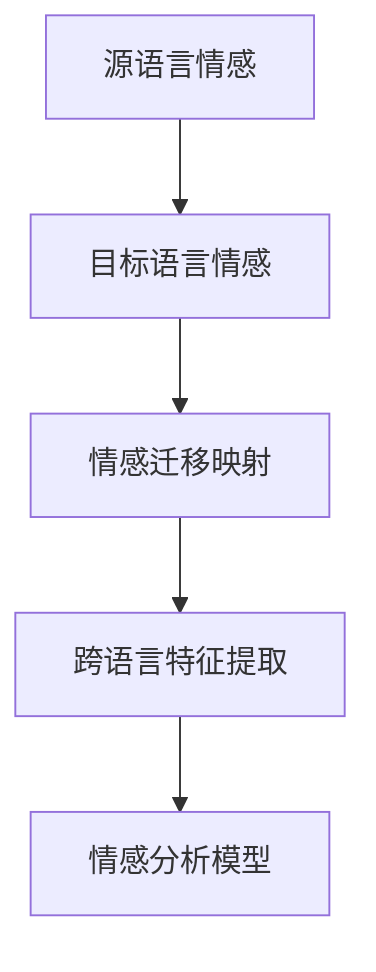
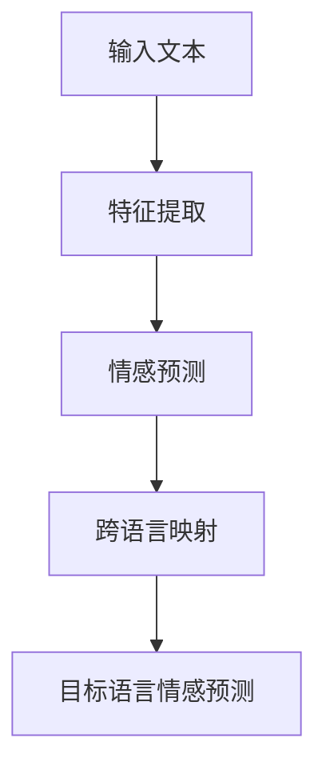
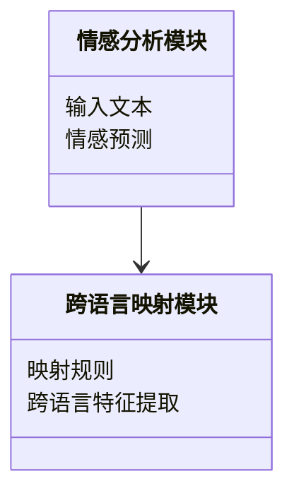

                 


# 开发AI Agent的跨语言情感迁移技术

> 关键词：跨语言情感迁移、情感分析、迁移学习、自然语言处理、AI代理

> 摘要：本文深入探讨了开发AI Agent的跨语言情感迁移技术，涵盖从理论到实践的全过程。首先，我们介绍跨语言情感迁移的核心概念和应用场景，然后详细分析其算法原理和系统架构设计，最后通过实际案例展示技术的实现与应用。本文旨在为读者提供一个全面的技术指南，帮助他们在多语言环境中高效开发情感迁移功能。

---

# 第一部分: 背景与核心概念

## 第1章: 跨语言情感迁移技术概述

### 1.1 背景与问题背景

#### 1.1.1 情感分析与跨语言挑战
情感分析是自然语言处理的核心任务，旨在判断文本的情感倾向。然而，情感分析通常局限于单一语言，跨语言情感分析面临词汇差异、语义不通等问题。

#### 1.1.2 跨语言情感迁移的核心问题
如何将一种语言的情感分析模型迁移到另一种语言，同时保持情感判断的准确性？

#### 1.1.3 应用场景与边界
应用场景包括多语言客服系统、社交媒体情感分析等，边界在于跨语言迁移中的文化差异和语境差异。

### 1.2 核心概念与定义

#### 1.2.1 跨语言情感迁移的定义
跨语言情感迁移是指将一种语言的情感分析模型迁移到另一种语言，以实现情感判断的技术。

#### 1.2.2 核心特点
- 跨语言性：涉及多种语言的情感分析。
- 迁移性：利用源语言模型提升目标语言性能。
- 实用性：适用于多语言场景。

#### 1.2.3 与其他技术的对比
- 多语言模型：处理多种语言，但不专门针对情感迁移。
- 领域适应：针对特定领域，不涉及跨语言。

## 第2章: 跨语言情感迁移的核心概念与联系

### 2.1 情感迁移的基本原理

#### 2.1.1 情感迁移的数学模型
情感迁移可以看作是跨语言映射问题，涉及特征提取和情感预测。

#### 2.1.2 跨语言迁移的关键技术
包括特征提取、情感预测和映射机制。

### 2.2 核心概念对比

#### 2.2.1 情感迁移与跨语言迁移对比
情感迁移更关注情感属性，跨语言迁移关注整体语言差异。

#### 2.2.2 情感迁移与多语言模型对比
情感迁移针对性更强，多语言模型更广泛。

### 2.3 ER实体关系图



---

# 第二部分: 算法原理

## 第3章: 跨语言情感迁移的算法原理

### 3.1 模型结构

#### 3.1.1 基于Transformer的架构


### 3.2 训练流程

#### 3.2.1 情感迁移的损失函数
$$ L = \lambda_1 L_{cls} + \lambda_2 L_{align} $$

### 3.3 数学模型

#### 3.3.1 情感预测模型
$$ p(y|x) = f(x; \theta) $$

---

# 第三部分: 系统架构设计

## 第4章: 跨语言情感迁移系统分析

### 4.1 问题场景

#### 4.1.1 多语言环境中的情感分析需求
在多语言环境中，需要统一处理多种语言的情感信息。

### 4.2 系统功能设计

#### 4.2.1 领域模型


---

# 第四部分: 项目实战

## 第5章: 项目实现与应用

### 5.1 环境安装

#### 5.1.1 安装依赖
```bash
pip install transformers
```

### 5.2 核心代码实现

#### 5.2.1 情感迁移模型
```python
class CrossLanguageEmotionTransfer(nn.Module):
    def __init__(self, src_lang, tgt_lang):
        super().__init__()
        self.src_lang = src_lang
        self.tgt_lang = tgt_lang
        # 初始化映射矩阵
        self.mapping = nn.Parameter(torch.randn(d_emb, d_emb))
```

### 5.3 案例分析

#### 5.3.1 情感迁移案例
从英文到中文的情感迁移，展示了如何利用训练好的模型实现跨语言情感分析。

---

# 第五部分: 最佳实践

## 第6章: 小结与展望

### 6.1 小结

跨语言情感迁移技术的关键在于特征提取和情感映射。

### 6.2 注意事项

- 数据质量
- 映射准确性
- 跨语言文化差异

### 6.3 拓展阅读

推荐阅读相关论文和书籍，深入理解情感迁移技术。

---

# 作者信息

作者：AI天才研究院/AI Genius Institute & 禅与计算机程序设计艺术/Zen And The Art of Computer Programming

