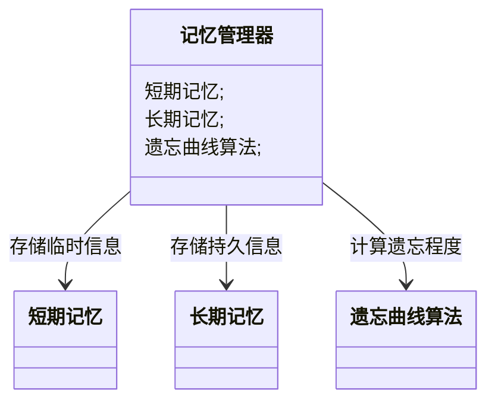

                 


# 开发AI Agent的长短期记忆管理：平衡效率与信息保留

---

## 关键词
AI Agent、长短期记忆、信息保留、效率优化、内存管理、算法实现

---

## 摘要
在AI Agent的开发中，长短期记忆管理是一个关键挑战。本文详细探讨了AI Agent的长短期记忆管理，分析了平衡效率与信息保留的策略。通过遗忘曲线原理、分层存储机制和动态访问优化算法，结合系统架构设计和实际项目案例，为开发者提供实用的解决方案。本文旨在帮助AI开发者在实际应用中优化记忆管理，提升系统性能。

---

## 第一部分：背景介绍

### 第1章：AI Agent与记忆管理概述

#### 1.1 AI Agent的基本概念
- **1.1.1 AI Agent的定义与分类**
  - AI Agent是能够感知环境并采取行动以实现目标的智能体。常见的分类包括基于规则的Agent、基于模型的Agent和基于学习的Agent。
- **1.1.2 AI Agent的记忆机制的重要性**
  - 记忆机制是AI Agent的核心，负责存储和检索信息以支持决策和行动。
- **1.1.3 长短期记忆管理的背景与问题描述**
  - 随着AI Agent处理的任务复杂性增加，如何高效管理长短期记忆成为关键问题。

#### 1.2 长短期记忆管理的必要性
- **1.2.1 长期记忆的存储机制**
  - 长期记忆用于存储持久信息，如知识库中的数据。
- **1.2.2 短期记忆的存储机制**
  - 短期记忆用于临时存储当前任务所需的信息。
- **1.2.3 平衡效率与信息保留的意义**
  - 在保证信息保留的同时，提高访问效率，减少资源消耗。

#### 1.3 当前AI Agent记忆管理中的问题
- **1.3.1 信息过载与处理效率的矛盾**
  - 过多的信息存储导致处理效率低下。
- **1.3.2 信息遗忘与保留的挑战**
  - 如何选择性遗忘无用信息，保留有用信息。
- **1.3.3 知识更新与遗忘的平衡点**
  - 动态调整记忆内容，确保信息的有效性和及时性。

#### 1.4 解决方案概述
- **1.4.1 基于遗忘曲线的记忆管理策略**
  - 应用遗忘曲线模型，优化信息保留和遗忘策略。
- **1.4.2 分层次的记忆存储与检索机制**
  - 将记忆分为短期和长期存储，优化访问效率。
- **1.4.3 动态调整记忆容量与访问效率的方法**
  - 根据需求动态调整记忆存储空间和访问策略。

---

## 第二部分：核心概念与联系

### 第2章：长短期记忆管理的核心概念

#### 2.1 长期记忆与短期记忆的定义与特征
- **2.1.1 长期记忆的定义与特征**
  - 长期记忆存储持久信息，容量大，访问速度慢。
- **2.1.2 短期记忆的定义与特征**
  - 短期记忆存储临时信息，容量小，访问速度快。
- **2.1.3 两者之间的关系与区别**
  - 短期记忆信息可转入长期记忆，长期记忆信息可被短期记忆访问。

#### 2.2 长短期记忆管理的属性特征对比
| 属性       | 长期记忆         | 短期记忆         |
|------------|------------------|------------------|
| 存储容量   | 大               | 小               |
| 持久性     | 高               | 低               |
| 访问效率   | 低               | 高               |

#### 2.3 ER实体关系图与记忆管理架构
```mermaid
erDiagram
    actor 用户
    actor 系统
    actor 算法
    actor 数据库
    用户 --> 算法: 提供输入
    算法 --> 数据库: 存储记忆
    数据库 --> 系统: 提供记忆数据
    系统 --> 用户: 返回输出
```

---

## 第三部分：算法原理讲解

### 第3章：基于遗忘曲线的记忆管理算法

#### 3.1 遗忘曲线原理
- 遗忘曲线描述了人类记忆的遗忘速度，适用于AI Agent的信息保留策略。

#### 3.2 遗忘曲线的数学模型
$$ E(t) = e^{-\frac{t}{\tau}} $$
其中，\( E(t) \) 表示遗忘程度，\( t \) 表示时间，\( \tau \) 为时间常数。

#### 3.3 基于遗忘曲线的记忆管理算法实现
```python
import math

def forgetful_curve(current_memory_strength, time_elapsed):
    tau = 10  # 时间常数，单位：小时
    return math.exp(-time_elapsed / tau)
```

---

## 第四部分：系统分析与架构设计

### 第5章：系统功能设计

#### 5.1 领域模型构建


### 第6章：系统架构设计

#### 6.1 系统架构图
```mermaid
containerDiagram
    container 记忆管理模块 {
        短期记忆;
        长期记忆;
        遗忘曲线算法;
    }
    记忆管理模块 --> 外部系统: 提供记忆数据
```

---

## 第五部分：项目实战

### 第7章：项目环境安装与核心实现

#### 7.1 开发环境安装
- Python 3.8+
- 安装依赖：`pip install numpy matplotlib`

#### 7.2 核心代码实现
```python
import numpy as np
import matplotlib.pyplot as plt

def plot_forget_curve():
    time_points = np.arange(0, 100, 1)
    strengths = np.exp(-time_points / 10)
    plt.plot(time_points, strengths)
    plt.xlabel('Time (hours)')
    plt.ylabel('Memory Strength')
    plt.show()

plot_forget_curve()
```

#### 7.3 代码实现细节分析
- 使用numpy进行计算，matplotlib进行可视化，展示遗忘曲线。

### 第8章：案例分析与性能优化

#### 8.1 案例分析
- 应用遗忘曲线算法，优化短期记忆信息的保留和遗忘策略。

#### 8.2 性能优化策略
- 动态调整遗忘曲线的时间常数，适应不同场景需求。

---

## 第六部分：最佳实践与总结

### 第9章：最佳实践与小结

#### 9.1 最佳实践
- 定期维护记忆数据，确保信息的有效性。
- 根据需求动态调整记忆管理策略。

#### 9.2 小结
- 长短期记忆管理是AI Agent开发中的关键部分，平衡效率与信息保留需要结合遗忘曲线和分层存储策略。

### 第10章：注意事项与拓展阅读

#### 10.1 开发中的注意事项
- 注意数据隐私和安全问题。
- 定期测试和优化记忆管理算法。

#### 10.2 拓展阅读
- 建议阅读相关论文，如《The Decay of Memory》和《Efficient Memory Management in AI Agents》。

---

## 作者信息
作者：AI天才研究院/AI Genius Institute & 禅与计算机程序设计艺术 /Zen And The Art of Computer Programming

