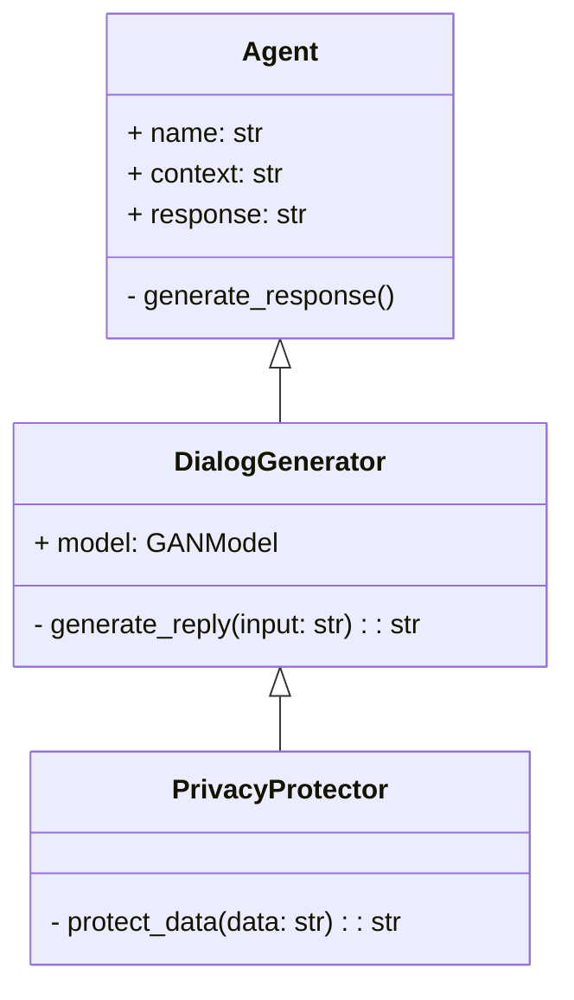
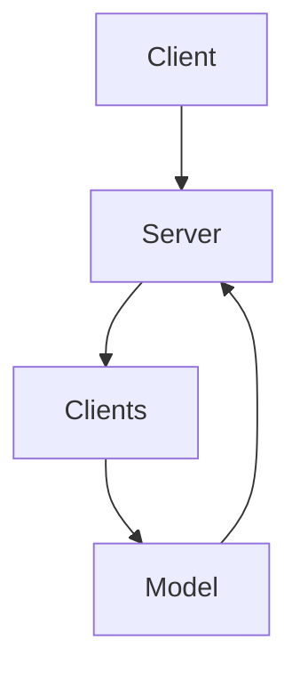
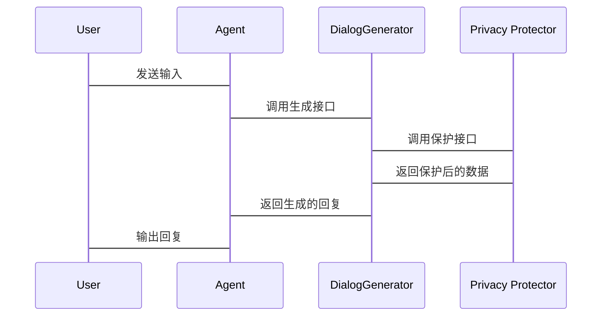

                 


# 开发AI Agent的隐私保护对话生成技术

**关键词**：AI Agent、隐私保护、对话生成技术、生成对抗网络、联邦学习

**摘要**：  
本文详细探讨了开发AI Agent的隐私保护对话生成技术的关键挑战和解决方案。通过分析AI Agent的核心概念、对话生成技术的现状以及隐私保护的重要性，本文提出了一种结合生成对抗网络（GAN）和联邦学习（Federated Learning）的创新方法，确保在生成对话过程中保护用户隐私。文章从理论基础到实际应用，详细阐述了算法原理、系统架构设计、项目实战及最佳实践，为开发者提供了全面的技术指导。

---

## 第一部分: AI Agent与隐私保护对话生成技术背景

### 第1章: AI Agent与隐私保护对话生成技术概述

#### 1.1 问题背景

##### 1.1.1 AI Agent的基本概念  
AI Agent（人工智能代理）是一种能够感知环境、自主决策并执行任务的智能实体。它能够通过与用户的交互，理解用户需求，并提供相应的服务或信息。AI Agent广泛应用于智能助手、推荐系统、聊天机器人等领域。

##### 1.1.2 对话生成技术的现状  
对话生成技术是自然语言处理（NLP）的核心任务之一，旨在让计算机能够生成与人类对话相匹配的自然语言回复。传统的对话生成方法主要基于序列到序列（Sequence-to-Sequence）模型，如循环神经网络（RNN）和变换器（Transformer）。然而，这些方法在处理隐私数据时存在潜在的风险，因为模型可能会泄露训练数据中的敏感信息。

##### 1.1.3 隐私保护的重要性  
随着AI技术的广泛应用，隐私保护成为一个重要议题。特别是在对话生成技术中，用户可能会分享敏感信息（如健康状况、财务数据等），这些信息可能被模型窃取或滥用。因此，保护用户隐私是开发AI Agent对话生成技术的核心挑战之一。

#### 1.2 问题描述

##### 1.2.1 当前对话生成技术的隐私问题  
传统的对话生成模型通常需要大量训练数据，这些数据可能包含用户的敏感信息。模型在训练过程中可能会 memorize这些数据，导致隐私泄露。此外，某些攻击方法（如模型提取攻击）可以通过训练后的模型提取出敏感数据。

##### 1.2.2 AI Agent在对话生成中的挑战  
AI Agent需要实时生成对话回复，这意味着它需要快速处理输入并生成输出。然而，隐私保护技术可能会增加计算开销，影响实时性。此外，如何在保护隐私的同时保持对话的自然性和流畅性也是一个挑战。

##### 1.2.3 隐私保护与对话生成的平衡  
隐私保护与对话生成之间存在一定的矛盾。过于严格的隐私保护可能会限制模型的表达能力，导致对话质量下降。因此，如何在保护隐私的同时，保持对话的自然性和准确性，是开发AI Agent对话生成技术的关键问题。

#### 1.3 解决方案

##### 1.3.1 隐私保护技术的引入  
为了保护用户隐私，可以采用差分隐私（Differential Privacy）或联邦学习（Federated Learning）等技术。这些技术可以在不暴露原始数据的情况下，保护模型的训练过程。

##### 1.3.2 对话生成模型的改进  
改进对话生成模型的结构，使其在生成回复时不会泄露敏感信息。例如，可以采用对抗训练（Adversarial Training）来增强模型的隐私保护能力。

##### 1.3.3 AI Agent的整体架构优化  
优化AI Agent的整体架构，使其在对话生成过程中，能够实时检测和处理潜在的隐私泄露风险。例如，可以在生成回复后，通过隐私保护模块对回复进行检查和修改。

#### 1.4 边界与外延

##### 1.4.1 技术边界  
AI Agent的隐私保护对话生成技术主要关注对话生成过程中的数据隐私保护，不涉及其他任务（如图像识别、语音识别）的隐私保护问题。

##### 1.4.2 应用场景的外延  
虽然本文主要关注AI Agent在对话生成中的应用，但类似的隐私保护技术也可以应用于其他需要实时交互的任务，如智能助手、虚拟客服等。

##### 1.4.3 与其他技术的关联  
隐私保护对话生成技术与数据隐私保护技术（如加密技术、差分隐私）、自然语言处理技术（如Transformer模型）密切相关。

#### 1.5 核心要素组成

##### 1.5.1 AI Agent的组成  
AI Agent通常由感知模块、决策模块和执行模块组成。在对话生成任务中，感知模块负责理解用户输入，决策模块负责生成回复，执行模块负责输出回复。

##### 1.5.2 对话生成的关键要素  
对话生成的关键要素包括：上下文理解、回复生成、对话历史管理等。这些要素需要在隐私保护的前提下进行设计和优化。

##### 1.5.3 隐私保护的核心要素  
隐私保护的核心要素包括：数据匿名化、模型保护、用户授权等。这些要素需要在AI Agent的整个生命周期中得到体现。

---

### 第2章: 核心概念与联系

#### 2.1 核心概念原理

##### 2.1.1 AI Agent的工作原理  
AI Agent通过感知环境、理解用户输入、生成回复并输出回复，完成对话任务。在隐私保护方面，AI Agent需要确保生成的回复不会泄露用户的敏感信息。

##### 2.1.2 对话生成技术的原理  
对话生成技术通过将输入文本映射到输出文本，实现自然语言对话。常见的对话生成方法包括基于RNN的模型和基于Transformer的模型。

##### 2.1.3 隐私保护技术的原理  
隐私保护技术通过加密、匿名化或差分隐私等方法，保护数据在处理过程中的隐私。

#### 2.2 概念属性特征对比

| 核心概念 | 特性描述 |
|----------|----------|
| AI Agent | 能够感知环境、自主决策、执行任务 |
| 对话生成技术 | 将输入文本映射为输出文本 |
| 隐私保护技术 | 保护数据隐私，防止信息泄露 |

#### 2.3 ER实体关系图

```mermaid
er
  actor(Agent, 用户)
  actor(系统, 对话生成系统)
  actor(数据, 对话数据)
  a
```

---

## 第三部分: 算法原理讲解

### 第3章: 生成对抗网络（GAN）与联邦学习（Federated Learning）的原理

#### 3.1 GAN的算法原理

##### 3.1.1 GAN的基本结构  
GAN由生成器（Generator）和判别器（Discriminator）组成。生成器的目标是生成与真实数据相似的样本，判别器的目标是区分真实数据和生成数据。

##### 3.1.2 GAN的数学模型  
生成器的损失函数：  
$$ \mathcal{L}_G = \log(D(G(z))) $$  
判别器的损失函数：  
$$ \mathcal{L}_D = \log(D(x)) + \log(1 - D(G(z))) $$  

##### 3.1.3 GAN的训练过程  
生成器和判别器通过交替训练优化模型参数。训练过程中，生成器不断生成更逼真的样本，判别器不断提高区分能力。

#### 3.2 Federated Learning的算法原理

##### 3.2.1 Federated Learning的基本结构  
Federated Learning通过在多个设备或服务器上分布训练数据，利用加密通信技术，联合训练模型。

##### 3.2.2 Federated Learning的数学模型  
假设有一个联合分布$P(x,y)$，每个设备$i$有局部数据分布$P_i(x,y)$。全局模型参数$\theta$通过以下方式更新：  
$$ \theta \leftarrow \theta - \eta \nabla_\theta \mathbb{E}_{i}[\mathcal{L}_i(\theta)] $$  

##### 3.2.3 Federated Learning的训练过程  
Federated Learning通过通信协议，将各个设备的梯度汇总到中央服务器，更新全局模型。每个设备只上传梯度，而不泄露本地数据。

#### 3.3 隐私保护对话生成技术的结合

##### 3.3.1 结合GAN和Federated Learning的必要性  
通过结合GAN和Federated Learning，可以在保护用户隐私的前提下，生成高质量的对话回复。

##### 3.3.2 结合方法的实现步骤  
1. 每个设备使用本地数据训练生成器和判别器。  
2. 中央服务器汇总各个设备的生成器参数，更新全局模型。  
3. 各个设备下载全局模型参数，更新本地模型。  

---

## 第四部分: 系统分析与架构设计方案

### 第4章: 隐私保护对话生成系统的架构设计

#### 4.1 问题场景介绍  
本文设计的隐私保护对话生成系统旨在保护用户隐私，同时提供高质量的对话生成服务。系统主要应用于智能助手、聊天机器人等领域。

#### 4.2 项目介绍  
本项目基于Python和TensorFlow框架，结合GAN和Federated Learning技术，设计了一个隐私保护对话生成系统。

#### 4.3 系统功能设计

##### 4.3.1 领域模型  


##### 4.3.2 系统架构设计  


##### 4.3.3 系统接口设计  
系统接口主要包含：  
- 用户输入接口  
- 对话生成接口  
- 隐私保护接口  

##### 4.3.4 系统交互设计  


---

## 第五部分: 项目实战

### 第5章: 隐私保护对话生成系统的实现

#### 5.1 环境安装  
安装所需的依赖库，如Python、TensorFlow、Mermaid等。

#### 5.2 核心代码实现

##### 5.2.1 GAN模型实现  
```python
import tensorflow as tf

class GANModel:
    def __init__(self):
        self.generator = self.build_generator()
        self.discriminator = self.build_discriminator()

    def build_generator(self):
        # 定义生成器网络结构
        pass

    def build_discriminator(self):
        # 定义判别器网络结构
        pass

    def train(self, data, epochs):
        # 训练模型
        pass
```

##### 5.2.2 隐私保护模块实现  
```python
class PrivacyProtector:
    def __init__(self):
        pass

    def protect_data(self, data):
        # 数据保护方法
        pass
```

#### 5.3 代码解读与分析  
对上述代码进行详细解读，说明每个模块的功能和实现细节。

#### 5.4 实际案例分析  
通过实际案例，展示如何使用上述代码实现隐私保护对话生成系统。

---

## 第六部分: 最佳实践

### 第6章: 开发过程中的经验和技巧

#### 6.1 小结  
本文详细探讨了开发AI Agent的隐私保护对话生成技术的关键挑战和解决方案，提出了结合GAN和Federated Learning的技术路线。

#### 6.2 注意事项  
在实际开发中，需要注意隐私保护技术的引入可能会影响模型的性能，需要在保护隐私和模型性能之间找到平衡。

#### 6.3 拓展阅读  
建议读者进一步阅读相关领域的最新研究成果，如差分隐私在NLP中的应用、联邦学习的优化方法等。

---

**作者：AI天才研究院/AI Genius Institute & 禅与计算机程序设计艺术 /Zen And The Art of Computer Programming**

