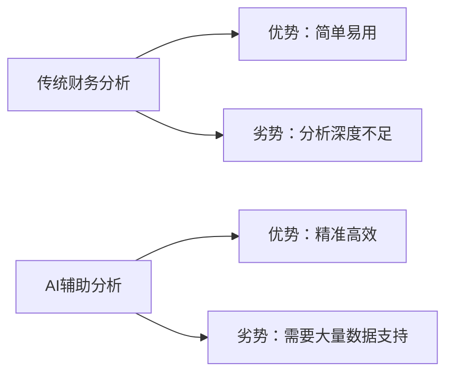
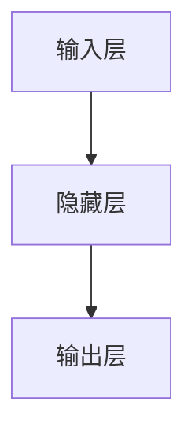
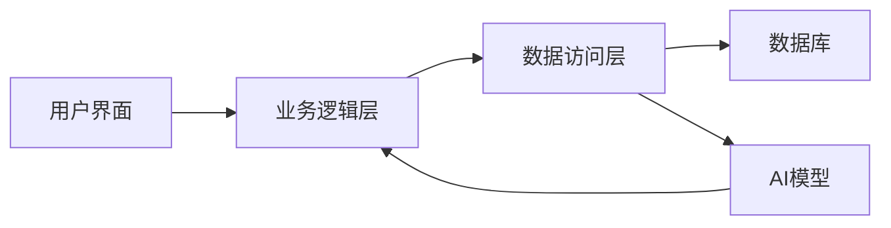
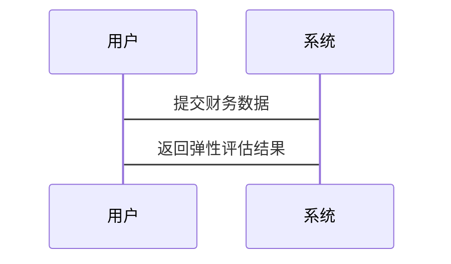

                 


# 开发AI辅助的企业财务弹性评估工具

## 关键词：AI辅助、财务弹性评估、机器学习、系统架构、项目实战

## 摘要：本文详细探讨了开发AI辅助的企业财务弹性评估工具的各个方面，包括背景分析、核心概念、算法原理、系统架构设计、项目实战以及最佳实践。通过理论与实践相结合，帮助读者掌握如何利用AI技术提升财务评估的效率和准确性。

---

### 目录

#### 第一部分: 背景与概述

#### 第1章: 企业财务弹性评估工具的背景与问题

##### 1.1 问题背景

- **1.1.1 企业财务弹性的重要性**：企业的财务弹性是衡量企业应对市场变化和风险能力的关键指标。传统的财务评估方法往往依赖人工分析，耗时且容易出错。

- **1.1.2 当前财务评估工具的局限性**：现有工具多基于规则引擎，难以处理非结构化数据，且缺乏深度学习能力，无法捕捉复杂的财务模式。

- **1.1.3 引入AI辅助的必要性**：AI技术可以处理大量数据，提取隐藏的模式，提供更精准的预测和建议，显著提升评估效率和准确性。

##### 1.2 问题描述

- **1.2.1 财务弹性评估的核心要素**：包括流动性、收益能力、偿债能力等多个维度。

- **1.2.2 传统评估方法的不足**：依赖人工经验，难以处理复杂数据，且结果缺乏动态调整能力。

- **1.2.3 数据驱动的评估需求**：通过AI技术，利用大数据分析，实时更新评估结果，提供动态反馈。

##### 1.3 问题解决与目标设定

- **1.3.1 AI辅助的核心目标**：构建一个智能、动态的财务评估系统，帮助企业在复杂环境中做出更明智的财务决策。

- **1.3.2 工具设计的关键问题**：如何有效整合AI模型与财务数据，确保系统的准确性和实时性。

- **1.3.3 边界与外延**：明确工具的适用范围，界定数据输入、模型训练和结果输出的具体边界。

##### 1.4 本章小结

---

#### 第二部分: 核心概念与联系

#### 第2章: 财务弹性评估与AI辅助的核心概念

##### 2.1 财务弹性评估的理论基础

- **2.1.1 财务弹性的定义与计算公式**：
  $$\text{财务弹性} = \frac{\text{息税前利润}}{\text{流动负债}}$$

- **2.1.2 财务弹性评估的维度与指标**：流动性、收益能力、偿债能力、运营效率等。

##### 2.2 AI辅助的核心原理

- **2.2.1 机器学习在财务分析中的应用**：用于预测财务趋势和识别异常交易。

- **2.2.2 自然语言处理在财务报告中的作用**：提取报告中的关键信息，辅助分析。

- **2.2.3 深度学习模型的优势**：能够处理复杂的数据模式，提供更精准的预测。

##### 2.3 核心概念的对比与联系

- **2.3.1 财务弹性评估与传统财务分析的对比**：下表展示了传统分析与AI辅助的关键区别：

| **维度**       | **传统财务分析**                     | **AI辅助分析**                          |
|----------------|--------------------------------------|-----------------------------------------|
| 数据处理能力   | 依赖人工筛选和整理                 | 能够处理结构化和非结构化数据           |
| 分析深度       | 基于固定规则，分析深度有限         | 可以挖掘数据中的隐藏模式               |
| 结果准确性     | 受人工经验影响较大                 | 结果更精准，基于大数据分析             |

- **2.3.2 AI辅助与传统工具的优劣势分析**：通过Mermaid图展示两种方法的优劣对比：



##### 2.4 本章小结

---

#### 第三部分: 算法原理与数学模型

#### 第3章: AI辅助的算法原理

##### 3.1 算法原理概述

- **3.1.1 机器学习模型的选择**：随机森林、支持向量机（SVM）和神经网络等模型的适用场景。

- **3.1.2 深度学习模型的适用性**：卷积神经网络（CNN）和循环神经网络（RNN）在处理财务数据中的应用。

- **3.1.3 模型训练的关键步骤**：数据预处理、特征提取、模型训练、调优和部署。

##### 3.2 数学模型与公式

- **3.2.1 线性回归模型**：
  $$ y = \beta_0 + \beta_1x + \epsilon $$

- **3.2.2 神经网络模型**：下图展示了简单的神经网络结构：



##### 3.3 算法实现与代码示例

- **3.3.1 环境安装**：安装Python、TensorFlow和Scikit-learn等工具。

- **3.3.2 核心代码实现**：

```python
import numpy as np
from sklearn.linear_model import LinearRegression

# 示例数据
X = np.array([[1], [2], [3], [4]])
y = np.array([2, 4, 6, 8])

# 模型训练
model = LinearRegression()
model.fit(X, y)

# 预测
print(model.predict([[5]]))  # 输出：[[10]]
```

- **3.3.3 代码解读与分析**：解释上述代码的功能，展示线性回归的基本实现。

##### 3.4 本章小结

---

#### 第四部分: 系统分析与架构设计

#### 第4章: 系统分析与架构设计方案

##### 4.1 问题场景介绍

- **4.1.1 工具的目标用户**：企业财务人员、管理层和审计人员。

- **4.1.2 工具的应用场景**：实时财务监控、风险评估、战略决策支持。

- **4.1.3 工具的使用流程**：数据输入、模型分析、结果输出和反馈。

##### 4.2 项目介绍

- **4.2.1 项目目标**：开发一个高效、智能的财务弹性评估工具。

- **4.2.2 项目范围**：涵盖数据收集、模型训练、系统设计和部署。

- **4.2.3 项目约束**：数据隐私、计算资源限制和用户界面友好性。

##### 4.3 系统功能设计

- **4.3.1 领域模型设计**：下图展示了系统的领域模型：


- **4.3.2 系统架构设计**：下图展示了系统的整体架构：



- **4.3.3 系统接口设计**：定义API接口，如：

```python
class FinancialAnalyzer:
    def __init__(self, model):
        self.model = model

    def assess_elasticity(self, data):
        # 调用AI模型进行评估
        return self.model.predict(data)
```

- **4.3.4 系统交互设计**：下图展示了用户与系统之间的交互流程：



##### 4.4 本章小结

---

#### 第五部分: 项目实战

#### 第5章: 项目实战

##### 5.1 环境搭建

- **5.1.1 安装Python**：从官网下载并安装适合的Python版本。

- **5.1.2 安装依赖库**：使用pip安装numpy、pandas、scikit-learn和tensorflow。

##### 5.2 核心代码实现

- **5.2.1 数据预处理**：加载数据、清洗和特征工程。

```python
import pandas as pd
from sklearn.model_selection import train_test_split

# 加载数据
data = pd.read_csv('financial_data.csv')

# 数据分割
X_train, X_test, y_train, y_test = train_test_split(data.drop('elasticity', axis=1), data['elasticity'])
```

- **5.2.2 模型训练与优化**：

```python
from sklearn.ensemble import RandomForestRegressor
from sklearn.metrics import mean_squared_error

# 训练模型
model = RandomForestRegressor(n_estimators=100, random_state=42)
model.fit(X_train, y_train)

# 模型评估
y_pred = model.predict(X_test)
print(mean_squared_error(y_test, y_pred))
```

##### 5.3 案例分析

- **5.3.1 数据分析与结果展示**：通过可视化工具展示模型预测结果与实际值的对比。

- **5.3.2 案例小结**：总结案例中的关键发现和经验教训。

##### 5.4 项目小结

---

#### 第六部分: 最佳实践

#### 第6章: 最佳实践

##### 6.1 开发注意事项

- 数据质量：确保数据准确、完整和代表性。

- 模型选择：根据具体场景选择合适的算法，避免过度拟合。

- 系统优化：优化模型性能，减少计算资源消耗。

##### 6.2 小结

##### 6.3 拓展阅读

- 推荐书籍：《机器学习实战》、《深度学习》。

---

### 附录

#### 附录A: 工具安装指南

#### 附录B: 代码示例

#### 附录C: 术语表

### 作者简介

作者：AI天才研究院/AI Genius Institute & 禅与计算机程序设计艺术 /Zen And The Art of Computer Programming

---

通过以上目录结构，读者可以系统地学习和应用开发AI辅助的企业财务弹性评估工具的相关知识，从理论到实践，全面掌握该领域的核心内容。

