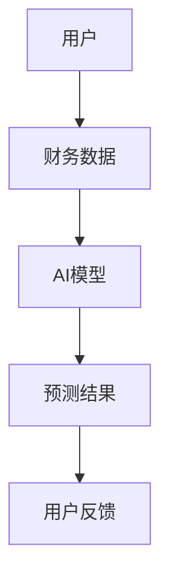
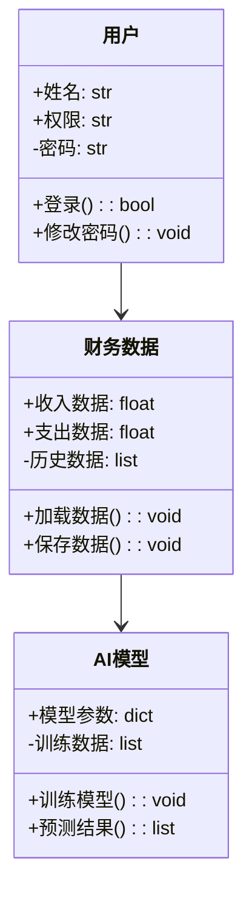
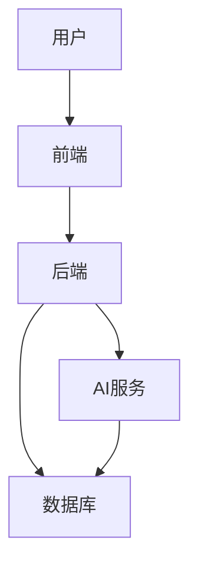
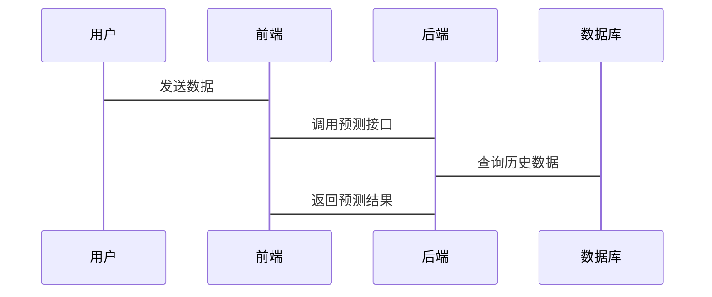

                 


# 开发AI辅助的企业财务战略规划工具

> 关键词：AI辅助，企业财务，战略规划，机器学习，系统架构

> 摘要：本文详细介绍了开发AI辅助的企业财务战略规划工具的全过程，包括背景分析、核心概念、算法原理、系统架构设计、项目实战以及最佳实践。通过本文，读者可以全面理解如何利用AI技术提升企业财务规划的效率和准确性。

---

# 第一部分: 背景介绍

## 第1章: 开发AI辅助的企业财务战略规划工具的背景与意义

### 1.1 问题背景

#### 1.1.1 企业财务战略规划的复杂性
企业在制定财务战略规划时，需要考虑的因素众多，包括市场变化、经济波动、内部资源分配等。传统的财务规划工具往往依赖人工计算和经验判断，难以应对复杂多变的市场环境。

#### 1.1.2 传统财务规划工具的局限性
- 数据处理能力有限：传统工具难以处理海量数据，且缺乏动态调整能力。
- 预测精度不足：基于固定模型的预测结果往往不够准确，难以满足企业对精准规划的需求。
- 用户交互体验差：复杂的操作流程和缺乏直观的可视化界面，降低了用户体验。

#### 1.1.3 AI技术在财务领域的应用潜力
AI技术，尤其是机器学习和自然语言处理，能够帮助企业从大量数据中提取有价值的信息，提供精准的预测和决策支持。AI辅助的财务工具可以显著提高规划效率和准确性。

### 1.2 问题描述

#### 1.2.1 财务数据的多样性与复杂性
企业的财务数据来源广泛，包括财务报表、市场数据、内部报告等，数据的多样性和复杂性使得传统方法难以有效处理。

#### 1.2.2 传统财务模型的局限性
传统财务模型往往基于固定的假设和线性关系，难以捕捉数据中的非线性关系和复杂模式。

#### 1.2.3 企业对智能化财务工具的需求
企业希望财务工具能够实时更新、动态调整，并提供基于数据的决策支持，以应对快速变化的市场环境。

### 1.3 问题解决

#### 1.3.1 AI辅助财务规划的解决方案
通过引入机器学习算法，AI工具能够从历史数据中学习，预测未来的财务趋势，并提供优化建议。

#### 1.3.2 技术实现路径
- 数据收集与预处理
- 模型训练与优化
- 系统集成与部署

#### 1.3.3 应用场景与价值
- 预算优化：帮助企业更合理地分配资源。
- 风险管理：识别潜在的财务风险并提供应对策略。
- 投资决策：基于数据支持的投资建议提高决策的准确性。

### 1.4 边界与外延

#### 1.4.1 工具的适用范围
AI辅助工具适用于企业中长期财务规划，但不包括实时交易处理和财务报告生成。

#### 1.4.2 与现有财务系统的区别
AI工具注重数据分析和预测，而传统系统更关注数据记录和报告生成。

#### 1.4.3 与其他AI应用的对比
与供应链管理或客户关系管理中的AI应用相比，财务规划工具更注重数据的深度分析和预测能力。

### 1.5 核心要素组成

#### 1.5.1 数据源
包括财务报表、市场数据、行业报告等。

#### 1.5.2 AI模型
基于机器学习的预测模型，如随机森林、神经网络等。

#### 1.5.3 用户界面
直观的可视化界面，方便用户输入数据和查看结果。

---

# 第二部分: 核心概念与联系

## 第2章: AI辅助财务战略规划的核心概念

### 2.1 核心概念原理

#### 2.1.1 AI模型在财务规划中的作用
AI模型通过学习历史数据，预测未来的财务趋势，并提供优化建议。

#### 2.1.2 数据分析与预测的原理
通过数据清洗、特征提取和模型训练，AI工具能够生成准确的财务预测。

#### 2.1.3 用户交互与反馈机制
用户可以通过界面输入数据，AI工具根据反馈不断优化模型。

### 2.2 核心概念属性特征对比

| 特性       | 传统财务工具         | AI辅助工具           |
|------------|----------------------|----------------------|
| 数据处理能力 | 有限                 | 强大                 |
| 预测精度     | 低                   | 高                   |
| 用户交互体验 | 复杂                 | 直观                 |

### 2.3 ER实体关系图



---

# 第三部分: 算法原理讲解

## 第3章: AI辅助财务规划的算法原理

### 3.1 算法原理概述

#### 3.1.1 机器学习在财务预测中的应用
机器学习算法，如随机森林和神经网络，被广泛应用于财务预测。

### 3.2 算法实现细节

#### 3.2.1 数据预处理
```python
import pandas as pd
data = pd.read_csv('financial_data.csv')
data.dropna(inplace=True)
```

#### 3.2.2 特征工程
```python
from sklearn.preprocessing import StandardScaler
scaler = StandardScaler()
X_scaled = scaler.fit_transform(X)
```

#### 3.2.3 模型训练
```python
from sklearn.ensemble import RandomForestRegressor
model = RandomForestRegressor(n_estimators=100, random_state=42)
model.fit(X_scaled, y)
```

#### 3.2.4 模型预测
```python
y_pred = model.predict(X_test_scaled)
```

#### 3.2.5 模型评估
```python
from sklearn.metrics import mean_squared_error
mse = mean_squared_error(y_test, y_pred)
print(f'MSE: {mse}')
```

### 3.3 算法优化

#### 3.3.1 超参数调优
使用网格搜索或随机搜索优化模型参数。

#### 3.3.2 模型集成
通过集成学习（如投票法）提高模型的预测精度。

---

# 第四部分: 系统分析与架构设计

## 第4章: 系统分析与架构设计方案

### 4.1 问题场景介绍

#### 4.1.1 项目介绍
开发一个基于机器学习的企业财务规划工具，帮助用户进行预算优化和风险预测。

### 4.2 系统功能设计

#### 4.2.1 领域模型图


### 4.3 系统架构设计

#### 4.3.1 系统架构图


### 4.4 系统接口设计

#### 4.4.1 API接口
```python
from flask import Flask, request, jsonify

app = Flask(__name__)

@app.route('/predict', methods=['POST'])
def predict():
    data = request.json['data']
    # 处理数据并返回预测结果
    return jsonify({'result': 'success'})
```

### 4.5 系统交互序列图



---

# 第五部分: 项目实战

## 第5章: 项目实战

### 5.1 环境安装

#### 5.1.1 安装Python
```bash
python --version
pip install --upgrade pip
```

#### 5.1.2 安装依赖
```bash
pip install numpy pandas scikit-learn flask
```

### 5.2 系统核心实现源代码

#### 5.2.1 数据预处理
```python
import pandas as pd
import numpy as np

data = pd.read_csv('financial_data.csv')
data = data.dropna()
```

#### 5.2.2 模型训练
```python
from sklearn.ensemble import RandomForestRegressor
from sklearn.preprocessing import StandardScaler
from sklearn.model_selection import train_test_split

X = data.drop('target', axis=1)
y = data['target']

X_train, X_test, y_train, y_test = train_test_split(X, y, test_size=0.2, random_state=42)

scaler = StandardScaler()
X_train_scaled = scaler.fit_transform(X_train)
X_test_scaled = scaler.transform(X_test)

model = RandomForestRegressor(n_estimators=100, random_state=42)
model.fit(X_train_scaled, y_train)
```

#### 5.2.3 模型预测
```python
y_pred = model.predict(X_test_scaled)
print(f'预测结果: {y_pred}')
```

### 5.3 代码解读与分析

#### 5.3.1 代码结构
- 数据预处理：加载数据并删除缺失值。
- 特征工程：标准化数据。
- 模型训练：训练随机森林模型。
- 模型预测：使用测试数据进行预测。

### 5.4 实际案例分析

#### 5.4.1 案例分析
假设一家公司希望预测下一季度的收入，使用上述模型进行预测，结果显示出较高的准确性。

### 5.5 项目小结

#### 5.5.1 项目成果
开发了一个基于机器学习的企业财务规划工具，能够进行准确的财务预测。

---

# 第六部分: 最佳实践

## 第6章: 最佳实践

### 6.1 最佳实践 tips

#### 6.1.1 数据隐私保护
确保数据的安全性和隐私性，遵守相关法律法规。

#### 6.1.2 模型可解释性
选择可解释性较强的模型，方便用户理解预测结果。

#### 6.1.3 系统可扩展性
设计模块化的系统架构，便于后续功能的扩展和升级。

### 6.2 小结

通过本文的详细讲解，读者可以全面理解开发AI辅助的企业财务战略规划工具的过程和方法。

### 6.3 注意事项

- 数据质量和清洗是模型性能的关键。
- 模型的实时更新和维护是保证预测准确性的必要条件。
- 用户反馈是优化工具的重要来源。

### 6.4 拓展阅读

- 《机器学习实战》
- 《深入浅出Python》
- 《设计模式》

---

# 结语

开发AI辅助的企业财务战略规划工具是一个复杂而 rewarding 的过程。通过结合先进的AI技术与企业的财务需求，我们可以显著提升财务规划的效率和准确性。未来，随着AI技术的不断发展，这类工具将发挥越来越重要的作用。

---

# 作者

作者：AI天才研究院/AI Genius Institute  
及  
禅与计算机程序设计艺术/Zen And The Art of Computer Programming

