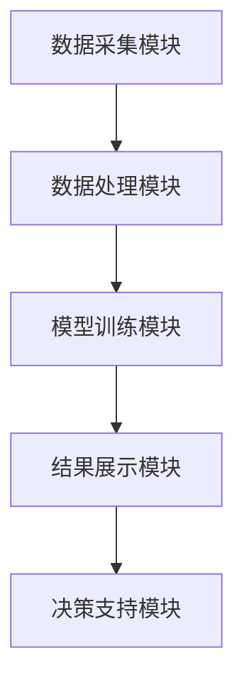

                 


```markdown
# 开发AI辅助的企业财务风险量化评估工具

> 关键词：AI技术，财务风险评估，机器学习，风险量化，企业财务

> 摘要：本文详细介绍了开发AI辅助的企业财务风险量化评估工具的背景、核心概念、算法原理、系统架构设计、项目实战以及最佳实践。通过理论与实践相结合的方式，系统性地阐述了如何利用AI技术提升企业财务风险评估的效率与准确性，为企业的财务决策提供有力支持。

---

## 第1章 企业财务风险量化评估工具概述

### 1.1 问题背景与目标
#### 1.1.1 企业财务风险的定义与重要性
企业财务风险是指企业在经营过程中由于内外部因素导致的财务损失可能性。它是企业在追求利润最大化的过程中不可避免的风险，需要通过科学的方法进行量化和评估。

#### 1.1.2 传统财务风险评估的局限性
传统财务风险评估主要依赖于财务报表分析和经验判断，存在以下局限性：
- 数据处理效率低，难以应对海量数据。
- 评估结果主观性较强，缺乏客观性。
- 无法实时动态调整评估结果。

#### 1.1.3 引入AI技术的目标与优势
通过引入AI技术，可以实现以下目标：
- 提高数据处理效率，降低人工成本。
- 增强评估结果的客观性和准确性。
- 实现实时动态评估，提高风险预警能力。

### 1.2 AI辅助财务风险评估的核心要素
#### 1.2.1 数据来源与特征
数据来源包括企业的财务报表、市场数据、行业数据等。核心数据特征包括：
- 财务指标：如资产负债率、净利润率等。
- 市场指标：如行业趋势、市场波动等。
- 公司治理指标：如管理层稳定性、股权结构等。

#### 1.2.2 模型选择与优化
AI模型的选择需要考虑数据特征、模型复杂度和评估目标。常见的模型包括逻辑回归、支持向量机（SVM）、随机森林和神经网络等。

#### 1.2.3 结果可视化与决策支持
通过可视化工具将评估结果以图表形式展示，帮助决策者快速理解风险情况并制定应对策略。

---

## 第2章 AI辅助财务风险评估模型的构建与优化

### 2.1 数据特征提取与分析
#### 2.1.1 数据预处理与清洗
- 数据清洗：处理缺失值、异常值和重复数据。
- 数据标准化：对不同量纲的数据进行标准化处理。

#### 2.1.2 关键风险指标的识别
通过统计分析和特征重要性评估，识别对财务风险影响最大的关键指标。

#### 2.1.3 数据特征的可视化与分析
使用Python的matplotlib库绘制特征分布图、相关性热图等，帮助理解数据特征。

### 2.2 AI模型的选择与训练
#### 2.2.1 常见AI模型在财务风险评估中的应用
- 逻辑回归：适用于二分类问题。
- 支持向量机（SVM）：适用于非线性分类问题。
- 随机森林：适用于特征重要性分析和高维数据。

#### 2.2.2 模型训练的流程与关键参数
模型训练流程包括数据分割、模型训练、参数调优等。关键参数包括学习率、树深度、惩罚系数等。

#### 2.2.3 模型优化与调参技巧
通过交叉验证和网格搜索优化模型参数，提高模型性能。

### 2.3 模型评估与验证
#### 2.3.1 评估指标的定义与计算
常用的评估指标包括准确率、召回率、F1分数等。

#### 2.3.2 交叉验证与模型泛化能力
通过k折交叉验证评估模型的泛化能力。

#### 2.3.3 模型的可解释性与优化方向
通过特征重要性分析和SHAP值解释模型决策过程。

---

## 第3章 系统架构设计与功能模块划分

### 3.1 系统整体架构概述
系统采用分层架构设计，包括数据采集层、模型训练层、结果展示层和用户交互层。

### 3.2 功能模块详细设计
#### 3.2.1 数据采集与处理模块
- 数据来源：企业财务报表、市场数据等。
- 数据处理：数据清洗、特征提取。

#### 3.2.2 模型训练与部署模块
- 模型选择：根据数据特征选择合适的AI模型。
- 模型训练：使用训练数据训练模型。
- 模型部署：将训练好的模型部署到生产环境。

#### 3.2.3 结果展示与决策支持模块
- 结果可视化：通过图表展示风险评估结果。
- 决策支持：提供风险预警和应对策略建议。

### 3.3 系统架构的mermaid图


---

## 第4章 项目实战与代码实现

### 4.1 开发环境的安装与配置
#### 4.1.1 Python环境的搭建
安装Python和必要的库（如numpy、pandas、scikit-learn）。

#### 4.1.2 数据集的获取与预处理
从公开数据源获取企业财务数据，并进行清洗和特征提取。

### 4.2 核心代码实现
#### 4.2.1 数据预处理代码
```python
import pandas as pd
from sklearn.preprocessing import StandardScaler

# 读取数据
data = pd.read_csv('financial_data.csv')

# 数据清洗
data.dropna(inplace=True)
data = data.drop_duplicates()

# 特征提取
X = data[['资产总额', '负债总额', '净利润率']]
y = data['财务风险等级']

# 数据标准化
scaler = StandardScaler()
X_scaled = scaler.fit_transform(X)
```

#### 4.2.2 模型训练代码
```python
from sklearn.ensemble import RandomForestClassifier
from sklearn.model_selection import train_test_split
from sklearn.metrics import accuracy_score, recall_score, f1_score

# 数据分割
X_train, X_test, y_train, y_test = train_test_split(X_scaled, y, test_size=0.2, random_state=42)

# 模型训练
model = RandomForestClassifier(n_estimators=100, max_depth=10, random_state=42)
model.fit(X_train, y_train)

# 模型预测
y_pred = model.predict(X_test)

# 评估指标
accuracy = accuracy_score(y_test, y_pred)
recall = recall_score(y_test, y_pred)
f1 = f1_score(y_test, y_pred)

print(f'准确率: {accuracy}')
print(f'召回率: {recall}')
print(f'F1分数: {f1}')
```

#### 4.2.3 结果展示代码
```python
import matplotlib.pyplot as plt
from sklearn.metrics import confusion_matrix, ConfusionMatrixDisplay

# 混淆矩阵
cm = confusion_matrix(y_test, y_pred)
disp = ConfusionMatrixDisplay(confusion_matrix=cm, display_labels=model.classes_)
disp.plot(cmap='Blues')
plt.show()
```

### 4.3 代码解读与优化建议
#### 4.3.1 代码逻辑的详细解读
- 数据预处理：清洗、标准化。
- 模型训练：随机森林模型，参数调优。
- 结果评估：准确率、召回率、F1分数。

#### 4.3.2 模型优化的具体建议
- 增加更多的特征。
- 尝试不同的模型，如XGBoost或神经网络。
- 调整模型参数，如增加树的数量。

### 4.4 本章小结

---

## 第5章 最佳实践与项目总结

### 5.1 开发过程中的注意事项
#### 5.1.1 数据质量的重要性
确保数据的完整性和准确性。

#### 5.1.2 模型选择的合理性
根据数据特征和业务需求选择合适的模型。

#### 5.1.3 系统设计的可扩展性
确保系统能够适应未来数据和业务的变化。

### 5.2 项目总结与未来展望
#### 5.2.1 项目成果的总结
成功开发了一个高效的AI辅助企业财务风险量化评估工具。

#### 5.2.2 未来改进的方向
- 增加实时数据处理功能。
- 集成更多的AI模型，如深度学习模型。
- 提供更丰富的可视化功能。

#### 5.2.3 AI技术在财务领域的潜在应用
AI技术可以进一步应用于智能投顾、信用评估等领域。

### 5.3 本章小结

---

## 附录

### 附录A: 常用AI模型与工具推荐
- AI模型：随机森林、XGBoost、神经网络。
- 工具：scikit-learn、XGBoost、Keras。

### 附录B: 财务风险评估相关文献推荐
- 文献1：《企业财务风险管理理论与实践》。
- 文献2：《基于机器学习的企业财务风险预测研究》。

---

## 作者：AI天才研究院 & 禅与计算机程序设计艺术

---

通过以上目录和内容，您可以开始撰写完整的文章。每一章的内容需要详细展开，确保理论与实践相结合，帮助读者全面理解AI辅助企业财务风险量化评估工具的开发过程。
```

