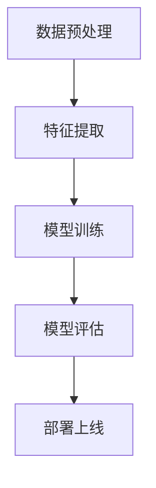
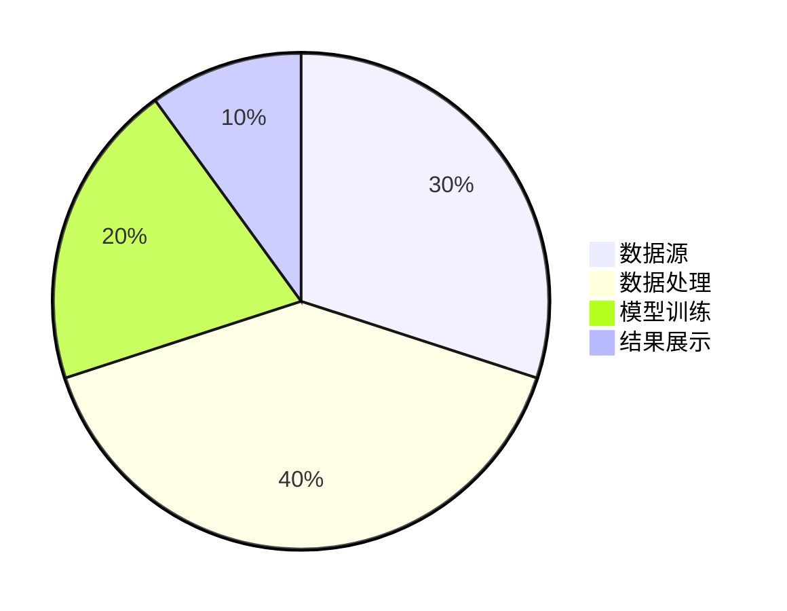
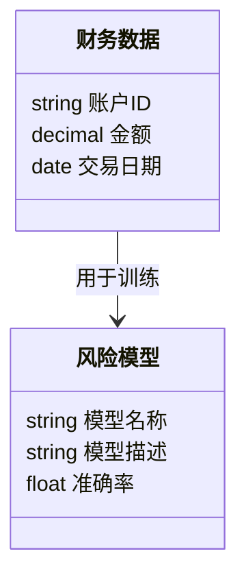

                 


# 开发AI辅助的企业财务风险预警仪表盘

## 关键词：AI技术, 企业财务风险, 预警系统, 数据可视化, 仪表盘开发, 机器学习模型, 风险管理

## 摘要：本文详细探讨了开发AI辅助的企业财务风险预警仪表盘的核心过程，包括背景分析、技术原理、系统架构设计以及项目实战。通过结合机器学习模型和数据可视化技术，本文展示了如何利用AI技术提升企业财务风险管理的效率和准确性，为企业提供实时、动态的风险预警支持，帮助企业在复杂多变的商业环境中做出更明智的决策。

---

## 第一章: 背景介绍

### 1.1 问题背景

#### 1.1.1 企业财务风险的定义与重要性
企业财务风险是指企业在经营过程中由于内外部环境变化而导致财务状况恶化、无法偿还债务或盈利能力下降的可能性。有效的财务风险管理是企业稳健运营的关键，尤其是在经济波动频繁的当下，及时发现和预警财务风险显得尤为重要。

#### 1.1.2 传统财务风险预警的局限性
传统的财务风险预警方法主要依赖财务报表分析和人工判断，存在以下问题：
- 数据处理耗时且容易出错。
- 预警模型缺乏动态更新能力，难以适应市场变化。
- 人工分析主观性强，难以覆盖大量数据。

#### 1.1.3 AI技术在财务风险预警中的优势
人工智能技术，尤其是机器学习和深度学习，能够快速处理大量非结构化数据，发现隐藏的模式和趋势，显著提升了财务风险预警的准确性和效率。

### 1.2 问题描述

#### 1.2.1 财务风险预警的核心目标
企业财务风险预警的核心目标是通过分析财务数据，识别潜在的财务危机，提前采取措施，降低损失。

#### 1.2.2 企业财务数据的特点与挑战
财务数据具有高度结构化、时序性强、涉及敏感信息等特点，同时面临着数据清洗难、特征提取复杂等挑战。

#### 1.2.3 用户需求与场景分析
企业财务管理人员、投资者和审计部门都需要实时了解财务状况，对潜在风险进行预警。用户需求包括：
- 实时监控财务指标。
- 自动生成风险评估报告。
- 提供风险缓解建议。

### 1.3 问题解决

#### 1.3.1 AI辅助的解决方案概述
利用机器学习模型对财务数据进行分析，构建风险预警模型，生成实时预警信息，帮助用户做出决策。

#### 1.3.2 仪表盘的功能定位与价值
仪表盘作为可视化工具，能够直观展示财务数据和预警结果，帮助用户快速理解数据，提升决策效率。

#### 1.3.3 解决方案的可行性分析
通过AI技术实现财务数据的自动分析和风险预警是可行的，但需要结合具体业务场景，选择合适的模型和算法。

### 1.4 边界与外延

#### 1.4.1 仪表盘的适用范围
适用于企业内部财务管理、风险管理部门和高层管理者。

#### 1.4.2 与现有系统的边界划分
与企业ERP系统、财务管理系统等其他系统进行数据集成，但不涉及核心业务处理。

#### 1.4.3 未来扩展的可能性
未来可以集成更多的AI模型，支持多语言分析、实时数据流处理等功能。

### 1.5 核心要素与组成

#### 1.5.1 数据源的整合
整合财务报表、市场数据、行业趋势等多源数据。

#### 1.5.2 AI模型的选择与部署
选择适合的机器学习模型，如逻辑回归、随机森林等，部署到生产环境。

#### 1.5.3 仪表盘的交互设计
设计直观的用户界面，支持多维度数据可视化和交互操作。

---

## 第二章: 核心概念与联系

### 2.1 核心概念原理

#### 2.1.1 机器学习模型在风险预警中的应用
机器学习模型能够从历史数据中学习财务风险的模式，预测未来的风险情况。

#### 2.1.2 自然语言处理在财务报告分析中的作用
NLP技术可以帮助分析财务报告中的文本信息，提取关键指标和风险信号。

#### 2.1.3 时间序列分析在预测中的应用
时间序列分析能够捕捉财务数据的时序特征，预测未来的财务状况。

### 2.2 概念属性特征对比

| 概念 | 属性 | 特征 | 示例 |
|------|------|------|------|
| 机器学习模型 | 监督学习 | 根据历史数据进行分类或回归预测 | 逻辑回归用于违约预测 |
| 数据预处理 | 清洗 | 处理缺失值和异常值 | 删除重复数据 |
| 可视化工具 | 图表类型 | 折线图、柱状图、热力图 | 使用Matplotlib绘制图表 |

### 2.3 ER实体关系图

```mermaid
erDiagram
    actor 用户 {
        string 用户ID
        string 用户名
        string 密码
    }
    database 财务数据库 {
        integer 交易ID
        date 交易日期
        decimal 金额
    }
    model 风险模型 {
        integer 模型ID
        string 模型名称
        string 模型描述
    }
    用户 --> 风险模型 : 使用模型
    财务数据库 --> 风险模型 : 训练数据
```

---

## 第三章: 算法原理讲解

### 3.1 逻辑回归模型

#### 3.1.1 算法流程图



#### 3.1.2 Python源代码

```python
import pandas as pd
from sklearn.linear_model import LogisticRegression

# 数据预处理
data = pd.read_csv('financial_data.csv')
data = data.dropna()

# 特征提取
X = data[[' revenue', ' net_profit', ' debt']]
y = data[' risk_flag']

# 模型训练
model = LogisticRegression()
model.fit(X, y)

# 模型评估
print(model.score(X, y))
```

#### 3.1.3 数学模型

$$ P(y=1|x) = \frac{e^{\beta_0 + \beta_1x_1}}{1 + e^{\beta_0 + \beta_1x_1}} $$

---

## 第四章: 系统分析与架构设计方案

### 4.1 系统架构设计

#### 4.1.1 系统架构图



### 4.2 系统功能设计

#### 4.2.1 领域模型



---

## 第五章: 项目实战

### 5.1 环境安装

#### 5.1.1 安装Python和相关库
```bash
pip install numpy pandas scikit-learn matplotlib
```

### 5.2 核心实现

#### 5.2.1 数据可视化代码

```python
import matplotlib.pyplot as plt

plt.figure(figsize=(10, 6))
plt.plot(data['日期'], data['收入'], 'b-', label='收入')
plt.plot(data['日期'], data['支出'], 'r-', label='支出')
plt.legend()
plt.xlabel('日期')
plt.ylabel('金额')
plt.title('收入与支出趋势图')
plt.show()
```

---

## 第六章: 最佳实践

### 6.1 小结
通过AI技术开发企业财务风险预警仪表盘，能够显著提升风险预警的效率和准确性，为企业提供有力支持。

### 6.2 注意事项
- 数据隐私保护
- 模型的实时更新
- 系统的可扩展性

### 6.3 拓展阅读
推荐学习相关技术书籍和论文，深入理解AI在金融领域的应用。

---

## 作者：AI天才研究院 & 禅与计算机程序设计艺术

