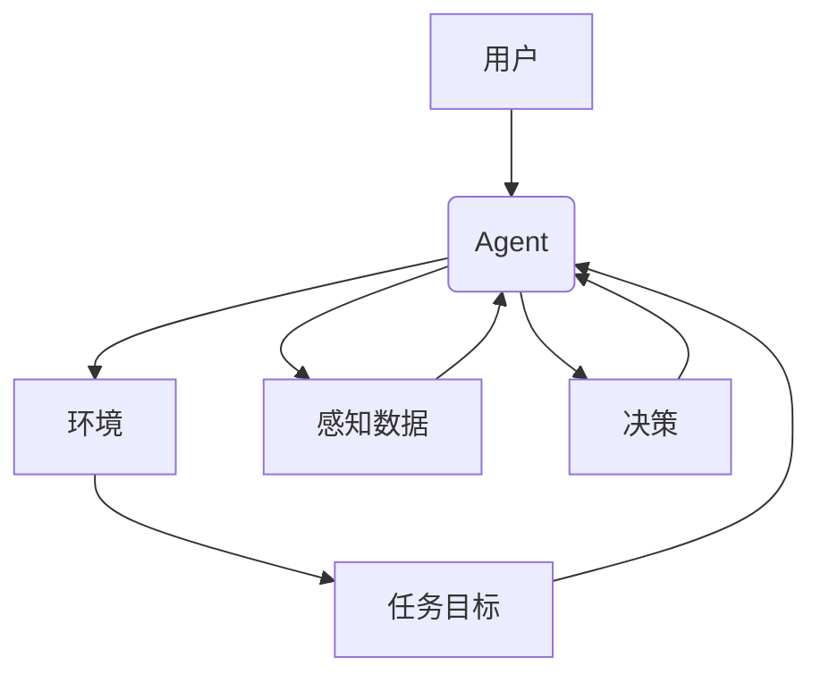
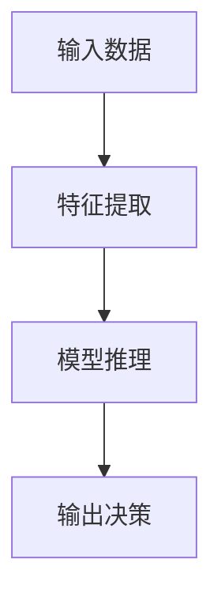
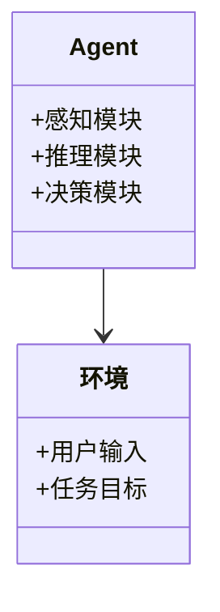
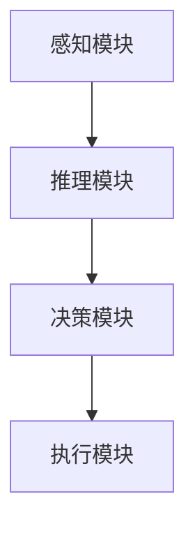

                 


# 开发具有复杂场景理解能力的AI Agent

> 关键词：复杂场景理解，AI Agent，强化学习，知识图谱，多模态数据融合

> 摘要：本文旨在探讨如何开发具有复杂场景理解能力的AI Agent。通过详细分析AI Agent的核心概念、算法原理、数学模型、系统架构以及项目实战，本文为读者提供了一套完整的开发框架和实现思路。从理论到实践，本文深入浅出地解析了AI Agent在复杂场景理解中的关键技术和实际应用。

---

# 第1章: AI Agent与复杂场景理解概述

## 1.1 什么是AI Agent

### 1.1.1 AI Agent的定义

AI Agent（人工智能代理）是一种能够感知环境、自主决策并执行任务的智能实体。它能够通过与环境的交互，实现特定的目标或解决复杂问题。AI Agent的核心在于其自主性和智能性，能够适应动态变化的环境并做出合理决策。

### 1.1.2 AI Agent的核心特征

1. **自主性**：AI Agent能够在没有外部干预的情况下独立运行。
2. **反应性**：能够实时感知环境并做出快速反应。
3. **目标导向**：基于明确的目标进行决策和行动。
4. **学习能力**：通过经验或数据不断优化自身的性能。

### 1.1.3 复杂场景理解的定义与挑战

复杂场景理解是指AI Agent能够理解多变、动态且包含大量不确定性的真实环境。这种理解需要AI Agent具备跨模态数据处理能力、上下文推理能力以及动态决策能力。其挑战主要在于如何在复杂场景中准确感知、理解并做出最优决策。

---

## 1.2 AI Agent的发展背景

### 1.2.1 AI技术的演进历程

AI技术的发展经历了多个阶段，从早期的专家系统到现在的深度学习和强化学习，每一次技术的进步都推动了AI Agent的智能化水平。

### 1.2.2 复杂场景理解的需求驱动

随着AI技术的广泛应用，AI Agent需要应对更加复杂的场景，例如自动驾驶、智能客服、机器人控制等领域，这些场景对AI Agent的理解能力提出了更高的要求。

### 1.2.3 当前AI Agent的应用现状

当前，AI Agent已经在许多领域取得了显著成果，例如智能助手、游戏AI、自动驾驶等。然而，如何在复杂场景中实现高效的场景理解仍然是一个重要的研究方向。

---

## 1.3 本书的核心目标

### 1.3.1 开发AI Agent的目标

本书旨在探讨如何开发具有复杂场景理解能力的AI Agent，从理论到实践，为读者提供一套完整的开发框架。

### 1.3.2 复杂场景理解的关键问题

复杂场景理解的关键问题包括多模态数据融合、动态环境建模、不确定性处理等。

### 1.3.3 本书的结构与内容安排

本书分为七个章节，从AI Agent的基础概念到复杂场景理解的实现，再到实际项目开发，逐步展开。

---

## 1.4 本章小结

本章对AI Agent的基本概念、复杂场景理解的重要性以及当前的技术背景进行了概述。通过本章的学习，读者可以初步了解AI Agent的核心目标和复杂场景理解的关键问题。

---

# 第2章: AI Agent的核心概念与联系

## 2.1 核心概念原理

### 2.1.1 知识表示与推理

知识表示是AI Agent理解场景的基础，常见的知识表示方法包括符号逻辑、知识图谱等。推理则是基于知识表示进行逻辑推理，帮助AI Agent做出决策。

### 2.1.2 感知与交互

AI Agent需要通过多模态传感器感知环境，并与环境进行交互。感知包括视觉、听觉、触觉等多种方式，交互则需要理解用户意图并进行反馈。

### 2.1.3 决策与执行

基于感知信息和知识推理，AI Agent需要做出决策，并通过执行机构完成任务。决策过程可能涉及强化学习、贪心算法等多种方法。

---

## 2.2 核心概念属性对比

### 2.2.1 不同AI Agent模型的对比分析

以下是几种常见AI Agent模型的对比：

| 模型类型    | 基础原理         | 优缺点           |
|------------|------------------|------------------|
| 专家系统    | 基于知识库和推理  | 知识依赖性强，适应性差 |
| 机器学习    | 数据驱动         | 需大量数据，缺乏解释性 |
| 强化学习    | 奖励驱动         | 适合动态环境，训练时间长 |

### 2.2.2 场景理解能力的量化评估

场景理解能力的量化可以通过准确率、召回率、F1分数等指标进行评估。

### 2.2.3 交互效率与准确性的平衡

在复杂场景中，AI Agent需要在交互效率和准确性之间找到平衡点，以确保用户体验和任务效率。

---

## 2.3 ER实体关系图



---

## 2.4 本章小结

本章详细介绍了AI Agent的核心概念，包括知识表示、感知与交互、决策与执行等，并通过对比分析和实体关系图展示了不同概念之间的联系。

---

# 第3章: AI Agent的算法原理

## 3.1 算法原理概述

### 3.1.1 基于强化学习的决策算法

强化学习是一种通过试错机制来优化决策的算法，适用于动态环境中的决策问题。

### 3.1.2 基于知识图谱的推理算法

知识图谱是一种结构化的知识表示方法，结合推理算法可以帮助AI Agent理解复杂场景。

### 3.1.3 多模态数据融合算法

多模态数据融合算法能够将来自不同模态（如图像、文本、语音）的数据进行整合，提升AI Agent的感知能力。

---

## 3.2 算法流程图



---

## 3.3 核心算法实现

### 3.3.1 强化学习算法代码示例

```python
class Agent:
    def __init__(self, state_space, action_space):
        self.state_space = state_space
        self.action_space = action_space
        self.model = self.build_model()

    def build_model(self):
        # 构建神经网络模型
        pass

    def act(self, state):
        # 根据状态选择动作
        pass
```

---

## 3.4 数学模型与公式

### 3.4.1 强化学习的数学模型

强化学习的目标是通过最大化累积奖励来优化策略：

$$ R(s, a) = \text{奖励函数} $$

$$ V(s) = \max_a Q(s, a) $$

---

## 3.5 本章小结

本章详细介绍了AI Agent的算法原理，包括强化学习、知识图谱推理和多模态数据融合等算法，并通过流程图和代码示例展示了这些算法的实现。

---

# 第4章: AI Agent的数学模型与公式推导

## 4.1 概率论基础

概率论是AI Agent理解复杂场景的重要数学基础。例如，贝叶斯定理可以用于计算条件概率：

$$ P(A|B) = \frac{P(B|A)P(A)}{P(B)} $$

---

## 4.2 强化学习的数学基础

强化学习的核心是通过最大化累积奖励来优化策略。其数学模型可以表示为：

$$ Q(s, a) = r + \gamma \max_a Q(s', a') $$

其中，$\gamma$ 是折扣因子。

---

## 4.3 知识图谱的表示学习

知识图谱可以通过嵌入方法进行表示学习，例如Word2Vec：

$$ E(w) = \text{词向量} $$

---

## 4.4 本章小结

本章通过概率论、强化学习和知识图谱的数学模型，详细推导了AI Agent的核心算法。

---

# 第5章: AI Agent的系统分析与架构设计

## 5.1 问题场景介绍

以智能助手为例，AI Agent需要在复杂场景中理解用户需求并提供准确的服务。

---

## 5.2 系统功能设计

以下是AI Agent的系统功能模块：



---

## 5.3 系统架构设计

以下是AI Agent的系统架构图：



---

## 5.4 系统接口设计

系统接口设计包括用户接口、环境接口和任务接口，确保各模块之间的数据交互。

---

## 5.5 本章小结

本章通过系统分析和架构设计，展示了AI Agent在复杂场景中的实现框架。

---

# 第6章: AI Agent的项目实战

## 6.1 环境安装

安装必要的开发环境和工具，例如Python、TensorFlow、Keras等。

---

## 6.2 核心实现

以下是AI Agent的核心实现代码：

```python
import tensorflow as tf
from tensorflow.keras import layers

model = tf.keras.Sequential()
model.add(layers.Dense(64, activation='relu', input_dim=64))
model.add(layers.Dense(1, activation='sigmoid'))
model.compile(optimizer='adam', loss='binary_crossentropy', metrics=['accuracy'])
```

---

## 6.3 案例分析

以智能客服为例，AI Agent需要理解用户的问题并提供准确的解决方案。

---

## 6.4 本章小结

本章通过项目实战，展示了AI Agent在复杂场景中的具体实现。

---

# 第7章: AI Agent开发的最佳实践与未来展望

## 7.1 最佳实践

1. **数据质量**：确保数据的多样性和准确性。
2. **算法选择**：根据场景选择合适的算法。
3. **系统优化**：通过不断迭代优化系统性能。

---

## 7.2 未来展望

随着AI技术的不断发展，AI Agent在复杂场景理解中的应用将更加广泛，例如人机协作、智能机器人等领域。

---

## 7.3 本章小结

本章总结了AI Agent开发的最佳实践，并展望了未来的技术发展趋势。

---

# 作者：AI天才研究院/AI Genius Institute & 禅与计算机程序设计艺术 /Zen And The Art of Computer Programming

---

本文通过详细分析AI Agent的核心概念、算法原理、数学模型、系统架构以及项目实战，为读者提供了一套完整的开发框架。从理论到实践，本文深入浅出地解析了AI Agent在复杂场景理解中的关键技术和实际应用。希望读者通过本文的学习，能够更好地理解和开发具有复杂场景理解能力的AI Agent。

