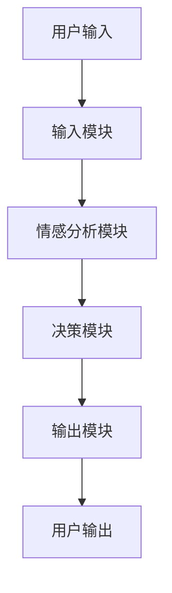

                 


# 开发具有情感分析能力的AI Agent

> 关键词：AI Agent, 情感分析, 自然语言处理, 机器学习, 深度学习, 对话生成

> 摘要：本文将详细探讨如何开发具有情感分析能力的AI Agent。首先，我们将介绍情感分析和AI Agent的基本概念，分析它们的结合意义。然后，我们将深入探讨情感分析的核心算法和AI Agent的系统架构设计。接着，我们将通过一个具体的实战案例，展示如何实现情感分析驱动的AI Agent。最后，我们将总结开发过程中需要注意的关键点和未来的发展方向。

---

## 第1章: 情感分析与AI Agent的背景介绍

### 1.1 情感分析的定义与应用

情感分析是自然语言处理（NLP）领域的重要分支，旨在识别和分析文本中蕴含的情感倾向。它可以帮助我们理解用户的情绪状态，从而为后续的决策提供支持。

#### 1.1.1 情感分析的核心概念
- **文本分类**：情感分析的本质是将文本分为不同的情感类别（如正面、负面、中性）。
- **情感强度**：除了分类，情感分析还可以估计情感的强度（如非常正面、稍微负面）。
- **情感方面分析**：针对特定方面（如产品功能、服务质量）进行情感分析。

#### 1.1.2 情感分析的常见应用场景
- **社交媒体分析**：监测用户对品牌或产品的评价。
- **客服系统优化**：通过分析用户情绪，提供更智能的客服响应。
- **个性化推荐**：根据用户的喜好推荐相关内容。

#### 1.1.3 情感分析的挑战与未来方向
- **数据偏差**：训练数据可能带有偏差，影响模型的准确性。
- **多语言支持**：情感分析在不同语言和文化背景下的适用性。
- **动态情感分析**：实时分析情感变化的需求。

### 1.2 AI Agent的基本概念

AI Agent（智能体）是一种能够感知环境、执行任务并做出决策的智能系统。它广泛应用于自动化服务、智能助手等领域。

#### 1.2.1 AI Agent的定义与特点
- **自主性**：能够在没有外部干预的情况下运行。
- **反应性**：能够根据环境变化做出实时响应。
- **目标导向**：具备明确的目标和任务执行能力。

#### 1.2.2 AI Agent的核心功能与分类
- **感知能力**：通过传感器或API获取环境信息。
- **决策能力**：基于感知信息做出决策。
- **执行能力**：通过动作影响环境。

#### 1.2.3 AI Agent在情感分析中的应用潜力
- **情感驱动的对话**：通过理解用户情感，提供更自然的对话体验。
- **个性化服务**：根据用户情感状态调整服务策略。

### 1.3 情感分析与AI Agent的结合

情感分析为AI Agent提供了理解用户情绪的能力，使其能够更智能地与用户交互。

#### 1.3.1 情感分析在AI Agent中的作用
- **情感识别**：准确识别用户的情感倾向。
- **情感记忆**：记录用户情感变化，优化后续交互。
- **情感反馈**：通过情感分析结果调整AI Agent的行为。

#### 1.3.2 AI Agent如何增强情感分析能力
- **上下文感知**：结合对话历史和上下文信息，提升情感分析的准确性。
- **多模态输入**：整合文本、语音、图像等多种模态信息，增强情感识别能力。
- **动态调整**：根据用户情感变化实时调整分析策略。

#### 1.3.3 情感分析与AI Agent结合的典型应用案例
- **智能音箱**：通过识别用户语气，提供更个性化的服务。
- **聊天机器人**：根据用户情感调整回答语气和内容。

### 1.4 本章小结

- **情感分析的核心概念总结**：情感分析是通过文本分类、情感强度估计和情感方面分析，帮助我们理解用户情绪的NLP技术。
- **AI Agent的基本功能与应用总结**：AI Agent是一种具备自主性、反应性和目标导向的智能系统，广泛应用于自动化服务和智能助手领域。
- **情感分析与AI Agent结合的意义**：情感分析为AI Agent提供了理解用户情绪的能力，使其能够更智能地与用户交互，提升用户体验。

---

## 第2章: 情感分析的核心概念与原理

### 2.1 情感分析的基本原理

情感分析的基本原理包括特征提取、模型训练和结果评估。

#### 2.1.1 情感分析的分类
- **二分类任务**：将文本分为正面、负面两类。
- **多分类任务**：将文本分为正面、负面、中性三类。
- **情感强度估计**：对情感强度进行量化评估。

#### 2.1.2 情感分析的特征提取方法
- **词袋模型**：基于词频的特征提取。
- **TF-IDF**：计算词的重要性的特征提取方法。
- **词嵌入**：使用预训练词向量（如Word2Vec、GloVe）提取特征。

#### 2.1.3 情感分析的模型训练与评估
- **训练数据**：需要标注好的训练数据集。
- **评估指标**：准确率、召回率、F1值等。

### 2.2 情感分析的关键技术

#### 2.2.1 基于传统机器学习的情感分析
- **线性分类器**：如逻辑回归、支持向量机（SVM）。
- **集成学习**：如随机森林、梯度提升树（GBDT）。

#### 2.2.2 基于深度学习的情感分析
- **循环神经网络（RNN）**：用于处理序列数据。
- **长短期记忆网络（LSTM）**：解决RNN的梯度消失问题。
- **Transformer架构**：如BERT、GPT等预训练模型。

#### 2.2.3 预训练语言模型在情感分析中的应用
- **BERT**：通过微调BERT模型进行情感分析。
- **GPT**：利用生成式模型生成情感化文本。

### 2.3 AI Agent的情感分析需求

#### 2.3.1 AI Agent中的情感分析目标
- **实时情感识别**：快速识别用户情感。
- **情感记忆**：记录用户情感变化。
- **情感反馈**：根据情感分析结果调整AI Agent的行为。

#### 2.3.2 情感分析在AI Agent对话中的作用
- **情感驱动的对话生成**：根据用户情感生成更自然的回复。
- **情感状态跟踪**：实时跟踪用户情感变化，优化对话流程。

#### 2.3.3 情感分析对AI Agent用户体验的影响
- **提升交互体验**：通过情感分析提供更个性化的服务。
- **增强用户信任**：通过理解用户情感，建立更深层次的信任关系。

### 2.4 本章小结

- **情感分析的核心技术总结**：情感分析基于特征提取、模型训练和评估，使用传统机器学习和深度学习技术，特别是预训练语言模型，提升情感分析的准确性和效果。
- **情感分析在AI Agent中的应用总结**：情感分析为AI Agent提供了理解用户情感的能力，使其能够更智能地与用户交互，提升用户体验。

---

## 第3章: AI Agent的情感分析系统架构

### 3.1 AI Agent的整体架构

AI Agent的情感分析系统需要模块化设计，确保各部分协同工作。

#### 3.1.1 AI Agent的功能模块划分
- **输入模块**：接收用户输入的文本或语音信息。
- **情感分析模块**：对输入信息进行情感分析。
- **决策模块**：根据情感分析结果做出决策。
- **输出模块**：生成并输出响应。

#### 3.1.2 情感分析模块在AI Agent中的位置
- 情感分析模块位于输入模块和决策模块之间。
- 情感分析模块负责提取情感信息，为决策模块提供支持。

#### 3.1.3 AI Agent与其他模块的交互流程
1. 用户输入：用户发送一条消息。
2. 输入模块：将消息传递给情感分析模块。
3. 情感分析模块：分析消息的情感倾向，并将结果传递给决策模块。
4. 决策模块：根据情感分析结果和任务目标，生成响应。
5. 输出模块：将响应输出给用户。

### 3.2 情感分析模块的设计

#### 3.2.1 情感分析模块的输入输出定义
- **输入**：用户输入的文本或语音信息。
- **输出**：情感类别（正面、负面、中性）或情感强度。

#### 3.2.2 情感分析模块的核心算法选择
- **选择模型**：使用预训练的BERT模型进行情感分类。
- **微调模型**：根据具体任务需求，对BERT模型进行微调。

#### 3.2.3 情感分析模块的性能优化方法
- **数据增强**：增加训练数据的多样性和平衡性。
- **模型调优**：优化模型超参数，提升分类准确率。

### 3.3 系统架构的Mermaid图



### 3.4 本章小结

- **AI Agent的整体架构总结**：AI Agent的情感分析系统需要模块化设计，各模块协同工作，确保情感分析信息的有效传递和利用。
- **情感分析模块的设计要点总结**：情感分析模块需要选择合适的模型和算法，进行数据增强和模型调优，提升分类准确率。

---

## 第4章: 情感分析驱动的AI Agent实现

### 4.1 环境安装与配置

#### 4.1.1 安装Python环境
```bash
python --version
pip install -upgrade pip
```

#### 4.1.2 安装必要的库
```bash
pip install numpy pandas scikit-learn transformers
```

### 4.2 情感分析模块的实现

#### 4.2.1 加载预训练模型
```python
from transformers import pipeline

sentiment_analyzer = pipeline("sentiment-analysis")
```

#### 4.2.2 情感分析函数实现
```python
def analyze_sentiment(text):
    result = sentiment_analyzer(text)
    return result[0]['label'], result[0]['score']
```

### 4.3 AI Agent对话生成模块的实现

#### 4.3.1 对话生成函数实现
```python
def generate_response(text):
    label, score = analyze_sentiment(text)
    if label == 'POSITIVE':
        response = "谢谢你的鼓励！有什么我可以帮你的吗？"
    elif label == 'NEGATIVE':
        response = "听起来你有点不开心，有什么我可以帮忙的吗？"
    else:
        response = "你有什么问题吗？"
    return response
```

### 4.4 项目实战案例分析

#### 4.4.1 案例背景
- **任务目标**：开发一个基于情感分析的客服AI Agent。
- **数据来源**：客服对话记录。

#### 4.4.2 实际案例分析
1. **数据预处理**：清洗和标注数据。
2. **模型训练**：使用预训练模型进行微调。
3. **系统集成**：将情感分析模块集成到AI Agent中。

### 4.5 本章小结

- **环境安装与配置总结**：安装必要的Python库，确保情感分析模块和对话生成模块能够正常运行。
- **情感分析模块实现总结**：使用预训练模型进行情感分类，实现情感分析功能。
- **对话生成模块实现总结**：根据情感分析结果生成相应的回复，提升用户体验。

---

## 第5章: 总结与展望

### 5.1 本章总结

- **情感分析的核心技术总结**：情感分析基于特征提取、模型训练和评估，使用传统机器学习和深度学习技术，特别是预训练语言模型，提升情感分析的准确性和效果。
- **AI Agent的情感分析系统总结**：AI Agent的情感分析系统需要模块化设计，各模块协同工作，确保情感分析信息的有效传递和利用。

### 5.2 未来展望

- **多模态情感分析**：整合文本、语音、图像等多种模态信息，提升情感分析的准确性和鲁棒性。
- **实时情感分析**：研究实时情感分析技术，提升AI Agent的响应速度和交互体验。
- **个性化情感分析**：根据用户个性化需求，定制化情感分析模型。

### 5.3 最佳实践Tips

- **数据多样性**：确保训练数据的多样性和平衡性，避免模型偏差。
- **模型调优**：优化模型超参数，提升分类准确率。
- **用户体验**：根据情感分析结果，提供个性化服务，提升用户体验。

---

## 作者：AI天才研究院/AI Genius Institute & 禅与计算机程序设计艺术 /Zen And The Art of Computer Programming

---

以上是《开发具有情感分析能力的AI Agent》的技术博客文章的完整内容，涵盖了从理论到实践的各个方面，逻辑清晰，结构紧凑，适合技术人员和相关领域的读者阅读和参考。

