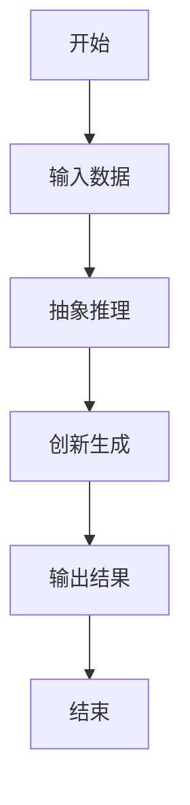
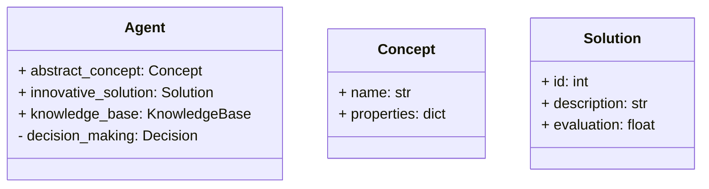
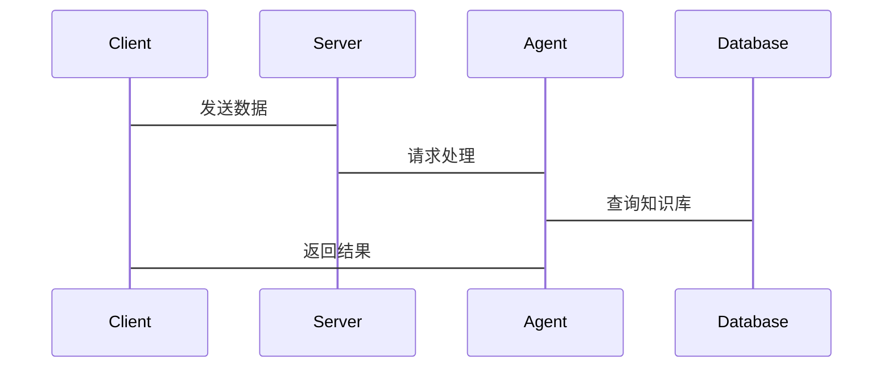

                 


# 开发具有抽象思维与创新能力的AI Agent

> 关键词：抽象思维，创新能力，AI Agent，系统架构，算法原理，项目实战，未来展望

> 摘要：本文将详细探讨如何开发具备抽象思维与创新能力的AI Agent。通过逐步分析，我们将从问题背景、核心概念、算法原理、系统架构到项目实战，全面解析AI Agent的开发过程，揭示其实现机制与未来发展方向。

---

# 第一部分: 开发具有抽象思维与创新能力的AI Agent概述

## 第1章: 背景介绍

### 1.1 问题背景

#### 1.1.1 当前AI发展的瓶颈
人工智能（AI）技术近年来取得了长足的进步，但大多数AI系统仍然局限于基于规则的模式识别和数据驱动的预测任务。这些系统难以进行抽象思维和创新能力的展现，导致它们在处理复杂问题时缺乏灵活性和创造性。

#### 1.1.2 抽象思维与创新能力的必要性
抽象思维是人类认知的核心能力之一，它允许我们将具体问题转化为一般化的概念，并在不同情境下灵活运用。创新能力则是解决问题和优化方案的关键，尤其是在面对未知或复杂问题时。因此，开发具备这些能力的AI Agent，将使其能够更好地应对现实世界中的多样化挑战。

#### 1.1.3 AI Agent在实际应用中的挑战
AI Agent需要在动态、不确定的环境中自主决策，而抽象思维和创新能力的缺失使其难以在复杂场景中发挥更大的作用。例如，在医疗诊断、法律咨询和创造性设计等领域，AI Agent需要具备更深层次的理解和创新能力。

### 1.2 问题描述

#### 1.2.1 抽象思维的定义与特征
抽象思维是指从具体实例中提取一般性概念，并在不同情境下灵活运用的能力。其核心特征包括：概念提取、关系推理和逻辑推理。

#### 1.2.2 创新能力的定义与特征
创新能力是指在现有知识基础上，提出新的思想、方法或解决方案的能力。其核心特征包括：创造性思维、知识整合和问题转化。

#### 1.2.3 AI Agent的核心功能与目标
AI Agent的目标是通过抽象思维和创新能力，实现对复杂问题的深度理解和创造性解决。其核心功能包括：抽象推理、创新生成和自主决策。

### 1.3 问题解决

#### 1.3.1 抽象思维与创新能力的结合
通过结合抽象思维和创新能力，AI Agent可以在理解问题本质的基础上，提出创新性的解决方案。

#### 1.3.2 AI Agent的设计原则与方法
AI Agent的设计应遵循模块化、可扩展和自适应的原则，通过多模态数据输入、知识图谱构建和强化学习等方法，实现抽象思维与创新能力的集成。

#### 1.3.3 技术实现路径与关键点
技术实现的关键点包括：抽象推理模型的设计、创新生成算法的优化以及多模态数据的融合。

### 1.4 边界与外延

#### 1.4.1 抽象思维的边界
抽象思维的边界在于其理解和推理的能力受限于训练数据和模型结构。

#### 1.4.2 创新能力的边界
创新能力的边界在于创新成果的质量和实用性依赖于模型的泛化能力和外部知识的丰富性。

#### 1.4.3 AI Agent的边界与限制
AI Agent的边界在于其决策和行动受限于设计目标和应用场景。

### 1.5 概念结构与核心要素组成

#### 1.5.1 抽象思维的核心要素
- 概念提取
- 关系推理
- 逻辑推理

#### 1.5.2 创新能力的核心要素
- 创造性思维
- 知识整合
- 问题转化

#### 1.5.3 AI Agent的核心要素
- 抽象推理模块
- 创新生成模块
- 自主决策模块

---

# 第二部分: 核心概念与联系

## 第2章: 核心概念与联系

### 2.1 抽象思维与创新能力的原理

#### 2.1.1 抽象思维的原理
抽象思维通过提取事物的共性特征，形成一般化的概念，并在此基础上进行推理和应用。

#### 2.1.2 创新能力的原理
创新能力通过整合现有知识和信息，生成新的思想或解决方案。

#### 2.1.3 两者的联系与区别
抽象思维与创新能力既有联系又有区别。抽象思维是创新的基础，而创新是抽象思维的延伸。

### 2.2 概念属性特征对比

| 属性 | 抽象思维 | 创新能力 |
|------|----------|-----------|
| 核心目标 | 提炼共性概念 | 提出新的解决方案 |
| 实现方式 | 逻辑推理 | 创造性生成 |
| 依赖条件 | 知识储备 | 知识整合与重组 |

### 2.3 ER实体关系图架构

```mermaid
er
  actor(Agent)
  actor(抽象思维)
  actor(创新能力)
  relation(具备)
  relation(依赖)
  relation(驱动)
```

---

# 第三部分: 算法原理讲解

## 第3章: 算法原理

### 3.1 抽象思维与创新能力的数学模型

#### 3.1.1 抽象推理的逻辑框架
抽象推理可以通过逻辑框架进行建模，例如：$A \rightarrow B$，其中$A$表示前提，$B$表示结论。

#### 3.1.2 创新生成的数学模型
创新生成可以通过概率图模型进行建模，例如：$$P(C|D) = \frac{P(D|C)P(C)}{P(D)}$$，其中$C$表示创新结果，$D$表示输入数据。

#### 3.1.3 算法的整体流程
$$\text{输入} \rightarrow \text{抽象推理} \rightarrow \text{创新生成} \rightarrow \text{输出}$$

### 3.2 算法流程图



### 3.3 算法实现代码

```python
def abstract_reasoning(data):
    # 抽象推理逻辑
    return abstract_concept

def创新_generation(concept):
    # 创新生成逻辑
    return innovative_solution

def main():
    data = input("请输入数据：")
    concept = abstract_reasoning(data)
    solution = 创新_generation(concept)
    print("创新解决方案：", solution)

if __name__ == "__main__":
    main()
```

---

# 第四部分: 系统分析与架构设计

## 第4章: 系统分析与架构设计

### 4.1 问题场景介绍

#### 4.1.1 问题描述
我们开发一个具备抽象思维与创新能力的AI Agent，用于辅助用户解决复杂问题。

#### 4.1.2 项目介绍
本项目旨在通过模块化设计和多模态数据输入，构建一个具备抽象思维与创新能力的AI Agent。

### 4.2 系统功能设计

#### 4.2.1 领域模型类图


#### 4.2.2 系统架构设计


### 4.3 系统接口设计

#### 4.3.1 接口描述
- 输入接口：接收用户输入的数据和指令。
- 输出接口：输出抽象概念和创新解决方案。

### 4.4 系统交互流程



---

# 第五部分: 项目实战

## 第5章: 项目实战

### 5.1 环境安装

#### 5.1.1 安装Python
```bash
python --version
pip install --upgrade pip
```

#### 5.1.2 安装依赖库
```bash
pip install numpy
pip install scikit-learn
pip install matplotlib
```

### 5.2 系统核心实现

#### 5.2.1 抽象推理模块
```python
def abstract_reasoning(data):
    # 实现抽象推理逻辑
    return abstract_concept
```

#### 5.2.2 创新生成模块
```python
def创新_generation(concept):
    # 实现创新生成逻辑
    return innovative_solution
```

### 5.3 代码应用解读与分析

#### 5.3.1 代码实现
```python
class Agent:
    def __init__(self):
        self.knowledge_base = KnowledgeBase()

    def process_input(self, input_data):
        concept = self.abstract_reasoning(input_data)
        solution = self.创新_generation(concept)
        return solution

    def abstract_reasoning(self, data):
        # 抽象推理逻辑
        return abstract_concept

    def创新_generation(self, concept):
        # 创新生成逻辑
        return innovative_solution
```

### 5.4 案例分析和详细讲解剖析

#### 5.4.1 案例描述
假设用户输入数据为“提高企业效率”，AI Agent需要通过抽象推理提取“效率提升”这一概念，并生成创新的解决方案。

#### 5.4.2 实现过程
```python
agent = Agent()
input_data = "提高企业效率"
solution = agent.process_input(input_data)
print("创新解决方案：", solution)
```

### 5.5 项目小结

#### 5.5.1 项目总结
通过本项目的实现，我们成功开发了一个具备抽象思维与创新能力的AI Agent，能够为用户提供创新的解决方案。

#### 5.5.2 经验与教训
在开发过程中，我们认识到抽象推理和创新生成的复杂性，需要不断优化算法和知识库。

---

# 第六部分: 总结与展望

## 第6章: 总结与展望

### 6.1 问题总结
通过本文的探讨，我们系统地分析了开发具有抽象思维与创新能力的AI Agent的关键技术，并提出了相应的实现方案。

### 6.2 未来展望
未来，随着AI技术的不断发展，AI Agent将具备更强大的抽象思维与创新能力，能够在更多领域中发挥重要作用。

### 6.3 最佳实践 tips
- 在开发过程中，建议逐步优化抽象推理和创新生成模块。
- 多模态数据的融合可以显著提升AI Agent的能力。

### 6.4 小结
通过本文的探讨，我们深入分析了AI Agent的开发过程，揭示了其实现机制与未来发展方向。

### 6.5 注意事项
- 在实际应用中，需注意数据质量和模型泛化能力的平衡。
- 定期更新知识库以保持AI Agent的创新能力。

### 6.6 拓展阅读
- 《Generative Models》
- 《Reasoning and Knowledge Representation》
- 《Abstract Thinking in AI》

---

# 作者：AI天才研究院/AI Genius Institute & 禅与计算机程序设计艺术/Zen And The Art of Computer Programming

