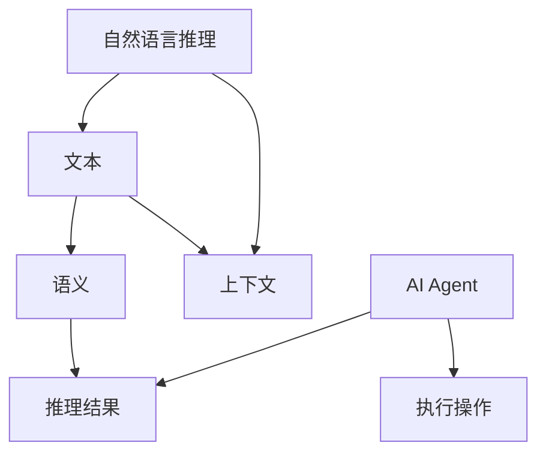
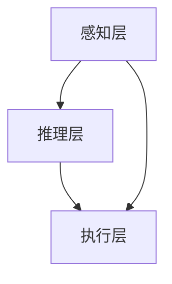

                 


# 开发具有自然语言推理能力的AI Agent

> 关键词：自然语言推理，AI Agent，深度学习，NLP，人工智能，机器学习

> 摘要：本文详细探讨了如何开发具有自然语言推理能力的AI Agent，从核心概念、算法原理到系统架构设计，再到项目实战，系统性地介绍了开发过程中的关键技术和实践方法。通过本文，读者将能够理解自然语言推理在AI Agent中的应用，掌握相关算法原理，并学习如何设计和实现一个完整的AI Agent系统。

---

## 第一部分: 自然语言推理与AI Agent概述

### 第1章: 自然语言推理与AI Agent的背景介绍

#### 1.1 问题背景
自然语言处理（NLP）是人工智能领域的重要分支，旨在让计算机能够理解和处理人类语言。随着技术的进步，NLP已经从简单的文本分析扩展到复杂的推理任务。AI Agent（智能体）是一种能够感知环境、执行任务并做出决策的智能系统。将自然语言推理能力赋予AI Agent，使其能够理解用户的意图、推理问题的含义，并做出相应的回应，是当前NLP和AI领域的研究热点。

#### 1.2 问题描述
传统的NLP技术虽然能够完成分词、句法分析等任务，但在处理复杂语义和推理任务时显得力不从心。AI Agent需要在动态环境中做出实时决策，这要求其具备强大的自然语言理解和推理能力。如何将NLP技术与AI Agent的需求结合起来，设计出一个能够处理复杂语义和推理任务的智能系统，是当前面临的主要挑战。

#### 1.3 问题解决
通过结合深度学习、注意力机制和知识图谱等技术，我们可以逐步解决自然语言推理在AI Agent中的应用问题。首先，利用预训练语言模型（如BERT、GPT）进行自然语言理解，然后结合推理算法（如基于规则的推理、符号逻辑推理）进行语义分析和决策。

#### 1.4 边界与外延
自然语言推理在AI Agent中的应用具有一定的边界，例如其处理能力受限于训练数据和模型的复杂度。此外，AI Agent的设计需要考虑实时性、计算资源和用户隐私等问题。未来，随着技术的进步，这些限制可能会逐步被克服。

#### 1.5 概念结构与核心要素组成
自然语言推理的核心要素包括文本理解、上下文推理和语义分析；AI Agent的核心要素包括感知、决策和执行。两者的结合需要构建一个能够理解用户意图、推理问题含义并执行相应操作的智能系统。

---

### 第2章: 核心概念与联系

#### 2.1 自然语言推理的核心原理
自然语言推理主要依赖于深度学习模型，尤其是Transformer架构。其核心原理包括：
- **上下文理解**：通过自注意力机制捕捉文本中的语义关系。
- **推理过程**：基于预训练模型进行文本表示和语义推理。

#### 2.2 AI Agent的核心原理
AI Agent的实现依赖于知识表示、推理算法和执行机制：
- **知识表示**：利用知识图谱或符号逻辑表示任务相关的知识。
- **推理算法**：基于规则或概率模型进行逻辑推理。
- **执行机制**：根据推理结果执行相应的操作。

#### 2.3 核心概念对比与ER实体关系图
通过对比自然语言推理和AI Agent的核心概念，可以构建如下的ER实体关系图：



---

## 第二部分: 自然语言推理算法原理

### 第3章: 基于Transformer的自然语言推理

#### 3.1 Transformer模型的结构
Transformer模型由编码器和解码器组成，其核心是自注意力机制：

```mermaid
graph TD
    EncoderLayer --> Multi-head Attention
    Multi-head Attention --> FFN
    DecoderLayer --> Multi-head Attention
    DecoderLayer --> FFN
```

#### 3.2 注意力机制的数学公式
自注意力机制的计算公式如下：

$$
\text{Attention}(Q, K, V) = \text{softmax}\left(\frac{QK^T}{\sqrt{d_k}}\right)V
$$

其中，$Q$、$K$、$V$分别是查询、键和值向量，$d_k$是向量的维度。

---

## 第三部分: 系统分析与架构设计

### 第4章: AI Agent的系统架构设计

#### 4.1 系统架构概述
AI Agent的系统架构包括以下模块：
- **感知层**：负责接收输入并进行初步分析。
- **推理层**：进行语义理解和逻辑推理。
- **执行层**：根据推理结果执行相应操作。

#### 4.2 系统架构的Mermaid图


---

## 第四部分: 项目实战

### 第5章: 自然语言推理AI Agent的实现

#### 5.1 项目环境搭建
- 安装必要的依赖库，如TensorFlow、Keras等。
- 配置GPU环境（如果需要）。

#### 5.2 核心实现代码
以下是自然语言理解模块的示例代码：

```python
import tensorflow as tf
from tensorflow.keras.layers import Input, Dense, Dropout
from tensorflow.keras.models import Model

# 定义模型输入
input_layer = Input(shape=(max_length,))
# 定义嵌入层
embedding_layer = Embedding(input_dim=vocabulary_size, output_dim=embedding_dim)(input_layer)
# 定义自注意力机制
attention = MultiHeadAttention(num_heads=8, key_dim=256)(embedding_layer, embedding_layer)
# 前向网络
dense_layer = Dense(256, activation='relu')(attention)
dropout_layer = Dropout(0.1)(dense_layer)
# 输出层
output_layer = Dense(num_classes, activation='softmax')(dropout_layer)

# 编译模型
model = Model(inputs=input_layer, outputs=output_layer)
model.compile(optimizer='adam', loss='sparse_categorical_crossentropy', metrics=['accuracy'])
```

#### 5.3 案例分析与详细解读
以客服AI Agent为例，展示如何实现自然语言理解和推理，以及如何与用户进行交互。

---

## 第五部分: 总结与展望

### 第6章: 总结与展望

#### 6.1 最佳实践
- 使用预训练语言模型作为基础。
- 结合领域知识图谱进行推理。
- 优化模型的实时性和可解释性。

#### 6.2 小结
本文系统性地介绍了如何开发具有自然语言推理能力的AI Agent，从核心概念到算法实现，再到系统设计，为读者提供了一个全面的开发框架。

#### 6.3 注意事项
- 注意模型的泛化能力和鲁棒性。
- 保护用户隐私和数据安全。
- 定期更新模型和知识库。

#### 6.4 拓展阅读
建议读者进一步学习自然语言处理、深度学习和智能体相关的书籍和论文。

---

## 作者

作者：AI天才研究院/AI Genius Institute & 禅与计算机程序设计艺术 /Zen And The Art of Computer Programming

---

以上就是《开发具有自然语言推理能力的AI Agent》的完整目录大纲和文章内容。通过系统的分析和实践，读者可以掌握如何将自然语言推理技术应用到AI Agent的开发中，实现智能、高效的交互和决策。

