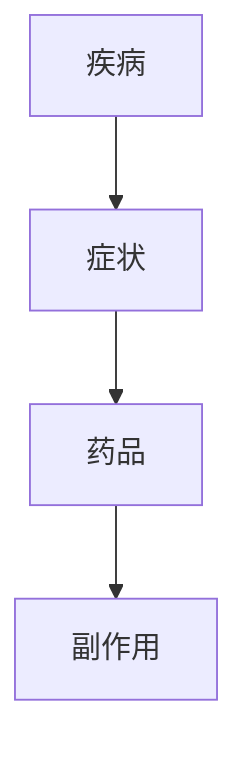

                 


# 开发具有跨领域知识图谱构建能力的AI Agent

> **关键词**：AI Agent，知识图谱，跨领域，构建能力，系统架构，项目实战

> **摘要**：本文详细探讨了开发具有跨领域知识图谱构建能力的AI Agent的全过程，从知识图谱的基础概念到跨领域知识图谱的构建挑战，再到AI Agent的设计与实现，最后结合实际案例进行项目实战。文章内容涵盖了背景介绍、核心概念、算法原理、系统架构以及项目实战等多个方面，为读者提供了从理论到实践的全面指导。

---

## 第一部分: 知识图谱基础

### 第1章: 知识图谱的定义与构建方法

#### 1.1 知识图谱的定义与特点
知识图谱是一种以图结构形式表示知识的语义网络，节点表示实体或概念，边表示实体间的关系或属性。知识图谱具有语义丰富、结构化、可扩展性强等特点，广泛应用于搜索引擎、智能问答、推荐系统等领域。

#### 1.2 知识图谱的构建流程
1. **数据收集与预处理**  
   从多种数据源（如文本、数据库、API等）获取数据，并进行清洗、去重、格式转换等预处理操作。  
   ```mermaid
   graph TD
       A[数据源] --> B[数据清洗]
       B --> C[数据格式转换]
       C --> D[数据预处理完成]
   ```

2. **知识抽取与融合**  
   从文本数据中提取实体、关系和属性，并将多源数据进行融合，解决数据冲突和冗余问题。  
   ```mermaid
   graph TD
       A[文本数据] --> B[实体识别]
       B --> C[关系抽取]
       C --> D[知识融合]
   ```

3. **知识图谱的存储与管理**  
   将抽取和融合的知识存储在图数据库（如Neo4j）中，并支持高效的查询与检索操作。  
   ```mermaid
   graph TD
       A[知识图谱] --> B[图数据库]
       B --> C[查询与检索]
   ```

#### 1.3 知识图谱的表示与推理
1. **知识图谱的表示方法**  
   使用RDF（资源描述框架）或OWL（Web本体语言）等标准表示知识。  
   ```latex
   $$a$$是一个实例，$$b$$是一个概念，$$a \in b$$ 表示实例属于概念。
   ```

2. **知识推理的基本原理**  
   通过逻辑推理（如SPARQL查询）在知识图谱中发现隐含的知识。  
   ```latex
   $$SELECT ?x WHERE {?x rdfs:subClassOf ?y}$$

   该查询用于找出所有属于类别$$y$$的实例$$x$$。
   ```

3. **知识图谱的可视化**  
   使用工具（如Gephi）将知识图谱可视化为图表形式，便于理解和分析。

---

### 第2章: 知识图谱的构建技术

#### 2.1 知识抽取与实体识别
1. **实体识别的基本方法**  
   基于规则或深度学习（如BERT）进行实体识别。  
   ```mermaid
   graph TD
       A[文本] --> B[实体识别]
       B --> C[实体列表]
   ```

2. **关系抽取与属性提取**  
   从文本中抽取实体间的关系或属性，并构建关系三元组（$$head$$, $$relation$$, $$tail$$）。  
   ```mermaid
   graph TD
       A[文本] --> B[关系抽取]
       B --> C[关系三元组]
   ```

3. **知识融合与冲突消解**  
   将多个数据源的知识进行融合，并解决冲突（如同一实体的多个名称）。  
   ```mermaid
   graph TD
       A[数据源1] --> B[数据源2]
       B --> C[知识融合]
       C --> D[冲突消解]
   ```

#### 2.2 知识图谱的存储与管理
1. **知识图谱的存储方式**  
   使用图数据库（如Neo4j）或知识图谱存储系统（如Wikidata）存储知识。  
   ```mermaid
   graph TD
       A[知识图谱] --> B[Neo4j]
       B --> C[查询与检索]
   ```

2. **知识图谱的查询与检索**  
   使用SPARQL查询语言进行复杂查询。  
   ```latex
   $$PREFIX neo4j: <http://neo4j.com/>$$  
   $$MATCH (n) RETURN n$$
   ```

3. **知识图谱的扩展与维护**  
   定期更新知识图谱，添加新知识并修复错误。

---

## 第二部分: AI Agent的基础

### 第3章: AI Agent的定义与设计原则

#### 3.1 AI Agent的定义
AI Agent是一种智能体，能够感知环境、自主决策并执行任务。AI Agent的核心能力包括感知、推理、规划和执行。

#### 3.2 AI Agent的设计原则
1. **模块化设计**  
   将AI Agent分解为独立的模块（如感知模块、推理模块、执行模块）。  
   ```mermaid
   graph TD
       A[感知模块] --> B[推理模块]
       B --> C[执行模块]
   ```

2. **任务驱动设计**  
   根据任务需求设计AI Agent的功能模块。  
   ```mermaid
   graph TD
       A[任务需求] --> B[功能模块设计]
       B --> C[任务完成]
   ```

3. **可扩展性设计**  
   确保AI Agent能够方便地扩展新功能。

---

## 第三部分: 跨领域知识图谱的构建

### 第4章: 跨领域知识图谱的构建挑战与解决方案

#### 4.1 跨领域知识图谱的定义
跨领域知识图谱是跨越多个领域的知识图谱，旨在整合不同领域的知识，提供更全面的信息。

#### 4.2 跨领域知识图谱的构建流程
1. **数据源的选择与整合**  
   从多个领域获取数据，并进行清洗和格式转换。  
   ```mermaid
   graph TD
       A[领域1数据] --> B[领域2数据]
       B --> C[数据整合]
   ```

2. **跨领域知识的抽取与融合**  
   将不同领域的知识进行抽取，并进行跨领域融合。  
   ```mermaid
   graph TD
       A[领域1知识] --> B[领域2知识]
       B --> C[跨领域融合]
   ```

3. **跨领域知识图谱的验证与优化**  
   对构建的知识图谱进行验证，并优化其质量。

#### 4.3 跨领域知识图谱的构建工具与平台
1. **知识图谱构建工具的分类**  
   工具分为基于规则的工具和基于机器学习的工具。  
   ```mermaid
   graph TD
       A[基于规则的工具] --> B[基于机器学习的工具]
       B --> C[混合工具]
   ```

2. **常用的知识图谱构建平台**  
   包括Neo4j、Ubergraph、Wikidata等平台。  
   ```mermaid
   graph TD
       A[Neo4j] --> B[Ubergraph]
       B --> C[Wikidata]
   ```

3. **跨领域知识图谱构建的挑战与解决方案**  
   挑战包括数据异构性、知识融合的复杂性等。解决方案包括引入统一的本体论（如CIDOC CRM）和使用跨领域知识融合算法。

---

## 第四部分: AI Agent的系统架构与实现

### 第5章: AI Agent的系统架构设计

#### 5.1 系统功能设计
1. **领域模型设计**  
   使用Mermaid类图描述系统的模块和接口。  
   ```mermaid
   classDiagram
       class AI Agent {
           - 知识库
           - 推理引擎
           - 执行模块
       }
       class 知识库 {
           - 实体
           - 关系
           - 属性
       }
       class 推理引擎 {
           - 知识推理
           - 逻辑推理
       }
       class 执行模块 {
           - 行为决策
           - 任务执行
       }
   ```

2. **系统架构设计**  
   使用分层架构，包括数据层、逻辑层和应用层。  
   ```mermaid
   graph TD
       A[数据层] --> B[逻辑层]
       B --> C[应用层]
   ```

3. **系统接口设计**  
   定义API接口，供其他系统调用AI Agent的功能。  
   ```mermaid
   graph TD
       A[API接口] --> B[功能模块]
       B --> C[任务完成]
   ```

---

## 第五部分: 项目实战

### 第6章: 跨领域知识图谱构建的项目实战

#### 6.1 环境安装
1. **安装图数据库**  
   安装Neo4j图数据库，并配置环境变量。  
   ```bash
   brew install neo4j
   ```

2. **安装知识图谱构建工具**  
   安装Python库（如networkx、py2neo）和深度学习框架（如TensorFlow、PyTorch）。  
   ```bash
   pip install networkx py2neo tensorflow
   ```

#### 6.2 系统核心实现
1. **知识抽取模块**  
   使用自然语言处理技术从文本中抽取实体和关系。  
   ```python
   def extract_entities(text):
       # 使用预训练的实体识别模型
       return entities
   ```

2. **知识融合模块**  
   将多源数据进行融合，并解决冲突。  
   ```python
   def fuse_knowledge(sources):
       # 使用冲突消解算法
       return fused_knowledge
   ```

3. **知识图谱构建模块**  
   将融合后的知识存储到图数据库中。  
   ```python
   def build_kg(fused_knowledge):
       # 使用Neo4j的Cypher语句创建节点和关系
       return kg
   ```

#### 6.3 实际案例分析
以医疗领域为例，构建跨医疗和药品领域的知识图谱。  


---

## 第六部分: 总结与展望

### 第7章: 总结与展望

#### 7.1 总结
本文详细探讨了开发具有跨领域知识图谱构建能力的AI Agent的全过程，从知识图谱的基础概念到AI Agent的设计与实现，再到项目实战。通过本文的学习，读者可以掌握跨领域知识图谱构建的核心技术，并将其应用于实际项目中。

#### 7.2 展望
未来，随着AI技术的不断发展，跨领域知识图谱构建能力的AI Agent将具有更广泛的应用场景。我们需要进一步研究如何提高知识图谱的构建效率和准确性，并探索新的AI Agent设计方法。

---

**作者：AI天才研究院/AI Genius Institute & 禅与计算机程序设计艺术 /Zen And The Art of Computer Programming**

