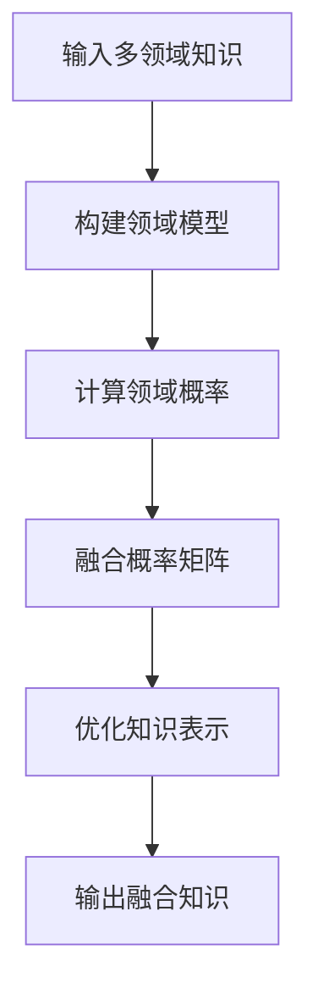
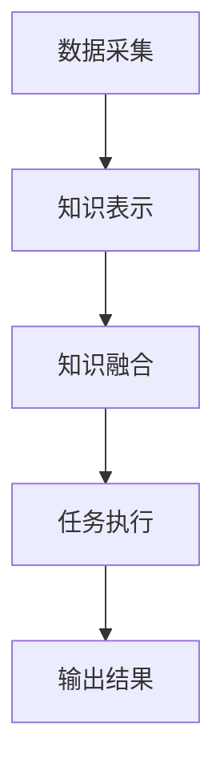
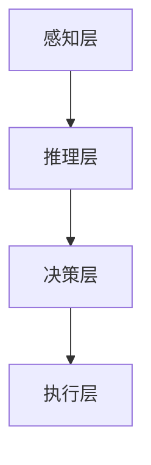

                 


# 开发具有跨领域知识融合能力的AI Agent

> 关键词：AI Agent，跨领域知识融合，知识图谱，知识表示，机器学习

> 摘要：本文深入探讨了开发具有跨领域知识融合能力的AI Agent的关键技术与实现方法。首先介绍了AI Agent的基本概念和跨领域知识融合的重要性，然后详细讲解了知识表示与知识图谱的构建方法，分析了跨领域知识融合的原理与算法，提出了基于知识图谱的AI Agent系统架构设计，并通过实际案例展示了如何实现跨领域知识融合的AI Agent。最后总结了开发中的注意事项与最佳实践。

---

## 第一部分：引言

### 1.1 AI Agent的基本概念

#### 1.1.1 AI Agent的定义与特点
AI Agent（人工智能代理）是指能够感知环境、自主决策并执行任务的智能实体。AI Agent可以通过传感器获取信息，通过推理和学习做出决策，并通过执行器与环境交互。其特点包括自主性、反应性、目标导向和学习能力。

#### 1.1.2 跨领域知识融合的必要性
在现实应用中，AI Agent需要处理来自多个领域的数据和知识。例如，医疗AI Agent需要结合医学知识和患者数据，金融AI Agent需要整合市场数据和客户行为数据。跨领域知识融合能够帮助AI Agent更好地理解和处理复杂场景。

#### 1.1.3 本书的目标与结构
本书旨在探讨如何开发具有跨领域知识融合能力的AI Agent，涵盖从理论到实践的全过程。内容分为引言、基础知识、核心概念、算法实现、系统架构、项目实战和最佳实践七个部分。

---

## 第二部分：AI Agent的基础知识

### 2.1 AI Agent的基本原理

#### 2.1.1 AI Agent的组成与功能
AI Agent通常由感知模块、推理模块、决策模块和执行模块组成。感知模块负责数据采集，推理模块负责知识处理，决策模块负责策略制定，执行模块负责任务执行。

#### 2.1.2 AI Agent的分类与特点
AI Agent可以分为简单反射型、基于模型的反应型、目标驱动型和效用驱动型。跨领域知识融合能力是目标驱动型和效用驱动型AI Agent的重要特征。

#### 2.1.3 AI Agent的典型应用案例
医疗诊断、智能客服、自动驾驶等领域是AI Agent的典型应用场景。例如，医疗AI Agent可以结合医学知识和患者数据，提供个性化的诊断建议。

### 2.2 跨领域知识融合的概念

#### 2.2.1 跨领域知识融合的定义
跨领域知识融合是指将来自不同领域、不同形式的知识进行整合，形成统一的知识表示，以便AI Agent能够更好地理解和应用。

#### 2.2.2 跨领域知识融合的核心要素
跨领域知识融合的核心要素包括知识表示、对齐、融合和验证。知识表示是基础，对齐是关键，融合是目标，验证是保障。

#### 2.2.3 跨领域知识融合的目标与方法
跨领域知识融合的目标是消除数据孤岛，提高知识利用率。常用方法包括基于本体论的对齐、基于图嵌入的融合和基于概率的推理。

---

## 第三部分：跨领域知识融合的核心概念

### 3.1 知识表示与知识图谱

#### 3.1.1 知识表示的多种方法
知识表示方法包括符号表示、向量表示和图表示。符号表示适用于规则明确的领域，向量表示适用于数据驱动的场景，图表示适用于复杂关联的领域。

#### 3.1.2 知识图谱的构建与应用
知识图谱是一种图结构的知识表示方法，广泛应用于搜索引擎、推荐系统和语义理解。构建知识图谱需要进行数据清洗、实体识别和关系抽取。

#### 3.1.3 跨领域知识图谱的挑战
跨领域知识图谱的构建面临领域术语差异、数据格式不一致和知识关联复杂等问题。

### 3.2 跨领域知识融合的原理与方法

#### 3.2.1 跨领域知识融合的定义与目标
跨领域知识融合的目标是消除领域间的知识差异，形成统一的知识表示。

#### 3.2.2 跨领域知识融合的主要方法
跨领域知识融合的方法包括基于本体论的对齐、基于图嵌入的融合和基于概率的推理。

#### 3.2.3 跨领域知识融合的实现步骤
跨领域知识融合的实现步骤包括数据预处理、知识表示、对齐、融合和验证。

### 3.3 知识融合的数学模型与算法

#### 3.3.1 跨领域知识融合的数学模型
跨领域知识融合的数学模型通常基于概率论和图论。概率模型用于处理不确定性，图模型用于表示知识关联。

#### 3.3.2 基于图的知識融合算法
基于图的知識融合算法通过图匹配和图合并来实现知识融合。算法步骤包括图构建、节点匹配、边合并和图优化。

#### 3.3.3 基于概率的知識融合方法
基于概率的知識融合方法通过贝叶斯网络或马尔可夫链来建模知识融合过程，能够处理数据的不确定性和冲突。

---

## 第四部分：跨领域知识融合的算法实现

### 4.1 基于概率的知識融合算法

#### 4.1.1 算法原理与步骤
基于概率的知識融合算法通过计算各领域知识的条件概率，实现知识的融合与优化。

#### 4.1.2 算法流程图
以下是基于概率的知識融合算法的流程图：



#### 4.1.3 算法数学模型
基于概率的知識融合算法的数学模型如下：

$$ P(k_i | e_j) = \frac{P(e_j | k_i) \cdot P(k_i)}{P(e_j)} $$

其中，$P(k_i | e_j)$ 表示领域 $e_j$ 下知识 $k_i$ 的后验概率。

---

## 第五部分：系统架构设计

### 5.1 系统功能设计

#### 5.1.1 系统功能模块
跨领域知识融合的AI Agent系统通常包括数据采集模块、知识表示模块、知识融合模块和任务执行模块。

#### 5.1.2 系统功能流程
以下是系统的功能流程图：



### 5.2 系统架构设计

#### 5.2.1 系统架构图
以下是系统的架构图：



---

## 第六部分：项目实战

### 6.1 环境安装

#### 6.1.1 系统需求
需要安装Python 3.8及以上版本，安装numpy、pandas、networkx和scikit-learn库。

#### 6.1.2 安装命令
```bash
pip install numpy pandas networkx scikit-learn
```

### 6.2 核心代码实现

#### 6.2.1 知识表示代码
```python
import networkx as nx

def buildKnowledgeGraph(data):
    G = nx.Graph()
    for item in data:
        G.add_node(item['id'])
        for relation in item['relations']:
            G.add_edge(item['id'], relation)
    return G
```

#### 6.2.2 知识融合代码
```python
def fuseKnowledgeGraphs(graph1, graph2):
    merged_graph = nx.compose(graph1, graph2)
    return merged_graph
```

### 6.3 案例分析

#### 6.3.1 案例介绍
以医疗AI Agent为例，融合医疗知识图谱和患者数据图谱。

#### 6.3.2 实施步骤
1. 数据采集：收集患者的医疗记录和诊断数据。
2. 知识表示：构建医疗知识图谱和患者数据图谱。
3. 知识融合：将两个图谱进行对齐和融合。
4. 任务执行：基于融合的知识图谱进行诊断推理。

---

## 第七部分：最佳实践

### 7.1 小结

跨领域知识融合是开发智能AI Agent的核心技术，通过知识表示、对齐和融合，能够实现多领域知识的协同应用。

### 7.2 注意事项

在实际开发中，需要注意领域术语差异、数据格式不一致和知识冲突等问题。

### 7.3 拓展阅读

推荐阅读《知识图谱实战》和《分布式知识表示学习》等书籍，深入理解跨领域知识融合的技术细节。

---

## 作者：AI天才研究院 & 禅与计算机程序设计艺术

---

通过以上内容，读者可以系统地了解跨领域知识融合的AI Agent开发过程，从理论到实践，全面掌握相关技术和方法。

