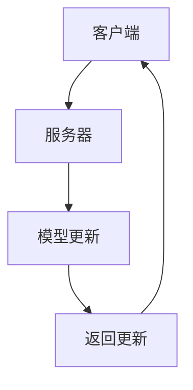
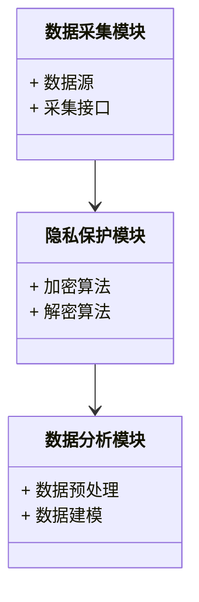
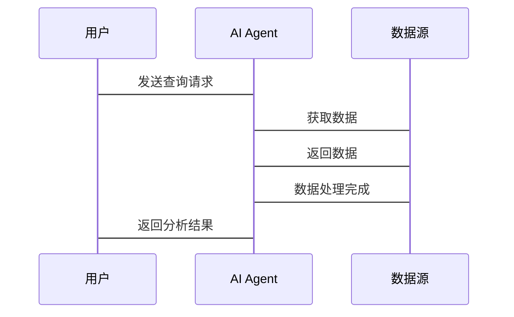

                 


# 开发具有隐私保护数据分析能力的AI Agent

## 关键词：隐私保护，数据分析，AI Agent，联邦学习，同态加密，数据安全

## 摘要：  
随着人工智能和数据分析技术的快速发展，隐私保护成为一项重要挑战。本文探讨如何开发具有隐私保护能力的AI Agent，通过隐私计算技术如联邦学习和同态加密，确保数据分析过程中的数据安全。文章详细分析AI Agent的核心功能、隐私保护算法原理、系统架构设计，并通过实际案例展示开发过程和应用效果。

---

# 第1章：背景与问题背景

## 1.1 数据分析的重要性  
数据分析是现代社会的核心技术，帮助企业发现趋势、优化决策。然而，数据分析通常需要处理敏感数据，如用户个人信息、医疗记录等，这带来了隐私泄露的风险。  

## 1.2 问题描述  
传统数据分析方法往往依赖于集中式数据存储，这使得数据容易被未经授权的第三方访问。此外，数据泄露事件频发，用户隐私受到严重威胁。  

## 1.3 AI Agent的核心目标  
AI Agent是一种智能代理，能够自主执行任务。在数据分析场景中，AI Agent需要具备以下能力：  
1. **数据采集**：从多种来源收集数据。  
2. **隐私保护**：在分析过程中保护数据隐私。  
3. **决策与反馈**：根据分析结果做出决策并提供反馈。  

## 1.4 边界与外延  
AI Agent的隐私保护能力并非万能，其边界包括：  
- 数据来源有限：AI Agent只能处理授权范围内的数据。  
- 决策能力有限：AI Agent的决策依赖于算法和训练数据的质量。  

---

# 第2章：核心概念与联系

## 2.1 隐私保护的核心技术  
隐私保护主要依赖以下技术：  
1. **数据加密**：通过加密技术保护数据的安全性。  
2. **匿名化处理**：去除数据中的敏感信息。  
3. **访问控制**：限制数据的访问权限。  

## 2.2 数据分析的流程  
数据分析通常包括以下步骤：  
1. **数据预处理**：清洗数据，去除噪声。  
2. **数据建模**：构建数学模型进行分析。  
3. **结果可视化**：将分析结果以图表形式展示。  

## 2.3 AI Agent的功能模块  
AI Agent的功能模块包括：  
1. **数据采集模块**：从多种来源获取数据。  
2. **隐私保护模块**：对数据进行加密或匿名化处理。  
3. **数据分析模块**：对数据进行建模和分析。  
4. **决策模块**：根据分析结果做出决策。  

## 2.4 核心概念之间的关系  
通过以下表格对比核心概念：  

| 概念       | 描述                                         | 与AI Agent的关系                              |
|------------|----------------------------------------------|-----------------------------------------------|
| 数据隐私   | 数据的安全性，防止未经授权的访问               | AI Agent通过隐私保护技术确保数据隐私         |
| 数据分析   | 对数据进行处理和建模，提取有用信息             | AI Agent利用数据分析能力提供决策支持           |
| AI Agent   | 智能代理，能够自主执行任务                     | 结合隐私保护与数据分析，提供端到端的解决方案     |

---

# 第3章：算法原理与数学模型

## 3.1 隐私保护算法  

### 3.1.1 同态加密  
**同态加密**允许在加密状态下对数据进行计算，结果解密后与原始计算结果一致。  
**数学模型**：  
$$ E(x) \rightarrow F(E(x)) \rightarrow D(F(E(x))) = x $$  
其中，$E(x)$表示加密，$F$表示计算函数，$D$表示解密。  

### 3.1.2 联邦学习  
**联邦学习**是一种分布式机器学习技术，数据分布在不同设备或服务器上，通过加密通信进行模型训练。  
**流程图**：  


---

## 3.2 数据分析算法  

### 3.2.1 数据建模  
**线性回归**是一种常用的回归分析方法，用于预测连续型变量。  
**数学模型**：  
$$ y = \beta_0 + \beta_1x + \epsilon $$  
其中，$\beta_0$和$\beta_1$是回归系数，$\epsilon$是误差项。  

### 3.2.2 数据可视化  
**折线图**用于展示数据随时间的变化趋势。  

---

# 第4章：系统分析与架构设计

## 4.1 系统功能设计  
**领域模型**：  


## 4.2 系统架构设计  
**系统架构图**：  


---

# 第5章：项目实战

## 5.1 环境安装  
安装Python和必要的库：  
```bash
pip install numpy pandas scikit-learn
```

## 5.2 核心代码实现  
```python
import numpy as np
from sklearn.linear_model import LinearRegression

# 数据预处理
X = np.array([[1], [2], [3], [4]])
y = np.array([2, 4, 5, 4])

# 建立模型
model = LinearRegression()
model.fit(X, y)

# 预测结果
print(model.predict(np.array([[5]])))
```

---

# 第6章：最佳实践与小结

## 6.1 最佳实践  
1. **数据加密**：优先选择同态加密或联邦学习等隐私保护技术。  
2. **访问控制**：严格限制数据访问权限。  
3. **数据匿名化**：在数据共享前进行匿名化处理。  

## 6.2 小结  
本文详细探讨了开发具有隐私保护数据分析能力的AI Agent的关键技术，包括隐私保护算法、数据分析方法和系统架构设计。通过实际案例展示了开发过程和应用效果，为后续研究提供了参考。

---

# 作者：AI天才研究院 & 禅与计算机程序设计艺术

通过本文的系统分析和实战指导，读者可以深入了解如何开发具有隐私保护能力的AI Agent，并在实际项目中应用相关技术。希望本文能为隐私保护与数据分析的结合提供新的思路和解决方案。

