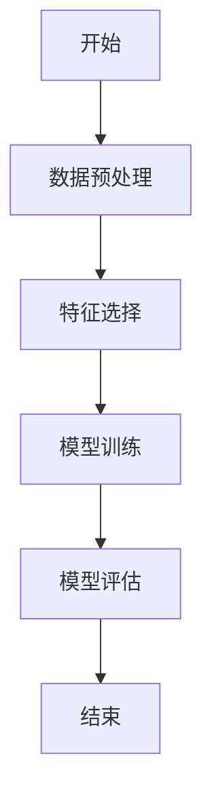

                 


# 开发基于AI的智能税务规划助手

## 关键词：AI, 智能税务规划, 税务优化, 机器学习, 自然语言处理

## 摘要：随着人工智能技术的快速发展，税务规划领域正面临智能化转型的契机。本文将深入探讨如何利用AI技术开发智能税务规划助手，从背景介绍、核心概念到系统架构设计，再到项目实战，全面解析智能税务规划助手的开发过程，为读者提供系统化的技术指导。

---

## 第一部分：智能税务规划助手的背景与基础

### 第1章：智能税务规划助手的背景与需求

#### 1.1 税务规划的基本概念

- **1.1.1 税务规划的定义与目标**
  税务规划是通过合理配置资产、收入和支出，以最小化税务负担的过程。其目标是优化纳税人的税务支出，同时确保合规性。

- **1.1.2 税务规划的核心要素**
  - 收入类型与金额
  - 可抵扣项目与扣除项
  - 税收优惠政策与法规

- **1.1.3 税务规划的常见场景**
  - 个人所得税优化
  - 企业所得税规划
  - 跨境税务安排

#### 1.2 智能税务规划助手的必要性

- **1.2.1 税务规划的传统方法与局限性**
  - 依赖人工计算，效率低
  - 易受主观因素影响，结果可能不准确
  - 需要专业知识，普通用户难以独立完成

- **1.2.2 AI技术在税务规划中的优势**
  - 高效数据处理能力
  - 智能学习与优化
  - 7x24小时实时分析

- **1.2.3 智能税务规划助手的应用前景**
  - 提高税务规划的效率与准确性
  - 降低税务风险
  - 为用户提供个性化的税务优化方案

---

## 第二部分：基于AI的税务规划助手的核心概念与联系

### 第2章：AI在税务规划中的核心应用

#### 2.1 自然语言处理在税务文档分析中的应用

- **2.1.1 NLP技术的基本原理**
  - 文本预处理：分词、去停用词、实体识别
  - 深度学习模型：如BERT、GPT
  - 文本理解：意图识别、情感分析

- **2.1.2 税务文档的结构化处理**
  - 文档分类：发票、账单、税务申报表
  - 关键信息提取：金额、日期、纳税人识别号
  - 数据清洗与存储

- **2.1.3 基于NLP的税务信息提取**
  - 实体识别：识别发票中的公司名称、金额等信息
  - 关系抽取：理解发票中的买卖关系
  - 信息摘要：提取关键信息生成摘要

#### 2.2 机器学习在税务预测与优化中的应用

- **2.2.1 机器学习的基本原理**
  - 监督学习：回归、分类
  - 无监督学习：聚类
  - 深度学习：神经网络

- **2.2.2 税务预测模型的构建**
  - 数据收集：历史税务数据、经济指标
  - 特征工程：选择影响税务的关键特征
  - 模型训练：训练回归模型预测未来税务负担

- **2.2.3 基于机器学习的税务优化策略**
  - 模拟不同财务策略的税务影响
  - 自动生成优化建议
  - 动态调整模型以适应政策变化

#### 2.3 AI模型在税务合规性检查中的应用

- **2.3.1 合规性检查的定义与目标**
  - 确保税务申报的准确性
  - 发现并纠正潜在的税务错误
  - 遵守相关法律法规

- **2.3.2 基于AI的税务合规性分析**
  - 异常检测：识别申报数据中的异常值
  - 风险评估：评估税务风险并提出改进建议
  - 自动化审核：辅助人工审核，提高效率

- **2.3.3 合规性检查的流程与实现**
  - 数据输入与清洗
  - 建模与训练
  - 结果分析与反馈

### 第3章：核心概念与联系

#### 3.1 AI模型与税务规划的关系

- **3.1.1 AI模型在税务规划中的核心作用**
  - 数据处理与分析
  - 模型训练与优化
  - 个性化建议生成

- **3.1.2 税务规划助手的系统架构**
  - 数据层：税务数据的存储与管理
  - 业务逻辑层：AI模型的调用与结果处理
  - 用户界面层：与用户的交互

- **3.1.3 AI模型与税务规划的交互流程**
  - 用户输入需求
  - 系统分析数据并生成建议
  - 用户查看结果并进行反馈

#### 3.2 核心概念对比分析

- **3.2.1 不同AI模型的对比**

| 模型类型 | 优点 | 缺点 | 适用场景 |
|----------|------|------|----------|
| 线性回归 | 简单、易于解释 | 高维度数据表现不佳 | 税务预测、趋势分析 |
| 支持向量机 | 高维数据表现好 | 对核函数的选择敏感 | 分类问题、税务合规性判断 |
| 随机森林 | 抗噪声能力强 | 解释性较差 | 特征重要性分析、税务优化 |

- **3.2.2 实体关系图**

```mermaid
erd
actor 税务规划助手;
actor 纳税人;
actor 税务机关;
```

---

## 第三部分：基于AI的税务规划助手的算法原理

### 第4章：算法原理讲解

#### 4.1 算法选择与实现

- **4.1.1 算法选择**
  - 监督学习：用于税务预测和分类
  - 非监督学习：用于异常检测和聚类

- **4.1.2 算法实现步骤**
  - 数据预处理：清洗、特征选择
  - 模型训练：选择模型并训练
  - 模型评估：验证准确率、召回率

#### 4.2 算法流程图



#### 4.3 核心算法的数学模型

- **线性回归模型**
  $$ y = \beta_0 + \beta_1 x + \epsilon $$
  其中，$y$ 是预测值，$x$ 是自变量，$\beta_0$ 和 $\beta_1$ 是模型参数，$\epsilon$ 是误差项。

- **决策树模型**
  通过构建树状结构，将数据分成不同的子集，每个子节点代表一个决策点，叶子节点代表最终结果。

---

## 第四部分：系统分析与架构设计

### 第5章：系统分析与架构设计

#### 5.1 项目目标与范围

- **项目目标**
  - 开发一个智能税务规划助手，帮助用户优化税务支出，确保合规性。

- **项目范围**
  - 支持个人所得税和企业所得税优化
  - 提供税务申报指导
  - 实现税务风险评估

#### 5.2 系统功能设计

- **领域模型**
  ```mermaid
  classDiagram
  class 税务数据 {
    收入
    支出
    扣除项
  }
  class 税务规划助手 {
    数据分析
    模型调用
    结果展示
  }
  ```

- **系统架构**
  ```mermaid
  rectangle 数据层 {
    数据库
    接口服务
  }
  rectangle 业务逻辑层 {
    税务规划助手
    AI模型服务
  }
  rectangle 用户界面层 {
    网页端/移动端
  }
  ```

- **系统交互流程**
  ```mermaid
  sequenceDiagram
  participant 用户
  participant 税务规划助手
  participant AI模型服务
  用户 -> 税务规划助手: 提交税务数据
  税务规划助手 -> AI模型服务: 请求优化建议
  AI模型服务 -> 税务规划助手: 返回优化方案
  税务规划助手 -> 用户: 显示结果
  ```

---

## 第五部分：项目实战

### 第6章：项目实战

#### 6.1 环境安装与配置

- **工具安装**
  - Python 3.8+
  - Jupyter Notebook
  - Scikit-learn、TensorFlow

- **数据准备**
  - 下载税务数据集（例如CSV格式）
  - 数据清洗与预处理

#### 6.2 核心代码实现

- **数据预处理代码**
  ```python
  import pandas as pd
  df = pd.read_csv('tax_data.csv')
  df = df.dropna()
  df['Year'] = pd.to_datetime(df['Year'])
  ```

- **模型训练代码**
  ```python
  from sklearn.linear_model import LinearRegression
  model = LinearRegression()
  model.fit(X_train, y_train)
  ```

- **结果分析代码**
  ```python
  import matplotlib.pyplot as plt
  plt.scatter(y_test, y_pred)
  plt.xlabel('真实值')
  plt.ylabel('预测值')
  plt.show()
  ```

#### 6.3 案例分析与解读

- **案例分析**
  - 输入历史收入与支出数据
  - 生成税务优化建议
  - 分析结果并进行反馈

- **代码解读**
  - 数据清洗：处理缺失值与异常值
  - 特征工程：选择影响税务的关键特征
  - 模型训练：训练回归模型预测未来税务负担

---

## 第六部分：总结与展望

### 第7章：总结与展望

#### 7.1 最佳实践与注意事项

- **数据隐私保护**
  - 确保用户数据的安全性
  - 符合相关法律法规

- **模型迭代优化**
  - 定期更新模型参数
  - 收集用户反馈以优化模型

#### 7.2 项目小结

- 本文详细介绍了开发基于AI的智能税务规划助手的过程
- 从背景介绍到系统设计，再到项目实战，为读者提供了全面的技术指导
- 希望本文能为AI在税务领域的应用提供有益的参考

#### 7.3 未来展望

- 智能税务规划助手将更加智能化和个性化
- 结合区块链技术实现更安全的数据管理
- 大数据分析技术的应用将更加广泛

---

## 作者信息

作者：AI天才研究院/AI Genius Institute & 禅与计算机程序设计艺术 /Zen And The Art of Computer Programming

