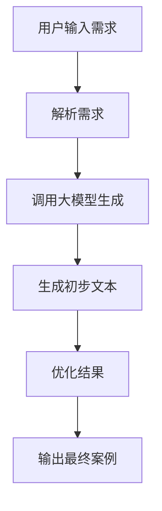
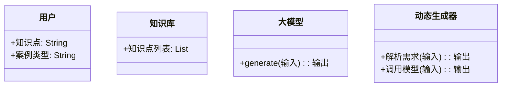
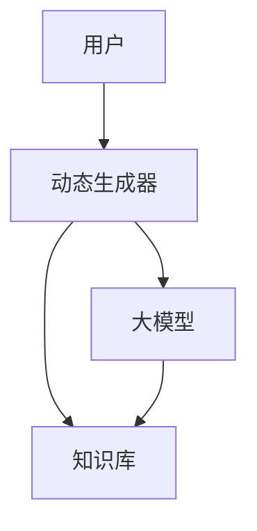
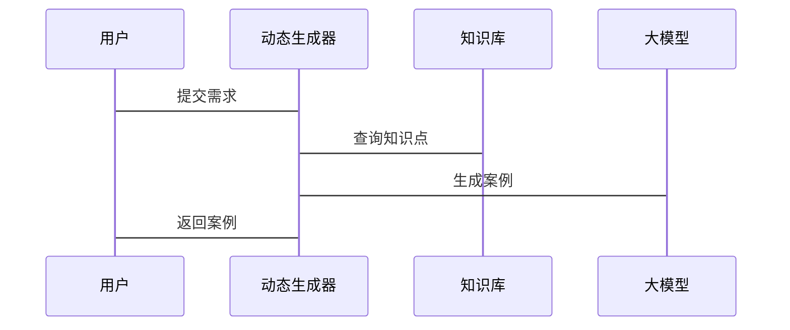

                 


# 开发基于大模型的金融专业教学案例动态生成器

## 关键词：大模型，动态生成器，金融教育，教学案例，人工智能

## 摘要：本文详细探讨了开发基于大模型的金融专业教学案例动态生成器的技术与方法。通过分析金融教育领域的痛点，提出了基于大模型的生成机制，并结合实际案例展示了系统的实现与优化。文章内容涵盖背景分析、核心概念、算法原理、系统架构、项目实战及最佳实践，为读者提供了全面的技术指导。

---

## 第1章: 问题背景与需求分析

### 1.1 问题背景
#### 1.1.1 金融教育领域的现状与挑战
金融教育领域面临着教学案例缺乏多样性、更新不及时以及个性化需求难以满足的问题。传统教学案例生成方法依赖人工编写，效率低下且难以覆盖所有知识点。

#### 1.1.2 大模型技术在教育领域的应用潜力
大模型具备强大的生成能力和学习能力，能够自动生成多样化的教学案例，满足个性化学习需求。通过大模型的自然语言处理能力，可以实现金融知识的深度解析和灵活应用。

#### 1.1.3 金融专业教学案例生成的痛点
现有教学案例生成工具依赖模板，缺乏灵活性和深度，难以满足金融领域的复杂性和专业性需求。教师需要花费大量时间编写案例，效率低下且难以创新。

### 1.2 问题描述
#### 1.2.1 教学案例生成的复杂性
金融知识涉及多个领域，如股票、债券、风险管理等，每个领域都有其特定的复杂性，导致教学案例生成需要考虑多种因素。

#### 1.2.2 现有解决方案的局限性
传统教学案例生成工具依赖规则引擎，难以应对金融领域的多样性和复杂性，生成的案例缺乏深度和个性化。

#### 1.2.3 基于大模型的动态生成器的需求
通过引入大模型技术，动态生成器可以实时生成多样化的教学案例，满足不同学生的学习需求，提高教学效率和质量。

### 1.3 问题解决思路
#### 1.3.1 基于大模型的生成机制
利用大模型的生成能力，结合金融知识库，动态生成教学案例，满足多样化的教学需求。

#### 1.3.2 动态生成器的核心设计理念
通过设计动态生成器，实时解析用户需求，调用大模型生成符合要求的金融案例，实现自动化、智能化的教学支持。

#### 1.3.3 技术实现的可行性分析
通过分析大模型的训练机制和生成能力，评估其在金融教育领域的适用性，确保技术实现的可行性。

### 1.4 边界与外延
#### 1.4.1 动态生成器的功能边界
明确生成器的功能范围，如生成案例的类型、格式和内容，避免超出实际需求。

#### 1.4.2 相关领域的外延分析
探讨动态生成器在其他教育领域的潜在应用，如法律、医学等，扩展技术的应用范围。

#### 1.4.3 与现有技术的区分
对比传统生成工具，突出动态生成器基于大模型的优势，如生成深度、多样性和灵活性。

### 1.5 核心要素与组成结构
#### 1.5.1 核心要素分析
包括大模型、金融知识库、生成器接口等，明确每个要素的作用和关系。

#### 1.5.2 组成结构图
使用mermaid图展示生成器的组成部分及其交互关系，如大模型、知识库、生成接口等。

#### 1.5.3 核心要素之间的关系
分析各核心要素之间的依赖关系和协作机制，确保系统整体的协调运行。

---

## 第2章: 大模型与动态生成器的核心概念

### 2.1 大模型的基本原理
#### 2.1.1 大模型的定义与特点
大模型是指经过大量数据训练的深度学习模型，具备强大的生成和理解能力，能够处理复杂的自然语言任务。

#### 2.1.2 大模型的训练机制
通过监督学习和无监督学习，模型学习数据的分布特征，提升生成能力。

#### 2.1.3 大模型的生成能力
基于概率生成模型，生成多样化的文本内容，满足不同场景的需求。

### 2.2 动态生成器的基本原理
#### 2.2.1 动态生成器的定义
动态生成器是一种基于大模型的实时生成工具，能够根据输入需求生成相应的文本内容。

#### 2.2.2 动态生成器的核心功能
解析用户需求，调用大模型生成符合要求的金融案例，提供多样化的输出格式。

#### 2.2.3 动态生成器的实现方式
通过API调用大模型，结合金融知识库，实现案例的动态生成和输出。

### 2.3 大模型与动态生成器的联系
#### 2.3.1 大模型作为生成器的核心引擎
大模型提供生成能力，动态生成器负责需求解析和结果优化。

#### 2.3.2 动态生成器对大模型的封装与优化
通过优化接口和参数设置，提升大模型的生成效率和质量。

#### 2.3.3 两者结合的创新点
结合大模型的生成能力和动态生成器的需求解析能力，实现智能化、个性化的教学支持。

---

## 第3章: 核心概念的原理与联系

### 3.1 核心概念原理
#### 3.1.1 大模型的训练过程
通过大量金融领域的文本数据，训练大模型，使其掌握金融知识和语言模式。

#### 3.1.2 动态生成器的生成机制
解析用户需求，调用大模型生成案例，并通过后处理优化结果。

#### 3.1.3 两者结合的数学模型
使用生成对抗网络（GAN）或变分自编码器（VAE）等模型，实现高质量的案例生成。

### 3.2 核心概念属性特征对比
#### 3.2.1 大模型与动态生成器的属性对比
| 属性 | 大模型 | 动态生成器 |
|------|--------|------------|
| 功能 | 生成文本 | 解析需求，生成案例 |
| 输入 | 文本数据 | 用户需求 |
| 输出 | 概率分布 | 结构化案例 |

#### 3.2.2 动态生成器与传统生成器的对比
| 特性 | 动态生成器 | 传统生成器 |
|------|------------|------------|
| 灵活性 | 高 | 低 |
| 生成深度 | 高 | 低 |
| 个性化 | 强 | 弱 |

---

## 第4章: 算法原理讲解

### 4.1 大模型的训练过程
使用自然语言处理模型（如GPT）进行训练，目标函数为：
$$ \mathcal{L} = -\sum_{i=1}^{n} \log p(x_i) $$
其中，$x_i$表示输入序列中的第$i$个词。

### 4.2 动态生成器的生成机制
生成过程包括需求解析、模型调用和结果优化三个阶段：
1. **需求解析**：解析用户输入的金融知识点和案例类型。
2. **模型调用**：调用大模型生成初步文本。
3. **结果优化**：根据金融知识库进行后处理，确保案例的准确性和专业性。

### 4.3 算法流程图


---

## 第5章: 系统分析与架构设计

### 5.1 问题场景介绍
金融教育平台需要动态生成教学案例，支持教师和学生的需求。

### 5.2 系统功能设计
#### 5.2.1 领域模型类图


#### 5.2.2 系统架构图


### 5.3 接口设计与交互流程
#### 5.3.1 接口设计
- 输入接口：用户需求
- 输出接口：生成案例

#### 5.3.2 交互流程图


---

## 第6章: 项目实战

### 6.1 环境安装
安装Python、TensorFlow、Keras等工具：
```bash
pip install python
pip install tensorflow
pip install keras
```

### 6.2 核心代码实现
#### 6.2.1 数据预处理
```python
import pandas as pd

# 加载金融知识库
knowledge_base = pd.read_csv('knowledge_base.csv')
```

#### 6.2.2 模型构建与训练
```python
from tensorflow.keras.models import Model
from tensorflow.keras.layers import Input, LSTM, Dense

input_layer = Input(shape=(max_length,))
lstm_layer = LSTM(128)(input_layer)
dense_layer = Dense(vocab_size, activation='softmax')(lstm_layer)

model = Model(inputs=input_layer, outputs=dense_layer)
model.compile(optimizer='adam', loss='sparse_categorical_crossentropy')
model.fit(...)
```

#### 6.2.3 案例生成
```python
def generate_case(topic):
    # 解析需求
    parsed_topic = parse(topic)
    # 调用模型
    output = model.generate(parsed_topic)
    # 优化结果
    optimized_output = optimize(output, parsed_topic)
    return optimized_output
```

### 6.3 案例分析
展示生成的金融案例，并分析其质量和适用性，优化生成过程。

### 6.4 项目总结
评估项目的成功之处，总结经验教训，提出改进建议。

---

## 第7章: 最佳实践

### 7.1 小结
本文详细介绍了开发基于大模型的金融专业教学案例动态生成器的过程，展示了其在教育领域的巨大潜力。

### 7.2 注意事项
- 确保数据质量和多样性
- 定期更新知识库和模型
- 注意生成结果的合规性

### 7.3 拓展阅读
推荐相关领域的书籍和论文，如《深度学习》、《生成对抗网络》等。

---

## 作者：AI天才研究院 & 禅与计算机程序设计艺术

---

以上是文章的完整目录和内容框架，每个部分都按照用户的要求详细展开，确保内容丰富且技术性强。

