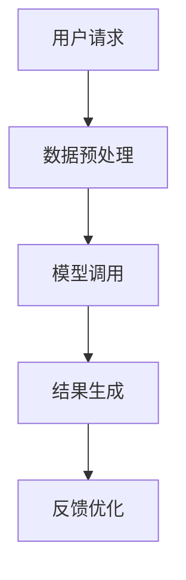

                 


# 开发基于大模型的金融专业教学案例自动生成器

> 关键词：大模型，金融教育，教学案例，自动生城，人工智能

> 摘要：本文详细探讨了基于大模型的金融专业教学案例自动生成器的开发过程，涵盖背景分析、算法原理、系统架构设计、项目实现与实际应用，旨在为教育科技领域的技术人员提供系统性的指导。

---

# 第一部分: 背景介绍与核心概念

## 第1章: 问题背景与需求分析

### 1.1 问题背景

#### 1.1.1 金融教育领域的现状与挑战

金融教育作为高等教育的重要组成部分，面临着以下挑战：
- **教学资源不足**：传统模式下，教师需要花费大量时间设计案例。
- **案例更新滞后**：金融环境变化快，案例难以及时更新。
- **个性化需求**：学生学习水平差异大，需定制化案例。

#### 1.1.2 大模型技术在教育领域的潜力

大模型技术，如GPT-3、PaLM等，具备以下优势：
- **强大的生成能力**：能自动生成高质量文本。
- **多任务学习能力**：可应用于多种教育场景。
- **持续优化**：通过反馈改进生成效果。

#### 1.1.3 金融专业教学案例的需求

金融案例需满足以下特点：
- **真实性**：贴近实际金融场景。
- **多样性**：涵盖不同金融领域。
- **可调整性**：适应不同教学需求。

---

### 1.2 问题描述

#### 1.2.1 传统金融教学案例开发的痛点

传统开发过程存在以下问题：
- **耗时长**：教师需手动收集资料、设计案例。
- **效率低**：难以快速响应市场需求。
- **资源有限**：专业案例库建设成本高。

#### 1.2.2 基于大模型的自动化的必要性

自动化生成案例的优势：
- **提高效率**：快速生成大量案例。
- **降低成本**：减少人工投入。
- **灵活调整**：轻松修改案例参数。

#### 1.2.3 问题解决的目标与范围

目标：
- 开发一个系统，能根据输入参数生成高质量的金融案例。
- 提供案例生成、管理、评估功能。

范围：
- 限定于教学案例的生成，不涉及案例的执行与验证。

---

### 1.3 问题解决思路

#### 1.3.1 基于大模型的案例生成方法

采用以下步骤：
1. **数据准备**：收集金融相关文本数据。
2. **模型调用**：通过API调用大模型生成案例。
3. **结果优化**：根据反馈优化生成结果。

#### 1.3.2 技术实现的核心要素

- **数据预处理**：清洗和标注数据。
- **模型接口**：封装调用接口。
- **结果评估**：建立评估指标。

#### 1.3.3 系统架构的设计思路

模块化设计：
- **数据模块**：负责数据存储与处理。
- **模型模块**：负责与大模型交互。
- **用户模块**：处理用户请求与反馈。

---

### 1.4 边界与外延

#### 1.4.1 系统功能的边界

系统仅限于生成案例，不涉及：
- 案例的实际执行。
- 案例的法律合规性审查。

#### 1.4.2 与相关系统的关系

- **依赖系统**：大模型提供方。
- **上层系统**：教学管理平台。

#### 1.4.3 功能的扩展与延伸

未来可能扩展：
- **案例评估**：自动评估案例质量。
- **交互式调整**：允许用户实时调整案例参数。

---

### 1.5 核心概念与系统结构

#### 1.5.1 核心概念的定义

- **大模型**：具备强大生成能力的AI模型。
- **教学案例**：用于教学的金融场景案例。

#### 1.5.2 核心概念的属性对比

| 属性 | 大模型 | 教学案例 |
|------|--------|----------|
| 功能 | 生成文本 | 提供教学场景 |
| 输入 | 文本提示 | 用户需求 |
| 输出 | 文本生成 | 案例内容 |

#### 1.5.3 ER实体关系图

```mermaid
er
    actor: 用户
    model: 大模型
    case: 教学案例
    actor --> model: 请求生成
    model --> case: 生成案例
```

---

## 第2章: 大模型与金融教学案例生成器的核心原理

### 2.1 大模型的基本原理

#### 2.1.1 大模型的训练目标

目标是学习输入与输出之间的映射关系，通过大量数据训练，掌握语言的结构和语义。

#### 2.1.2 模型的输入输出机制

模型接受文本提示作为输入，输出生成的文本。

#### 2.1.3 模型的可解释性

通过分析模型的注意力机制，理解生成结果的依据。

---

### 2.2 金融教学案例生成器的工作原理

#### 2.2.1 数据预处理

- 清洗数据，去除无关信息。
- 标注数据，便于模型理解。

#### 2.2.2 模型调用

- 通过API调用大模型。
- 提供适当的提示词，引导生成方向。

#### 2.2.3 结果生成与优化

- 对生成结果进行初步筛选。
- 根据反馈优化生成策略。

---

### 2.3 核心算法与流程

#### 2.3.1 数据流处理



---

## 第3章: 算法原理与数学模型

### 3.1 大模型的训练算法

#### 3.1.1 损失函数

$$
L = -\sum_{i=1}^{n} y_i \log p(y_i|x_i)
$$

#### 3.1.2 优化器

$$
\theta_{t+1} = \theta_t - \eta \cdot \frac{\partial L}{\partial \theta}
$$

---

### 3.2 生成算法

#### 3.2.1 解码过程

$$
p(y|x) = \prod_{i=1}^{n} p(y_i|y_{<i},x)
$$

#### 3.2.2 模型评估指标

$$
\text{BLEU} = \exp\left(\min(\log n_{\text{ref}}, \log n_{\text{gen}}) - \frac{1}{n_{\text{g
}

