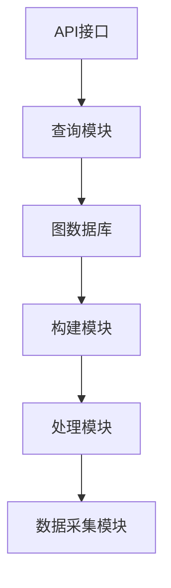

                 


# 开发基于大模型的金融专业教材知识图谱构建器

**关键词**：知识图谱，大模型，自然语言处理，金融领域，文本挖掘

**摘要**：本文详细探讨了如何利用大模型构建金融专业教材的知识图谱。文章从背景和概念入手，分析了知识图谱和大模型的基本原理，结合实际案例，讲解了构建过程中的关键技术，包括实体识别、关系抽取等。同时，通过系统架构设计和项目实战，展示了如何在实际应用中构建高效的金融知识图谱，并提出了优化和扩展的建议。

---

## 第一部分：背景与概念

### 第1章：知识图谱概述

#### 1.1 知识图谱的定义与特点
知识图谱是一种结构化的数据表示方式，通过实体和关系描述世界。其特点包括：
- **结构化**：以图结构表示，节点为实体，边为关系。
- **可扩展性**：支持大规模数据构建。
- **语义丰富**：通过关系和属性描述复杂语义。

#### 1.2 大模型的基本原理
大模型（如BERT、GPT）通过大量数据预训练，具备强大的上下文理解和生成能力。其核心原理包括：
- **深度学习**：多层神经网络提取特征。
- **自注意力机制**：捕捉文本中的长距离依赖。
- **预训练-微调**：通用模型+特定任务微调。

#### 1.3 金融专业教材知识图谱的构建背景
- **需求**：金融领域术语多，知识复杂，需系统化整理。
- **挑战**：专业性强，数据分散，构建难度大。
- **意义**：支持智能检索、辅助教学、数据挖掘。

### 第2章：大模型与知识图谱的结合

#### 2.1 大模型在知识抽取中的应用
- **文本处理**：分割、词性标注、句法分析。
- **实体识别**：利用大模型识别金融术语。
- **关系抽取**：识别实体间的关系。

#### 2.2 知识图谱构建的核心技术
- **实体识别**：利用大模型的上下文理解。
- **关系抽取**：基于语义分析的关系识别。
- **知识融合**：多源数据的整合与冲突处理。

---

## 第二部分：算法与实现

### 第3章：知识图谱构建算法原理

#### 3.1 分词与实体识别算法
- **分词**：使用jieba进行中文分词。
- **实体识别**：基于CRF的条件随机场模型，结合大模型的特征提取。

#### 3.2 关系抽取算法
- **路径分析**：通过句法结构分析句子中的关系。
- **向量空间模型**：利用词向量计算实体间的关系相似度。

#### 3.3 知识融合算法
- **规则融合**：基于金融领域的规则进行知识合并。
- **图嵌入**：通过节点嵌入技术优化知识图谱的结构。

### 第4章：算法实现与优化

#### 4.1 算法实现流程
- **数据预处理**：清洗、标注。
- **模型训练**：基于大模型进行微调。
- **图谱构建**：实体和关系的存储与索引。

#### 4.2 优化策略
- **模型优化**：减少参数量，降低计算复杂度。
- **算法优化**：并行处理、分布式存储。

---

## 第三部分：系统架构与实战

### 第5章：系统架构设计

#### 5.1 项目介绍
- **目标**：构建金融知识图谱，支持智能应用。
- **功能模块**：数据采集、处理、构建、存储和查询。

#### 5.2 系统功能设计
- **数据采集模块**：从教材中提取文本。
- **处理模块**：分词、实体识别、关系抽取。
- **构建模块**：生成知识图谱。
- **存储模块**：使用图数据库存储。
- **查询模块**：提供API接口查询。

#### 5.3 系统架构图


### 第6章：项目实战

#### 6.1 环境安装
- **Python**：3.8+
- **库**：jieba、spaCy、networkx、 neo4j-driver

#### 6.2 核心代码实现
- 实体识别：
  ```python
  import jieba
  text = "金融衍生品是一种金融合约"
  words = jieba.lcut(text)
  print(words)
  ```
- 关系抽取：
  ```python
  from spacy.lang.zh import Chinese
  nlp = Chinese()
  doc = nlp(text)
  for token in doc:
      print(token.text, token.pos_)
  ```

#### 6.3 代码解读
- 使用jieba进行分词，提取关键词。
- 使用spaCy进行词性标注，识别实体。

#### 6.4 案例分析
- **案例**：构建一个简单的金融术语图谱，包含实体和关系。

---

## 第四部分：总结与展望

### 第7章：总结与展望

#### 7.1 总结
- 本文详细介绍了如何利用大模型构建金融知识图谱，涵盖了从理论到实践的全过程。
- 知识图谱在金融领域的应用前景广阔。

#### 7.2 展望
- **技术优化**：探索更高效的算法。
- **领域扩展**：应用于更多金融场景。
- **工具开发**：开发可视化工具辅助构建和分析。

---

**作者：AI天才研究院/AI Genius Institute & 禅与计算机程序设计艺术 /Zen And The Art of Computer Programming**

---

这篇文章详细介绍了基于大模型的金融知识图谱构建过程，从理论到实践，层层深入，为读者提供了全面的技术指导和实践方案。

