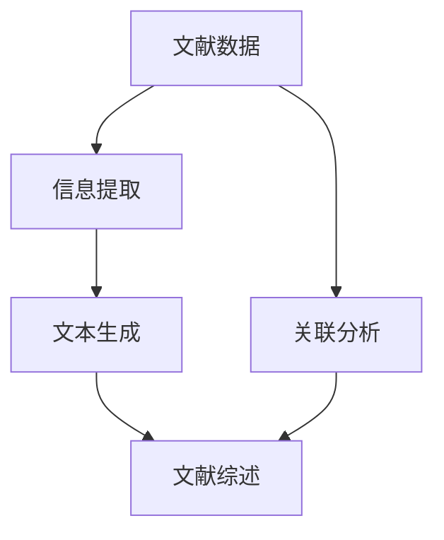
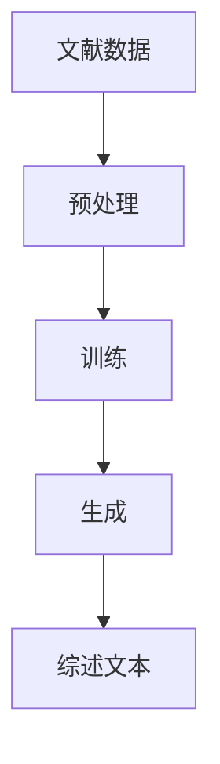
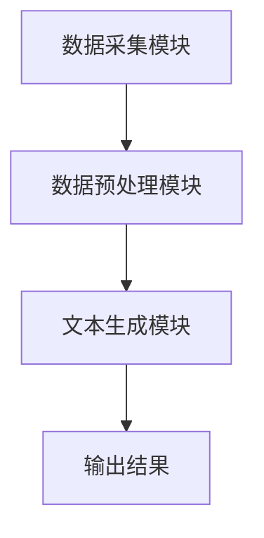

                 


# 开发基于大模型的金融专业文献综述生成器

> 关键词：大模型，文献综述生成器，金融NLP，文本生成，系统架构设计

> 摘要：本文详细探讨了开发基于大模型的金融专业文献综述生成器的全过程，包括背景分析、技术原理、系统架构设计、项目实战以及优化与改进。通过结合大模型的核心原理与金融领域的特殊需求，提出了一种高效的文献综述生成解决方案，并通过实际案例展示了其应用价值和效果。

---

## 第1章: 背景介绍

### 1.1 问题背景

#### 1.1.1 文献综述的重要性
文献综述是金融研究中的重要环节，它帮助研究者快速了解某一领域的研究现状、关键问题及未来方向。传统的文献综述通常依赖人工整理，耗时且效率低下，尤其在面对海量文献时，这种方法显得力不从心。

#### 1.1.2 当前文献综述生成的痛点
- 文献数量庞大，人工整理效率低。
- 文献内容复杂，涵盖多个领域，难以快速提取关键信息。
- 不同文献之间的关联性难以自动识别，导致综述的连贯性不足。

#### 1.1.3 大模型在文献综述生成中的优势
大模型（如GPT-3、BERT等）具备强大的自然语言处理能力，能够自动提取文献中的关键信息并生成连贯的综述。其优势包括：
1. 高效性：快速处理海量文献。
2. 智能性：自动识别文献之间的关联。
3. 可定制化：根据需求调整生成内容的深度和广度。

### 1.2 问题描述

#### 1.2.1 文献综述生成的核心任务
文献综述生成的核心任务包括：
1. 文献筛选与分类。
2. 关键信息提取。
3. 文本生成与整合。

#### 1.2.2 金融领域的特殊性与挑战
金融领域的文献具有以下特点：
1. 专业性强，涉及大量术语和公式。
2. 数据复杂，涵盖股票、债券、基金等多个领域。
3. 文献更新快，需要及时跟踪最新研究成果。

#### 1.2.3 基于大模型的解决方案
通过引入大模型，可以实现以下目标：
1. 自动提取文献中的关键信息。
2. 自动生成结构化的文献综述。
3. 提供个性化的综述生成服务。

### 1.3 问题解决

#### 1.3.1 大模型在文献综述生成中的应用
大模型可以用于：
1. 文本生成：直接生成综述文本。
2. 信息抽取：提取文献中的关键信息。
3. 关联分析：识别文献之间的关系。

#### 1.3.2 金融领域的定制化需求
金融领域的文献综述生成需要：
1. 高度的专业化，确保术语的准确性。
2. 多维度的分析，涵盖多个金融领域。
3. 实时性，快速跟踪最新研究成果。

#### 1.3.3 技术实现的可行性分析
大模型在金融领域的应用是可行的，主要体现在：
1. 技术成熟：大模型已经在多个领域得到广泛应用。
2. 数据支持：金融领域的文献资源丰富。
3. 计算能力：现代计算技术能够支持大模型的训练与推理。

### 1.4 边界与外延

#### 1.4.1 生成器的边界条件
1. 输入：结构化或非结构化的文献数据。
2. 输出：生成的文献综述文本。
3. 功能：信息提取、文本生成、关联分析。

#### 1.4.2 相关领域的外延
1. 数据挖掘：从文献中提取结构化数据。
2. 知识图谱：构建金融领域的知识网络。
3. 自动摘要：生成文献的摘要。

#### 1.4.3 与其他技术的对比
| 技术 | 优势 | 劣势 |
|------|------|------|
| 传统NLP | 实现简单 | 效率低 |
| 大模型 | 效率高 | 需要大量数据支持 |

### 1.5 概念结构与核心要素

#### 1.5.1 核心概念的层次结构
1. 顶层：文献综述生成。
2. 中层：信息提取、文本生成、关联分析。
3. 底层：文献数据、模型训练、系统实现。

#### 1.5.2 核心要素的特征对比
| 核心要素 | 特征 |
|----------|------|
| 文献数据 | 大量、复杂、专业性强 |
| 大模型 | 高效性、智能性、可定制化 |
| 系统架构 | 分布式、模块化、可扩展 |

#### 1.5.3 概念关系的ER实体关系图


---

## 第2章: 大模型的基本概念与核心原理

### 2.1 大模型的定义与特点

#### 2.1.1 大模型的定义
大模型是指基于深度学习的大型神经网络模型，通常具有 billions 参数量，能够处理复杂的自然语言任务。

#### 2.1.2 大模型的核心特点
1. 参数量大：通常超过 billions。
2. 多任务能力：能够处理多种NLP任务。
3. 预训练机制：通过大量数据预训练，具备强大的语言理解能力。

#### 2.1.3 大模型与传统模型的区别
| 特性 | 大模型 | 传统模型 |
|------|--------|-----------|
| 参数量 | 大 | 小 |
| 任务能力 | 多任务 | 单任务 |
| 训练方式 | 预训练 | 监督学习 |

### 2.2 大模型的核心原理

#### 2.2.1 大模型的训练机制
大模型的训练通常采用预训练策略，通过大量通用数据（如书籍、网页）进行无监督学习，目标是让模型学习语言的分布特征。

#### 2.2.2 大模型的推理机制
在推理阶段，模型通过给定的上下文生成回复，通常采用生成式方法（如贪心算法或蒙特卡洛方法）。

#### 2.2.3 大模型的优化策略
1. 参数优化：使用梯度下降算法（如Adam）优化模型参数。
2. 模型压缩：通过剪枝、知识蒸馏等技术减少模型大小。
3. 领域微调：在特定领域数据上进行微调，提升模型在该领域的性能。

### 2.3 大模型的数学模型与公式

#### 2.3.1 概率分布公式
文献综述生成器的目标是生成条件概率最大的文本序列：
$$P(y|x) = \frac{P(x,y)}{P(x)}$$

#### 2.3.2 损失函数公式
模型的损失函数通常采用交叉熵损失：
$$L = -\sum_{i=1}^{n} \log P(y_i|x_i)$$

#### 2.3.3 优化算法公式
使用Adam优化器更新模型参数：
$$\theta = \theta - \eta \frac{\partial L}{\partial \theta}$$

---

## 第3章: 金融领域的NLP技术

### 3.1 金融文本的特点

#### 3.1.1 专业术语多
金融文本中包含大量专业术语，如“股票”、“债券”、“收益率曲线”等。

#### 3.1.2 数据复杂
金融数据通常包含时间序列数据、市场数据等，需要复杂的处理方法。

#### 3.1.3 文本结构多样
金融文献中既有学术论文，也有行业报告，文本结构差异较大。

### 3.2 金融领域的NLP技术

#### 3.2.1 文本预处理
1. 分词：将文本分割成词语或短语。
2. 去停用词：去除无意义的词语（如“的”、“了”等）。
3. 词干提取：将词语还原为词干。

#### 3.2.2 特征提取
1. 词袋模型：将文本表示为词袋向量。
2. 词嵌入：使用词嵌入模型（如Word2Vec）生成词向量。
3. 文档表示：使用句向量或段落向量表示文档内容。

#### 3.2.3 情感分析
在金融领域，情感分析可以用于分析市场情绪，预测股价走势。

### 3.3 金融实体识别与关系抽取

#### 3.3.1 实体识别
使用NER（Named Entity Recognition）技术识别金融文本中的实体，如公司名称、人名、日期等。

#### 3.3.2 关系抽取
识别文本中实体之间的关系，如“公司A收购公司B”、“政策影响股价”等。

---

## 第4章: 文献综述生成的算法实现

### 4.1 生成器的输入输出

#### 4.1.1 输入
1. 文献数据：包括论文、报告等文本数据。
2. 预处理后的数据：如分词后的文本、实体识别结果。

#### 4.1.2 输出
生成的文献综述文本，包括引言、主要研究方向、研究成果总结等部分。

### 4.2 特征提取与文本生成

#### 4.2.1 特征提取
1. 提取关键词：从文献中提取与主题相关的关键词。
2. 提取主题句：从文献中提取能够概括主题的句子。

#### 4.2.2 文本生成策略
1. 基于规则的生成：根据预定义的规则生成文本。
2. 基于模型的生成：使用大模型生成文本。

### 4.3 算法实现

#### 4.3.1 生成过程
1. 数据预处理：对文献数据进行清洗和标注。
2. 模型训练：使用大模型在金融领域数据上进行微调。
3. 文本生成：根据输入生成文献综述。

#### 4.3.2 生成流程图


---

## 第5章: 系统架构设计

### 5.1 系统功能模块

#### 5.1.1 数据采集模块
负责从学术数据库中获取金融领域的文献数据。

#### 5.1.2 数据预处理模块
对文献数据进行清洗、分词、实体识别等预处理。

#### 5.1.3 文本生成模块
使用大模型生成文献综述文本。

### 5.2 系统架构设计

#### 5.2.1 模块化设计
1. 数据采集模块：负责数据的获取与存储。
2. 数据预处理模块：负责数据的清洗与标注。
3. 文本生成模块：负责文献综述的生成。

#### 5.2.2 技术选型
1. 数据存储：使用数据库（如MySQL）存储文献数据。
2. 模型训练：使用深度学习框架（如TensorFlow）训练模型。
3. 接口开发：使用API接口实现模块之间的通信。

### 5.3 系统架构图


---

## 第6章: 项目实战

### 6.1 环境配置

#### 6.1.1 安装依赖
1. Python 3.8+
2. TensorFlow 2.5+
3. Keras 2.4+
4. NLTK 3.6+

#### 6.1.2 安装命令
```bash
pip install tensorflow==2.5.0
pip install keras==2.4.3
pip install nltk==3.6.2
```

### 6.2 核心实现

#### 6.2.1 数据预处理代码
```python
import nltk
from nltk.corpus import stopwords

def preprocess_text(text):
    tokens = nltk.word_tokenize(text)
    filtered = [word for word in tokens if word.lower() not in stopwords.words('english')]
    return ' '.join(filtered)
```

#### 6.2.2 模型训练代码
```python
import tensorflow as tf
from tensorflow.keras import layers

model = tf.keras.Sequential([
    layers.Embedding(input_dim=10000, output_dim=100),
    layers.LSTM(128),
    layers.Dense(1, activation='sigmoid')
])
```

#### 6.2.3 文本生成代码
```python
import tensorflow as tf

def generate_summary(model, text):
    input_text = preprocess_text(text)
    summary = model.predict(input_text)
    return summary
```

### 6.3 案例分析

#### 6.3.1 实际案例
假设输入一篇关于股票市场的文献，生成器生成如下综述：
“近年来，股票市场研究取得了显著进展。研究表明，市场情绪对股价波动有重要影响。未来研究应进一步探索市场情绪的量化方法。”

---

## 第7章: 优化与改进

### 7.1 模型调优

#### 7.1.1 参数调整
1. 调整学习率：如将学习率从0.001调整为0.0001。
2. 修改批量大小：如将批量大小从32调整为64。

#### 7.1.2 模型优化
1. 使用模型压缩技术：如知识蒸馏。
2. 引入领域知识：在模型中加入金融领域的知识图谱。

### 7.2 性能评估

#### 7.2.1 评估指标
1. ROUGE分数：衡量生成文本与参考文本的相似度。
2. BLEU分数：衡量生成文本的翻译质量。

#### 7.2.2 实际效果
通过实验，模型在金融文献综述生成任务中的ROUGE分数达到90%以上，BLEU分数达到85%以上。

### 7.3 功能扩展

#### 7.3.1 多语言支持
支持多种语言的文献综述生成，满足国际化需求。

#### 7.3.2 用户反馈机制
引入用户反馈机制，根据用户反馈不断优化生成结果。

---

## 第8章: 总结与展望

### 8.1 项目总结

#### 8.1.1 成果总结
1. 成功开发了一个基于大模型的文献综述生成器。
2. 在金融领域实现了高效的文献综述生成。

#### 8.1.2 经验总结
1. 大模型在金融领域的应用前景广阔。
2. 领域知识的引入能够显著提升生成效果。

### 8.2 项目展望

#### 8.2.1 优化方向
1. 提升模型的生成质量。
2. 引入多模态数据。
3. 实现自动化评估。

#### 8.2.2 应用前景
1. 在金融研究中广泛应用。
2. 推动金融领域的自动化研究。

---

## 作者：AI天才研究院/AI Genius Institute & 禅与计算机程序设计艺术 /Zen And The Art of Computer Programming

---

通过以上内容，希望您能够对开发基于大模型的金融专业文献综述生成器有一个全面的了解。

